# 最大似然估计

> 原文：<https://towardsdatascience.com/ml-estimation-gaussian-model-and-linear-discriminant-analysis-92d93f185818?source=collection_archive---------28----------------------->

## 高斯模型和线性判别分析

# 背景

最大似然估计(ML Estimation，MLE)是统计领域常用的一种强有力的参数估计方法。最大似然法的思想是估计模型的参数，其中给定的数据是可能获得的。在这一节中，我将从模式识别方法中介绍 MLE 的重要性。我们为什么需要 MLE？它在模式识别过程中是如何工作的？

## 统计模式识别

模式识别是机器学习的一个分支。它是识别给定*模式*对应的*类别*的过程。这里，模式是指可用于定义任何空间或序列可观测数据是否在同一组中的特征。范畴是指模式识别的结果，意为一组相同或相似的模式。在**统计模式识别**中，提取给定训练样本的统计特征并用于形成识别过程。

模式识别的目标相当于确定一个多类别的鉴别器函数。为了生成一个性能良好的鉴别器函数，需要几个标准，例如最大后验概率判定规则、最小鉴别器误差判定规则、贝叶斯判定规则。在本帖中，我们重点以最大后验概率决策规则为例。在下面的解释中，我们致力于使用最大后验概率决策规则来定义给定输入数据 x 的相应类别 y。

## 最大后验概率决策规则

为了定义给定输入 x 的类别 y，自然要选择一个类别，在该类别中该输入属于它的可能性最高。这意味着选择具有后验概率 p(y|x)的最大值的类别。

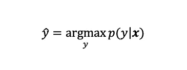

这种决策规则称为最大后验概率规则。这与将决策区域设置为

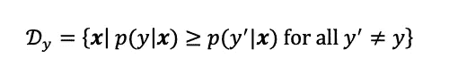

根据贝叶斯理论，后验概率可以写成以下形式。由此，最大后验概率规则等价于最大条件概率 p(x|y)和先验概率 p(y)的乘积。

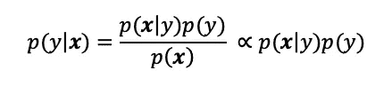

因此，需要估计条件概率 p(x|y)和先验概率 p(y)来获得后验概率 p(y|x)。

## 为什么我们需要参数估计？

由于类别 y 是一个离散型随机变量，我们可以简单地估计先验概率

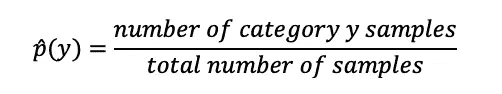

然而，用这种方法估计连续型随机变量输入 x 是不可能的。例如，假设输入 x 具有高斯分布。为了定义 x 的条件概率，我们需要期望值和标准变化值作为参数。*这就是为什么需要 MLE 等参数估计方法的原因。*

# MLE 的定义

由有限数量的参数形成的一组概率密度函数被称为**参数模型**。我们称**为 q(x；θ)**参数模型，其中**θ**是参数。

当逼近概率密度函数时，很自然地确定参数值，使得我们拥有的训练样本是最有可能出现 的 ***。这里，在参数 **theta** 下，我们考虑当前训练样本 **x_i** (i=1，…，n)发生的概率。作为参数θ的函数，这个概率被称为**似然**并被写为**L(θ)**。在独立同分布假设下，可能性为***

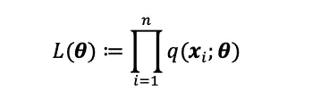

在最大似然估计方法中，我们找到使似然值最大化的参数θ的值。用最大似然法得到的最佳参数θ写为

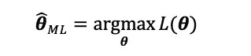

当参数模型 q(x；θ)可由θ导出，下面的等式为真。这个方程被称为**似然方程**。这是最大似然估计答案的必要条件*而不是充分条件*。

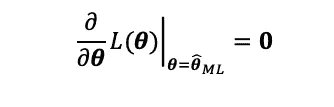

在大多数情况下，求解似然方程是复杂的。作为一种解决方案，使用对数似然法。因为对数函数是单调增加的，所以对数似然和似然中的最佳参数是相同的。

# 高斯模型

高斯模型是具有高斯分布的参数模型。d 维模式 **x** 的高斯模型通常以下列形式给出。

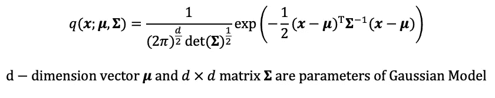

\μ和\适马是高斯模型的参数。\适马是正定对称矩阵。高斯模型的一个重要特征是参数μ和适马分别是概率分布的期望值和方差-协方差矩阵。

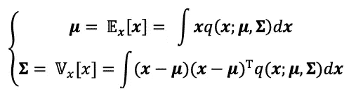

# 高斯模型的极大似然估计

现在，我们以高斯模型为例。假设我们有 n 个样本数据{x_i} (i=1，…，n)。我们将使用这些输入来估计高斯模型的参数。

首先，模型的可能性和对数可能性是

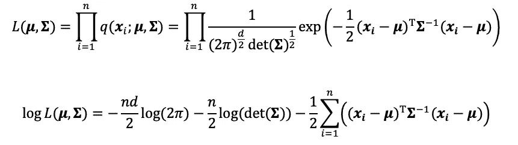

接下来，似然方程可以写成

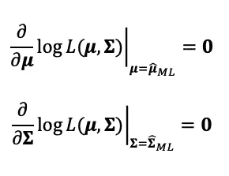

求解这些方程，我们最终获得估计的参数

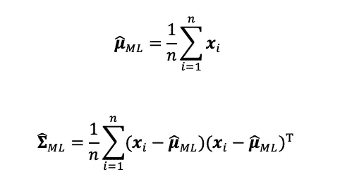

这同样适用于样本均值和样本方差-协方差矩阵。

下图显示了使用 8000 个样本点对高斯模型应用 MLE 的结果。

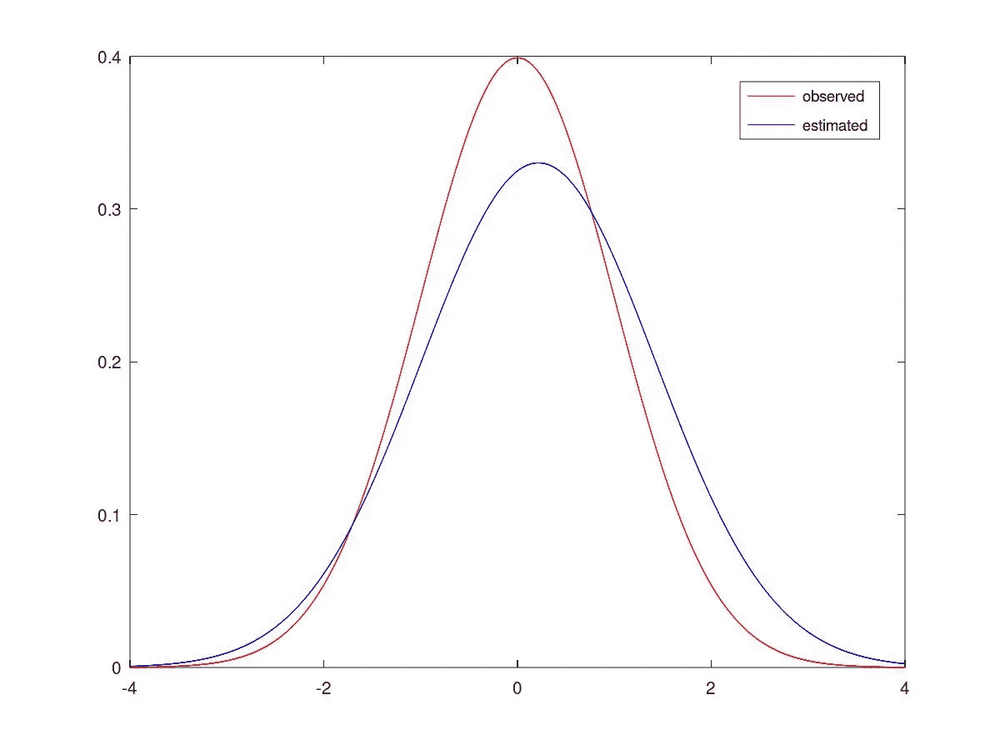

# 类别的后验概率

回到我们在定义给定输入数据的相应类别时的问题。我们通过计算 p(y|x)来选择概率的最大值，使得给定的数据 x 属于类别 y，从而找到这个类别。正如上一节所讨论的，我们的问题是估计条件概率 p(x|y)。

假设我们的观测数据用高斯模型表示。现在，利用之前提到的 MLE，我们可以通过下式估计每个类别 y，p(x|y)的条件概率

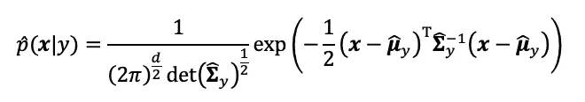

。{mu}_y 和{适马}_y 是属于 y 类模式的估计期望值和方差-协方差矩阵

考虑到上一节提到的这个估计的 p(x|y)和 p(y ),我们现在可以计算后验概率了。为了使计算更简单，我们使用对数后验概率 log p(y|x)。n_y 是类别 y 中的样本数，n 是样本总数。c 是与变量 y 无关的常数。

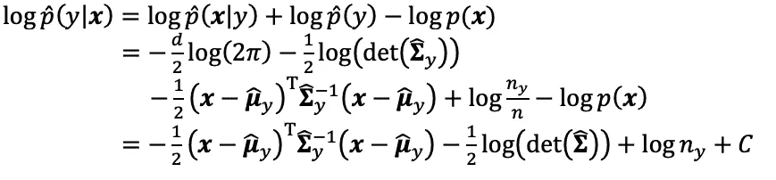

最后，为了定义模式 x 的相应类别，我们为类别集中的所有 y 计算 log p(y|x ),并选择具有最大值的一个。

# 线性判别分析

为避免复杂化，我们假设每一类的方差-协方差矩阵相等，常见的方差-协方差矩阵为\适马。

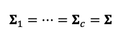

根据这一假设和上述讨论，公共方差-协方差矩阵的估计为

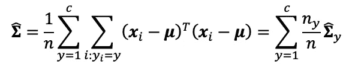

使用这种估计，对数后验概率现在可以写成

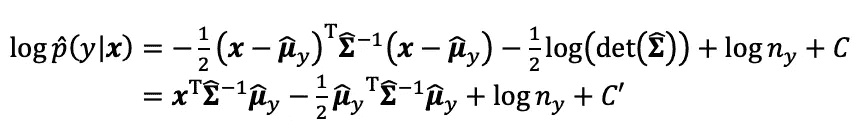

作为一个例子，现在假设类别的数量是 2。在这种情况下，决策边界是一组后验概率相等的点，意思是 p(y = 1 |**x**)= p(y = 2 |**x**)。决策边界可以写成

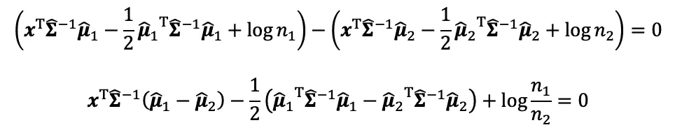

这可以简化为

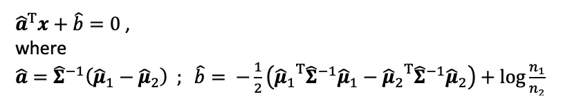

可以说决策边界是样本 **x** 的超平面。这种确定决策边界的方法称为 Fisher 线性判别分析。

# 例子

假设样本数据 x 在 2d 空间中。这里我们将做实值的线性判别分析。

## 训练样本

训练样本数据如下图所示，其中“x”表示类别 1，“+”表示类别 2。这里，我们在每个类别中使用 n1(=200)和 n2(=200)个样本。这些训练样本是用总体均值=(2，2)和(-2，-2)的高斯分布，总体方差-协方差矩阵[1，0；0,9].

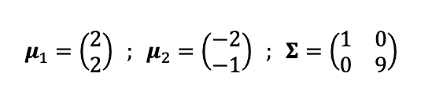

人口参数

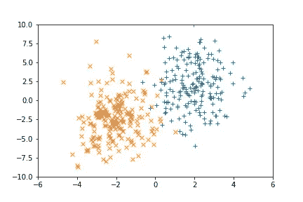

## 模型

与前面的讨论相同，我们用高斯模型近似数据，其中两个类别的方差-协方差矩阵相等。

## 估计

使用最大似然估计，每个类别的期望值和方差-协方差矩阵的估计为

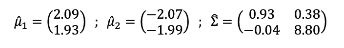

估计参数(样本参数)

根据线性判别分析部分的结果，给定数据的判定边界为

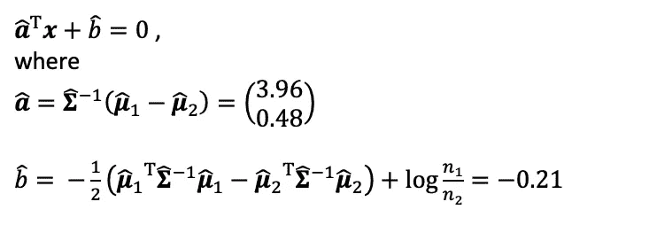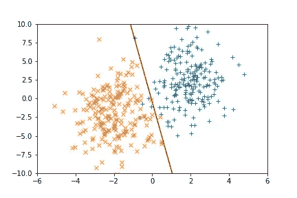

## 讨论

现在，让我们看看样本数量如何影响决策边界。
我们在[10，5，1，1/5，1/10]中对 n1/n2 值进行测试。

n1/n2 = 10

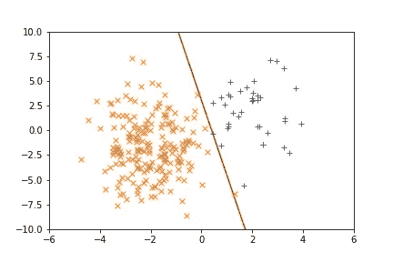

n1/n2 = 5

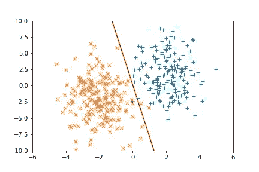

n1/n2 = 1

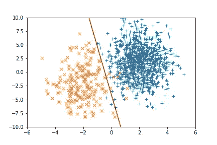

n1/n2 = 1/5

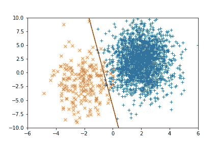

n1/n2 = 1/10

从这些结果中我们可以看出，当 n1/n2 >1 (n1> n2)时，将类别 1 的模式归入类别 2 的错误比类别 2 的模式少。在 n1

# 结论

最大似然估计在基于生成模型的模式识别中起着关键作用。正如我们在将 ML 估计应用于高斯模型中所讨论的，参数的估计与样本期望值和方差-协方差矩阵相同。这在统计估计中直观上很容易理解。然而，作为讨论部分的结果，样本的数量影响估计的准确性，这导致对模式识别(在这种情况下是线性判别分析)的性能的影响。因此，使用平衡的样本数据来避免过度适应识别过程的任何类别是至关重要的。

在这篇文章中，我们只讨论了高斯模型。然而，在现实生活的数据分析中，我们需要根据数据的自然特征为数据定义一个特定的模型。在不久的将来，我将介绍“最大似然估计中的模型选择”。

## 源代码

# 参考

[1] Masashi Sugiyama，统计机器学习—基于生成模型的模式识别(2019)