# ML 从零开始:K-最近邻分类器

> 原文：<https://towardsdatascience.com/ml-from-scratch-k-nearest-neighbors-classifier-3fc51438346b?source=collection_archive---------19----------------------->

Maksym Kaharlytskyi 在 [Unsplash](https://unsplash.com/s/photos/wine?utm_source=unsplash&utm_medium=referral&utm_content=creditCopyText) 上的照片

## KNN 分类算法的完整指南，在这里我们将看到如何从头实现一个基于 KNN 的机器学习模型，同时理解其背后的数学原理。

当涉及到通过机器学习解决分类问题时，有各种各样的算法可供选择，几乎可以用于任何数据类型或人们可能要处理的利基问题。这些算法选择可以大致分为两组，如下所示。

1.  **参数算法:**属于这一类别的算法依赖于代数数学方程，使用一组**权重和偏差**(统称为参数)，以预测给定数据集的最终离散结果。模型大小，即模型中可训练参数的总数，可以从仅仅几个(例如，在[传统机器学习算法](https://datamahadev.com/classification-algorithms-explained-in-30-minutes/)的情况下)变化到数百万甚至数十亿(如在[人工神经网络](https://datamahadev.com/artificial-neural-networks-detailed-explanation/)的情况下通常看到的)。
2.  **非参数算法:**这类分类算法相当独特，因为它们 ***根本不使用任何可训练参数*** 。这意味着，为了生成预测，*与它们的参数对应模型*不同，这一类别中的模型不依赖于一组权重和偏差，或者对数据有任何假设。相反，为了预测一个新数据点的目标类别，模型使用某种比较技术来帮助它们确定最终结果。

今天，在本文中，我们将详细研究这样一种非参数分类算法——**K-最近邻(KNN)算法。**

这将是一个基于*项目的指南*，在第一部分，我们将了解 KNN 算法的基础。接下来是一个项目，我们将使用基本的 PyData 库(如 **NumPy** 和 **Pandas** )从头实现一个 KNN 模型，同时理解算法的数学基础。

所以系好安全带，让我们开始吧！

# KNN 分类器基础

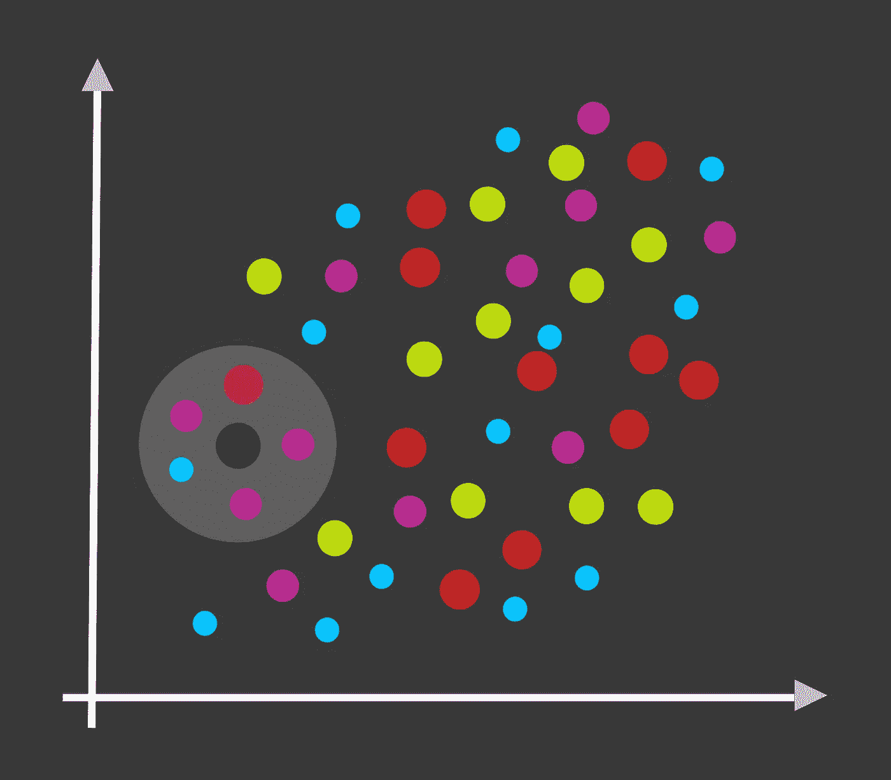

KNN 分类(作者图片)

首先，KNN 算法是经典的**监督机器学习**算法之一，能够进行**二元**和**多类分类**。**非参数**从本质上来说，KNN 也可以用作**回归算法。** *然而，就本文的范围而言，我们将只关注 KNN 的分类方面。*

> ***KNN 分类一目了然-***
> 
> →监督算法
> 
> →非参数
> 
> →用于回归和分类
> 
> →支持二元和多类分类

在我们进一步讨论之前，让我们首先分解定义并理解我们遇到的几个术语。

*   **KNN 是一个“有监督的”算法——**通俗地说，这意味着用于训练 KNN 模型的数据是一个有标签的数据。
*   **KNN 用于“二元”和“多类分类”——**在机器学习术语中，分类问题是这样一个问题，给定一系列离散值作为可能的预测结果(称为**目标类)，**模型的目的是确定给定数据点可能属于哪个目标类。对于二元分类问题，可能的目标类的数量是 2。另一方面，多类分类问题，顾名思义，有 2 个以上可能的目标类。KNN 分类器可以用来解决任何一种分类问题。

做完这些，我们对 KNN 有了一个大致的概念。但是现在，一个非常重要的问题出现了。

## KNN 分类器是如何工作的？

如前所述，KNN 是一种非参数算法。因此，训练 KNN 分类器不需要通过迭代多个时期的训练数据以优化一组参数的更传统的方法。

相反，KNN 的实际培训过程恰恰相反。训练一个 KNN 模型包括简单地将所有的训练数据实例同时装入*(或保存)*计算机存储器，这在技术上需要一个单一的训练周期。

完成此操作后，在推断阶段，模型必须预测全新数据点的目标类，模型只需将新数据与现有的训练数据实例进行比较。最后，基于这个比较，模型将这个新的数据点分配给它的目标类。

但是现在另一个问题出现了。我们正在谈论的这种比较到底是什么，它是如何发生的？坦白地说，这个问题的答案隐藏在算法本身的名字中——*K-最近邻*。

为了更好地理解这一点，让我们更深入地了解一下**推理过程是如何工作的。**

*   作为第一步，我们的 KNN 模型计算这个新数据点到“拟合的”训练数据内的每个数据点的距离。
*   然后，在下一步中，该算法选择“k”个训练数据点，这些训练数据点根据计算的距离最接近这个新数据点。
*   最后，该算法将作为我们的新数据点的最近邻居的这些“k”点的目标标签进行比较。在这些 k 个邻居中具有最高频率的目标标签被分配为新数据点的目标类别。

这就是 KNN 分类算法的工作原理。

关于数据点之间距离的计算，我们将使用欧几里德距离公式。我们将在下一节中理解这种距离计算，我们将从头开始编写我们自己的基于 KNN 的机器学习模型。

现在进入有趣的，实用的部分！我们将从快速浏览我们正在通过项目解决的问题陈述开始。

# 理解问题陈述

对于这个项目，我们将致力于著名的 [*UCI 红酒数据集*](https://archive.ics.uci.edu/ml/datasets/wine+quality#:~:text=UCI%20Machine%20Learning%20Repository%3A%20Wine%20Quality%20Data%20Set&text=Abstract%3A%20Two%20datasets%20are%20included,%2C%20%5BWeb%20Link%5D).) 。这个项目的目的是创建一个可以预测红酒样本质量的机器学习解决方案。

这是一个多类分类问题。目标变量，即葡萄酒的“质量”,接受一个范围从 0 到 10 的离散整数值，其中质量分数 10 表示葡萄酒的最高质量标准。

现在我们已经理解了问题，让我们从项目开始，导入所有必要的项目依赖项，包括必要的 PyData 模块和数据集。

# 导入项目依赖关系

第一步，让我们导入所有必要的 Python 模块。

现在，让我们导入数据集。

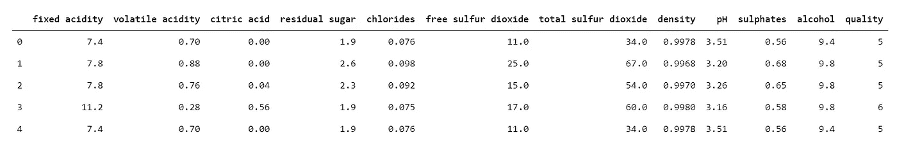

快速浏览数据集(图片由作者提供)

现在我们已经导入了数据集，让我们试着理解数据中的每一列表示什么。

# 理解数据

下面是对数据集中所有单个列的简要描述。

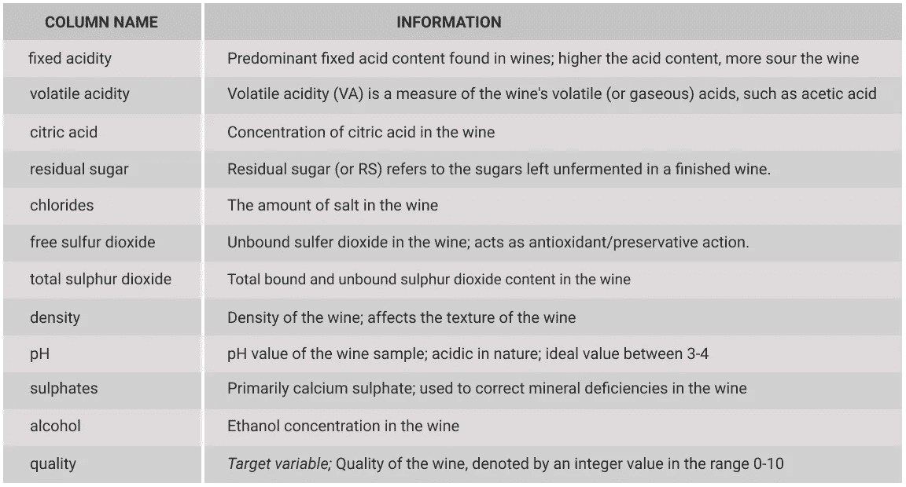

数据集的描述(图片由作者提供)

正如我们前面所讨论的,“质量”列是这个项目的目标变量。数据集中的其余列表示将用于训练模型的特征变量。

现在我们知道了数据集中不同的列代表什么，让我们继续下一部分，我们将对数据进行一些预处理和探索。

# 数据争论和 EDA

数据争论*(或预处理)*包括分析数据，看看它是否需要任何清理或缩放，以便为训练模型做准备。

作为数据预处理的第一步，我们将检查数据中是否有需要处理的空值。

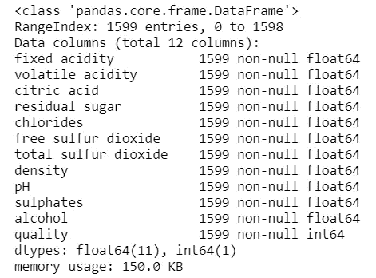

列描述和空值计数(作者图片)

正如我们所看到的，在我们的数据集中没有空值。这是一件好事，因为我们不必处理任何丢失的数据。现在，让我们看一下数据的统计分析。

从上面给出的统计分析中一个突出的观察结果是，在我们的数据集中不同列的值的范围中有一个明显的不一致。更清楚地说，一些列中的值的顺序是 *1e-1* ，而在少数其他列中，值可以高达顺序 *1e+2* 。由于这种不一致性，在训练模型时可能会出现特征权重偏差。这基本上意味着，某些特征最终可能会比其他特征对最终预测的影响更大。因此，为了防止这种重量不平衡，我们将不得不调整我们的数据。

对于这种扩展，我们将标准化我们的数据。 ***标准化*** 通常指重新调整数据，使每个特征列的平均值为 0，标准差为 1(单位方差)。

以下是标准缩放的数学公式。

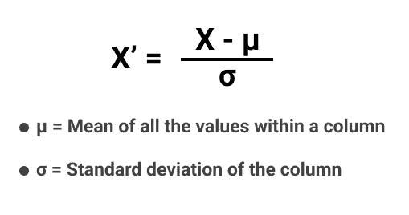

现在我们知道了数学公式，让我们继续用 Python 从头开始实现它。

**步骤 1** :分离特征矩阵和目标数组。

**步骤 2** :声明标准化功能。

**步骤 3** :对特征集进行标准化。

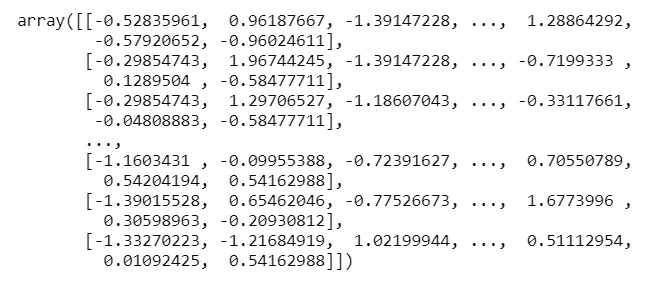

标准化数据(图片由作者提供)

这样，我们就完成了数据的标准化。这将最有可能照顾体重偏差。

现在，对于我们的数据争论和 EDA 部分的最后一部分，我们将看看数据集的目标列中的值的分布。

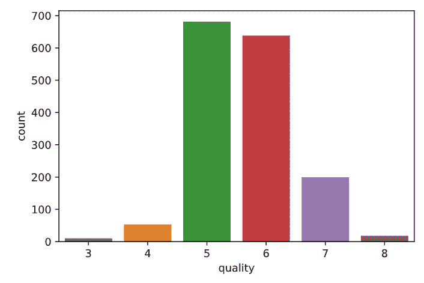

目标标签数量(作者图片)

上图中的一些观察结果是-

*   在我们的数据中，大多数葡萄酒样品被评为 5 和 6 级，其次是 7 级。
*   没有一款酒的评分高于 8 或低于 3。这意味着极高品质(9 或 10)或极低品质(0、1 或 2)的葡萄酒样品可以被认为是一种假设的理想情况，或者说**数据可能受到采样偏差**的影响，其中极高品质的样品在调查中没有任何代表性。
*   当我们注意到大多数葡萄酒样品被评为 5 或 6 级时，我们最后一个关于数据中取样偏差的假设得到了进一步加强。
*   根据这些数据训练的模型将产生有偏差的结果，更有可能将葡萄酒样品归类为质量等级 5 或 6，而不是 3 或 8。要了解更多关于抽样偏差或如何处理它，请查看我的文章[。](https://datamahadev.com/sampling-bias-in-data-science/)

既然我们已经完成了对数据的探索，让我们进入项目的最后一部分，在这里我们将使用 NumPy 对多类分类器 KNN 模型进行编码。

# 建模和评估

作为建模过程的第一步，我们首先将数据集分成训练集和测试集。*这样做是因为在相同的数据上训练和评估你的模型被认为是一种不好的做法。*

让我们看看如何使用 Python 实现分割数据集的代码。

步骤 1:声明 split 函数。

步骤 2:在我们的标准化数据集上运行分割函数。

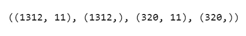

分叉的形状(图片由作者提供)

现在我们已经创建了我们的训练和验证集，我们将最终看到如何实现模型。

根据我们到目前为止所学的知识，下面是创建 KNN 模型的步骤。

**第一步:训练模型-** 正如我们前面读到的，在 KNN 的例子中，这仅仅意味着将训练数据集保存在内存中。我们在创建培训和验证数据拆分时已经做到了这一点。

**步骤-2:计算距离-** 作为 KNN 算法中推理过程的一部分，计算距离的过程是一个迭代过程，其中我们从训练数据中的每个单个数据点计算测试数据中的数据点*(基本上是数据实例/行)*的欧几里德距离。

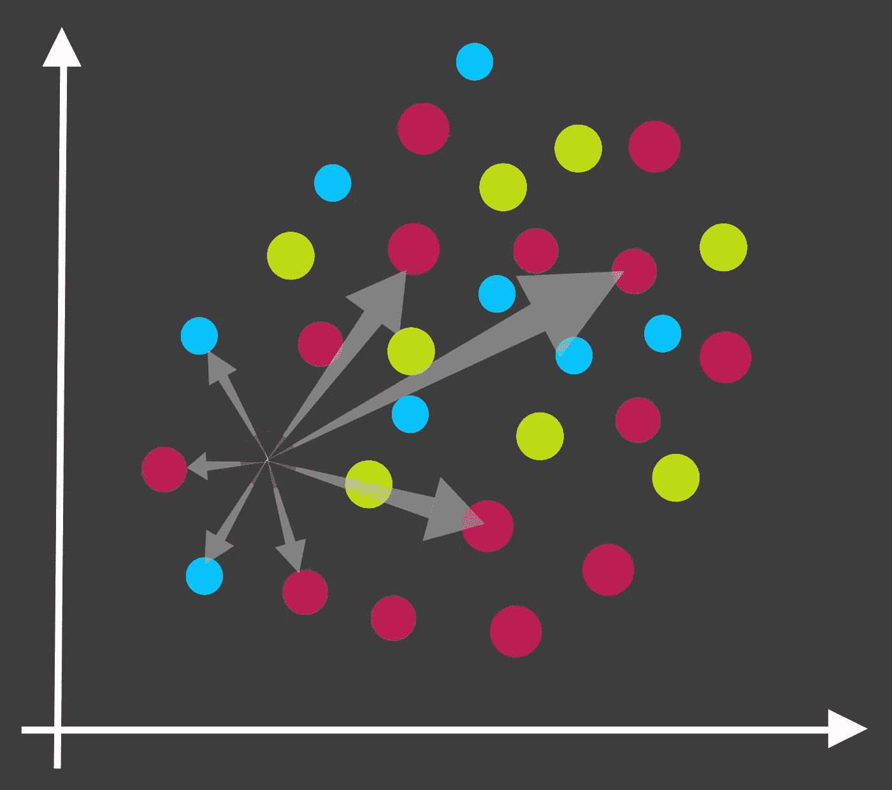

距离的计算(图片由作者提供)

现在，让我们了解欧几里德距离公式是如何工作的，以便我们可以为我们的模型实现它。

*   让我们考虑**两个数据点 A 和 b**

**→A**=【**A**0， **a** 1， **a** 2， **a** 3，… **a** n】，其中 **a** i 是表示数据点 a 的特征。

**→** 同样， **B=** [ **b** 0， **b** 1 **，b** 2 **，b** 3 **，…。b** n】。

因此，使用以下公式计算数据点 A 和 B 之间的欧几里德距离

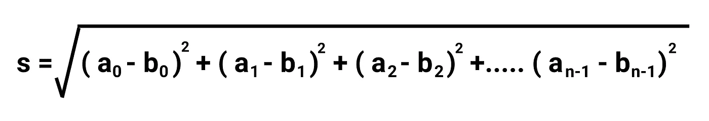

欧几里德距离公式(图片由作者提供)

现在让我们用 Python 实现这个距离计算步骤。

*   **步骤-2.1** :声明 Python 函数计算两点之间的欧氏距离。

*   **Step-2.2** :声明一个 Python 函数，计算训练数据中每一点的距离

在我们进入下一步之前，让我们测试一下距离函数。

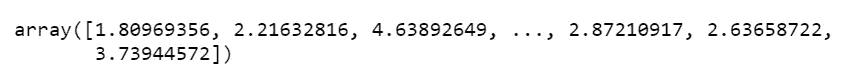

正如我们所看到的，我们的距离函数成功地计算了测试数据中第一个点与所有训练数据点的距离。现在我们可以进入下一步了。

**步骤 3:选择 k 个最近的邻居并进行预测-** 这是推断阶段的最后一步，其中算法基于步骤 2 中计算的距离选择 k 个最接近测试数据点的训练数据点。然后，我们考虑这些 k 个最近邻点的目标标签。出现频率最高的标签被指定为测试数据点的目标类别。

让我们看看如何用 Python 实现这一点。

**步骤-3.1** :定义 KNN 分类功能。

**步骤 3.2** :在我们的测试数据集上运行推理。

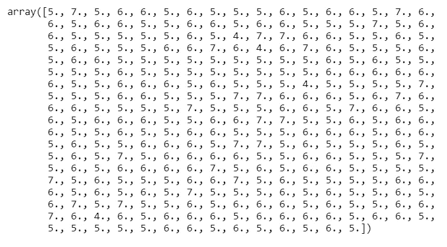

预测值数组(图片由作者提供)

至此，我们完成了建模和推理过程。最后一步，我们将评估模型的性能。为此，我们将使用一个简单的精度函数来计算我们的模型做出的正确预测的数量。

让我们看看如何在 Python 中实现精度函数。

**步骤 1** :定义精度函数。

**第二步**:检查我们模型的准确性。

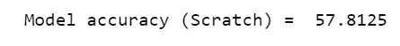

初始模型精度

**步骤 3** :与使用 Scikit-Learn 库构建的 KNN 分类器**的准确度进行比较。**

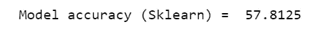

Sklearn 精度，k 值与 scratch 模型相同

这里有一个有趣的观察！虽然我们的模型表现得不是很好(只有 57%的正确预测)，但它与 Scikit-Learn KNN 模型具有完全相同的准确性。这意味着我们从头定义的模型最不能复制预定义模型的性能，这本身就是一项成就！

不过，我相信我们可以在一定程度上进一步提高模型的性能。因此，作为我们项目的最后一部分，我们将找到**超参数**‘k’的最佳值，我们的模型对此给出了最高的精度。

# 模型优化

在我们实际寻找最佳 K 值之前，首先让我们理解 K 值在 K-最近邻算法中的重要性。

*   KNN 算法中的 k 值确定了在确定测试数据点的类别时要考虑的训练数据点的数量。
*   **低 k 值的影响:**如果 k 值非常低，比如 1 或 2，模型将对数据中的异常值非常敏感。*离群值可以定义为数据中不遵循数据中一般趋势的极端情况。*正因为如此，模型的预测变得非常不稳定。
*   **高 k 值的影响:**现在，随着 KNN 算法中 k 值的增加，观察到一个奇怪的趋势。首先，观察到算法的稳定性增加。其中一个原因可能是，当我们考虑更多的邻居来预测测试数据点的目标类时，由于多数投票，离群值的影响减少了。然而，随着我们继续增加 k 值，在某个点之后，我们开始观察到算法的稳定性下降，并且模型精度开始恶化。

下图大致描述了 KNN 分类器模型的 k 值和稳定性之间的关系。

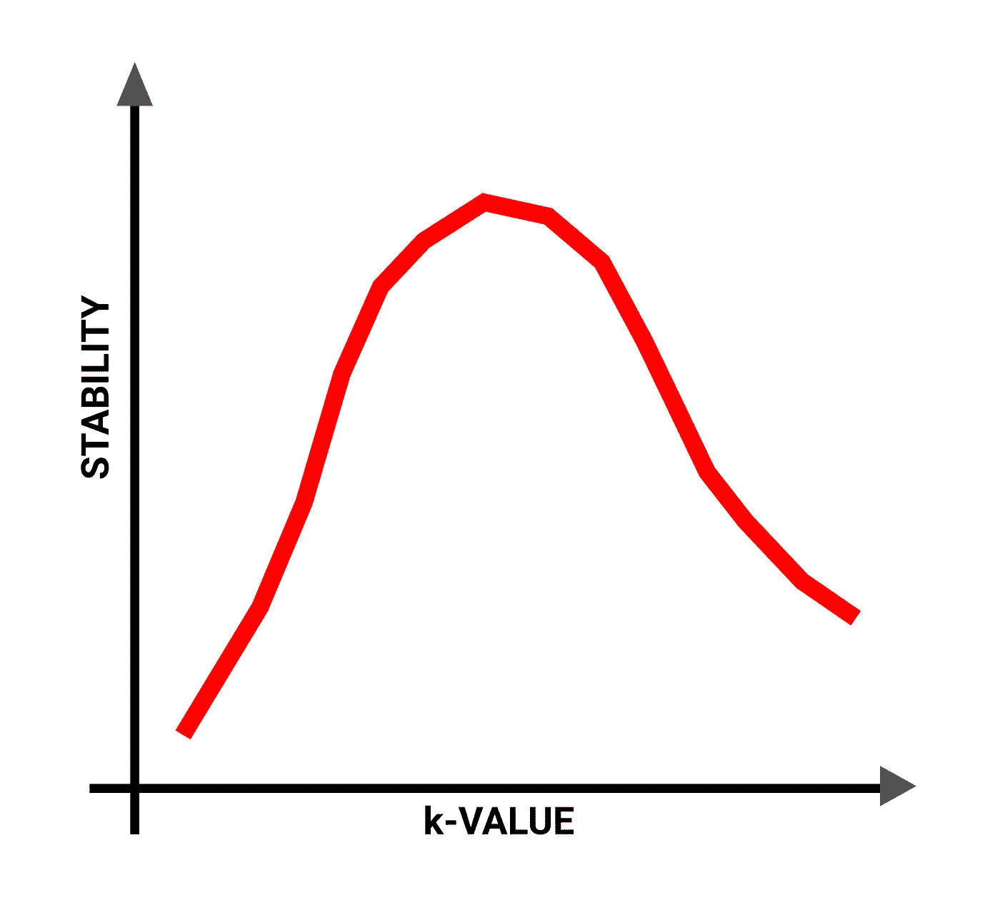

k 值与稳定性(图片由作者提供)

现在，让我们最后评估一系列不同 k 值的模型。具有最高精确度的一个将被选为我们模型的最终 k 值。

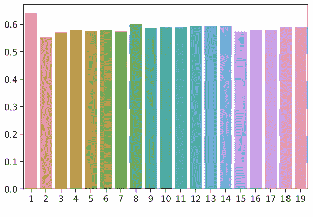

不同 k 值下的模型精度(图片由作者提供)

我们可以看到，k 值 1 的精度最高。但是正如我们之前讨论的，对于 k=1，模型将对异常值非常敏感。因此，我们将使用 k=8，它具有第二高的精度。让我们观察 k=8 的结果。

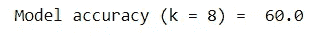

如您所见，我们在这里获得了性能提升！仅仅通过调整超参数“k ”,我们的模型的精确度就提高了近 3%。

这样，我们的项目就结束了。

最后，让我们快速总结一下今天所学的内容，以及本课的一些要点。

# 结论

本文对 K 近邻分类算法进行了深入的分析。我们知道该算法如何使用数据实例之间的欧几里德距离作为比较标准，并在此基础上预测特定数据实例的目标类。

在本指南的第二部分，我们主要使用 Python 和 NumPy，一步步地从头开始创建 KNN 分类模型。

虽然我们的模型不能提供一流的性能，但至少我们能够匹配预定义的 Scikit-Learn 模式的性能。现在，虽然我们能够通过超参数优化将模型的准确性提高 60%，但性能仍然不理想。

这与数据的结构有很大关系。正如我们之前观察到的，数据中存在巨大的采样偏差。这无疑影响了我们模型的性能。性能不佳的另一个原因可能是数据中有大量异常值。所有这些把我们带到了一个非常重要的部分，我把它留到了最后，在那里我们将会看到 KNN 分类算法的优点和缺点。

## KNN 的优势-

*   正如我们之前讨论的，作为一种非参数算法，KNN 不需要多个训练周期来适应训练数据中的趋势。因此，KNN 的**训练时间几乎可以忽略不计，**事实上，它是训练速度最快的机器学习算法之一。
*   与其他更复杂的分类算法相比，KNN 的**实现非常简单**。

## KNN 的缺点-

*   说到推理，KNN 是**非常计算密集型**。对于每个测试数据实例的推断，算法必须计算它与训练数据中每个单点的距离。在**时间复杂度**方面，对于 n 个训练数据实例和 m 个测试数据实例，算法复杂度评估为**O(m×n)**。
*   随着维度*(即特征总数)*和数据集规模*(即数据实例总数)*的增加，模型规模也随之增加，进而影响模型的性能和速度。因此，对于高维、大规模数据集，KNN 不是一个好的算法选择。
*   KNN 算法对数据中的异常值非常敏感。即使数据集内的噪声略有增加，也可能会严重影响模型的性能。

到此，我们终于结束了今天的学习。[在我的另一篇文章](https://datamahadev.com/machine-learning-classification-algorithms-step-by-step-comparison/)中，我已经直接让一堆机器学习算法互相对垒了。在那里，您可以查看 KNN 相对于其他分类算法(如逻辑回归、决策树分类器、随机森林集成等)的表现。

顺便说一下，这是我的 **ML 从零开始**系列的第四篇文章，其中我详细介绍了不同的机器学习算法及其数学基础。如果您有兴趣了解更多，本系列的其他文章是-

 [## ML 从零开始-多项式逻辑回归

### 你的多项逻辑回归完全指南，又名 Softmax 回归

towardsdatascience.com](/ml-from-scratch-multinomial-logistic-regression-6dda9cbacf9d)  [## 使用 PyTorch 的多项式回归(从头开始)

### 说到预测分析，回归模型被证明是最具成本效益的方法之一。当……

towardsdatascience.com](/polynomial-regression-using-pytorch-from-scratch-500b7887b0ed)  [## 数字线性回归模型

### 在这个项目中，我们将看到如何创建一个使用多元线性回归算法的机器学习模型。

towardsdatascience.com](/linear-regression-model-with-numpy-7d270feaca63) 

[**链接到项目 GitHub 文件**](https://github.com/amansharma2910/MachineLearning-Scratch_WineClassificationKNN) **。**

如果你喜欢这篇文章，并且想在 **ML from Scratch** 系列中继续看到更多的文章，确保你点击了下面的按钮。

快乐学习！