# ML 从零开始-多项式逻辑回归

> 原文：<https://towardsdatascience.com/ml-from-scratch-multinomial-logistic-regression-6dda9cbacf9d?source=collection_archive---------13----------------------->

图片来源-Unsplash.com

## 你的多项逻辑回归完全指南，又名 Softmax 回归

当涉及到现实世界的机器学习时，大约有 *70%* 的问题是基于分类的，在可用的特征集的基础上，你的模型试图预测在一组给定的类别(离散的可能结果)中，你的目标变量可能属于哪个类别。**今天，在本文中，我们将了解多项逻辑回归，这是一种经典的监督机器学习算法，能够进行*多类分类*、**，即当有两个以上可能的离散结果类时，预测目标变量的结果。

这是一个基于项目的指南，在其中我们将看到如何从头开始编写 MLR 模型，同时理解允许模型进行预测的数学方法。

对于这个项目，我们将致力于著名的 [*UCI 克利夫兰心脏病数据集*](https://archive.ics.uci.edu/ml/datasets/Heart+Disease) 。**我们将从头开始创建一个 ML 模型，该模型使用多项逻辑回归，能够预测患者心脏病的严重程度。**

# 多项式逻辑回归基础

在我们开始实际的项目之前，让我们首先熟悉 MLR 背后的基本思想——它是什么，它做什么，以及它是如何操作的？

## 到底什么是多项逻辑回归？

你可以把多项逻辑回归看作是类固醇上的逻辑回归(更具体地说，是二元逻辑回归)。而二进制逻辑回归可以预测二进制结果(例如，是或否，垃圾邮件或非垃圾邮件，0 或 1 等。)，MLR 可以预测 k 个可能结果中的一个，其中 k 可以是任意正整数。

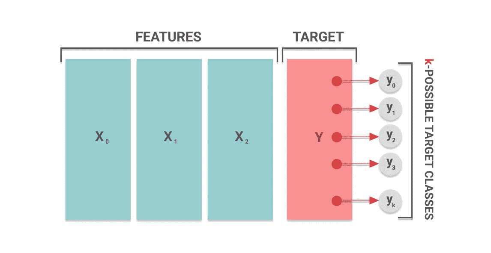

为特征集预测的结果是 k 个可能结果之一

## MLR 是如何工作的？

多项式回归函数是一种***统计分类算法*** 。这意味着，一旦我们为函数提供了一组要素，模型就会执行一系列数学运算，将输入值归一化为遵循概率分布的值向量。

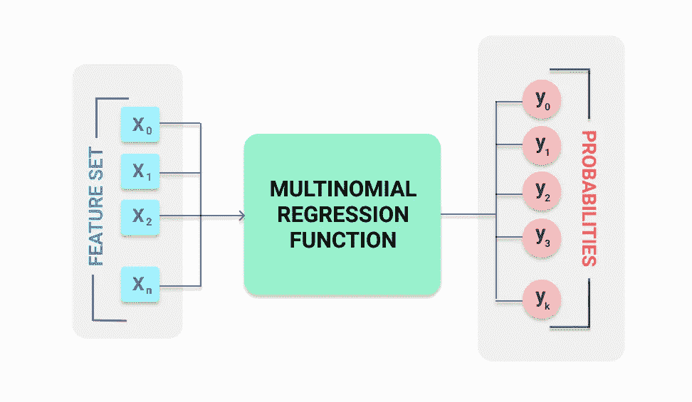

MLR 函数根据给定的特征集计算可能的目标类的概率

*   我们给模型的输入是一个特征向量， **X** ，包含特征**X**1， **x** *2* ， **x** *3* …..**x**n。
*   我们得到的输出是一个概率向量 **Y** ，包含 **y** *1* ， **y** *2* ，**Y***3*…**Y***k*对于 **k** 目标类的概率。
*   这里，**y***1*+**y***2*+**y***3*…+**y***k*= 1，由于一个系统中所有可能事件的总概率总是 1。

最后，概率最高的结果将是给定特征集的预测结果。

现在的问题是，MLR 函数到底是如何将特征集转换成概率值的？在我们的项目中，我们会努力理解这一点。

# 导入项目依赖关系

在我们开始这个项目之前，让我们首先导入所有必要的模块和包。

现在，我们将导入数据集。根据[数据源](https://archive.ics.uci.edu/ml/datasets/Heart+Disease)，数据集没有列名。因此，我们将把 header 属性设置为 None，然后根据源上的可用信息手动设置列名。

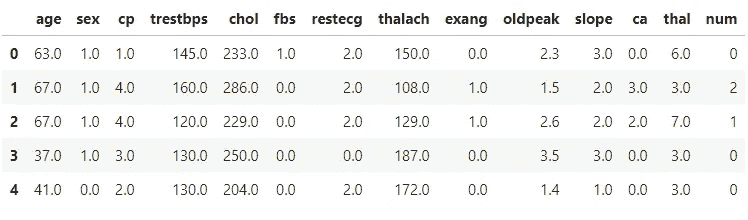

显示数据集的屏幕截图

## 理解数据

现在我们已经导入了数据集，让我们试着理解每一列的含义。

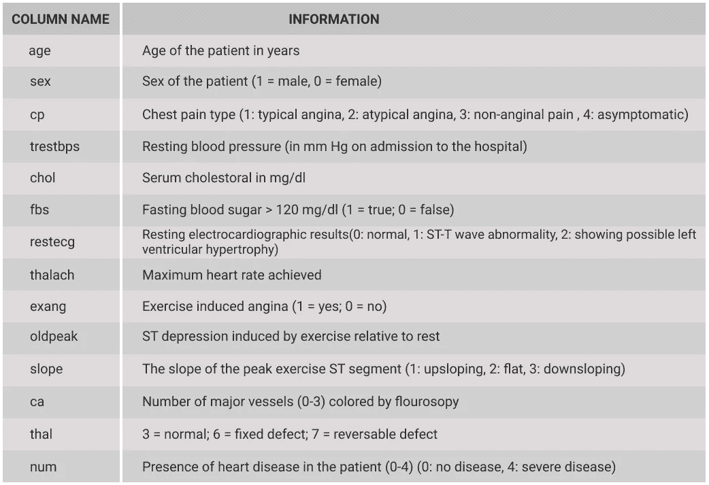

这里， **num** 列是我们的目标变量，值的范围从 0(没有疾病)到 4(心脏病的高几率)。

既然我们已经确切地知道了我们的数据集代表什么，让我们继续下一步。

# 数据预处理

现在，让我们分析数据，看看是否需要清理或修改。作为数据预处理的第一步，我们将检查是否有任何空值需要处理。

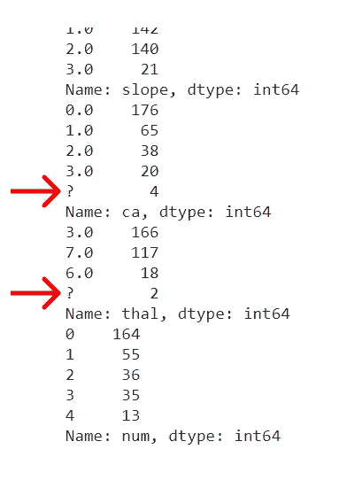

正如我们所看到的，列 **ca** 和 **thal** 有 4 个和 2 个**'？'**分别取值。这些是我们需要处理的空值。由于这两列都由分类值组成，我们将用各自列的中值替换空值。我们还将把这两列类型转换为*‘float 64’值。*

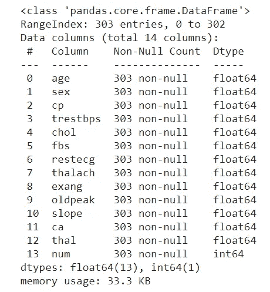

现在我们已经清理了数据，让我们看看数据集的统计分析。

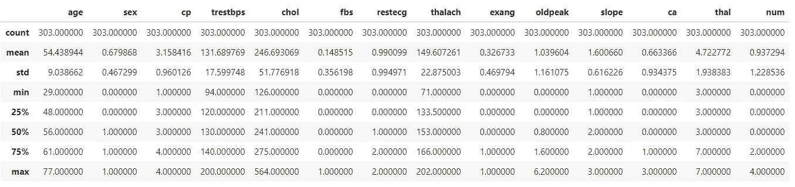

数据集的统计分析

观察数据后，我们可以看到数据需要缩放，因为我们的值在范围 *(1，1e+2)内。我们缩放数据的主要原因是，由于我们将使用随机梯度下降来优化我们的模型参数，缩放可以显著提高我们的优化器的速度和准确性。*

这里，我们将使用标准比例来标准化数据。 ***标准化*** 通常是指重新调整数据，使平均值为 0，标准差为 1(单位方差)。以下是标准缩放的数学公式。

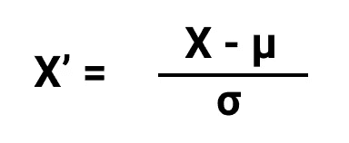

这里，

*   **μ =一列中所有值的平均值**
*   **σ =列的标准偏差**

现在，让我们在代码中实现它。第一步是将数据集分为目标数组和要素数组。

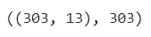

特征矩阵和目标向量的形状

现在，让我们定义标准缩放的函数。

我们现在将对我们的特性集执行标准化。

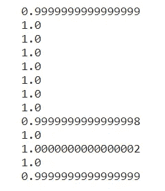

正如我们所看到的，每个特性列的标准偏差现在是 1，正如标准缩放所预期的那样。我们已经成功地标准化了我们的功能集。

这样，我们就完成了数据争论的过程。随着数据的清理和标准化，现在让我们开始研究我们的模型。

# 从头开始构建模型

正如我们前面看到的，MLR 模型将特征向量作为输入，然后根据这些特征计算可能结果的概率。那么 MLR 模型到底是怎么做到的呢？让我们在这一节中找出 MLR 模型的编码位置。

多项式回归函数由两个功能层组成

1.  线性预测函数(也称为逻辑层)
2.  Softmax 函数(也称为 softmax 层)

首先，让我们看看线性预测函数的作用。下面给出了线性预测函数的公式。

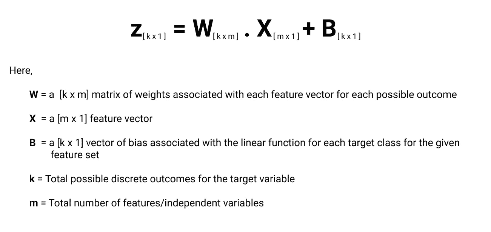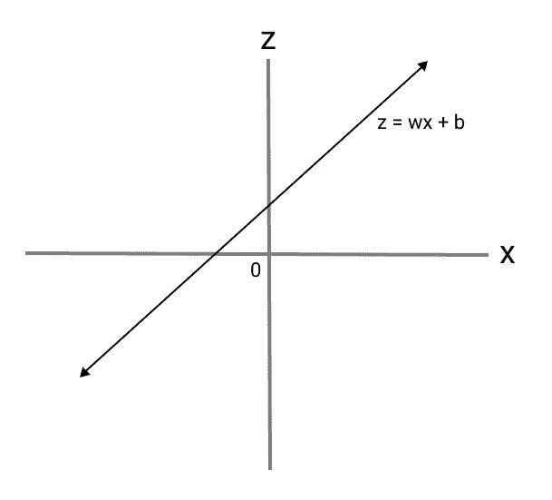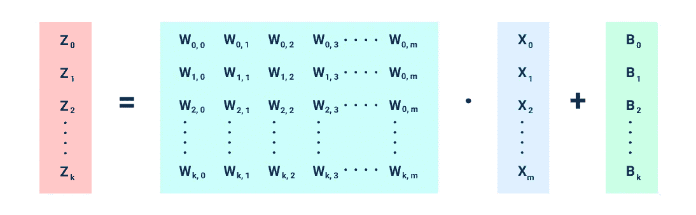

如果你仔细观察，这类似于我们用于线性回归模型的函数。它基本上做的是在范围(- **∞，** + **∞** )内映射我们的目标变量的每个可能结果的分数。

这有点类似于 log odds( [logit function](https://en.wikipedia.org/wiki/Logit) )，将一个事件的赔率映射到范围(- **∞，** + **∞** )。因此，线性预测函数也称为 logit 函数。

现在，我们将看到线性预测函数的代码。

**步骤 1** -为我们的模型创建随机权重和偏差(因为我们有 5 个可能的目标结果和 13 个特征，k = 5，m = 13)。

**第 2 步** -定义线性预测函数。

现在，让我们测试一下特征矩阵的功能。最终输出应该是一个 303 x 5 的矩阵，因为我们的数据集中有 303 个特征集，目标变量有 5 个可能的结果。

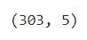

正如我们所看到的，这个函数工作得很好。现在进入下一步，将 logit 分数转换成概率值。这就是 softmax 函数发挥作用的地方。下面给出了 softmax 算法的公式。

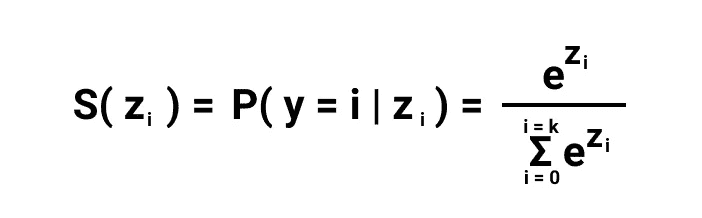

softmax 函数的作用是对每个可能结果的 logit 分数进行归一化，使得归一化的输出遵循概率分布。

通俗地说，softmax 函数将一个特性集的可能结果的 logit 得分转换为概率值。

现在，让我们为我们的模型定义 softmax 函数。

既然我们已经定义了 softmax 函数，那么让我们将这两个函数合并成一个多项式函数用于我们的模型。

现在，让我们对我们的特征集执行逻辑回归。

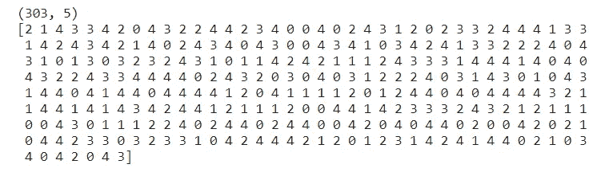

现在让我们检查我们的模型的准确性。由于权重和偏差是随机生成的，我们不能指望我们的模型在此刻非常准确。

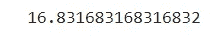

初始模型精度

正如我们所看到的，初始模型精度只有 16%左右，这是非常差的，甚至不能考虑这个模型在现实生活中进行任何心脏病预测。

因此，我们需要优化我们的模型参数，以提高其准确性。

# 模型优化

在我们进一步优化我们的模型之前，我们应该首先将数据集分成测试集和训练集。**在同一个数据集上进行训练和测试被认为是一种不好的做法**，因为它会严重影响模型的真实性能。

让我们定义 train_test_split 函数，将数据集分成训练和测试数据。然后，我们将在数据集上运行它。

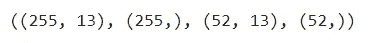

训练特征、训练目标、测试特征和测试目标的大小

**现在我们有了独立的训练和测试数据集，我们将把测试数据集放在一边，只用于测试目的。所有的训练和优化都将在训练数据集上执行。**

现在我们离优化模型只有一步之遥了。在开始优化之前，我们有几个问题要回答。*我们计划优化模型的标准到底是什么？甚至优化的目的到底是什么？*

答案是——我们希望优化模型，以减少模型产生的信息损失。由于优化的标准是信息损失，我们需要为我们的模型定义一个损失函数。

对于多项式回归函数，通常我们使用**交叉熵损失**函数。下面给出了交叉熵损失函数的公式。

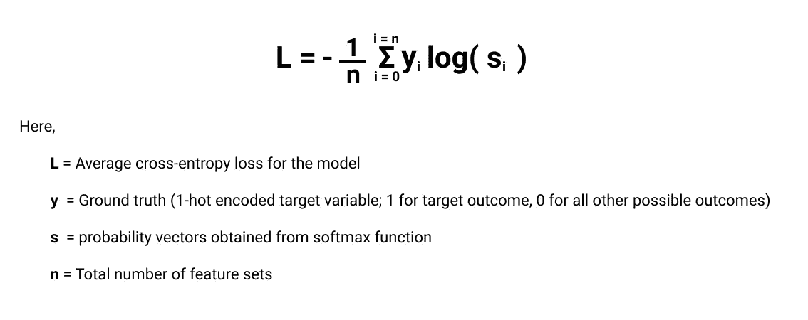

现在让我们定义交叉熵损失函数。

既然我们已经定义了损失函数，我们将最终定义优化器算法。下面给出了随机梯度下降运算的公式。

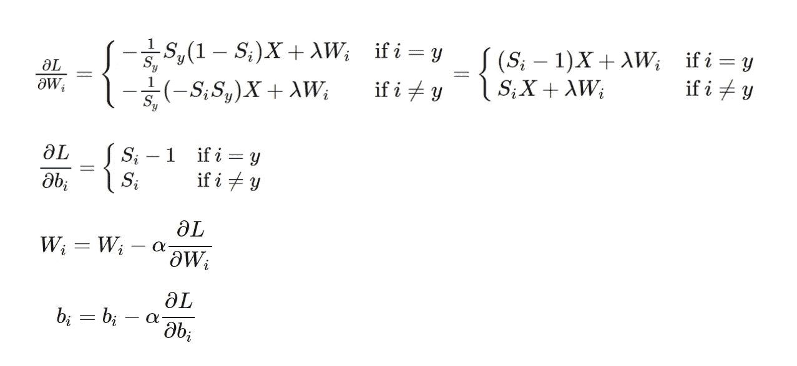

[图像来源](https://madalinabuzau.github.io/2016/11/29/gradient-descent-on-a-softmax-cross-entropy-cost-function.html)

关于这方面的更多细节，请参考[这个来源。下面给出的是 SGD 算法的代码。](http://machinelearningmechanic.com/deep_learning/2019/09/04/cross-entropy-loss-derivative.html)

现在我们已经准备好了优化器函数，我们将为我们的模型运行它。

我们现在已经到了项目的最后一步。

**“我们已经到了最后阶段！”**

现在，我们将使用通过运行优化器函数获得的更新权重和偏差来测试我们的多项式逻辑回归模型。

**注意——测试将在测试数据集上进行，而不是在训练数据集上进行。**

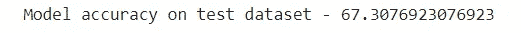

正如我们所看到的，我们的模型在测试数据上显示了大约 67%的准确性。虽然这比我们最初获得的 16%有了显著的提高，但仍有足够的改进空间。

您可以通过调整超参数(学习率、训练次数等)来进一步提高精确度。)或者通过使用不同的缩放或优化算法来尝试该过程。记住，你尝试的越多，你学到的就越多！

这样，我们的项目就结束了。

## 以下是关键要点-

*   从头开始编写多项式逻辑回归模型。
*   MLR 模型中涉及的数学。

更多像这样有趣的项目，请查看[我的简介](https://medium.com/@amansharma2910)。

我只是机器学习和数据科学领域的新手，所以任何建议和批评都将真正帮助我提高。

点击以下链接，继续关注更多 ML 内容！

**数据集和 Jupyter 笔记本的 GitHub repo 链接-**

 [## aman Sharma 2910/多项式回归-Scratch _ heart disease prediction

### 在这个项目中，我从头开始编写了一个 MLR 模型，可以用来预测心脏的存在(和严重程度)。

github.com](https://github.com/amansharma2910/MultinomialLogisticRegression-Scratch_HeartDiseasePrediction) 

# 参考

*   多项逻辑回归— [维基百科](https://en.wikipedia.org/wiki/Multinomial_logistic_regression)
*   Logit 函数— [维基百科](https://en.wikipedia.org/wiki/Logit#:~:text=In%20statistics%2C%20the%20logit%20(%2F,.)
*   Softmax 函数— [维基百科](https://en.wikipedia.org/wiki/Softmax_function)
*   交叉熵函数-[MachineLeariningMechanic.com](http://machinelearningmechanic.com/deep_learning/2019/09/04/cross-entropy-loss-derivative.html)