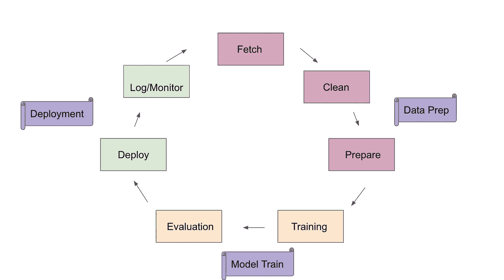

# ML in Production-1:Amazon sage maker-AWS，设置、培训和部署！

> 原文：<https://towardsdatascience.com/ml-in-production-1-amazon-sagemaker-aws-setup-train-and-deploy-896086848cde?source=collection_archive---------29----------------------->

> "那些像生命流动一样流动的人知道他们不需要其他力量."老子


浮冰，斯瓦尔巴特群岛~ Roshini Johri(图片由作者提供)

将大规模的机器学习系统投入生产，并建立一个漂亮的流线型基础设施，其中的功能库只是流动，这已经成为我的一个新的困扰(也许这就是作为一个 10 年的机器学习老手对你所做的..你只是想狗屎工作)

最近，我与伦敦[women in machine learning](https://www.meetup.com/London-Women-in-Machine-Learning-and-Data-Science/events/271800385/)社区一起开始了一个关于学习和教授如何做到这一点的系列，分为三部分，以实现不同的机器学习工作流程。这是我演讲后写的文章。这篇文章假设了机器学习模型的基本知识，并更多地关注于在生产中设置工作流和部署。在这个系列的第一部分，我们将在[亚马逊 Sagemaker](https://aws.amazon.com/sagemaker/) 上进行设置。我们将使用 [sklearn 的波士顿住房](https://scikit-learn.org/stable/modules/generated/sklearn.datasets.load_boston.html)数据集。

# 机器学习生命周期

让我们花点时间来看一下机器学习的生命周期。简化的机器学习生命周期看起来像:



机器学习生命周期

现在是第一部分，数据准备，实际上应该是生产工作流程的数据预处理和特征工程。

*   **获取数据:**这是一个过程，您将从 repos、ETL 等中读入数据，将数据移动到一个位置，以形成您的训练数据的原始版本。
*   **清理数据:**这个阶段主要是做一些基本的清理工作，比如类型转换、空处理、确保字符串/类别等的一致性
*   **准备/转换:**特征转换、衍生、高阶特征，如交互特征、编码等。

下一阶段涉及建模和评估阶段:

*   **训练模型:**在这个阶段你的数据应该以特征向量和标签的形式分割成训练、验证和测试。在这个阶段，您将读取这些数据， ***在您的训练集上训练您的模型，调整到验证集并在测试集上测试*** ！这也是您保存模型工件以进行评估和记录的阶段。
*   **评估模型:**评估阶段，“我的模型做得对吗”阶段是最重要的阶段之一，我觉得我们从来没有在这个阶段花足够的时间。特征工程和模型评估将帮助您了解模型性能。句号。多注意你的模型评估指标，并选择正确的指标。

最后但同样重要的是，我们阅读这篇文章的真正原因是部署！万岁。

*   **部署到生产:**这是您准备将您的模型发布到野外的阶段。添加所需的调度，并注意**概念漂移和模型衰减**(由于底层分布的变化而导致的性能变化)
*   **监控/收集/评估数据:**模型性能、输入/输出路径、错误度量、日志、模型工件等都将被打上时间戳并记录下来，应该为完美的管道建立围绕模型选择的监控度量和警报/报告！

以上，是一个简化但漂亮的机器学习管道。激动吗？欣喜若狂？你应该害怕。在我看来，组织应该把这作为一句口头禅。现在让我们看看如何用 Amazon Sagemaker 设置一个。

# 亚马逊 Sagemaker

现在，第一步从创建一个 [AWS 账户](https://aws.amazon.com/premiumsupport/knowledge-center/create-and-activate-aws-account/))开始。如果您已经熟悉 Amazon 提供的实例类型(ec2 实例)，这会有所帮助。如果没有，请从[这里](https://aws.amazon.com/sagemaker/pricing/instance-types/)开始。Sagemaker 实例针对运行机器学习(ML)算法进行了优化。实例的类型也取决于区域和[可用区域](https://docs.aws.amazon.com/general/latest/gr/rande.html#sagemaker_region)。


[https://aws.amazon.com/sagemaker/pricing/instance-types/](https://aws.amazon.com/sagemaker/pricing/instance-types/)

如果您觉得阅读太多关于实例类型的细节令人厌烦，那么开始吧:

开始 ML 的好实例: **ml.m4.xlarge(非自由)**

开始 DL 的好实例: **ml.p2.xlarge(非自由)**

AWS Sagemaker EC2 实例具有与之关联的默认配额。你可能不总是得到 20，这也因地区而异。根据您可能需要请求和增加的用例。这可以通过与 AWS 支持中心一起创建案例来完成。请在这里查看更多[信息](https://docs.aws.amazon.com/general/latest/gr/aws_service_limits.html)

## Sagemaker 笔记本实例

现在要启动 sagemaker 笔记本实例，请转到 aws 帐户服务来搜索 sagemaker。进入 sagemaker 页面后，单击 create notebook instance。这将如下所示:


笔记本实例:命名笔记本并选择实例类型

下一步是选择 IAM 角色。简单的第一次尝试就是创建一个新的角色并选择 none 作为 s3 存储桶，除非有一个您想要读取的 s3 存储桶。此外，此时应该有一个选择 git 存储库的可选选项。向下滚动并点击创建笔记本实例。


笔记本实例:选择 IAM 角色

您可以看到正在创建的笔记本的状态，一旦准备就绪，您可以选择 jupyter 或 jupyter lab。


笔记本实例已创建！选择 Jupyter/JypyterLab

如果您需要克隆您的 git 存储库，从 jupyter 树的右上角打开终端，在那里显示 new，然后执行以下操作:

```
cd SageMakergit clone myFunSagemakerRepo
```

太好了！这应该为您设置了一个笔记本实例和一个 git hub 存储库。我们现在可以开始有趣的部分了！

## Sagemaker 会话和角色


初始化 sagemaker 会话和角色

我们将使用 load_boston()方法从 sklearn 获取数据集。然后，我们将把这个数据集分成训练、验证和测试。

```
#load the data
boston_data = load_boston()#Training data
X_bos_pd = pd.DataFrame(boston_data.data, columns=boston_data.feature_names)#Target
Y_bos_pd = pd.DataFrame(boston_data.target)#Train/Test split
X_train, X_test, Y_train, Y_test = sklearn.model_selection.train_test_split(X_bos_pd, Y_bos_pd, test_size=0.20)#Train/Validation split
X_train, X_val, Y_train, Y_val = sklearn.model_selection.train_test_split(X_train, Y_train, test_size=0.33)
```

一旦创建了训练、验证和测试数据集，就需要将它们上传到 s3(简单存储服务)桶，以便 sagemaker 容器可以在执行训练作业时访问它们。最好用前缀指定位置，最好是型号名称和版本，以确保路径整洁。上传后，您可以从您的控制台转到 s3 服务并进行检查。

```
prefix = 'boston-xgboost-example'**test_location** = session.upload_data(os.path.join(data_dir, 'test.csv'), key_prefix=prefix)
**val_location** = session.upload_data(os.path.join(data_dir, 'validation.csv'), key_prefix=prefix)
**train_location** = session.upload_data(os.path.join(data_dir, 'train.csv'), key_prefix=prefix)
```


检查 s3 中的存储桶创建

## Sagemaker 培训工作

在 sagemaker 中训练机器学习模型涉及到创建一个训练作业。我们将使用 [xgboost 模型](https://docs.aws.amazon.com/sagemaker/latest/dg/xgboost.html)。请检查此处链接的文档，以确保您查看了 sagemaker 的要求和语法。

培训工作组件

要培训 sagemaker 模型，第一项任务是创建一个培训作业，包括以下内容:

*   培训/验证的 S3 位置(注意:这应该是 csv 文件)
*   模型的计算资源(这不同于我们用于笔记本电脑的资源)
*   输出 S3 位置(模型工件)
*   内置模型的停靠路径([见此)](https://docs.aws.amazon.com/sagemaker/latest/dg/sagemaker-algo-docker-registry-paths.html)

模型估计器

*   为了训练一个模型，我们需要创建一个模型估计器。这将包含关于如何训练模型的信息(配置)。更多详情请看这里:[估算器](https://sagemaker.readthedocs.io/en/latest/estimators.html)
*   我们将使用名为 get_image_uri 的 SageMaker 实用程序方法来获取内置算法的容器路径
*   估计器初始化如下所示。这里我用了一个付费的例子。

```
container = get_image_uri(session.boto_region_name, 'xgboost')#xgboost estimator
xgb_estimator = sagemaker.estimator.Estimator(
container, 
role,      
train_instance_count=1,                                                                            train_instance_type='ml.m4.xlarge',                                                 output_path='s3://{}/{}/output'.format(session.default_bucket(), prefix),
sagemaker_session=session
)
```

模型超参数

*   任何模型训练方法的关键部分，在我们开始训练之前，我们需要调用估计器的 **set_hyperparameters** 方法。xgboost 超参数见此:[xgboost _ 超参数](https://docs.aws.amazon.com/sagemaker/latest/dg/xgboost_hyperparameters.html)
*   当估计器都设置好了，下一个开始训练的方法是 fit

```
xgb_estimator.set_hyperparameters(max_depth=5,
                        eta=0.2,
                        gamma=4,
                        min_child_weight=6,
                        subsample=0.8,
                        objective='reg:linear',
                        early_stopping_rounds=10,
                        num_round=200)train_s3 = sagemaker.s3_input(s3_data=train_location, content_type='csv')
validation_s3 = sagemaker.s3_input(s3_data=val_location, content_type='csv')xgb_estimator.fit({'train': train_s3, 'validation': validation_s3})
```

模型评估

*   SageMaker 使用一个 transformer 对象来评估模型。([文档](https://sagemaker.readthedocs.io/en/latest/transformer.html))
*   transformer 对象像 estimator 对象一样，需要知道实例计数以及它需要转换的测试数据的类型和格式。为了让 transformer 以批处理的方式评估测试数据，我们需要让它知道将文件分解成块的行的分割类型。

```
xgb_transformer = xgb_estimator.transformer(instance_count = 1, instance_type = 'ml.m4.xlarge')xgb_transformer.transform(test_location, content_type='text/csv', split_type='Line')xgb_transformer.wait()
```

现在，为了将我们的数据从 s3 移回我们的笔记本进行分析，我们复制了它(我在 udacity 上学到的一个小技巧)

```
!aws s3 cp --recursive $xgb_transformer.output_path $data_dir
```

现在我们来评估！

```
Y_pred = pd.read_csv(os.path.join(data_dir, 'test.csv.out'), header=None)
```


y_pred 对 y_test

## 模型部署

通过高级 api 的模型部署非常简单。我将展示一个如何部署我们刚刚培训过的上述模型的示例。

```
#call deploy method to start an endpoint instance xgb_predictor = xgb_estimator.deploy(initial_instance_count=1, instance_type='ml.m4.xlarge')xgb_predictor.content_type = 'text/csv'
xgb_predictor.serializer = csv_serializerY_pred = xgb_predictor.predict(X_test.values).decode('utf-8')#DON'T FORGET TO SHUT DOWN/CLEAN UP WHEN YOU ARE DONE!
```

*   与我们评估 transformer 对象的方式类似，我们可以对部署的模型做同样的事情，这是我们在生产环境中真正想要做的事情，以保存能力日志并比较不同运行的结果以及 ***概念漂移*** (可能导致模型衰退的底层数据分布的变化)。
*   根据测试集的大小，我们可以决定数据应该一次发送还是分块发送。
*   Xgb predictor 需要知道文件的格式以及要使用的序列化程序的类型。

这是在 AWS Sagemaker 上尝试建立第一个 ml 工作流的非常简单的方法。我建议在转向复杂之前坚持超级简单！我们将在稍后的帖子中处理较低级别的 api，并真正进入细节，但为了获得基本的理解并建立对新框架的舒适感，请使用一些简单的数据集尝试这些设置，并尝试不同的可用模型。

## 家政

请记住:

>删除端点和端点配置

>删除模型

>删除 s3 存储桶

>如果不使用笔记本实例，请将其停止

SageMaker 文档:

**开发者文档**可以在这里找到:[**https://docs.aws.amazon.com/sagemaker/latest/dg/**](https://docs.aws.amazon.com/sagemaker/latest/dg/)

**Python SDK 文档**(也称高层方法)可以在这里找到:【https://sagemaker.readthedocs.io/en/latest/】

****Python SDK 代码**可以在 github 上找到这里:[**https://github.com/aws/sagemaker-python-sdk**](https://github.com/aws/sagemaker-python-sdk)**

**一如既往地乐于助人，回答问题并渴望反馈！请让我知道你是否喜欢这个流程，简单/复杂等等。**