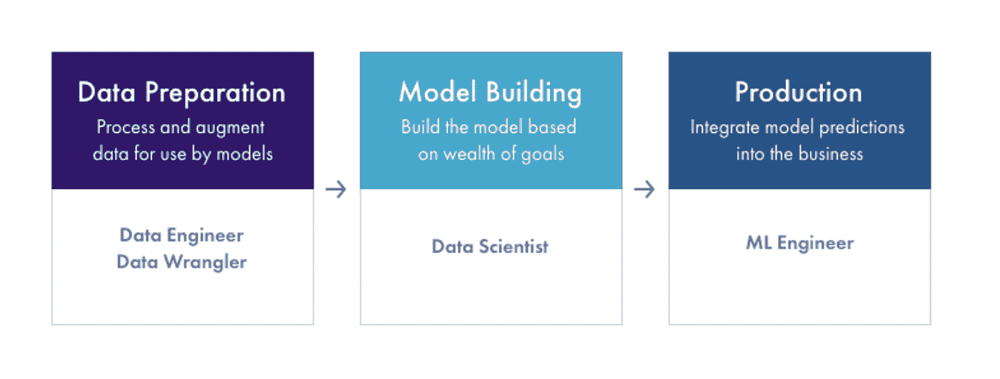

# 用于数据准备的 ML 基础设施工具

> 原文：<https://towardsdatascience.com/ml-infrastructure-tools-for-data-preparation-70d79e70f8d4?source=collection_archive---------27----------------------->

## 数据准备-机器学习工作流程的第一阶段

作者的 ML 基础设施平台图

几乎每个行业的企业都在采用人工智能(AI)和机器学习(ML)。许多企业都在期待 ML 基础设施平台，以推动他们在业务中利用人工智能的运动。了解各种平台和产品可能是一项挑战。**ML 基础设施空间拥挤、混乱且复杂**。有许多平台和工具跨越模型构建工作流程中的各种功能。

按作者列出的 ML 工作流阶段图

为了理解生态系统，我们大致将机器学习工作流分为三个阶段——数据准备、模型构建和生产。了解工作流程每个阶段的目标和挑战有助于做出明智的决策，确定哪些 ML 基础设施平台最适合您的业务需求。

机器学习工作流程的每个广泛阶段(数据准备、模型构建和生产)都有许多垂直功能。其中一些功能是更大的端到端平台的一部分，而一些功能是一些平台的主要焦点。

由于模型是从数据中构建和学习的，因此构建模型的第一步是数据准备，即从数据中提取模型输入的过程。有许多工具可以帮助数据科学家获取数据、转换数据以及向数据集添加标签。在这篇博文中，我们将深入了解数据准备的目标是什么，组织在 ML 工作流的这一阶段面临的挑战，以及数据科学家何时决定进入工作流的下一阶段。

# 什么是数据准备？

问任何一个数据科学家，他们都会告诉你他们花了很多时间在数据准备上。管道的数据准备阶段用于将原始数据转换为用于训练模型的模型输入特征。特征是对提供实际模型输入的已清理数据的变换。

在管道的早期阶段，原始数据来自组织中不同的数据存储和湖泊。下一阶段涉及数据处理，以清理、转换和提取特征，从而在特征选择阶段生成一致的输入。处于使用 ML 基础设施前沿的大型科技公司(谷歌、脸书、优步等)通常会有集中的功能存储，因此许多团队可以在没有重复工作的情况下提取价值。

数据准备阶段包括多个步骤:获取数据、确保完整性、添加标签和数据转换以生成要素。

# 采购数据

获取数据是第一步，通常也是第一个挑战。数据可以存在于不同的数据存储中，具有不同的访问权限，并且可能散布着个人身份信息(PII)。

数据准备的第一步包括从正确的地方获取数据，并整合组织内不同数据湖中的数据。如果模型的输入、预测和实际值是在不同的时间段接收的，并存储在不同的数据存储中，这可能会很困难。设置公共预测或事务 ID 有助于将预测与其实际值联系起来。

此阶段通常涉及数据管理、数据治理和法律，以确定哪些数据源可供使用。此阶段的工作角色通常包括数据工程师、数据科学家、法律人员和 IT 人员。

*数据存储领域的 ML 基础设施公司示例:Elastic Search、Hive、Qubole*

# 完全

一旦数据来源，需要对完整性进行一系列检查，以确定收集的数据是否可以转化为有意义的特征。首先，了解可供使用的历史数据的长度很重要。这有助于了解模型构建者是否有足够的数据用于训练目的(一年的数据等)。拥有具有季节性周期和已识别异常的数据可以帮助模型建立弹性。

数据完整性还可以包括检查数据是否有正确的标签。许多公司在原始数据的清洁度方面存在问题。同一件事可以有多个标签。将会有一些数据未被标记或被错误标记。许多供应商提供数据标注服务，这些服务采用技术和人员的组合来向数据添加标签并清理问题。

*数据标注中的 ML 基础设施公司示例:* Scale AI，Figure Eight，LabelBox，Amazon Sagemaker

检查所看到的数据是否是有代表性的分布也很重要。数据是在一段不寻常的时间内收集的吗？这是一个更难的问题，因为它是特定于业务的，并且数据会随着时间的推移而不断变化。

# 数据处理

一旦收集了数据，并且有足够的带有适当标签的数据，就可以进行一系列的数据转换，从原始数据转换为模型可以理解的特征。该阶段特定于企业使用的数据类型。对于分类值，通常使用一键编码。对于数值，可以有某种形式的基于数据分布的规范化。这个过程的一个关键部分是理解您的数据，包括数据分布。

数据处理还可以包括额外的数据清理和添加[数据质量检查](https://arize.com/blog/solving-data-quality-with-ml-observability-and-data-operations/)。由于模型依赖于它们所训练的数据，因此通过删除重复事件、索引问题和其他数据质量问题来确保干净的数据非常重要。

一些数据争论公司允许数据科学家、业务分析师和数据工程师定义转换规则，以清理和准备数据。这些公司从无代码、低代码到以开发者为中心的平台。

最后，对训练数据进行持续的数据质量检查，以确保今天干净的数据明天也会干净。

数据准备是模型性能的组成部分。要获得完整、干净的数据有很多挑战。从数据源到所有数据转换，构建训练数据集的所有工作都要进行，因此很难跟踪所有可能影响模型性能的版本化数据转换。随着组织的发展，具有通用数据转换的[功能库](https://arize.com/blog/feature-store/)可以减少重复工作和计算成本。

*数据角力中的 ML 基础设施公司:* Trifacta，Pixata，Alteryx

*数据处理领域的 ML 基础设施公司:* Spark、DataBricks、Qubole、Hive

*数据版本化、特征存储领域的 ML 基础设施公司&特征提取:* Stealth Startups、Pachyderm、Alteryx

# 数据准备后会发生什么

在某些情况下，一旦数据科学家准备好数据，数据准备和模型构建之间的交接就由包含已处理数据的数据文件或要素存储构成。在其他情况下，移交是不固定的。在大型组织中，数据工程团队负责将数据转换成数据科学家可以用于建模的格式。

在许多托管笔记本中，如 Databricks 托管笔记本、Cloudera 数据科学工作台、Domino 数据实验室笔记本，数据准备工作流与模型构建并不分离。特征选择依赖于数据，因此函数开始模糊数据准备和模型构建之间的界限。

*笔记本电脑管理领域的 ML 基础设施公司* : Databricks、Cloudera Workbench、Domino、Stealth Startups

# 下一个

我们将在 ML 工作流程的模型构建部分对 ML 基础设施公司进行更深入的研究。

## 联系我们

如果这个博客引起了你的注意，并且你渴望了解更多关于[机器学习可观察性](https://arize.com/platform-overview/)和[模型监控](https://arize.com/model-monitoring/)，请查看我们其他的[博客](https://arize.com/blog/)和 [ML 监控](https://arize.com/ml-monitoring/)上的资源！如果您有兴趣加入一个有趣的 rockstar 工程团队，帮助模型成功生产，请随时[联系](https://arize.com/contact/)我们，并在此处[找到我们的空缺职位](https://arize.com/careers/)！