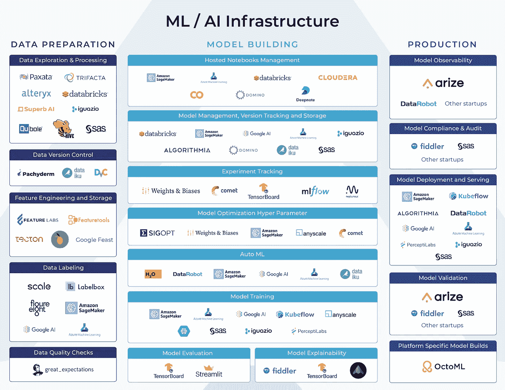

# 用于生产的 ML 基础设施工具(第 1 部分)

> 原文：<https://towardsdatascience.com/ml-infrastructure-tools-for-production-1b1871eecafb?source=collection_archive---------14----------------------->

## 生产 ML——模型工作流程的最后阶段

作者的 ML 基础设施平台图

几乎每个行业的企业都在采用机器学习(ML)。许多企业都在期待 ML 基础设施平台，以推动他们在业务中利用人工智能的运动。了解各种平台和产品可能是一项挑战。**ML 基础设施空间拥挤、混乱且复杂**。有许多平台和工具跨越模型构建工作流程中的各种功能。

为了理解生态系统，我们将机器学习工作流大致分为三个阶段——数据准备、模型构建和生产。了解工作流程每个阶段的目标和挑战有助于做出明智的决策，确定哪些 ML 基础设施平台最适合您的业务需求。

作者的 ML 基础设施平台图

机器学习工作流程的每个阶段(数据准备、模型构建和生产)都有许多垂直功能。一些平台涵盖整个 ML 工作流程的功能，而其他平台则专注于单个功能(例如:实验跟踪或超参数调整)。

在我们的上一篇文章中，我们深入探讨了 ML 工作流的数据准备和模型构建部分。在本帖中，我们将更深入地探讨生产。

# 什么是生产？

将一个模型投入生产，感觉就像跑完一场马拉松后穿过终点线。在大多数现实环境中，准备数据、模型训练以及最终完成研究过程可能需要很长时间。然后是将模型投入生产的艰难过程，这可能涉及复杂的部署管道和服务基础设施。将模型投入生产的最后阶段包括检查模型是否准备好投入生产，打包模型进行部署，将模型部署到服务环境中，以及[在生产中监控模型](https://arize.com/model-monitoring/) &数据。

到目前为止，生产环境是模型生命周期中最重要的，也是最少被讨论的部分。这是模型接触业务的地方。这是模型做出的决策实际上改善了结果或给客户带来了问题的地方。数据科学家花费大部分时间和精力的训练环境仅由模型在真实世界中看到的样本组成。

# 从研究到生产

机器学习操作化的一个独特挑战是从研究环境到真正的生产工程环境的移动。Jupyter 笔记本，最常见的模型开发之家，表面上是一个研究环境。在一个控制良好的软件开发环境中，工程师拥有版本控制、测试覆盖分析、集成测试、在代码签入时运行的测试、代码评审和可再现性。虽然有许多解决方案试图将软件工程工作流程的片段引入 Jupyter 笔记本电脑，但这些笔记本电脑首先是一个为快速灵活的实验而设计的研究环境。此外，并非所有数据科学家都是软件工程师，而是拥有跨越多个领域的背景，如化学工程、物理学家和统计学家，这是生产 ML 的核心问题之一:

生产 ML 中的核心挑战是**将一个模型从**研究环境**提升到软件工程环境**同时仍然交付研究的**结果**。****

在这篇博文中，我们将强调将研究提升到具有一致性、可再现性和可观察性的产品所需的核心领域，这是我们对软件工程的期望。

# 模型验证

注意:模型验证是**而不是**，以免与验证数据集混淆。

快速回顾数据集:模型是使用多个数据集构建和评估的。**训练数据集**用于拟合模型的参数。**验证数据集**用于在调整超参数时评估模型。**测试集**用于评估*最终*模型的无偏性能，通过提供一个未用于调整超参数或以任何方式用于训练的数据集。

# 什么是模型验证？

您是一名数据科学家，您已经在测试集上构建了一个性能良好的模型，可以满足您的业务目标。现在，*你如何验证你的模型将在生产环境中工作*？

模型验证对于交付可在生产中工作的模型至关重要。模型不是线性代码。它们基于历史训练数据构建，部署在依赖实时输入数据的复杂系统中。**模型验证的目标是测试模型假设，并展示模型在大量不同环境下的工作情况。这些模型验证结果应该被保存并引用，以便在生产环境中部署时比较模型性能。**

模型可以以各种不同的方式部署到生产环境中，从研究到生产的转换可能会在许多地方引入错误。在某些情况下，将一个模型从研究阶段迁移到生产阶段可能会涉及到将基于 Python 的 Jupyter notebook 翻译成 Java 生产代码。虽然我们将在下一节中深入讨论模型存储、部署和服务，但需要注意的是，一些操作化方法会带来额外的风险，即研究结果与生产结果不匹配。Algorithmia、SageMaker、Databricks 和 Anyscale 等平台正在构建平台，试图让研究代码直接转移到生产中，而无需重写代码。

在软件开发生命周期中，单元测试、集成测试、基准测试、构建检查等有助于确保软件在部署到生产环境中之前经过不同的输入和验证。在模型开发生命周期中，模型验证是在模型投入生产之前运行的一组通用且可重复的测试。

# 工业中模型验证的现状

如今，模型验证在行业中的机器学习团队中各不相同。在监管较少的用例/行业或不太成熟的数据科学组织中，模型验证流程只涉及构建模型的数据科学家。数据科学家可能会向更广泛的团队提交他们在 Jupyter 笔记本上构建的模型的代码评审。团队中的另一名数据科学家可能会发现任何建模问题。此外，模型测试可能由一组非常简单的保持测试组成，这些测试是模型开发过程的一部分。

更成熟的机器学习团队已经建立了大量的测试，这些测试既可以在代码签入时运行，也可以在模型部署之前运行。这些测试可能包括功能检查、数据质量检查、切片模型性能、模型压力测试和回溯测试。在回测的情况下，生产就绪模型被提供以前的历史生产数据，理想情况下在一大组看不见的数据点上测试模型。

在金融科技和银行业等受监管行业，验证过程可能非常复杂，甚至可能比实际的模型构建过程还要长*。模型风险管理有独立的团队，专注于评估模型及其输出的风险。模型验证是一个独立的团队，它的工作是打破模型。这是一个内部审计功能，旨在强调和发现模型崩溃的情况。与软件工程世界平行的是 QA 团队和代码审查过程。*

# 模型验证检查

不管是什么行业，在将模型部署到生产环境中之前，都需要做一些检查。这些检查包括(但不限于):

*   整体和部分的模型评估测试(准确性、RMSE 等)
*   预测分布检查将模型输出与以前的版本进行比较
*   特性分布检查将非常重要的特性与以前的测试进行比较
*   特征重要性分析，用于比较模型用于决策的特征变化
*   对随机和极端输入噪声的灵敏度分析
*   模型压力测试
*   偏见和歧视
*   标注错误和要素质量检查
*   数据泄漏检查(包括时间旅行)
*   过度装配和装配不足检查
*   对历史数据进行回溯测试，以比较和基准测试性能
*   特性管道测试，确保研究和生产之间没有特性中断

侧重于模型验证的 ML 基础设施工具提供了执行这些检查或分析来自检查的数据的能力——以可重复和可再现的方式。它们使组织能够减少操作模型的时间，并像交付软件一样自信地交付模型。

*支持模型验证的 ML 基础设施平台示例:Arize AI、SAS(金融)、其他创业公司*

# 模型合规性和审计

在监管最严格的行业中，可能会有一个额外的合规和审计阶段，由内部审计师甚至外部审计师对模型进行审查。ML 基础设施工具关注于法规遵循和审计团队，通常关注于维护模型清单、模型批准和围绕模型的文档。他们与模型治理一起工作，执行关于谁有权访问什么模型、模型必须通过哪一层验证以及在整个组织中调整激励的策略。

*ML 基础设施示例:SAS 模型验证解决方案*

# 连续交货

在设置为持续交付和持续集成的组织中，在以下情况下运行上述验证检查的子集:

*   代码被检入—持续集成
*   一个新的模型已经准备好生产-连续交付

持续集成测试可以在代码签入时运行，通常更像单元测试。当模型准备好投入生产时，通常会运行一组更大的验证测试，这些测试范围更广，可能包括回溯测试。随着团队试图根据[模型漂移度量](https://arize.com/model-drift/)不断地进行再培训或者自动再培训，模型的持续交付验证变得更加重要。

许多工具，比如 ML Flow，支持与 CI/CD 测试和记录工件集成的模型管理工作流。这些工具集成到 GitHub 中，以支持提取/存储正确的模型，并存储由 Github 操作启动的结果。

*支持连续交付的 ML 基础设施平台示例:数据块、ML 流、CML*

# 下一个

关于人工智能的可操作性，我们将深入探讨许多讨论不足且极其重要的话题！接下来，我们将继续深入生产 ML，并讨论模型部署、模型服务和模型可观察性。

## 联系我们

如果这个博客引起了你的注意，并且你渴望了解更多关于[机器学习可观察性](https://arize.com/platform-overview/)和[模型监控](https://arize.com/model-monitoring/)，请查看我们其他的[博客](https://arize.com/blog/)和 [ML 监控](https://arize.com/ml-monitoring/)上的资源！如果您有兴趣加入一个有趣的 rockstar 工程团队，帮助模型成功生产，请随时[联系](https://arize.com/contact/)我们，并在此处[找到我们的空缺职位](https://arize.com/careers/)！