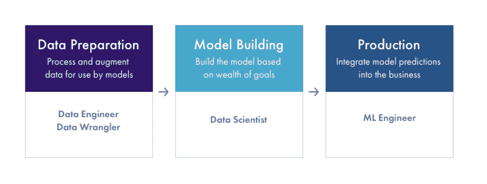

# ML 生产基础设施工具

> 原文：<https://towardsdatascience.com/ml-infrastructure-tools-for-production-part-2-model-deployment-and-serving-fcfc75c4a362?source=collection_archive---------10----------------------->

## 第 2 部分—模型部署和服务

作者图片(阿里泽·艾)

几乎每个行业的企业都在采用机器学习(ML)技术。企业期待 ML 基础设施平台帮助他们最好地利用人工智能(AI)。

了解各种平台和产品可能是一项挑战。**ML 基础设施空间拥挤、混乱且复杂**。有许多平台和工具，它们在模型构建工作流程中各有各种功能。

为了理解 ML 基础设施生态系统，我们可以将机器学习工作流大致分为三个阶段——数据准备、模型建立和生产。数据准备是指处理和扩充数据以供模型使用，而模型构建是指基于数据构建模型，生产将模型预测集成到业务中。

了解工作流程每个阶段的目标和挑战可以帮助您做出最明智的决策，确定最适合您业务需求的 ML 基础架构平台。

按作者列出的 ML 工作流阶段图

机器学习工作流程的每个阶段(数据准备、模型构建和生产)都有许多垂直功能。一些平台涵盖了 ML 工作流程中的所有三项功能，而其他平台则侧重于单一功能(例如，实验跟踪或超参数调整)。

在我们之前的文章中，我们研究了 ML 工作流的数据准备和模型构建部分。我们开始深入生产 ML，并详细讨论了模型验证。在这篇文章中，我们将更深入地研究生产，并关注模型部署和服务。

# 模型部署和服务

一旦模型被训练、构建和验证，最后就是部署和服务模型的时候了！在 ML 的最后一步中，前面步骤的所有工作最终被数据驱动的模型所使用。

团队需要做出的第一个决定是他们是否应该构建一个模型服务器。过去五年中部署的大多数模型都是自制的服务方法。然而，最近几年，使用 ML 模型的公司已经不再从零开始构建一切。事实上，考虑到上市的模型服务器的数量，我们预测从头构建一切的方法将会发生巨大的变化。

模型的模型服务选项通常分为几种不同的类型:

*   内部构建的可执行文件(PKL 文件/Java) —容器化和非容器化
*   云 ML 提供商——亚马逊 SageMaker、Azure ML、谷歌 AI
*   批处理或流:托管和本地— Algorithmia、Spark/Databricks、Paperspace
*   开源——tensor flow Serving、Kubeflow、Seldon、Anyscale 等。

对于给定的团队来说，哪一个是正确的选择？在决定模型服务选项时有许多考虑因素。以下是团队问自己的几个问题，以确定哪一个是最适合他们的 ML 选项:

# 要考虑的关键问题

1.  **组织的数据安全要求是什么？**

对数据安全性有严格要求的组织可能需要内部 ML 解决方案。一些不错的选择是 *Algorithmia、Seldon、Tensorflow、* Kubeflow、*或自制的专有解决方案*。一些提供商(如 Algorithmia)具有下文详述的安全特定功能集。对于那些不太需要安全性但需要更多远程访问/虚拟化的组织来说，云解决方案可能是更好的选择。

**2。团队需要模型服务的托管还是非托管解决方案？**

诸如 *Algorithmia、SageMaker、Google ML、Azure、*和 *Paperspace* 之类的托管解决方案对于 IT 人员较少的公司来说是个好主意。Kubeflow、 *Seldon、Tensorflow Serving、*或 *Anyscale* 等非托管解决方案可能更适合更多的技术组织。

**3。组织中的每个团队都将使用相同的部署选项吗？**

即使一个团队选择了服务选项，整个组织也很少使用相同的服务方法。拥有像 *ML-Flow* 这样的通用模型管理平台仍然有助于弥合差距。

**4。最终的模型是什么样的？是否已经建立了接口？**

如果已经部署了一个模型，那么去掉模型服务系统并用一个新的模型服务器替换它可能没有意义。替换已经部署的模型的容易程度可能取决于所选择的模型服务器及其与其他系统、API 和特性管道的集成。

**5。模型可执行文件在哪里？(例如，毫升流或 S3 桶)**

易于集成到 *ML-Flow* 或模型存储系统是一个重要的考虑因素。

6。需要 GPU 推理吗？

基于性能需求对使用 GPU 服务器的预测可能会驱使您选择云提供商或内部部署的 *Algorithmia* 。

**7。是否有单独的特征生成管道，或者它们是否集成到模型服务器中？**

取决于你的特性管道部署在哪里，比方说，亚马逊网络服务(AWS)，这可能会引导你使用 *SageMaker。*这可能是使用 *SageMaker* 的更常见原因之一，因为数据已经部署在 AWS 中。

**部署详情**

基于用于构建模型的框架，跨组织和项目的模型的格式可以不同。一些示例格式包括分类器的权重/参数的 pickle 图像、Tensorflow SavedModel 对象、Pytorch 模型、Keras 模型、XGBoost 模型、Apache TVM、MXNet、ONNX 运行时等。

**实施**

有许多方法可以实现 ML 模型。这些模型可以集成到更大系统的代码库中，作为微服务部署，甚至可以在设备上运行。如果模型是集成到一个更大的系统中的代码，那么模型的接口就是一个简单的函数调用。如果模型在它自己的服务/可执行文件或服务器中，它可以被看作是一个服务。这些服务有定义良好的 API 或接口来将输入传递给模型并获得响应。上面描述的模型服务器接受以上面的格式生成的经过训练的模型工件，并允许您将它部署到生成定义良好的 API 的容器化模型服务器。

**集装箱化**

现代的服务器方法是将模型可执行文件容器化，这样模型就有了一个通用的接口和一个通用的方法来支持它们。当部署时，模型从模型管理系统(例如 *ML-Flow* )中被提取到一个容器中。有许多方法可以实现这一点，要么为你的公司构建一个定制容器，使用开源解决方案，如 *KubeFlow 或*Seldon AI，要么使用常见的云提供商工具，如 *Algorithmia* 、 *SageMaker* 、 *Azure* 或 *Google AI* 。

**实时或批量模式**

另一个需要考虑的重要部署问题是，是使用实时/在线模型还是批处理模型。在线模型用于需要即时预测并接受实时应用输入的情况。如果这不是一个要求，批量推断可能是合适的。

许多服务平台允许您构建单个模型，并具有不同的部署选项(批处理或实时)来支持两种类型的服务机制。

# **在模型服务器中需要寻找的东西**

*轻松扩展* **:**

随着应用程序预测量的增长，最初的单一服务器支持预测的方法很容易被淹没。模型服务器更有用的功能之一是能够简单地将服务器添加到预测服务中，而无需重新构建或生成大量额外的模型操作工作。

*金丝雀 A/B 框架* **:**

canary A/B 框架允许开发人员向一小部分用户推出软件，以执行 A/B 测试，从而找出软件的哪些方面最有用，并为用户提供最佳功能。部署后，一些团队将 A/B(金丝雀)模型与生产模型并行运行，最初只预测新模型的一小部分流量。这是在将新模型部署到整个预测卷之前的一个简单测试。我们交谈过的许多团队都自行构建了他们自己的 A/B 测试框架。也就是说，一些模型服务器解决方案也支持开箱即用的简单 A/B 部署，例如，通过点击一个按钮来选择 B 模型的流量百分比。

*合奏支持*:

将多个模型放在同一个服务器上或者轻松连接模型之间的预测(推理)流的能力可能是一个重要的考虑因素。大多数情况下，模型响应会被最终应用程序所消耗，但是随着系统变得越来越复杂，一些模型的输出会成为另一个模型的输入。在快速预测响应的情况下，可能需要协同定位模型。

*回落支持* **:**

当您将新模型部署到生产中时，您可能会发现性能急剧下降。在性能下降期间，拥有不同的模型(可能是以前的版本或非常简单的模型)的能力在这种情况下非常有用。

*安全*:

如果安全性对组织来说非常重要，那么一些平台已经有了非常成熟的安全特性集。这些涵盖了一系列安全需求，主要集中在:访问权限、应用程序安全、网络安全和内存安全。生产中的模型需要从系统中的某个地方获取数据/输入，并且需要生成其他系统使用的预测/输出。有权访问预测的应用程序可能无权访问输入数据。此外，如果应用程序在 Kubernetes 托管的模型中使用 Python 包，许多公司希望确保这些包不是公共包。最后，如果您在共享内存环境中运行，如 GPU，您将需要评估您在内存加密和访问方面的数据保护措施。一些平台，如 *Algorithmia、*拥有更为成熟的安全特性集，可为各种情况提供解决方案。

*特征管道支持*:

在容器化的解决方案中，输入到特征的转换可能驻留在容器本身中，或者可能有单独的特征转换管道。基础设施越大，输入到特征的转换就越有可能是一个管道或[特征存储系统](https://arize.com/blog/feature-store/)，对容器的输入进行预处理。

在服务层，也有一些新的平台，如 *Tecton AI，这些平台*专注于功能服务。全球功能库允许团队轻松地将功能管道直接部署到生产环境中——最大限度地减少功能管道错误，并允许团队利用跨公司的功能构建。

*监控*:

一些模型服务器支持基本的监控解决方案。一些服务器支持对服务基础设施、内存使用和其他操作方面的监控。我们的观点是，这种类型的原始模型操作监控和可视化对于模型横向扩展很重要，但不具有可观察性。我们显然是有偏见的，但是我们认为真正的模型可观测性实际上是一个独立的平台。

用于部署和服务的示例 ML 基础设施平台包括 *Datarobot、H2O.ai、Sagemaker、Azure、Google Kubeflow、*和 *Tecton AI。*

# 模型可观测性与模型监控

似乎任何人都可以进行监控——绿灯是好的，红灯是坏的。您可以设置警报，如果某个值低于某个水平，就会触发向员工发送电子邮件。

然而，如果是这样的话，亚马逊云手表就会杀死 Datadog。

这里的问题是——当你收到警报时，你会怎么做？

我们的观点是，监控解决方案和可观察性平台之间的区别在于无缝排除故障和找出问题的能力。在人工智能生态系统中，这些问题表现为将人工智能研究与工程联系起来的问题。该平台是自下而上地设计来解决问题的，还是在一些预先存在的图表上附加了一个警报系统？故障排除模型+现实世界中的数据是一个庞大而复杂的空间。这就是为什么可观测性平台被从头开始设计**以帮助研究和工程团队共同解决这些问题。**

## *为什么模型服务器不适合观察*:

模型服务器没有正确的数据点来链接分析模型所需的复杂层。模型服务器缺少基本数据，例如训练数据、测试运行、预编码的热特征数据、真实/标签事件等等。在特征数据的情况下，对于我们工作过的许多较大的模型，用于故障排除的数据管道的插入点是与模型服务器非常不同的技术。最后，许多组织拥有的模型服务方法与生产中的模型一样多，他们不太可能转移到一台服务器上来管理所有的方法。当您拥有相互提供数据的混合模型，但是您想要一个内聚的图片时，会发生什么呢？

软件基础设施也是如此；您的基础设施可观察性解决方案并不依赖于基础设施本身。

# 下一个

我们希望您喜欢 ML 基础设施系列！接下来，我们将深入探讨生产人工智能。关于人工智能的可操作性，我们将深入探讨许多讨论不足且极其重要的话题！

## 联系我们

如果这个博客引起了你的注意，并且你渴望了解更多关于[机器学习可观察性](https://arize.com/platform-overview/)和[模型监控](https://arize.com/model-monitoring/)，请查看我们其他的[博客](https://arize.com/blog/)和 [ML 监控](https://arize.com/ml-monitoring/)上的资源！如果您有兴趣加入一个有趣的 rockstar 工程团队，帮助模型成功生产，请随时[联系](https://arize.com/contact/)我们，并在此处[找到我们的空缺职位](https://arize.com/careers/)！