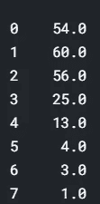

# ML，ML，谁是他们所有人的冠军？

> 原文：<https://towardsdatascience.com/ml-ml-who-is-the-champion-of-them-all-1a4d253e86ad?source=collection_archive---------37----------------------->

## 使用机器学习预测停赛后的欧洲冠军联赛 2019/20 冠军

亚历克斯·莫托克在 [Unsplash](https://unsplash.com/s/photos/champion-league?utm_source=unsplash&utm_medium=referral&utm_content=creditCopyText) 上的照片

过去的几个月对包括我在内的数百万球迷来说一定不容易。作为皇马的铁杆球迷，我已经一遍又一遍地观看了罗纳尔多、劳尔的集锦，试图实现我最喜欢的一面却被新冠肺炎带去的兴奋。不过好消息是，**足球又回来了:**三周前，欧足联宣布，从四分之一决赛开始，欧洲冠军联赛(UCL)将于八月初回归，所有赛程都是单淘汰制，[放出所有赛程抽签](https://www.uefa.com/uefachampionsleague/news/025f-0fda67108b5a-ab24bdc017b7-1000--champions-league-finals-schedule/)。这对我来说是一个好消息，因为几个月来我一直在想皇马将如何在曼彻斯特卷土重来，现在是见证的时候了。

然而，问题是，复出的可能性有多大？

所以在上周，我带着这个问题开始了一个机器学习项目，研究 UCL 比赛回来后会如何进行。在这个项目中，我研究了谁将最终成为潜在的冠军，谁可以被命名为“获胜的失败者”，最重要的是，皇家马德里可能会走多远。在文章的其余部分，我将展示我是如何独自从头到尾完成这个项目的，同时分享任何有趣的发现。

# 数据收集

我需要的数据是在长时间停赛前的比赛中产生的所有信息。因此，我在[fbref.com](https://fbref.com/en/comps/8/schedule/Champions-League-Scores-and-Fixtures)用 Scrapy 收集了 2019/2020 UCL 的所有数据。这包括资格赛，小组赛，以及在二月和三月进行的几次淘汰赛。

装置/结果的截图(来源于作者)

一般来说，数据分为两类:一类是比赛中的球队名称及其最终得分(如上面的标题所示)，另一类是关于球队的详细数据，这些数据分别来自守门员、射门、控球等几个方面。老实说，我当时不知道我收集的所有数据是否会被使用，但我只是把它们都保留下来，以避免再次上网。我将在下一节讲述我是如何决定应该使用哪些特性的。

传递数据(来源于作者)

拍摄数据(来源于作者)

# 数据清理和预处理

所以我的下一步是使用收集的数据配置熊猫数据框架。如上所述，不确定是否应该利用数据集的所有功能。它们中的一些只是一种性质，但被描述成集合形式和平均形式。例如，Gls 和 Gls/90 分别代表总目标和平均目标。因此，我只是提取了反映球队平均表现的特征，下图说明了我保留的特征:

其余专栏(来源于作者)

尽管这种特征选择不能 100%消除多重线性。也许在一些剩余的特征之间，即使它们有不同的名称，它们也是高度相互依赖的。这可以通过绘制特征之间的关联热图来揭示:

所选功能的热图(来源于作者)

显然，存在着一些很强的相关性。我的解决方案是通过先验成分分析进行降维。在执行 PCA 之前，我需要将 fixture 表与特征集合并，因为我假设匹配双方的数据是我的模型的输入。

至于先验成分的数量，我也进行了一点测试，结果是前 14 个先验成分已经能够解释 95%以上的信息。考虑到之前我们总共有超过 80 个输入变量，这是令人印象深刻的。

第一个先验成分的累积方差(来源于作者)

# 建模

我选择了四个模型进行比较:逻辑回归、XGBoosting、决策树、高斯混合模型。我使用均方根误差(RMSE)作为衡量标准，对它们进行了 5 次交叉验证，发现 XGBoosting 的表现优于任何其他同类产品。

四种模式在 RMSE 方面的比较(来源于作者)

现在我需要获得最佳的预测结果。为此，我使用贝叶斯优化调整了性能最佳的 XGBoosting 的参数。

贝叶斯优化(来源于作者)

优化把性能从 2.84 左右提升到了 2.74，现在剩下的就是预测未来游戏的结果了。

夹具支架(来源于作者)

在上图中，右半边的四支球队已经进入了四分之一决赛，而左边的球队本月还有第二回合的比赛。因此，括号中的数字表示双方在 16 强赛中的总得分，而括号外的数字表示他们在第二回合的得分。值得注意的是，非常奇怪的是，剩余比赛的所有结果都是**主场 2: 1 客场**，这在现实中几乎不会发生。这不会是一个准确的预测，一定有什么我错过了，需要修复。

# 改进

我花了一段时间重新思考整个过程，并注意到问题来自于数据的不平衡。足球是一种在一场比赛中不太可能有很多进球的运动。换句话说，一场多进球少的比赛往往会频繁发生。据我观察，不考虑主客场差异，1:1、2:1、2:0 是本赛季 UCL 迄今为止成绩表上最常见的比分。也就是说，一支球队在大多数比赛中最多只能进 2 个球。

匹配结果分布(来源于作者)

一局一方的比分分布(来源于作者)

然而，也存在一些比赛，如 4:4 和 7:2，尽管它们只发生过一次。这使得我的预测有偏差，因为模型被欺骗了，倾向于用最频繁的样本之一来标记游戏。

这个问题有两个解决方案:缩小数据集或过采样。切断数据集也会带走数据集中的部分信息，考虑到我的数据集规模很小，这绝对不是一个理想的选择。然后我只有一个选择。

我尝试了名为“ *imlearn* 的 python 包，因为 *imlearn* 没有启用多标签分类的过采样，所以我的替代方案是将 *RandomOverSampling* 应用于一场比赛的得分(一列)，而不是双方得分的多少(两列)。这样，我将每场比赛的结果视为一个标签，并均等地填充其中的每一项。

过采样后的匹配结果分布(来源于作者)

现在我需要做的就是重复下面的步骤。

现在结果看起来不错！(来源于作者)

我需要控制的最后一个因素是分类模型的参数。根据我的观察，由贝叶斯优化调整的参数是不稳定的，这意味着它们在不同的优化中可能是不同的，因此由模型生成的预测也是不同的。为了有一个相对可靠的值，我通过运行整个预测超过 300 次来模拟比赛，以计算每一方赢得奖杯的可能性有多大。

上述模拟的结果如下图所示:

基于 XGBoosting 的逐轮概率

# 结论

总而言之，现在我可以回答我在开始这个项目时就想到的问题了:

1.  曼城是最具统治力的球队，有超过 50%的机会赢得奖杯；巴黎圣日耳曼在排行榜上排名第二，这要归功于它相对容易的右半区。
2.  RB 莱比锡将是最有可能夺冠的失败者。此外，不要忘记那不勒斯:据估计，他们有 46%的机会进入四分之一决赛，22%的机会进入半决赛。所以小心了，梅西和莱万多夫斯基！
3.  虽然我不愿意接受这一点，但我应该承认，皇马在曼彻斯特的回归就像是大联盟模式的*不可能完成的任务*:我们只有 0.33%的机会活过这一轮，实际上没有机会走得更远。

# 思想

这是一个完全由我自己完成的项目，当时我没有其他事情来消磨时间，所以我想一定有什么事情我没有更好地考虑。就我而言，在这个项目中有 3 个方面我应该做得更好:

1.  **数据的时效性**。如果你足够仔细地阅读这篇文章，你一定记得我用来预测的仅仅是本赛季 UCL 的数据。然而，事情是这样的，UCL 的最后一场比赛已经是大约 5 个月前了，事情会在这 5 个月里发生变化。换句话说，我没有考虑最近的表现。仅以 Real 为例。众所周知，他们在小组赛和第一回合的比赛中表现不佳。城市。但自西甲重启以来，他们没有输过一场比赛(10 胜 1 平)，[获得国内冠军](https://en.as.com/en/2020/07/16/football/1594921115_294909.html#:~:text=Real%20Madrid%20sealed%20their%2034th,in%20the%20suburbs%20of%20Madrid.)。鉴于如此激烈的表现，你仍然有信心瓜迪奥拉的球队会毫不留情地淘汰齐祖的球队吗？
2.  **拉断路器**。当出现“平局”时，比如说，双方在单淘汰赛中得分相同，或者，他们在双淘汰赛中得分相同，客场进球相同，我不知道如何判断哪一方应该晋级。我所做的只是在它们之间随机选择一个。从我的立场来看，收集那些在以前的原因中延伸到加时赛甚至点球大战的比赛数据是解决这个问题的关键。
3.  **单个球员对比赛的影响**。在整个项目中，我只考虑了团队的宏观表现，但从未考虑过他们的球员。忽视他们可能会怀疑预测模型的准确性:一些球员已经被转移，不再能够为他们以前的球队效力。例如，蒂莫·韦尔纳，这样一个危险的前锋为德国队 RB Leipzig 贡献了 6 个进球(包括助攻)，而整个球队迄今为止总共只有 14 个进球。所以可以肯定地说，他转会切尔西肯定会带来奢华的数据，可能还有莱比锡的火力。

这就是我第一个关于 UCL 冠军预测的数据科学项目。多么奇妙的经历啊！如果你喜欢读故事，请给我一个掌声，点击关注按钮，这是你对我最大的鼓励。如果你对我的实现感兴趣，可以访问我的 Kaggle 内核，网址是[https://www . ka ggle . com/anzhe Meng/19-20-UCL-champion-prediction](https://www.kaggle.com/anzhemeng/19-20-ucl-champion-prediction)。

最后，哈拉马德里和纳达马斯！

由[曼努埃尔·诺鲍尔](https://unsplash.com/@mmanusoo?utm_source=unsplash&utm_medium=referral&utm_content=creditCopyText)在 [Unsplash](https://unsplash.com/s/photos/real-madrid?utm_source=unsplash&utm_medium=referral&utm_content=creditCopyText) 上拍摄的照片