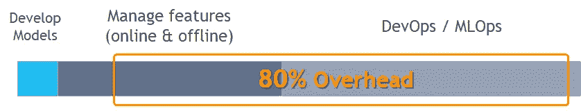
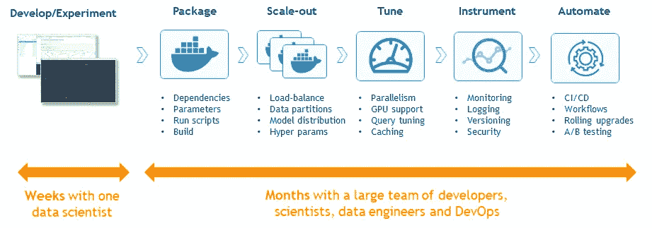
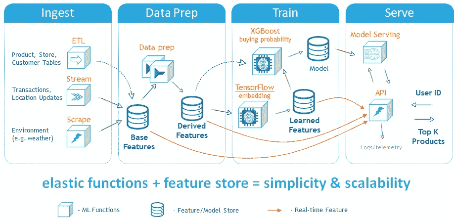
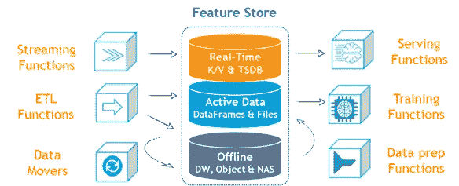

# ML Ops 挑战、解决方案和未来趋势

> 原文：<https://towardsdatascience.com/ml-ops-challenges-solutions-and-future-trends-d2e59b74dc6b?source=collection_archive---------15----------------------->

## 我的 MLOps NYC 演讲摘要，主要的 AI/ML &数据挑战以及如何用新兴的开源技术解决它们

AI 和 ML 实践不再是研究机构或技术巨头的奢侈品，它们正在成为任何现代商业应用程序不可或缺的一部分。据分析师称，大多数组织未能成功交付基于人工智能的应用程序，并陷入了将数据科学模型(在样本或历史数据上进行测试)转化为处理现实世界和大规模数据的交互式应用程序的过程中。

一种称为 MLOps 的新工程实践应运而生，以应对这些挑战。顾名思义，它结合了 AI/ML 实践和 DevOps 实践，其目标是创建数据和 ML 密集型应用程序的持续开发和交付(CI/CD)。

最近[端到端数据科学平台提供商和开源 MLOps 技术开发商 Iguazio](https://www.iguazio.com/) 与主要云提供商、领先企业和技术巨头一起举办了 [MLOps NYC](https://www.mlopsnyc.com/) 活动。议程是讨论不同的方法、最佳实践，并开始为 MLOps 创建协作和标准化。

我的会议总结了 MLOps 当前面临的挑战以及我们将在不久的将来看到的趋势(参见 12 分钟的[视频](https://www.youtube.com/watch?v=kQto7JYq0qg))。

# 挑战

根据不同的调查，数据科学团队不做数据科学，他们将大部分时间花在数据争论、数据准备、管理软件包和框架、配置基础设施以及集成各种组件上。这些任务可以概括为功能管理任务和 MLOps 任务(即 ML 的 DevOps)。

# MLOps 挑战

数据科学起源于研究机构，后来被用于生成报告和检测堆积如山的数据中的异常。为了在事件和数据发生时智能地做出反应，将数据科学融入每个商业应用的新兴趋势正在机器学习实践中产生根本性的变化。

与研究或事后数据分析不同，业务应用程序需要能够处理实时和不断变化的数据，它们必须全天候运行，必须满足适当的响应时间，支持大量用户，等等。曾经的目标——生产一个 ML 模型——今天只是将数据科学引入生产的漫长过程中的第一步(如下图所示)。许多组织低估了将机器学习整合到生产应用程序中所需的工作量。这导致整个项目半途而废(75%的数据科学项目从未投入生产)或消耗比最初预期多得多的资源和时间。

# 数据挑战

数据科学家从样本数据开始，他们在 Jupyter 笔记本上工作或使用 AutoML 工具来识别模式和训练模型。在某一点上，他们需要在更大的数据集上训练模型。这是事情开始变得困难的时候。他们可能会发现，大多数处理 CSV 文件并将数据加载到内存中的工具都无法大规模工作，他们需要重新设计一切以适应分布式平台和结构化数据库。

许多时间花费在从原始数据创建特征上，并且在许多情况下，相同的特征提取工作为多个项目或者由不同的团队重复进行。每当数据集发生变化、导出的数据和模型发生变化，或者需要重复实验以获得所需的精度时，开销就会进一步放大。

当数据科学团队尝试将模型部署到生产中时，他们发现真实世界的数据是不同的，并且他们不能对总是在变化的数据使用相同的数据准备方法。延迟或计算能力限制需要一个完全不同的数据管道，它依赖于流处理、快速键/值和时间序列数据库来提供实时特征向量。

在纽约 MLOps 大会上，优步、推特和网飞讨论并分享了他们构建在线和离线特征库的经验，这是他们数据科学平台的基本组成部分。

# 解决方案和未来趋势

在我的会议中，我概述了行业的愿景，以克服上述挑战。解决这些挑战的方法是:

1.  从第一天起就使用可扩展和生产就绪的数据科学平台和实践。
2.  尽可能采用自动化和更高层次的抽象。
3.  为协作和重用而设计。

# 无服务器 ML 函数

我们消除 ML 管道复杂性的方法是采用无服务器“ML 函数”的概念。无服务器技术允许您编写代码和规范，这些代码和规范会自动转换为自动扩展的生产工作负载。直到最近，这些还仅限于无状态和事件驱动程序工作负载，但现在有了我们展示的新的[开源技术(MLRun+Nuclio+KubeFlow)](https://github.com/mlrun/mlrun) ，无服务器功能可以应对实时、超大规模数据分析和机器学习的更大挑战。

打包、扩展、调整、检测和连续交付的步骤是完全自动化的，解决了每个组织的两个主要挑战:

1.  显著缩短上市时间
2.  尽可能减少完成项目所需的资源和技能水平

ML 函数可以很容易地链接起来产生 ML 管道(使用 [KubeFlow](https://www.kubeflow.org/) )。它们可以生成后续阶段将使用的数据和特征。下图演示了用于创建实时推荐引擎应用程序的管道:

过渡到微服务和函数式编程模型支持协作和代码重用。用户可以在不中断管道的情况下逐步扩展和调整功能，同时只消耗适量的 CPU、GPU 和内存资源。 [Kubernetes](https://kubernetes.io/) 和 [KubeFlow](https://www.kubeflow.org/) 在这个架构中扮演着核心角色，调度合适的资源，扩展工作负载，管理管道。

Iguazio 的[首席架构师&联合创始人 Orit Nissan-Messing 在圣地亚哥举行的 KubeCon + CloudNativeCon 2019 上通过现场演示介绍了 Nuclio ML 功能和 MLRun 架构(观看她的](https://www.iguazio.com/)[视频](https://www.youtube.com/watch?v=GmCpdRRFmxw)以了解有关这一挑战和克服挑战的方法的更多信息)。

# 内置功能存储

第二个挑战是构建、管理和使用离线和在线功能的复杂性。优步、网飞等数字巨头都在内部建立了“特色商店”来克服这一问题。大多数组织负担不起或者不具备从零开始构建功能存储的技能，并且需要它成为他们使用的数据平台的一个组成部分。

我们可以使用连接到共享在线+离线数据存储库的 ML 函数构建特征库，并使用元数据管理和自动化对其进行包装，如下图所示。

摘要

计划将 ML 和 AI 纳入其应用程序的组织必须以最终目标为出发点，并通过采用 MLOps(即持续集成和部署(CI/CD)和 DevOps 实践)为其数据科学活动构建生产，这样他们可以获得敏捷性，并可以服务于现实世界的在线应用程序。

如果没有适当的抽象和自动化，MLOps 和 data op 可能会消耗资源并导致重大延迟，这些挑战将导致数据科学优化的“无服务器”、SaaS 产品、ML 功能市场和托管功能商店的兴起。

押注正确的技术非常重要，这种技术是开放的，使用 Kubernetes 及其庞大的生态系统，而不是特定于点或云的解决方案。

对于我的 12 分钟视频: