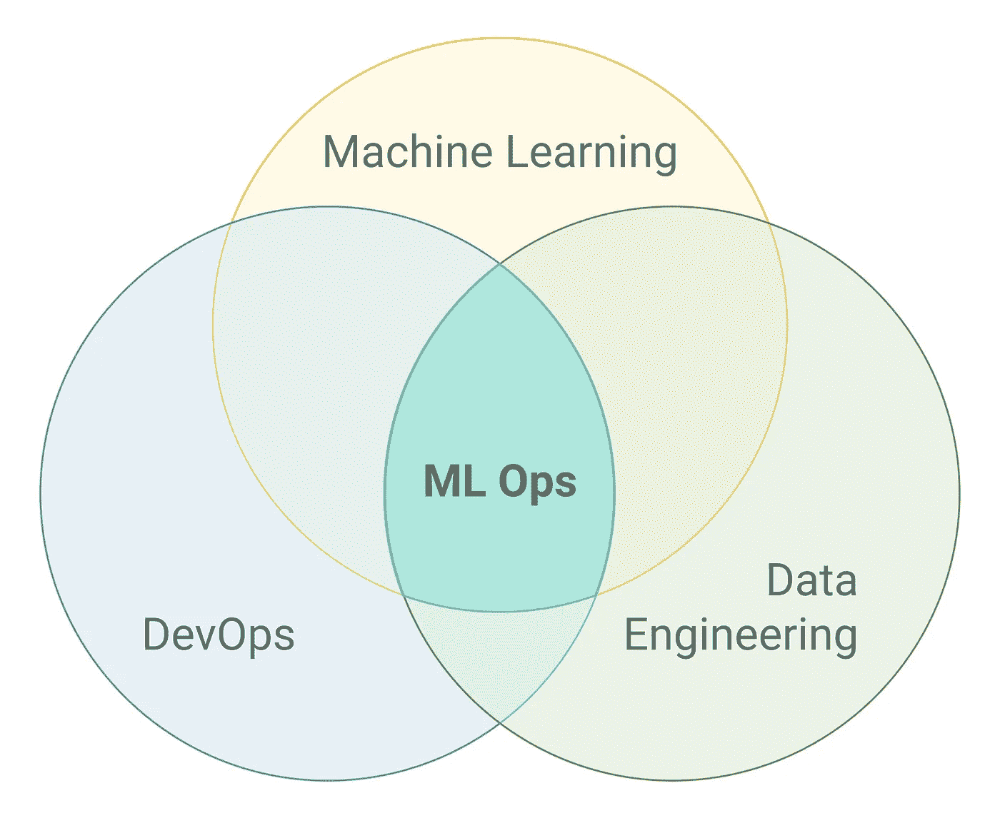
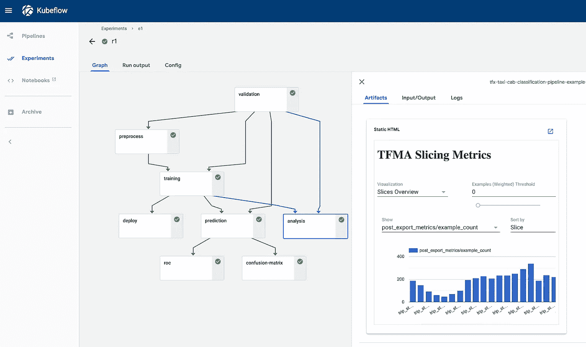
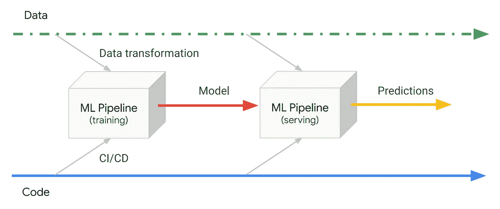
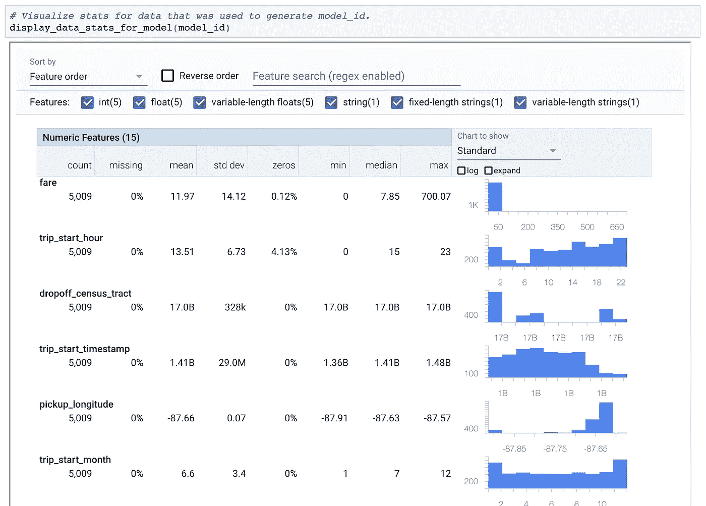
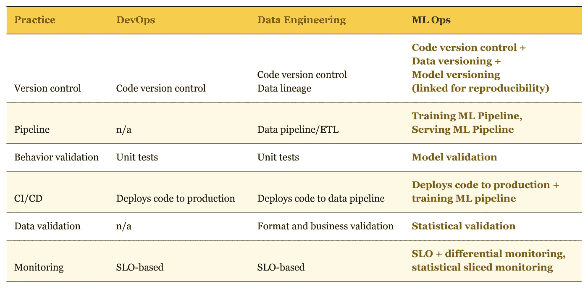

# ML Ops:作为工程学科的机器学习

> 原文：<https://towardsdatascience.com/ml-ops-machine-learning-as-an-engineering-discipline-b86ca4874a3f?source=collection_archive---------1----------------------->

## 随着 ML 从研究到应用商业解决方案的成熟，我们是否需要提高其运作过程的成熟度

所以，你的公司决定投资机器学习。你有一个才华横溢的数据科学家团队，他们制作模型来解决几年前还无法解决的重要问题。所有的性能指标看起来都很棒，演示让人们惊讶不已，高管们问你多久能有一个模型投入生产。

你认为应该很快。毕竟，你已经解决了所有的高级科学、数学问题，所以剩下的就是例行的 IT 工作了。能有多难？

很难，事实证明。Deeplearning.ai 报告称“只有 22%使用机器学习的公司成功部署了一个模型”。是什么让它如此艰难？我们需要做些什么来改善这种情况？

我们先来看一下根本原因。

# 挑战

在传统软件开发的世界中，一套被称为 [**DevOps**](https://en.wikipedia.org/wiki/DevOps) 的实践已经使得在几分钟内将软件交付生产并保持其可靠运行成为可能。DevOps 依靠工具、自动化和工作流来抽象掉意外的复杂性，让开发人员专注于需要解决的实际问题。这种方法如此成功，以至于许多公司已经驾轻就熟，那么我们为什么不能简单地继续为 ML 做同样的事情呢？

根本原因是 ML 和传统软件有一个根本的区别: **ML 不仅仅是代码，它是代码加数据**。ML 模型，即您最终投入生产的工件，是通过将算法应用于大量训练数据而创建的，这将影响模型在生产中的行为。至关重要的是，模型的行为还取决于它将在预测时接收的输入数据，而这是您无法提前知道的。

ML =代码+数据

虽然代码是在受控的开发环境中精心制作的，但是数据来自于那个被称为“真实世界”的无穷无尽的熵源。它永远不会停止变化，你无法控制它将如何变化。思考它们之间关系的一个有用的方法是，将代码和数据视为生活在不同的平面上，它们共享时间维度，但在所有其他维度上是独立的。ML 过程的挑战是以可控的方式在这两个平面之间建立一座桥梁。

代码和数据独立发展。我们可以认为它们是具有共同时间维度的独立平面。

这种基本的脱节导致了几个重要的挑战，任何试图将 ML 模型成功投入生产的人都需要解决这些挑战，例如:

*   缓慢、脆弱且不一致的部署
*   缺乏再现性
*   性能下降(培训服务偏差)

由于“数据”这个词在本文中已经使用了几次，您可能会想到另一个可以拯救我们的学科:**数据工程**。你可能是对的:数据工程确实提供了重要的工具和概念，对于解决生产中的 ML 难题是不可或缺的。为了破解它，我们需要结合来自 DevOps 和数据工程的实践，添加一些 ML 特有的实践。

因此，ML Ops 可以由这个交集来定义:

ML Ops 是机器学习、DevOps 和数据工程的交集

因此，我们可以将 ML Ops 定义如下:

> **ML Ops 是一套结合了机器学习、DevOps 和数据工程的实践，旨在可靠高效地在生产中部署和维护 ML 系统。**

现在让我们更详细地看看这实际上意味着什么，通过检查可用于实现 ML Ops 目标的个体实践。

# 练习

## 混合团队

因为我们已经确定生产一个 ML 模型需要一系列的技能，这些技能目前被认为是独立的，为了成功，我们需要一个混合的团队，这些团队一起涵盖了所有的技能。当然，一个人可能在所有这些方面都足够优秀，在这种情况下，我们可以称那个人为全面的 **ML 操作工程师**。但现在最有可能的情况是，一个成功的团队应该包括一名数据科学家或 ML 工程师、一名 DevOps 工程师和一名数据工程师。

该团队的确切组成、组织和头衔可能会有所不同，但最重要的是要认识到，单靠一名数据科学家无法实现 ML Ops 的目标。即使一个组织包括所有必要的技能，如果他们不密切合作，它也不会成功。

另一个重要的变化是，数据科学家必须精通基本的软件工程技能，如代码模块化、重用、测试和版本控制；让一个模型在凌乱的笔记本上工作是不够的。这就是为什么许多公司都采用 ML 工程师的头衔，强调这些技能。在许多情况下，ML 工程师实际上正在执行 ML Ops 所需的许多活动。

## ML 管道

数据工程的核心概念之一是**数据管道**。数据管道是应用于源和目标之间的数据的一系列转换。它们通常被定义为一个图，其中每个节点是一个转换，边代表依赖关系或执行顺序。有许多专门的工具可以帮助创建、管理和运行这些管道。数据管道也可以称为 ETL(提取、转换和加载)管道。

ML 模型总是需要某种类型的数据转换，这通常是通过脚本甚至笔记本中的单元格来实现的，这使得它们难以可靠地管理和运行。切换到适当的数据管道在代码重用、运行时可见性、管理和可伸缩性方面提供了许多优势。

由于 ML 训练也可以被认为是一种数据转换，所以很自然地将特定的 ML 步骤包含在数据管道本身中，将其变成一个 **ML 管道**。大多数模型需要两个版本的管道:一个用于培训，一个用于服务。这是因为，通常情况下，数据格式和访问它们的方式在每个时刻都有很大的不同，特别是对于实时请求的模型(与批量预测运行相反)。

[Kubeflow 管道](https://www.kubeflow.org/docs/pipelines/overview/pipelines-overview/)中 ML 管道的可视化表示

ML 管道是一个纯代码工件，独立于特定的数据实例。这意味着可以在源代码控制中跟踪它的版本，并通过常规的 **CI/CD 管道**自动化它的部署，这是 DevOps 的核心实践。这使我们能够以结构化和自动化的方式连接代码层和数据层:

ML 管道连接数据和代码以产生模型和预测

注意，有两个不同的 ML 管道:训练管道和服务管道。它们的共同点是，它们执行的数据转换需要产生相同格式的数据，但是它们的实现可能有很大的不同。例如，训练管道通常在包含所有特征的批处理文件上运行，而服务管道通常在线运行，并且仅接收请求中的部分特征，从数据库中检索其余部分。

然而，确保这两个管道的一致性是很重要的，因此应该尽可能地重用代码和数据。一些工具可以帮助实现这一目标，例如:

*   像 [TensorFlow Transform](https://www.tensorflow.org/tfx/transform/get_started) 这样的转换框架可以确保基于训练集统计数据的计算(如归一化的平均值和标准差)是一致的。
*   要素存储是存储不属于预测请求的值的数据库，例如根据用户历史计算的要素。

## 模型和数据版本控制

为了具有再现性，一致的版本跟踪是必不可少的。在传统的软件世界中，版本控制代码就足够了，因为所有的行为都是由它定义的。在 ML 中，我们还需要跟踪模型版本，以及用于训练它的数据和一些元信息，如训练超参数。

模型和元数据可以在像 Git 这样的标准版本控制系统中进行跟踪，但是数据通常太大且易变，因此效率不高且不实用。避免将模型生命周期与代码生命周期捆绑在一起也很重要，因为模型训练经常在不同的时间表上进行。还需要对数据进行版本化，并将每个训练好的模型与所使用的代码、数据和超参数的确切版本联系起来。理想的解决方案是专门构建的工具，但是到目前为止，市场上还没有明确的共识，并且使用了许多方案，大多数基于文件/对象存储约定和元数据数据库。

## 模型验证

另一个标准的 DevOps 实践是测试自动化，通常以单元测试和集成测试的形式出现。通过这些测试是部署新版本的先决条件。拥有全面的自动化测试可以给团队很大的信心，大大加快生产部署的步伐。

ML 模型更难测试，因为没有模型给出 100%正确的结果。这意味着模型验证测试本质上必须是统计的，而不是二元的通过/失败状态。为了决定一个模型对于部署来说是否足够好，我们需要决定要跟踪的正确的度量以及它们的可接受值的阈值，通常是凭经验，并且经常通过与以前的模型或基准进行比较。

跟踪整个验证集的单一指标也是不够的。正如好的单元测试必须测试几个案例一样，模型验证需要针对数据的相关部分(称为切片)单独进行。例如，如果性别可以直接或间接地成为模型的相关特征，则跟踪男性、女性和其他性别的单独指标。否则，模型可能存在公平性问题，或者在重要部分表现不佳。

如果您设法以自动化和可靠的方式验证模型，以及 ML 管道的其余部分，如果对用例有意义，您甚至可以关闭循环并实现在线模型训练。

## 数据有效性

一个好的数据管道通常从验证输入数据开始。常见的验证包括文件格式和大小、列类型、空值和无效值。这些对于 ML 训练和预测都是必要的，否则你可能会以一个行为不端的模型结束，并挠头寻找原因。数据验证类似于代码域中的单元测试。

除了任何数据管道执行的基本验证之外，ML 管道还应该验证输入的高级统计属性。例如，如果某个要素的平均值或标准偏差在不同的训练数据集之间发生了很大的变化，则可能会影响训练模型及其预测。这可能是数据实际变化的反映，也可能是数据处理方式导致的异常，因此检查并排除可能污染模型的系统错误非常重要，必要时可以修复它们

[TensorFlow 数据验证](https://www.tensorflow.org/tfx/data_validation/get_started)中的统计数据剖析示例

## 监视

监控生产系统对于保持其良好运行至关重要。对于 ML 系统，监控变得更加重要，因为它们的性能不仅取决于我们可以控制的因素，如基础设施和我们自己的软件，还取决于我们无法控制的数据。因此，除了监控[标准指标，如延迟、流量、错误和饱和度](https://landing.google.com/sre/sre-book/chapters/monitoring-distributed-systems/)，我们还需要监控模型预测性能。

监控模型性能的一个明显挑战是，我们通常没有经过验证的标签来比较我们的模型预测，因为模型是在新数据上工作的。在某些情况下，我们可能有一些间接的方法来评估模型的有效性，例如通过测量推荐模型的点击率。在其他情况下，我们可能不得不依赖于时间段之间的比较，例如，通过每小时计算正面分类的百分比，如果它偏离该时间的平均值超过百分之几，则发出警报。

就像在验证模型时一样，为了能够检测出影响特定部分的问题，跨部分(而不仅仅是全局)监控指标也很重要。

# 摘要

随着 ML 从研究走向应用商业解决方案的成熟，我们也需要提高其运作流程的成熟度。幸运的是，我们可以从 ML 之前的学科中扩展许多实践。

下表总结了 ML Ops 的主要实践，以及它们与 DevOps 和数据工程实践的关系:

这是一个全新的令人兴奋的学科，其工具和实践可能会快速发展。在 ML 中开发和应用生产技术肯定有很多机会。

## 参考

*   [Kaz Sato——谷歌云上的 ML 运营最佳实践(Cloud Next’19)](https://www.youtube.com/watch?v=20h_RTHEtZI)
*   [Kaz Sato——什么是 ML Ops？面向 ML 的开发运维最佳实践(云计算下一个 2018 年)](https://www.youtube.com/watch?v=_jnhXzY1HCw)
*   [kube flow——Kubernetes 的机器学习工具包](https://www.kubeflow.org/)
*   [tensor flow Extended(TFX)——用于部署生产 ML 管道的端到端平台](https://www.tensorflow.org/tfx/)
*   [机器学习的规则:ML 工程的最佳实践](https://developers.google.com/machine-learning/guides/rules-of-ml)