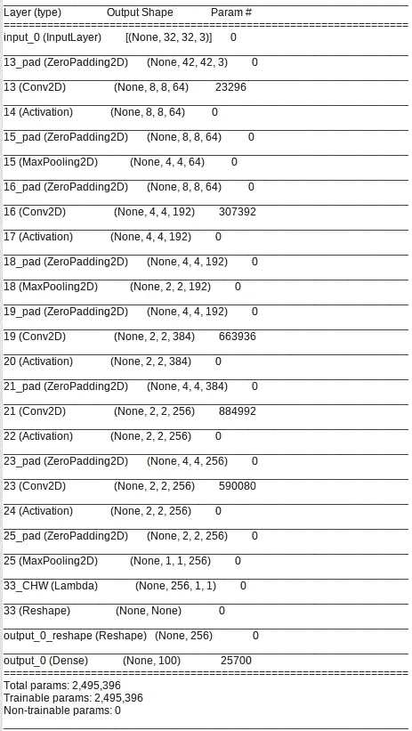

# ML Privacy Meter——量化机器学习模型隐私风险的综合工具

> 原文：<https://towardsdatascience.com/ml-privacy-meter-a-comprehensive-tool-for-privacy-attacks-on-your-ml-model-b4d3f2e05cb4?source=collection_archive---------52----------------------->

马库斯·斯皮斯克在 [Unsplash](https://unsplash.com?utm_source=medium&utm_medium=referral) 上的照片

由于计算能力的提高，以及训练模型的大量数据的可用性，深度学习越来越多地用于解决跨领域的问题。随着深度学习的日益普及，这些模型变得更加健壮、安全和隐私变得至关重要。

然而，研究表明，深度学习和机器学习模型在训练不当时，往往容易出现各种类型的隐私漏洞。其中一种攻击是成员推断攻击[1]，攻击者试图推断某些数据是否是训练集的一部分。用于训练模型的数据通常取自真实世界的数据，例如用于图像分类问题的真实图像，或者用于医疗诊断应用的实际用户的病历。因此，泄漏此类数据的模型可能会威胁到数据集个体成员的隐私。

[ML 隐私测量仪](https://github.com/privacytrustlab/ml_privacy_meter) [2]是一种分析机器学习模型如何容易受到成员推理攻击的工具。该工具在经过训练的目标模型上生成攻击，假设对模型进行黑盒或白盒访问，以获得攻击的推理准确性。白盒攻击可以利用目标模型参数的梯度、中间层输出或模型预测来推断输入的训练集成员资格，而黑盒攻击仅使用目标模型预测来识别成员资格[3]。通过生成推理模型来执行攻击，该推理模型使用可用于某些数据的目标模型组件，并返回该数据的训练集成员的概率。

**安装工具**

安装 ML Privacy Meter 的先决条件是 Python 3.6。和 TensorFlow 2.1。首先安装工具的依赖项，然后安装工具。

*pip 安装-r 要求. txt
pip 安装-e .*

**攻击模型** 该工具提供了攻击给定训练模型的方法。用户需要提供模型权重文件、用于训练模型的数据以及完整的数据集。

该工具假设用户有一个已经训练好的 Keras 模型，以及它的数据集和用于训练的数据集子集。数据文件的格式可以在“数据集/自述”文件中找到。keras 模型可以使用 Keras 的 keras.load_model()函数通过传递模型文件直接加载，也可以按照下面代码片段中给出的方式进行初始化，使用 Keras 的 load_weights()函数加载训练好的权重文件。

我们加载要分析的完整目标 Keras 模型及其参数和权重。

然后，我们通过提供完整的数据集和用于训练的数据集来创建攻击处理程序。攻击处理程序提取数据，并为攻击模型的训练集和测试集创建批次。

attack_data()函数中使用的参数是:

*   dataset_path:指向。txt 数据集文件。(项目的“数据集”目录中提供了下载和创建示例)
*   member_dataset_path:用于创建目标模型的 numpy 数据文件的路径。(项目的“数据集”目录中提供了下载和创建示例)
*   batch_size:训练推理模型时使用的批量大小
*   attack_percentage:用于训练推理模型的训练数据的百分比。
*   normalization : Boolean，如果数据需要规范化，则设置为 true。这将计算中值和标准偏差以标准化数据。这些值可能会被“tutorials/attack_alex.py”示例中给出的值覆盖。
*   input_shape:模型输入数据的形状

接下来，初始化 whitebox 类以生成推理模型组件。对于白盒攻击，用户可以提供他们想要利用的层的梯度，以及白盒攻击者可以访问的神经网络的其他参数。对于黑盒攻击，只有最终层的输出可用于攻击参数。
在下面的例子中，进行了白盒攻击，其利用了最后一层的梯度和模型的最后两层的输出。还使用了输出损耗值、实际标签的一键编码(参见下面的函数参数描述)。
最后，调用 train_attack()函数来执行实际的攻击，并生成结果。在此期间，根据给定的参数，要利用的模型组件用于训练攻击模型。

initialize()函数中使用的参数有:

*   target_train_model:用于训练攻击模型的目标分类模型
*   target_attack_model:用于评估攻击模型的目标分类模型
*   train _ datahandler:`target_train_model`的 data handler
*   优化器:用于训练攻击模型的优化器操作。支持“sgd”、“adam”、“adadelta”、“adagrad”、“momentum”和“rmsprop”。
*   layers_to_exploit:中间输出将被利用的层索引的列表。对于黑盒攻击，这个值应该包含最后一层的索引。
*   gradients_to_exploit:将利用其梯度的层索引的列表。层索引取自模型中具有可训练参数的层。
*   exploit_loss:用于指定是否将利用目标模型的损失值的布尔值。
*   exploit_label:用于指定是否将利用独热编码标签的布尔值。
*   learning_rate:优化器的学习速率
*   时期:训练攻击模型的时期数。

攻击执行后，可以在日志文件夹和控制台中查看攻击结果。

**Alex net CIFAR-100 攻击的端到端示例**

为了像 Nasr 等人[3]中那样执行攻击，使用了在 CIFAR-100 数据集上训练的 Alexnet 模型。可以在模型上执行白盒攻击，同时利用梯度、最终层输出、损失值和标签值。
首先，从`[教程/模型](https://github.com/privacytrustlab/ml_privacy_meter/tree/master/tutorials)`目录下载预训练的模型，并放在项目的根目录下。
**解压 tutorials/models/Alex net _ pre trained . zip-d .**

预训练的 CIFAR-100 Alexnet 模型(从 Pytorch 转换为 Keras)

*注意:用户也可以训练自己的模型来攻击类似于` tutorials/alexnet.py`* 中的例子，然后执行脚本来下载所需的数据文件。这将下载数据集文件和训练集文件，并将其转换为工具所需的格式。
**cd 数据集
chmod+x download _ cifar 100 . sh
。/download _ CIFS ar 100 . sh**

然后，执行主攻击代码以获得结果。
**python 教程/attack_alexnet.py**

文件中的“attackobj”初始化 meminf 类和攻击配置。以下是可在功能中更改的一些配置示例。
注:根据 CIFAR-100 分布，代码明确设置了图像归一化的平均值和标准偏差。
1。白盒攻击-利用最终图层梯度、最终图层输出、损失值和标签值(默认)

> attack obj = ml _ privacy _ meter . attack . meminf . initialize(
> target _ train _ model = CMO dela，
> target _ attack _ model = CMO dela，
> train _ data handler = datahandlerA，
> attack _ data handler = datahandler，ew
> layers_to_exploit=[26]，
> gradients_to_exploit=[6]，
> device=None)

2.白盒攻击—利用最后两个模型层输出、损失值和标签值

> attack obj = ml _ privacy _ meter . attack . meminf . initialize(
> target _ train _ model = CMO dela，
> target_attack_model=cmodelA，
> train _ data handler = data handlera，
> attack _ data handler = data handler，
> layers_to_exploit=[22，26]，
> device=None)

2.黑盒攻击—利用最终层输出和标签值

> attack obj = ml _ privacy _ meter . attack . meminf . initialize(
> target _ train _ model = CMO dela，
> target_attack_model=cmodelA，
> train _ data handler = datahandlerA，
> attack _ data handler = datahandler，
> layers_to_exploit=[26]，
> exploit_loss=False，
> device=None)

> **ML 隐私测量仪**，可从[https://github . com/privacytrustlab/ML _ Privacy _ Meter/tree/master/tutorials](https://github.com/privacytrustlab/ml_privacy_meter/tree/master/tutorials)获得

**参考文献**

[1] Shokri，Reza 等，“针对机器学习模型的成员推理攻击” *2017 年 IEEE 安全与隐私(SP)研讨会*。IEEE，2017。

[2] ML 隐私计:通过机器学习模型量化信息泄露的工具。在 https://github.com/privacytrustlab/ml_privacy_meter[有售](https://github.com/privacytrustlab/ml_privacy_meter)

[3]纳斯尔、肖克里和胡曼萨德。深度学习的综合隐私分析:2019 年 IEEE 安全与隐私研讨会上被动和主动白盒推理攻击下的独立和联合学习。