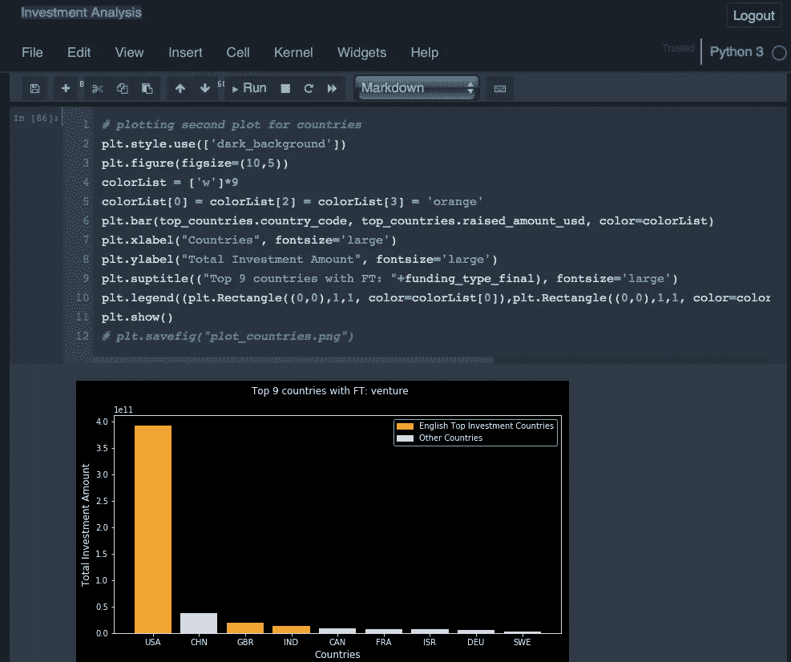

# 每个数据工程师都应该知道的 ML 编程技巧——第 2 部分

> 原文：<https://towardsdatascience.com/ml-programming-hacks-that-every-data-engineer-should-know-part-2-61c0df0f215c?source=collection_archive---------44----------------------->

## 现实世界中的 DS

## 数据科学家和机器学习从业者的更广泛的备忘单。


[Bermix 工作室](https://unsplash.com/@bermixstudio?utm_source=medium&utm_medium=referral)在 [Unsplash](https://unsplash.com?utm_source=medium&utm_medium=referral) 拍摄的照片

## 这篇文章是下述文章的续篇。

[](/programming-hacks-that-every-data-engineer-should-know-part-1-fb7cd436c40) [## 每个数据工程师都应该知道的 ML 编程技巧——第 1 部分

### 数据科学家和机器学习从业者的更广泛的备忘单。

towardsdatascience.com](/programming-hacks-that-every-data-engineer-should-know-part-1-fb7cd436c40) 

在上面的帖子中，我提出了一些重要的编程要点，在执行机器学习实践时要知道并牢记在心，以使您的实现更快更有效。接下来我们会看到更多这样的黑客。让我们开始吧。

# 11.操作宽长数据帧:

转换宽到长数据和长到宽数据最有效的方法分别是 pandas.melt()和 pandas.pivot_table()函数。除了这些函数之外，您不需要其他任何东西来将长而宽的数据相互转换。

## a.宽到长(融化)

```
>>> import pandas as pd
# create wide dataframe
>>> df_wide = pd.DataFrame(
...    {"student": ["Andy", "Bernie", "Cindy", "Deb"],
...     "school":  ["Z", "Y", "Z", "Y"],
...     "english": [66, 98, 61, 67],  # eng grades
...     "math":    [87, 48, 88, 47],  # math grades
...     "physics": [50, 30, 59, 54]   # physics grades
...    }
...  )
>>> df_wide
  student school  english  math  physics
0    Andy      Z       66    87       50
1  Bernie      Y       98    48       30
2   Cindy      Z       61    88       59
3     Deb      Y       67    47       54
**>>> df_wide.melt(id_vars=["student", "school"],
...               var_name="subject",  # rename
...               value_name="score")  # rename**
   student school  subject  score
0     Andy      Z  english     66
1   Bernie      Y  english     98
2    Cindy      Z  english     61
3      Deb      Y  english     67
4     Andy      Z     math     87
5   Bernie      Y     math     48
6    Cindy      Z     math     88
7      Deb      Y     math     47
8     Andy      Z  physics     50
9   Bernie      Y  physics     30
10   Cindy      Z  physics     59
11     Deb      Y  physics     54
```

## b.长到宽(数据透视表)

```
>>> import pandas as pd
# create long dataframe
>>> df_long = pd.DataFrame({
...         "student":
...             ["Andy", "Bernie", "Cindy", "Deb",
...              "Andy", "Bernie", "Cindy", "Deb",
...              "Andy", "Bernie", "Cindy", "Deb"],
...         "school":
...             ["Z", "Y", "Z", "Y",
...              "Z", "Y", "Z", "Y",
...              "Z", "Y", "Z", "Y"],
...         "class":
...             ["english", "english", "english", "english",
...              "math", "math", "math", "math",
...              "physics", "physics", "physics", "physics"],
...         "grade":
...             [66, 98, 61, 67,
...              87, 48, 88, 47,
...              50, 30, 59, 54]
... })
>>> df_long
   student school    class  grade
0     Andy      Z  english     66
1   Bernie      Y  english     98
2    Cindy      Z  english     61
3      Deb      Y  english     67
4     Andy      Z     math     87
5   Bernie      Y     math     48
6    Cindy      Z     math     88
7      Deb      Y     math     47
8     Andy      Z  physics     50
9   Bernie      Y  physics     30
10   Cindy      Z  physics     59
11     Deb      Y  physics     54
**>>> df_long.pivot_table(index=["student", "school"], 
...                     columns='class', 
...                     values='grade')**
class           english  math  physics
student school                        
Andy    Z            66    87       50
Bernie  Y            98    48       30
Cindy   Z            61    88       59
Deb     Y            67    47       54
```

# 12.交叉制表:

当您需要总结数据时，交叉制表在汇总两个或更多因素并计算值的频率表中起着重要作用。它可以用 pandas.crosstab()函数来实现，该函数还允许在使用“normalize”参数打印输出时找到归一化的值。

```
>>> import numpy as np
>>> import pandas as pd
>>> p = np.array(["s1", "s1", "s1", "s1", "b1", "b1",
...               "b1", "b1", "s1", "s1", "s1"], dtype=object)
>>> q = np.array(["one", "one", "one", "two", "one", "one",
...               "one", "two", "two", "two", "one"], dtype=object)
>>> r = np.array(["x", "x", "y", "x", "x", "y",
...               "y", "x", "y", "y", "y"], dtype=object)
**>>> pd.crosstab(p, [q, r], rownames=['p'], colnames=['q', 'r'])**
q  one    two   
r    x  y   x  y
p               
b1   1  2   1  0
s1   2  2   1  2# get normalized output values
**>>> pd.crosstab(p, [q, r], rownames=['p'], colnames=['q', 'r'], normalize=True)**
q        one                 two          
r          x         y         x         y
p                                         
b1  0.090909  0.181818  0.090909  0.000000
s1  0.181818  0.181818  0.090909  0.181818
```

# 13.Jupyter 主题:

Python 中最好的库之一是 jupyterthemes，它允许您更改和控制大多数 ML 从业者使用的笔记本视图的样式。不同的主题，如黑暗模式、光明模式等。或者定制样式是大多数程序员的首选，它可以在 Jupyter 笔记本中使用 jupyterthemes 库来实现。



```
# pip install
$ pip install jupyterthemes# conda install
$ conda install -c conda-forge jupyterthemes# list available themes
$ jt -l
Available Themes:
   chesterish
   grade3
   gruvboxd
   gruvboxl
   monokai
   oceans16
   onedork
   solarizedd
   solarizedl# apply the theme
jt -t chesterish# reverse the theme
!jt -r
```

你可以在 https://github.com/dunovank/jupyter-themes 的 Github [上找到更多相关信息。](https://github.com/dunovank/jupyter-themes)

# 14.将分类变量转换为虚拟变量:

使用 pandas.get_dummies()函数，您可以直接将 DataFrame 中的分类特征转换为虚拟变量，并使用 drop_first=True 删除第一个冗余列。

```
>>> import pandas as pd
>>> df = pd.DataFrame({'A': ['a', 'b', 'a'], 'B': ['b', 'a', 'c'],
...                     'C': [1, 2, 3]})>>> df
   A  B  C
0  a  b  1
1  b  a  2
2  a  c  3**>>> pd.get_dummies(df[['A','B']])**
   A_a  A_b  B_a  B_b  B_c
0    1    0    0    1    0
1    0    1    1    0    0
2    1    0    0    0    1**>>> dummy = pd.get_dummies(df[['A','B']], drop_first=True)
>>> dummy**
   A_b  B_b  B_c
0    0    1    0
1    1    0    0
2    0    0    1# concat dummy features to existing df **>>> df = pd.concat([df, dummy], axis=1)** >>> df
   A  B  C  A_b  B_b  B_c
0  a  b  1    0    1    0
1  b  a  2    1    0    0
2  a  c  3    0    0    1
```

# 15.转换成数字:

在将数据集加载到 pandas 中时，有时数值列被作为对象类型，并且不能在其上执行数值操作。为了将它们转换成数字，我们可以使用 pandas.to_numeric()函数并更新现有的系列或 DataFrame 中的列。

```
>>> import pandas as pd
>>> s = pd.Series(['1.0', '2', -3, '12', 5])
>>> s
0    1.0
1      2
2     -3
3     12
4      5
dtype: object**>>> pd.to_numeric(s)**
0     1.0
1     2.0
2    -3.0
3    12.0
4     5.0
**dtype: float64****>>> pd.to_numeric(s, downcast='signed')**
0     1
1     2
2    -3
3    12
4     5
**dtype: int8**
```

# 16.分层取样/分割:

当分割数据集时，我们有时需要在数据分割中获得样本总体。当数据集中的类不够平衡时，它会更有效。`[**sklearn.model_selection**](https://scikit-learn.org/stable/modules/classes.html#module-sklearn.model_selection)`在**。train_test_split()** 函数中，名为“分层”的参数可与目标类特征一起设置，以正确分割不同类的数据，其比率与未分割数据集中的比率相同。

```
from sklearn.model_selection import train_test_split
X_train, X_test, y_train, y_test = **train_test_split**(X, y,
                                                    **stratify=y**, 
                                                    test_size=0.25)
```

# 17.按类型选择要素:

在大多数数据集中，我们有两种类型的列，即数值型和非数值型。我们经常需要只提取数据集中的数字列或分类列，并对其执行一些可视化功能或自定义操作。在 pandas 库中，我们有**data frame . select _ dtypes()**函数，它从给定的数据集中选择与指定数据类型匹配的特定列。

```
>>> import pandas as pd
>>> df = pd.DataFrame({'a': [1, 2] * 3,
...                     'b': [True, False] * 3,
...                     'c': [1.0, 2.0] * 3})
>>> df
   a      b    c
0  1   True  1.0
1  2  False  2.0
2  1   True  1.0
3  2  False  2.0
4  1   True  1.0
5  2  False  2.0**>>> df.select_dtypes(include='bool')**
       b
0   True
1  False
2   True
3  False
4   True
5  False**>>> df.select_dtypes(include=['float64'])**
     c
0  1.0
1  2.0
2  1.0
3  2.0
4  1.0
5  2.0**>>> df.select_dtypes(exclude=['int64'])**
       b    c
0   True  1.0
1  False  2.0
2   True  1.0
3  False  2.0
4   True  1.0
5  False  2.0
```

# 18.随机搜索 CV:

RandomizedSearchCV 是来自`[sklearn.model_selection](https://scikit-learn.org/stable/modules/classes.html#module-sklearn.model_selection)`类的一个函数，用于确定上述学习算法的随机超参数集，它为每个提供的超参数随机选择不同的值，以对每个选择的值进行调整和应用交叉验证，并使用搜索时提供的不同评分机制确定其中的最佳值。

```
>>> from sklearn.datasets import load_iris
>>> from sklearn.linear_model import LogisticRegression
>>> from sklearn.model_selection import RandomizedSearchCV
>>> from scipy.stats import uniform
>>> iris = load_iris()
>>> logistic = LogisticRegression(solver='saga', tol=1e-2, 
...                               max_iter=300,random_state=12)
>>> distributions = dict(C=uniform(loc=0, scale=4),
...                      penalty=['l2', 'l1'])**>>> clf = RandomizedSearchCV(logistic, distributions, random_state=0)** >>> search = clf.fit(iris.data, iris.target)**>>> search.best_params_**
{'C': 2..., 'penalty': 'l1'}
```

# 19.神奇功能—%历史记录:

笔记本中的一批先前运行的命令可以使用“%history”神奇功能来访问。这将提供所有以前执行的命令，并且可以提供自定义选项来选择特定的历史命令，您可以使用“%history？”来检查这些命令在朱庇特笔记本里。

```
In [1]: import math

In [2]: math.sin(2)
Out[2]: 0.9092974268256817

In [3]: math.cos(2)
Out[3]: -0.4161468365471424In [16]: %**history** -n 1-3
   1: import math
   2: math.sin(2)
   3: math.cos(2)
```

# 20.下划线快捷键(_):

在 python 中，可以使用带下划线的 print(_)函数直接打印解释器最后发送的输出。这可能没什么帮助，但是在 IPython (jupyter notebook)中，这个特性已经被扩展了，您可以在 print()函数中使用 n 个下划线来打印任何 n 个最后的输出。例如，带有两个下划线的 print(__)将给出倒数第二个输出，跳过所有没有输出的命令。

另外，另一个是下划线，后跟行号，打印相关的输出。

```
In [1]: **import** **math**

In [2]: math.sin(2)
Out[2]: 0.9092974268256817

In [3]: math.cos(2)
Out[3]: -0.4161468365471424In [4]: **print**(_)
-0.4161468365471424

In [5]: **print**(__)
0.9092974268256817**In [6]: _2**
Out[13]: 0.9092974268256817
```

目前就这些。在接下来的几个部分中，我将介绍更多这些每个数据工程师都应该了解的重要技巧/功能。

敬请关注。

[](/what-makes-logistic-regression-a-classification-algorithm-35018497b63f) [## 是什么让逻辑回归成为一种分类算法？

### 对数优势，基线的逻辑回归解释。

towardsdatascience.com](/what-makes-logistic-regression-a-classification-algorithm-35018497b63f) 

豪伊·R 在 [Unsplash](https://unsplash.com?utm_source=medium&utm_medium=referral) 上拍摄的照片

感谢阅读。你可以在这里找到我的其他[机器学习相关的帖子](https://towardsdatascience.com/@imsparsh)。

希望这篇帖子有用。我感谢反馈和建设性的批评。如果你想谈论这篇文章或其他相关话题，你可以在这里或在 [LinkedIn](https://www.linkedin.com/in/imsparsh/) 给我发短信。

[](/assumptions-in-linear-regression-528bb7b0495d) [## 线性回归中的假设你可能不知道。

### 模型应该符合这些假设，以产生与数据的最佳线性回归拟合。

towardsdatascience.com](/assumptions-in-linear-regression-528bb7b0495d)