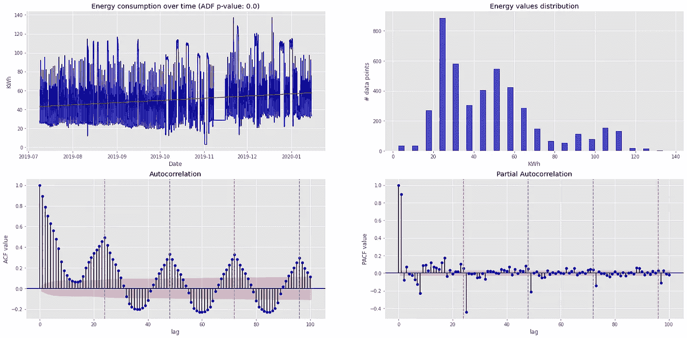
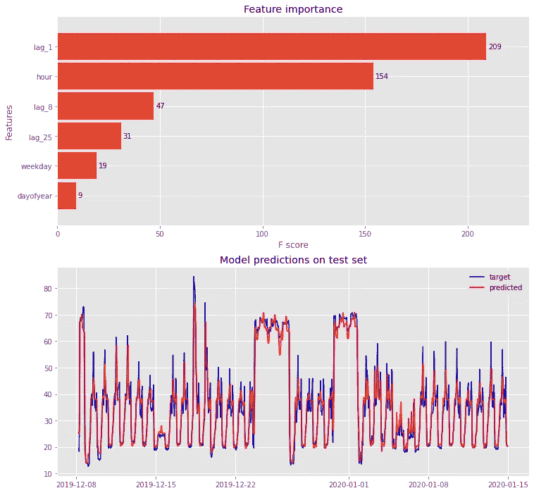
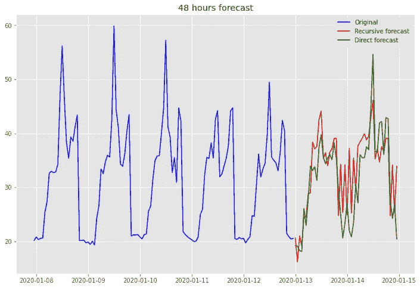

# ML 时间序列预测的正确方法

> 原文：<https://towardsdatascience.com/ml-time-series-forecasting-the-right-way-cbf3678845ff?source=collection_archive---------6----------------------->

## 用机器学习预测未来的端到端指南

*作者* [*马里奥*](https://medium.com/u/99ed96040994?source=post_page-----cbf3678845ff--------------------------------) *&* [*洛伦佐*](https://medium.com/u/f93d8afa68ed?source=post_page-----cbf3678845ff--------------------------------) *。*

照片由 [Aron 视觉效果](https://unsplash.com/@aronvisuals?utm_source=medium&utm_medium=referral)在 [Unsplash](https://unsplash.com?utm_source=medium&utm_medium=referral) 上拍摄

# 介绍

将机器学习(ML)技术应用于时间序列预测并不简单。一个主要的挑战是在通常被称为*预测*中使用 ML 模型来实际预测未来。没有预测，时间序列分析就变得无关紧要。

这个问题源于数据的时间结构，因为与标准的 ML 项目不同，在新的数据点上应用预先训练的模型来获得预测是不够的，但是，正如我们将在本文中看到的，需要额外的步骤。****很少有使用 ML 在线进行时间序列预测的例子是真正端到端的**，因为它们专注于在可用数据上测试模型，而忽略了预测部分。**

**这篇文章展示了一个完整的例子——从特征工程到使用不同策略预测未来——一个常见问题的例子，例如预测工厂内公用事业(例如变压器)的能耗。在开始之前，让我们简要地澄清一些术语。**

## **时间序列分析**

**时间序列分析是一个广泛的领域，已被应用于许多不同的问题，从计量经济学到地震和天气预测。一般来说，时间序列方法可以根据预期结果分为两类:**

*   ****时间序列预测**:预测是时间序列分析中最常见的做法。给定一个时间序列，这些技术旨在使用一个计算模型预测具有一定置信区间的未来值。**
*   ****时间序列分类**:给定一个时间序列，这些技术旨在从时间序列中提取相关的聚集特征，以确定它是否属于某一类。时间序列分类的一个例子是分析 ECG 记录，以了解它们是取自健康患者还是患病患者。这些方法更类似于标准的 ML 分类。**

**这里，我们只处理时间序列预测。我们将我们的问题限制为预测一个*单变量时间序列*在未来执行*多步预测*。**

**如果你想深入时间序列分析，以及如何针对你的具体问题选择合适的模型，可以参考[这篇](https://neptune.ai/blog/select-model-for-time-series-prediction-task)优秀的文章。**

# **数据集**

**我们考虑的数据集包括从 2019 年 7 月到 2020 年 1 月的大约 7 个月期间，某工业公用事业单位的*小时能源消耗率*千瓦时。能量测量是从安装在意大利一家真实工厂中的传感器获得的。数据通过随机常数乘法匿名化。让我们绘制数据的不同视图。**

****

**数据集的不同视图。从上到下顺时针我们有原始时间序列，其值的分布，自相关和部分自相关函数。**

**在左上图中，我们看到了能耗随时间变化的原始行为。如图标题所示，扩展的 Dick-Fuller (ADF)检验的 p 值很好地表明时间序列是平稳的。**

**右上面板显示了能耗的数值分布。数据值似乎遵循缓慢衰减的泊松分布，其中高于 50 千瓦时的高值能耗比低值(10 至 40 千瓦时)更不可能。这是预期的行为，因为连续运行的工业设施的能源消耗通常具有相当恒定的平均值，由于产量增加或维护窗口而具有零星的峰值。**

**下图显示了自相关(ACF)和部分自相关(PACF)函数。参见[此处](https://dzone.com/articles/autocorrelation-in-time-series-data)了解更多关于它们对时间序列分析重要性的细节。ACF 显示，时间序列在 24 小时(灰色水平线)具有季节性成分，自相关峰值不随时间而降低，表明该成分的强度。PACF 证实了这一点。**

# **基于 XGBoost 的机器学习预测**

**对于我们的预测问题，我们选择 XGBoost 算法，使用[这个](https://xgboost.readthedocs.io/en/latest/get_started.html)流行的 Python 实现。与其他基于树的 ML 方法相比，XGBoost 对于时间序列问题来说是快速而准确的，正如几个 Kaggle 竞赛和其他在线作品所示(例如，参见[此处](https://filip-wojcik.com/talks/xgboost_forecasting_eng.pdf)或[此处](/forecasting-stock-prices-using-xgboost-a-detailed-walk-through-7817c1ff536a))。**

**为了将时间序列预测任务转化为有监督的机器学习问题，我们需要生成特征。实际的时间序列值被用作 ML 模型的目标。我们可以将时间序列的特征类型分为 3 类:**

*   ****滞后特征**:它们利用原始时间序列本身作为具有一定偏移的特征，通常称为*滞后*。可以通过查看部分自相关函数的值来自动选择滞后。特别地，我们仅将 PACF 大于 0.2 的滞后作为特征，相当于滞后的 5%相关性。这里是创建这些功能的 Python 代码片段。**

*   ****标准时间序列特性**:标准时间序列特性，如小时、周末、季节等。使用一些关于数据的领域知识，我们还可以构建额外的时间序列特性，例如，在我们的例子中，每个时间戳的当前工人班次。**
*   ****外生特征**:外生特征本身就是时间序列，是外部的，即不依赖于要预测的时间序列。在我们的例子中，外部变量可能是外部温度。在这篇文章中，我们不考虑他们。**

**我们使用标准管道来训练和测试 XGBoost 模型，该模型具有 80/20 训练测试分割、[滚动时间窗口](https://stats.stackexchange.com/a/268847)交叉验证以及使用`[hyperopt](https://hyperopt.github.io/hyperopt/)`库的超参数优化。最佳模型在交叉验证中产生的平均百分比误差(MAPE)为 14.302，在小得多的测试集上预测时为 8.378。测试集上的预测值和主要特征的相应重要性系数如下所示。**

****

**XGBoost 模型对具有相应特征重要性直方图的测试进行预测。**

# **用 ML 模型进行多步预测**

**ML 模型结果是可接受的，我们的工作就完成了。不完全是！我们在介绍中提到，从模型中获得满意的结果并不足以获得可操作的结果。类似于标准的监督 ML 问题，我们希望对未知数据点使用模型，在我们的情况下，未知数据点是*未来时间段* : ，最终我们希望预测未来。预测未来的时间段数通常被称为*预测范围*。**

**与标准最大似然模型不同，标准最大似然模型可以直接应用于新数据，时间序列问题的时间结构使得预测更加复杂。有几种策略可以实现多步预测，在[这里](https://dzone.com/articles/lessons-learnt-while-solving-time-series-forecasti-1)可以找到对这些方法的很好的介绍。在这篇文章中，我们比较了两种最广泛使用的策略，并展示了它们在上面讨论的 ML 模型中的实现。我们选择 48 个时间段的预测范围，对应于*提前 2 天预测*。**

## **递归策略**

**递归预测策略仅使用为一步预测预训练的单个模型。*在每个预测步骤中，该模型用于预测下一步，然后将从预测中获得的值输入到同一个模型中，以预测下一步*(类似于递归函数，因此得名)等等，直到达到期望的预测范围。递归策略是最便宜的预测方法，因为它使用相同的模型。然而，从长期来看，这并不是最佳策略，因为它会在每一步累积预测误差。出现这个问题是因为先前的预测值被用于构建当前步骤的特征空间。**

**下面的代码片段实现了 ML 模型的递归策略。**

## **直接战略**

**直接预测策略对每个预测步骤使用不同的 ML 模型。更具体地说，*每个模型都是使用作为目标的时间序列来训练的，该时间序列被移动了期望数量的时间段到未来*。例如，想象一个人想要训练一个提前 4 步的模型。在这种情况下，目标时间序列中的每个时间戳相对于特征集中的相应时间戳提前 4 步选择。通过这种方式，我们创建了一个经过训练的模型，用于预测未来的 4 个步骤。对所有预测步骤重复相同的程序。对于前面要执行的每个额外步骤，训练/交叉验证集的大小会稍微减小。**

**上面概述的直接方法不会在每次预测时产生误差累积，但它的计算成本较大，因此不适合大范围的预测。此外，它不能模拟预测之间的统计关系，因为每个时间步使用的模型是独立的。顺便说一下，后一个问题可以通过使用一个神经网络来解决，该网络被训练成一次输出多个预测-每个未来时间段一个-它也学习过程中的关系。**

**这里实施一个简单的直接预测我们的 ML 模型。**

# **预测结果**

**最后，让我们来看看上述两种策略在预测未来方面的比较。我们将数据集的过去 48 小时视为未来，这样我们就有真实的数据来与预测进行比较。请注意，在现实世界的问题中，未来是无法预知的！**

**通过查看这两种方法的 MAPE 分数，直接方法比递归方法表现得更好，误差大约低 15%。**

**仅仅查看这些值不足以评估预测质量。让我们画出这两种预测。**

****

**对于这个相对较短的时间范围，两种策略在初始预测步骤中的表现相似。然而，大约 24 小时后，递归策略开始偏离直接策略。这很可能是由于误差累积开始影响递归方法的结果。误差累积也可能产生递归预报所显示的更强的波动。然而，直接策略所产生的改进并不显著，不足以证明其使用的合理性。在时间序列模型的生产部署中，通常最好使用不太精确的方法，这种方法需要更少的计算工作量，例如递归策略。**

**总之，请记住，目前的方法只是基本的预测策略。已经投入了大量的研究工作来设计更精确和可控的预测技术，其中一个例子就是这里[所描述的修正策略](https://robjhyndman.com/papers/rectify.pdf)。**

**如果你喜欢这篇文章，并且有任何意见、建议或批评，请联系我们([洛伦佐](https://www.linkedin.com/in/lorenzo-ghiringhello-a5235414b/)或[马里奥](https://www.linkedin.com/in/mariodagrada/))。这篇文章的完整代码可以在 [Github](https://github.com/madagra/energy-ts-analysis) 上找到。**