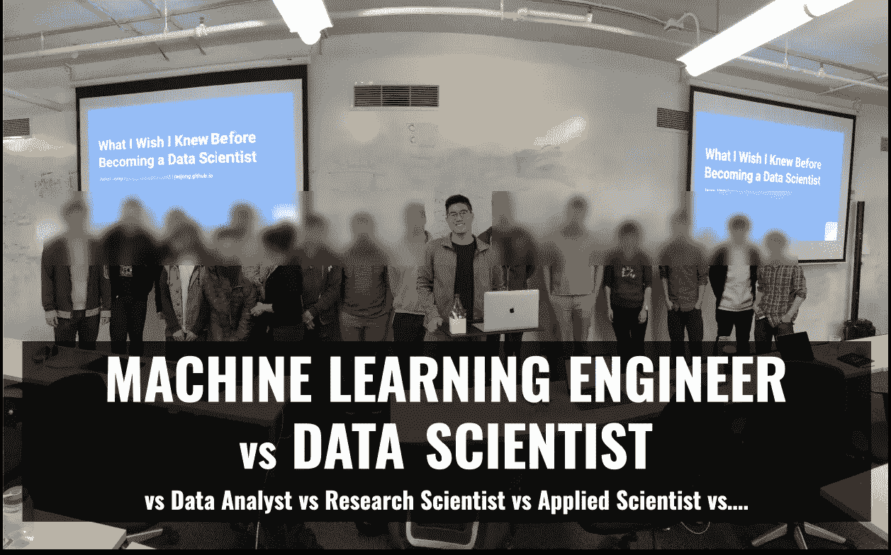
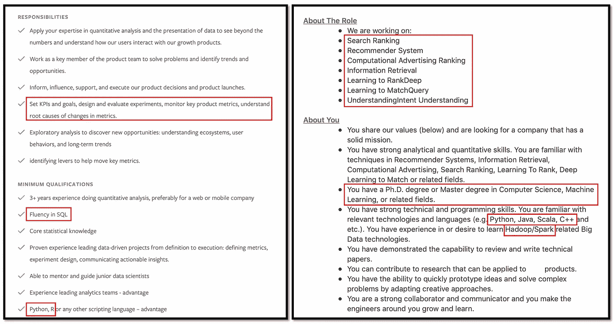
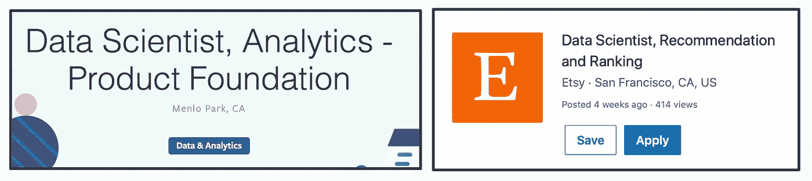
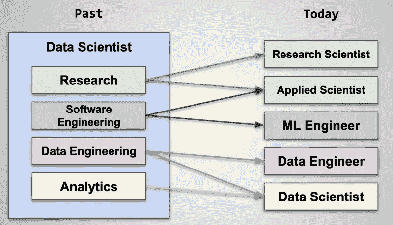
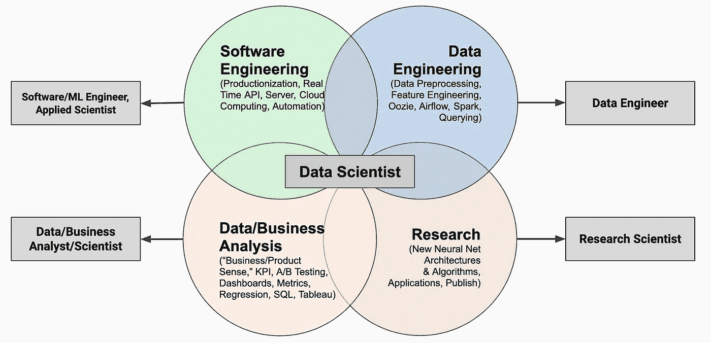
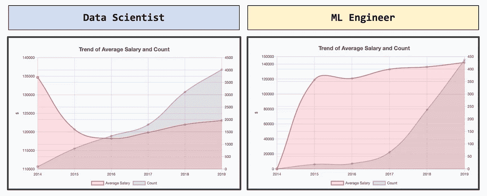
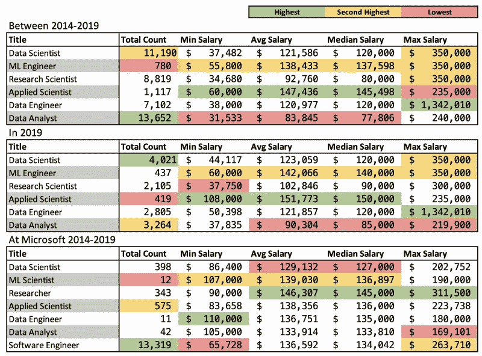

# 机器学习工程师 vs 数据科学家(数据科学结束了吗？)

> 原文：<https://towardsdatascience.com/mlevsds-3c89425baabb?source=collection_archive---------1----------------------->

## vs 数据分析师 vs 研究科学家 vs 应用科学家 vs…

在 Metis，在给学生们做了我的演讲后(来源:我)。

# 你好，我是杰森

我是硅谷的一名数据科学家(我们将在本文后面详细介绍)，我喜欢学习新东西！

# 介绍

伙计，这个话题在我脑子里藏了很久了。但是因为有太多的事情可能要涉及，我无法让自己完成这项艰巨的任务。但是，由于“原地避难”的顺序，我被困在房间里，没有东西可以浪费时间，我最终决定完成它。

自 2013 年以来，随着其受欢迎程度的爆炸式增长，数据科学行业已经发生了巨大的变化，但正在慢慢融合为更具体的角色。不可避免地，这在它的成长过程中造成了混乱和不一致的工作职能。例如，似乎有许多不同的职位具有完全相同的角色，或者相同的职位具有不同的角色:

> 分析数据科学家，机器学习数据科学家，数据科学工程师，数据分析师/科学家，机器学习工程师，应用科学家，机器学习科学家…

这样的例子不胜枚举。甚至对我来说，招聘人员也向我寻求数据科学家、机器学习(ML)专家、数据工程师等职位。显然，这个行业很困惑。差异如此之大的众多原因之一是公司对数据科学的需求和用途大相径庭。不管什么原因，数据科学领域似乎正在分支并合并成这几个顶级类别:**分析**、**软件工程、数据工程**和**研究**。不管类似的标题怎么说，通常都属于这几类。这种专业化在能够负担得起的大型科技公司中最为真实。

在本文中，我们将首先了解数据科学行业的整体趋势，然后更深入地比较 ML 工程师和数据科学家。我并不打算提供一个广泛的历史，而是叙述我作为一名数据科学家生活在硅谷时的所见所闻。甚至当我在 2017 年写我的文章 [*如何无学位的数据科学*](/how-to-data-science-without-a-degree-79d8388a49ba) 的时候，我对数据科学的看法也是截然不同的。

去年，我应邀在 Metis boot camp 给数据科学学生做了一个简短的演讲，当时我谈到了这个话题。我想利用这个机会解释一下不同之处，帮你找到最适合你的角色。让我们看看这个行业是仍在蓬勃发展还是以数据告终，因为这是数据科学家的工作，对吗？(可能不会)。无论如何，我希望你会发现它有用和信息丰富。

# 数据科学产业趋势

在我们深入探讨之前，先看看我在 LinkedIn 上找到的以下两个职位描述。试着猜猜这些描述是为了什么标题。我用红色标出了一些要点:

这是我去年在 LinkedIn 上找到的。有点过时，但仍然正确(来源:LinkedIn 和脸书)。

很不一样，对吧？令人惊讶的是，这两个职位都是数据科学家。左边是脸书，右边是艾西。我并不是说一个比另一个好。主要的一点是看他们有多大的不同。

以上描述的职位名称。脸书(左)和 Etsy(右)(来源:LinkedIn 和脸书)。

即使在工作中，人们也在积极讨论如何定义数据科学家。我见过有人把数据科学家描述成*计算机科学博士*或者*新数据分析师*。这是因为不同的公司使用术语*数据科学家*表示非常不同的职位。然而，我相信这个行业一直在学习变得更具体，有更专业的角色，而不是将一切都归入数据科学的广阔范围。

那么，数据科学家可以暗示哪些不同的角色呢？很大程度上，我认为他们是**软件工程师、数据分析师、数据工程师、**和**应用/研究科学家。**我见过我的朋友拥有相同的数据科学家头衔，但他们的角色是四个之一。看看我在下面创建的图表。在数据科学的早期，数据科学家可能包括所有这四种角色。然而，今天的职位正变得越来越具体和专业化，如下图所示。

数据科学家趋势(来源:我)。

## 《哈佛商业评论》预见到了吗？

这种趋势令人惊讶吗？根据著名文章 [**数据科学家:21 世纪最性感的工作**](https://hbr.org/2012/10/data-scientist-the-sexiest-job-of-the-21st-century) **，**没那么多:

> 数据科学家最基本、最通用的技能是编写代码的能力。这可能在五年后就不那么真实了，那时会有更多的人在他们的名片上有“数据科学家”的头衔。

正如这篇文章所建议的，作为一名数据科学家，你没有多少理由成为一名优秀的程序员。以前，用于分析大而讨厌的数据的工具和方法不像以前那样容易访问和用户友好。这要求数据科学家在其他技能的基础上拥有相对较强的工程技能。但是用于 ML 和数据科学的工具发展很快，现在比以往任何时候都更容易访问，这样你只需要几行代码就可以访问最先进的(SOTA)模型。这使得将角色划分为分析或工程更容易。现在，我们不必像以前一样，为了成为数据科学家而专注于学习所有的分析、工程和统计。

例如，脸书引领了数据分析师职位向数据科学家转变的趋势。这是一个自然的过程，因为随着数据量的增加和更具挑战性的数据问题，需要更多的技能和培训来执行良好的分析。不仅是脸书，苹果、Airbnb 等许多其他公司也一直在明确区分分析/产品数据科学家和 ML 数据科学家。

## 公司规模如何影响角色

值得一提的是，专业化更多发生在大型科技公司。与各种规模的科技公司都需要软件工程师不同，并非所有这些公司都需要专业的研究科学家或 ML 工程师。有几个数据科学家可能就足够了。因此，在较小的公司中，仍然有数据科学家可能同时担任这四种角色。

今天的经验法则是，大公司的数据科学家(方)通常类似于高级分析师，而小公司的数据科学家更类似于 ML 工程师。这两个功能都很重要，也是必需的。展望未来，我将坚持我的新定义，即数据科学家意味着分析功能。

# 不同的数据科学家以及如何选择他们

在下面的图表中，我试图展示一个与上图相似的图片，但是对四个函数有更详细的描述。这些描述并不完美，但你可以参考一下。

DS 的四大支柱(来源:我)。

## 求职——选择哪个标题，如何准备？

如果你试图进入这个领域，无论是作为一名 ML 工程师还是数据科学家，你可能会想你应该选择哪一个。让我列出四个与 ML 相关的主要角色的简单(和刻板)描述来帮助你澄清。虽然我没有亲自担任过所有这些职位，但我从各个领域的朋友那里学到了一些真知灼见。我还在括号里提供了潜在的面试内容(就当是四轮面试吧)。

1.  **数据科学家**:你想分析大数据，设计实验和 A/B 测试，建立简单的机器学习和统计模型(例如使用 sklearn)来驱动商业战略吗？这个角色不太结构化，有更多的不确定性，你将推动项目的叙述。*(面试:1 个大概/统计，1 个 Leetcode，1 个 SQL，1 ML)。*
2.  **ML 工程师**:您是否希望在生产中构建和部署最新的机器学习模型(例如 Tensorflow、PyTorch)？您的重点不仅仅是构建模型，而是运行和支持您的模型所需的软件。你更多的是一个软件工程师(SWE)。*(面试:3 Leetcode，1 ML)。*
3.  研究科学家:你有计算机科学的博士学位，并且在 ICLR 有几份 ML 出版物吗？你想突破 ML 研究的界限吗？当你的论文被引用时，你会兴奋吗？这些是稀有品种，你已经知道你是谁。这些人中的大多数最后都去了谷歌或脸书。此外，没有博士学位也可以进入 it 行业，但不幸的是，这种情况很少见。*(访谈:1 Leetcode，3ML/研究)。*
4.  **应用科学家**:你是 ML 工程师和研究科学家的混血儿。你关心代码，但也关心使用和推动最先进的(SOTA)机器学习模型。*(面试:2 个 Leetcode，2 ML)。*

显然，这些描述并不详尽。但是在和朋友聊天，看很多职位描述的时候，我发现这些想法很普遍。如果你不确定你要申请的职位，这里有一些小贴士可以帮助你了解更多:

*   *阅读职位描述*:老实说，头衔并不重要。它可能被称为同一个“数据科学家”，但工作描述可能会大不相同。
*   *LinkedIn 梗*:如果你不确定苹果的数据科学家是什么样的，就简单翻翻苹果数据科学家在 LinkedIn 有什么样的背景。是不是大部分都是 CS 博士？本科生？他们有什么样的培训？这将有助于你获得更好的想法。
*   *面试*:如果你认为你的角色是一个技术角色，但却没有参加编码面试，你可能不会得到一个技术角色。你的面试内容反映了工作性质。

# ML 工程师 vs 数据科学家

(来源:我)

好吧，那很久了。现在回到我们的话题。近年来，我开始听到人们对数据科学工作的负面评价。有几个原因是，越来越多的数据科学家工作似乎不再有很酷的机器学习因素，似乎更容易获得。也许五年前，大多数职位描述要求至少有硕士学位才能获得数据科学家的工作，但现在不再是这样了。不管人们认为数据科学(至少是过去的)已经结束的原因是什么，让我们来看一些数据。

以下数据和图表来自全球知名的薪资数据库引擎[薪资忍者](https://salary.ninja/)。它搜索基于在美国的外国工人的 H1-B 数据库。你会看到 2014 年到 2019 年之间，职位名称中要么有“数据科学家”要么有“机器学习工程师”的职位的平均工资和数量。

比较数据科学家和 ML 工程师趋势(来源:Me)。

你对结果感到惊讶吗？尽管这两个职位的平均工资相似，但你可以看到数据科学家的平均工资在 2015 年和 2016 年有所下降。也许这就是人们所说的数据科学家的好日子结束了。从纯粹的数量上来说，数据科学比 ML 工程大很多，但是你可以看到 ML 工程师增长更快，薪水更高。

为了让你开心，我提供了一个汇总统计数据，是我从本文中讨论的几个角色的薪水忍者那里收集的。我做了过去六年的总体总结(第一张表)和 2019 年最近一年的子集(第二张表)。最后，我只包含了一个公司的表，微软(第三个表)。

少数 ml 相关岗位汇总统计(来源:我)。

我学到了一些有趣的见解:

*   总体而言，数据分析师比数据科学家多，但这在 2019 年发生了逆转！这可能是数据分析师被更名为数据科学家的标志吗？
*   ML 工程师的薪酬略高于数据科学家，但该领域的 ML 工程师要少得多。这是因为 ML 工程师的官方头衔往往只是*软件工程师*。
*   研究科学家的平均水平低得惊人。我发现这是因为数据库可以包括许多其他类型的科学家，而不仅仅是那些从事技术 ML 研究的科学家。这就是为什么我只为一家科技公司提供了一张表格来减少这种噪音。不出所料，研究人员登上了微软薪酬最高的宝座。
*   我对这位数据工程师 130 万美元的底薪感到惊讶。这太疯狂了。也许你应该考虑那个职业。
*   请记住，这个数据集只包括基本工资，股票通常在技术领域发挥着巨大的作用。此外，它也没有描绘出就业市场的全貌。然而，考虑到我们在科技行业有多少外国工人，这应该仍然是一个很好的代表。

根据这些数据，我不能说数据科学行业已经破产。它仍在增长，但可能更侧重于分析。从我的观察来看，似乎确实有更多的数据科学工作需要更少的先决条件，但这不是一件坏事。

# 结论

我谈了很多事情，但我希望你和我在一起。我写这篇文章是因为我自己对这个行业正在发生的变化感到困惑。此外，人们似乎对什么是数据科学有很多不同的看法。不管谁对谁错，希望你能看清趋势，自己决定。

最后，不要因为一份工作或一个行业的平均工资更高，或者因为一些流行词汇而选择它。不管你的头衔是数据科学家、ML 工程师还是数据分析师。如果有人说数据科学家是工程师或分析师并不重要，因为两者都可能是真的。

虽然根据薪酬来比较职位很容易，但选择一个你喜欢并擅长的职位更重要。专注于你所做的实际工作，确保它适合你。仅仅因为平均工资可能较低，并不意味着你实际上得到的报酬会更少。正如你之前看到的，我讨论的所有角色都有很高的最高工资。

在结束之前，您可以参考一些其他资源来了解更多信息:

*   Airbnb 的 [**一份数据科学工作并不适合所有人**](https://www.linkedin.com/pulse/one-data-science-job-doesnt-fit-all-elena-grewal/) 文章:我认为 Airbnb 在组织数据科学工作家庭方面做得最好的工作之一，本文对此进行了详细解释。他们不是有一个模糊的数据科学家头衔，而是有三个分析、算法和推理的轨道。
*   [**到底什么是数据科学？YouTube 上霍马的一位数据科学家**](https://youtu.be/xC-c7E5PK0Y?t=372) 说:他很好地按照公司规模解释了不同类型的数据科学家。你还会更好地了解大型科技公司的分析数据科学家们在做什么。

再次感谢您的阅读。我的愿望是，这篇文章给了你一些见解，让你在研究数据科学和机器学习的世界时不会迷失。一如既往，如果你有任何问题，请在下面评论。在这个艰难的时刻，我祝你一切顺利，希望这篇文章对你有用。下次见。

如果你觉得无聊，可以看看我以前的文章和项目。

*   中等 **:** [**如何数据科学无学位**](/how-to-data-science-without-a-degree-79d8388a49ba) **。**
*   中 **:** [**作为数据/研究科学家如何保持最新**](/how-to-stay-up-to-date-as-a-data-research-scientist-3846ef6b1739) 。
*   Medium **:** [**我如何在 5 周内用 Django 构建并部署我的第一个 Web 应用**](https://medium.com/better-programming/how-i-built-and-deployed-my-first-web-application-with-django-in-5-weeks-e9728480a8dd) 。
*   中等: [**四年内做过软件工程师、机器学习工程师、数据科学家。这些是我的主要收获。**](/i-worked-as-a-software-engineer-machine-learning-engineer-and-data-scientist-within-four-years-a4afa19545ca?source=user_profile---------0-------------------------------)
*   YouTube **:** [**用深度学习打败脸书的文字闪电战游戏。**](https://youtu.be/uP0-T8kYCjI)
*   项目:查看我的最新项目[**www . Salary . Ninja**](https://salary.ninja/)**及相应文章 [**欢迎来到薪金忍者**](https://medium.com/salary-ninja/welcome-to-salary-ninja-e87f275863d6) 。**
*   **查看我正在看的书: [**我的书单**](https://jasjung.github.io/books.html) 。我在用 html、CSS 和 Javascript 做这个的时候很开心。**

***2020–06 更新:***

*   **这篇文章是 KDnuggets.com 的特稿。感谢您的支持和关注！:[https://www . kdnugges . com/2020/06/machine-learning-engineer-vs-data-scientist . html # . xvtzyrhrx 8s . LinkedIn](https://www.kdnuggets.com/2020/06/machine-learning-engineer-vs-data-scientist.html#.XvTZyRhrX8s.linkedin)**

***2021–11 更新:***

*   **我有一篇新文章:[我如何用我的前四篇中型文章赚了 2000 多美元](https://medium.com/@jasjung/how-i-made-over-2000-with-my-first-four-medium-articles-193b2ba184c3?source=user_profile---------0-------------------------------)。请检查一下！**