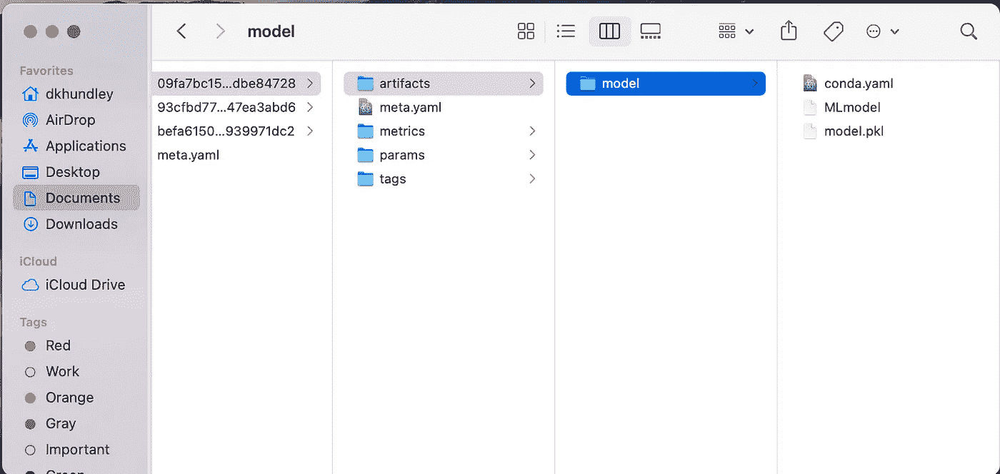
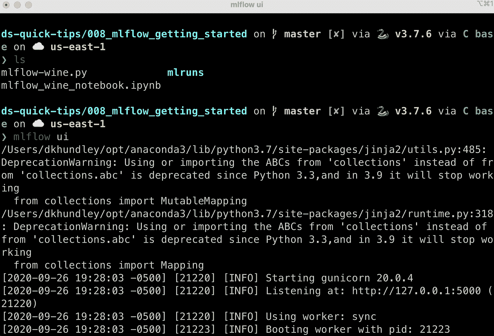
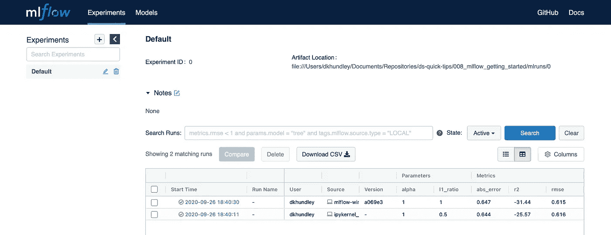
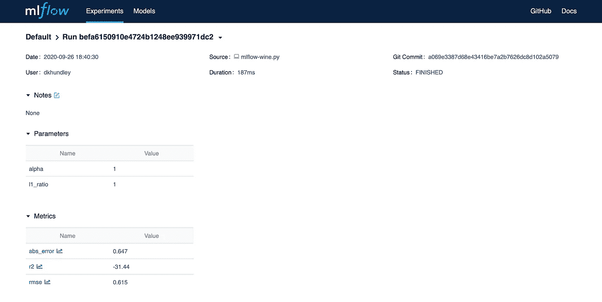

# MLflow 第 1 部分:MLflow 入门！

> 原文：<https://towardsdatascience.com/mlflow-part-1-getting-started-with-mlflow-8b45bfbbb334?source=collection_archive---------22----------------------->


## MLflow 101

## 使用这个方便的工具，帮助您迈出机器学习生命周期流程的第一步

朋友们，你们好！我们带着另一个快速提示回到这里，因为我试图保持这些帖子快速，这实际上是与 MLFlow 相关的一系列提示的第一部分。本着完全透明的精神，MLFlow 对我来说是相当新的，因此在接下来的几周内，我将与大家一起学习一些东西。如果您想了解我的代码，[请查看我的相关 GitHub 库](https://github.com/dkhundley/ds-quick-tips/tree/master/008_mlflow_getting_started)的链接。

我敢肯定你脑子里的第一个问题是，什么是 MLflow？简而言之， [MLflow](https://mlflow.org) 是一个开源平台，旨在帮助简化机器学习生命周期过程。同样，我仍在学习它的所有功能，但它似乎提供了许多有前途的功能，我很高兴在未来的帖子中探索这些功能。这些事情包括创建模型注册中心、将模型作为 API 轻松部署等等。老实说，我不知道这个子系列会持续多久，但我想我们会从这个简洁的工具中获得很多！

但是当然，我们都得从某个地方开始。我们将一步步走进这个世界，为将来的职位做好准备。也就是说，我们将采用一种非常简单的方法来创建和记录一个非常简单的模型。在开始之前，我们需要安装 MLflow，它就像运行以下 pip 命令一样简单:

```
pip install mlflow
```

在过去的几篇文章中，我们一直在使用泰坦尼克号数据集，但这一次，我们将偏离使用经典的红酒质量数据集🍷。现在，我个人不是一个葡萄酒爱好者(一般来说也不是一个酒精爱好者)，但对于你们这些葡萄酒鉴赏家来说，我想你们会像《泰坦尼克号》一样喜欢这个数据集，如果不是更多的话，因为它不是基于一个巨大的悲剧！

我们之所以要更改此数据集，是因为此数据集中的所有要素本质上都是数值型的，因此我们实际上不需要进行任何要素工程来使其适合模型。当然，我不能保证我们会得到高质量的结果，但是至少我们可以得到一个简单的模型，并且运行起来，而不需要数据清理的麻烦。我们唯一要做的就是导入数据，并在训练集和验证集之间适当地拆分数据，如下所示:

```
# Loading data and prepping for training
df_wine = pd.read_csv('../data/wine/train.csv')X = df_wine.drop(columns = 'quality')
y = df_wine[['quality']]X_train, X_val, y_train, y_val = train_test_split(X, y, random_state = 42)
```

(哦，顺便说一下，我觉得有必要说今天的帖子或多或少是 [MLflow 的第一个教程](https://mlflow.org/docs/latest/tutorials-and-examples/tutorial.html)的副本，但我故意简化了很多，并在这里更彻底地解释我的简化。)

现在是我们开始步入 MLflow 世界的时候了。我将继续粘贴下面的脚本的剩余部分，并解释每一部分是做什么的。

```
# Defining model parameters
alpha = 1
l1_ratio = 1# Running MLFlow script
with mlflow.start_run():# Instantiating model with model parameters
    model = ElasticNet(alpha = alpha,
                       l1_ratio = l1_ratio)# Fitting training data to the model
    model.fit(X_train, y_train)# Running prediction on validation dataset
    preds = model.predict(X_val)# Getting metrics on the validation dataset
    rmse = mean_squared_error(preds, y_val)
    abs_error = mean_absolute_error(preds, y_val)
    r2 = r2_score(preds, y_val)# Logging params and metrics to MLFlow
    mlflow.log_param('alpha', alpha)
    mlflow.log_param('l1_ratio', l1_ratio)
    mlflow.log_metric('rmse', rmse)
    mlflow.log_metric('abs_error', abs_error)
    mlflow.log_metric('r2', r2)# Logging model to MLFlow
    mlflow.sklearn.log_model(model, 'model')
```

在“mlflow.start_run()”下，前几行代码您应该已经非常熟悉了。这里，我们只是用提供的参数实例化一个模型，根据参数拟合训练数据，然后用我们新训练的模型和验证数据集获得预测结果。通过验证数据集中记录的预测结果和实际结果，我们可以获得均方根误差、平均绝对误差和 R2 分数的适当指标。到目前为止，这里没有什么新东西。

现在是我们开始涉足新领域的时候了。幸运的是，我认为简单地阅读代码本身就足够了。伐木时间到了，朋友们！在我们的代码中，我们将记录三件不同的事情:模型的参数、来自验证集的度量以及模型本身。随着我们下面对 UI 的探究，这样做的原因将很快变得显而易见。

运行这段代码后，您会注意到一个名为“mlruns”的新目录应该出现在您运行代码的位置附近。当你第一眼看到它的时候，它可能看起来很奇怪，但是如果你深入挖掘，你会找到你真正关心的东西。值得注意的是，您应该能够挖掘出您刚刚记录的所有内容，包括序列化的模型工件本身。



现在，在我们进入下一节之前，我想记下我在 Jupyter 笔记本和基本 Python 脚本中运行了这段代码。你不需要这样做，但这将有助于理解为什么我现在注意到这一点。

好了，现在有趣的部分来了！在命令行中，导航到“mlruns”上面的目录。(如果您刚刚运行了 Python 脚本，您应该已经在那里了。)运行以下命令，您应该会看到以下屏幕:

```
mlflow ui
```



如果你像我一样，这个界面可能看起来很熟悉，因为它似乎在幕后使用 Gunicorn 来提供这个 UI。您会注意到，在我的例子中，UI 似乎是在 localhost:5000 上提供的。打开你最喜欢的浏览器，导航到那个地址。这是您应该看到的屏幕。



很整洁，是吧？请注意，该表中显示了两次运行。如果您查看这些运行的源代码，您会注意到其中一个是从我的 mlflow-wine.py Python 脚本运行的，而另一个是从 iPykernel 运行的，这当然是我的 Jupyter 笔记本！此外，您将在接下来的几列中看到我们的模型参数，最后您可以在最后一组列中看到模型指标。

接下来，点击“开始时间”下的超链接，打开其中一个模型。这是你应该看到的。



同样，我们看到了像模型参数和验证指标这样的东西，但是我们在这里也看到了其他附加的东西，比如持续时间和相关的 git 提交。我不能在一个屏幕截图中捕获所有的内容，但是如果你从这里向下滚动，你也可以直接从 UI 中导航到模型工件本身，我认为这实在是太酷了！

这就是第一次介绍的全部内容！我们在这里仅仅触及皮毛，所以我期待在接下来的几篇帖子中与大家一起学习，继续共同探索 MLflow。希望你喜欢这个快速介绍！很快再次见到你们。😃