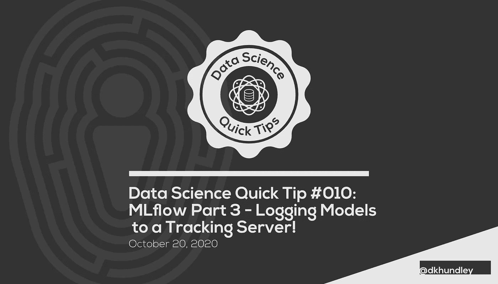
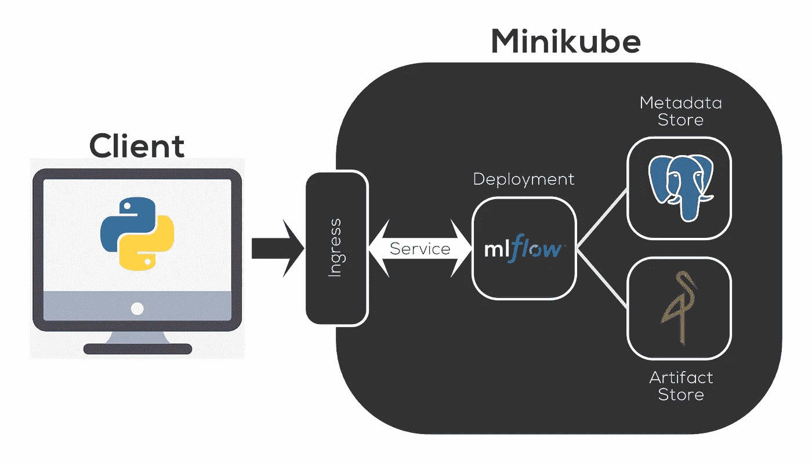
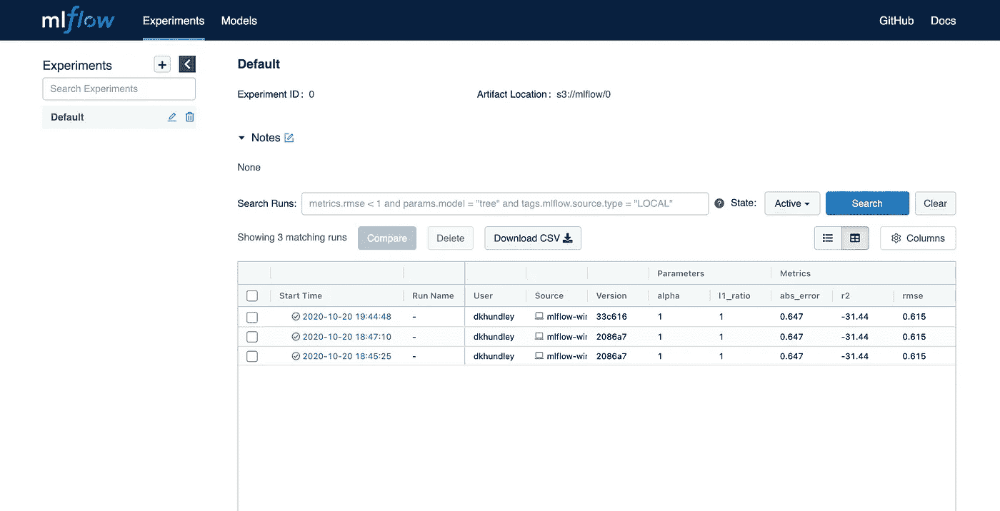
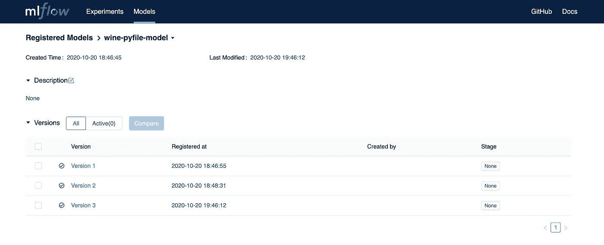

# MLflow 第 3 部分:将模型记录到跟踪服务器！

> 原文：<https://towardsdatascience.com/mlflow-part-3-logging-models-to-a-tracking-server-54b6aa3cd00f?source=collection_archive---------20----------------------->



## MLflow 101

## 将您的参数、指标、工件等记录到 MLflow 跟踪服务器

嘿，朋友们，欢迎回到我们关于 MLflow 系列的另一篇文章。如果这是你看到的第一篇文章，你想了解一下，请点击这里查看之前的文章:

*   [第 1 部分:MLflow 入门！](/mlflow-part-1-getting-started-with-mlflow-8b45bfbbb334)
*   [第 2 部分:将跟踪服务器部署到 Minikube！](/mlflow-part-2-deploying-a-tracking-server-to-minikube-a2d6671e6455)

和往常一样，如果你想看这篇文章中提到的代码，请务必[点击这里](https://github.com/dkhundley/ds-quick-tips/tree/master/010_mlflow_logging_to_server)查看我的 GitHub repo。

这篇最新的文章将建立在第 2 部分的基础上，所以如果你错过了，请一定要看看。简单回顾一下我们在那篇文章中所做的，我们在本地机器上用 Minikube 为 Kubernetes 部署了一个 MLflow 跟踪服务器。在幕后，MLflow 跟踪服务器由 Postgres 元数据存储和名为 Minio 的类似 AWS S3 的工件存储支持。那篇文章内容丰富，所以我很乐意分享这篇文章，相比之下，这篇文章简单多了。唷！

我个人更喜欢图片，而不是静态的解释，所以结合我们在上一段中提到的内容，这个架构图像总结了我们将如何在这个特定的帖子中与 MLflow 进行交互。(如果你不熟悉图标，大象是 PostgreSQL，红色的火烈鸟图标是 Minio。)



作者创建的图像

当然，在我们上一篇文章中，我们已经在图片的右侧做了所有的事情，所以这篇文章的重点是你需要为客户机上的 Python 文件包含什么。当然，巧合的是，由于我们使用 Minikube，所有的东西都托管在本地机器上，但是如果你使用合法的 Kubernetes 环境，你的客户端很可能与 MLflow 跟踪服务器分开。

这段代码实际上非常简单，其中很多内容对您来说肯定很熟悉。部分是因为其中很多是基本的机器学习内容，部分是因为在阅读本系列的第 1 部分时，您可能已经看到了其中的大部分内容。因为代码非常简单，所以我将把全部内容粘贴到这里，并介绍一些您可能不熟悉的特殊内容。

```
# Importing in necessary libraries
import os
import pandas as pd
from sklearn.model_selection import train_test_split
from sklearn.metrics import mean_squared_error, mean_absolute_error, r2_score
from sklearn.linear_model import ElasticNet
import mlflow
import mlflow.sklearn# PROJECT SETUP
# ------------------------------------------------------------------------------
# Setting the MLflow tracking server
mlflow.set_tracking_uri('[http://mlflow-server.local'](http://mlflow-server.local'))# Setting the requried environment variables
os.environ['MLFLOW_S3_ENDPOINT_URL'] = '[http://mlflow-minio.local/'](http://mlflow-minio.local/')
os.environ['AWS_ACCESS_KEY_ID'] = 'minio'
os.environ['AWS_SECRET_ACCESS_KEY'] = 'minio123'# Loading data from a CSV file
df_wine = pd.read_csv('../data/wine/train.csv')# Separating the target class ('quality') from remainder of the training data
X = df_wine.drop(columns = 'quality')
y = df_wine[['quality']]# Splitting the data into training and validation sets
X_train, X_val, y_train, y_val = train_test_split(X, y, random_state = 42)# MODEL TRAINING AND LOGGING
# ------------------------------------------------------------------------------
# Defining model parameters
alpha = 1
l1_ratio = 1# Running MLFlow script
with mlflow.start_run():# Instantiating model with model parameters
    model = ElasticNet(alpha = alpha,
                       l1_ratio = l1_ratio)# Fitting training data to the model
    model.fit(X_train, y_train)# Running prediction on validation dataset
    preds = model.predict(X_val)# Getting metrics on the validation dataset
    rmse = mean_squared_error(preds, y_val)
    abs_error = mean_absolute_error(preds, y_val)
    r2 = r2_score(preds, y_val)# Logging params and metrics to MLFlow
    mlflow.log_param('alpha', alpha)
    mlflow.log_param('l1_ratio', l1_ratio)
    mlflow.log_metric('rmse', rmse)
    mlflow.log_metric('abs_error', abs_error)
    mlflow.log_metric('r2', r2)# Logging training data
    mlflow.log_artifact(local_path = '../data/wine/train.csv')# Logging training code
    mlflow.log_artifact(local_path = './mlflow-wine.py')# Logging model to MLFlow
    mlflow.sklearn.log_model(sk_model = model,
                             artifact_path = 'wine-pyfile-model',
                             registered_model_name = 'wine-pyfile-model')
```

在顶部，您会注意到我们首先必须确保脚本指向正确的跟踪服务器。当我们在上一篇文章中部署我们的跟踪服务器时，你可能记得我们在 URI mlflow-server.local 后面有跟踪服务器本身，并且工件存储(minio)在 mlflow-minio.local 后面提供。提醒一下，Minio 故意模仿 AWS 的 S3，所以如果你想知道为什么我们要设置类似 AWS 的环境变量，这就是为什么。

在加载数据并进行一些基本建模后，我们归结到所有 MLflow 跟踪的优点。MLflow 在这里非常灵活，所以你会注意到我们正在记录/上传所有这些伟大的东西，包括…

*   因素
*   韵律学
*   我们用来运行这个模型的代码
*   训练数据本身
*   模型本身

说到最后一个，您会注意到一些关于模型命名的特殊语法。这是因为除了在工件注册中心获得模型工件之外，MLflow 还将在其 MLflow 模型注册中心创建一个正式的模型。我们将在下面简要地介绍一下，但是我们将在以后的文章中进一步探讨。(敬请期待！)

好了，如果一切正常，您需要做的就是运行以下命令:

```
python mlflow-wine.py
```

我已经多次运行了这个文件，所以这里是我的终端显示的输出。如果您是第一次运行这个程序，您会看到一些类似的东西，但很明显只是一个微小的不同:

```
Registered model 'wine-pyfile-model' already exists. Creating a new version of this model...
Created version '3' of model 'wine-pyfile-model'.
```

还有朋友，真的是这样！但是在我们结束这篇文章之前，让我们进入 UI，看看一切都正常工作。打开你的浏览器，跳到 mlflow-server.local，你会看到一个类似这样的屏幕:



如果您阅读了本系列的第 1 部分，这看起来会非常熟悉。点击相应的超链接，打开其中一个运行。如果一切正常，您应该看到您刚刚记录的所有适当的信息，包括我们刚刚创建的模型工件。不错！

第 1 部分中我们没有涉及的另一件事是位于 UI 左上角的新 Models 选项卡。单击它，您应该会看到类似这样的内容:



这个用户界面很酷。您不仅可以提供模型的全面描述，还可以将模型的特定版本设置为不同的阶段。例如，您可以将“版本 2”设置为转移，“版本 3”设置为生产，“版本 1”设置为归档。这个功能真的很棒，当我们在未来的帖子中探索更多东西时，它会非常方便。

当然，尽管 UI 很棒，但我们真的应该以编程方式做所有事情，MLflow 在这方面也有我们的支持。但是我认为我们今天在一个很好的地方停下来，所以我们将继续并结束。在下一篇文章中，我们将从一个更加程序化的角度来看如何与这个 UI 交互，然后在接下来的两篇文章中，我们将展示如何将这个模型注册表中的模型部署到一个真实的生产环境中，从而真正开始使用 gas。在此之前，感谢阅读！注意安全，朋友们！