# mlmachine -干净的 ML 实验，优雅的 EDA 和 Pandas 管道

> 原文：<https://towardsdatascience.com/mlmachine-clean-ml-experiments-elegant-eda-pandas-pipelines-daba951dde0a?source=collection_archive---------23----------------------->

来自 [Pixabay](https://pixabay.com/?utm_source=link-attribution&amp;utm_medium=referral&amp;utm_campaign=image&amp;utm_content=242558) 的[像素体系](https://pixabay.com/users/PixelAnarchy-555/?utm_source=link-attribution&amp;utm_medium=referral&amp;utm_campaign=image&amp;utm_content=242558)的图像

## 多层机器

## 这个新的 Python 包加速了基于笔记本的机器学习实验

## **TL；博士**

mlmachine 是一个 Python 库，用于组织和加速基于笔记本的机器学习实验。

在本文中，我们使用 mlmachine 来完成原本需要大量编码和工作的操作，包括:

*   数据输入和特征类型识别
*   简单、优雅的探索性数据分析
*   熊猫进出管道

查看这篇文章的 [Jupyter 笔记本](https://github.com/petersontylerd/mlmachine/blob/master/notebooks/mlmachine_part_1.ipynb)。

在 GitHub 上查看[项目](https://github.com/petersontylerd/mlmachine)。

查看 mlmachine 系列的其他条目:

 [## ml machine-group by inputr、KFoldEncoder 和倾斜校正

### 这个新的 Python 包加速了基于笔记本的机器学习实验

towardsdatascience.com](/mlmachine-groupbyimputer-kfoldencoder-and-skew-correction-357f202d2212)  [## mlmachine -众包特征选择

### 这个新的 Python 包加速了基于笔记本的机器学习实验

towardsdatascience.com](/mlmachine-crowd-sourced-feature-selection-50cd2bbda1b7) 

# **什么是 mlmachine？**

笔记本通常充当数据科学家的草稿纸。机器学习实验往往会变成一系列杂乱无序的硬编码块。即使花时间编写通用功能，这些功能也是孤立的，无用地与新项目隔离开来。

mlmachine 是一个 Python 包，它有助于进行整洁有序的基于笔记本的机器学习实验，并完成实验生命周期的许多关键方面。

mlmachine 的中枢是`**Machine()**`级。`**Machine()**`对象保留数据集、目标数据和特征元数据。更重要的是，`**Machine()**`对象有许多内置方法，用于快速执行机器学习实验工作流的关键部分。

以下是我们将详细探讨的 mlmachine 功能的几个核心领域:

1.  **数据摄取&** `**mlm_dtype**` **识别**
2.  **探索性数据分析** -下面是一个例子，展示了为一个特性创建一个可视化和数据汇总面板是多么容易:

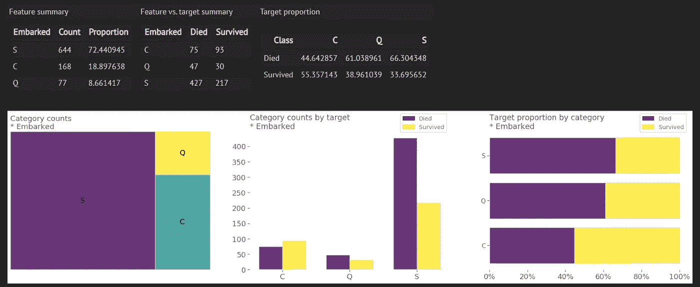

彻底的 EDA，简单的执行

3.**熊猫友好的变压器和管道**——看看简单地将 mlmachine 实用程序`**PandasTransformer()**`包裹在`**OneHotEncoder()**` 周围是如何维护我们的`**DataFrame**`:

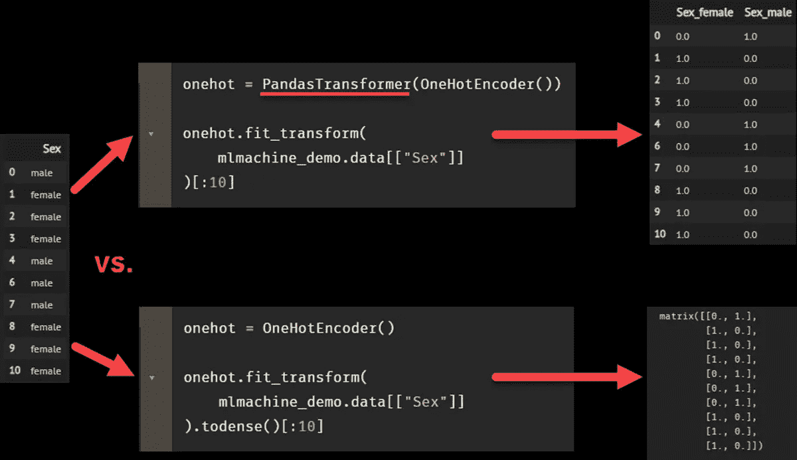

mlmachine 包含大量旨在节省时间和提高模型性能的功能，同时保持我们的工作流程整洁有序。

让我们开始吧。

# 机器类-有许多辐条的轮毂

## **数据摄取**

我们首先实例化一个`**Machine()**` 对象:

让我们打开刚才做的东西。使用规范的 Titanic 数据集，我们通过以下方式实例化一个名为`**mlmachine_titanic**`的`**Machine()**` 对象:

*   将整个数据集作为一个`**DataFrame**`传入
*   指定包含目标变量的列
*   将监督学习任务指定为分类任务

`**mlmachine_titanic**` 最基本的目的是维护我们的观察数据集和我们的目标值。我们的数据集存储为`**DataFrame**` ，可以通过调用`**mlmachine_titanic.data**`来访问:

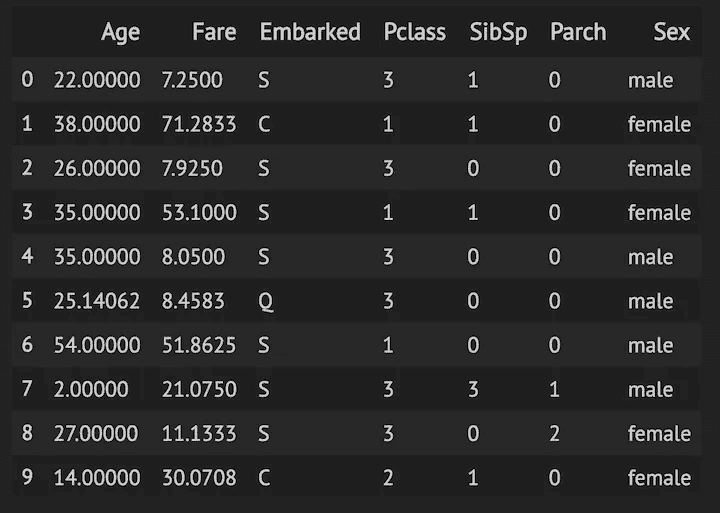

我们的目标变量存储为一个名为 Pandas `**Series**`的变量，可以通过调用`**mlmachine_titanic.target**`轻松访问:

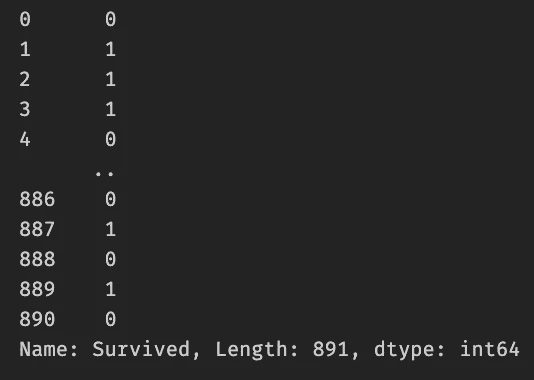

如果需要，目标值将被自动标记编码。

我们还将几个包含特性名称的列表传递给参数，如`**identify_as_continuous**` 和`**identify_as_nominal**`。让我们来看看这些参数的用途。

## 传销数据类型:为熊猫数据类型添加功能含义

Pandas dtypes 描述了包含在一个列中的值，但是不考虑这些值的实际含义*。名词性范畴、序数范畴、连续数字、计数……通常不可能单独从熊猫数据类型中做出这些区分。*

*在 mlmachine 生态系统中，这些区别被称为`**mlm_dtypes**`。mlmachine 编目，最重要的是，*随着数据集在特征工程中的发展而更新* `**mlm_dtypes**`。*

*我们的数据集存储为`**mlmachine_titanic.data**`，有一个名为`**mlm_dtypes**`的元数据属性:*

*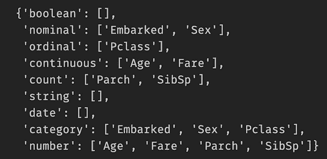*

*这个字典是 mlmachine 工作流的基石，渗透到了包的所有功能中。注意字典的键。根据我们在实例化`**Machine()**`对象时提供的指导，`**mlm_dtypes**`存储每个特性的 mlm dtype。*

*字典键使得引用某种类型的所有特性变得特别容易，而不必键入特性名称。这样做的实际好处是显而易见的，尤其是当我们考虑的数据集比这个巨大的数据集还要大的时候。*

*在本文中，我们将在两个关键领域利用这种效率:*

*   *探索性数据分析*
*   *转换和管道*

*让我们在介绍 mlmachine 的探索性数据分析功能时使用`**mlm_dtypes**`。*

# *因为 EDA 很繁琐，而且永远都用不完*

*我们都为执行粗略的 EDA 而感到内疚，如果有的话(“让我们开始模型训练吧！”).即使有了所有优秀的 Python 可视化库，EDA 也需要进行大量的设置。我们都在做的事情是，第一百次编写那些相同的、稍加修改的函数。记住哪种可视化类型最适合哪种特征类型以及特征/目标类型的组合并不容易。*

*跳过 EDA 绝对是一个错误，因此 mlmachine 的一部分功能致力于快速制作既有益又好看的面板。*

## *分类特征面板*

*我们在介绍中看到了一个名为“apolloed”的分类特性的 EDA 面板。让我们超越这个例子，使用我们的`**mlm_dtypes**`字典为我们在`**mlmachine_titanic.data**`中的所有分类特征快速生成面板:*

*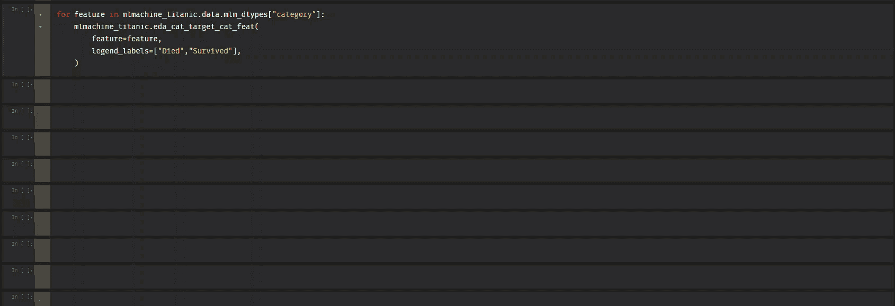*

*`**eda_cat_target_cat_feat()**`为分类目标环境中的分类或计数特征生成 EDA 面板。顶部有三个汇总表:*

1.  *特性摘要——类别中每个级别的简单计数，以及每个级别在特性中所占的百分比。*
2.  *功能与目标摘要-类别中每个级别的计数，按目标中的类分组*
3.  *目标比例-特定特征级别值的百分比，按目标中的类分组。*

*该面板包括三个可视化。从左至右:*

1.  *分类特征的树形图。*
2.  *分类特征的条形图，按目标分面。*
3.  *按目标分面的 100%水平堆积条形图。*

***轻松扩展到多类问题***

*现在让我们使用`**eda_cat_target_cat_feat()**`为一个多类示例生成一个面板。我们将使用 Scikit-learn wine 数据集来可视化一个名为“alcalinity_of_ash”的数字特征，该数字特征已被分成 5 个箱，实际上使其成为一个分类列:*

*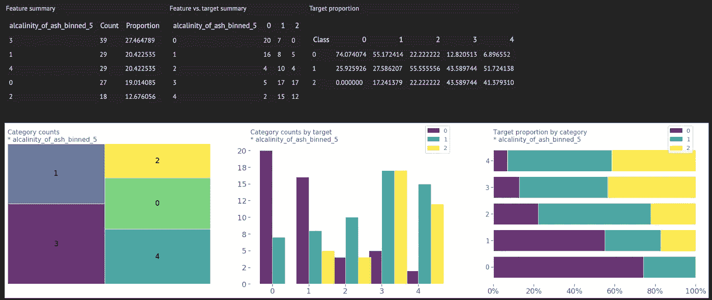*

*面板的每个组件都相应地适应该数据集中的多类问题。*

## *连续特征面板*

*现在让我们看看 mlmachine 可以对数字特征做些什么:*

*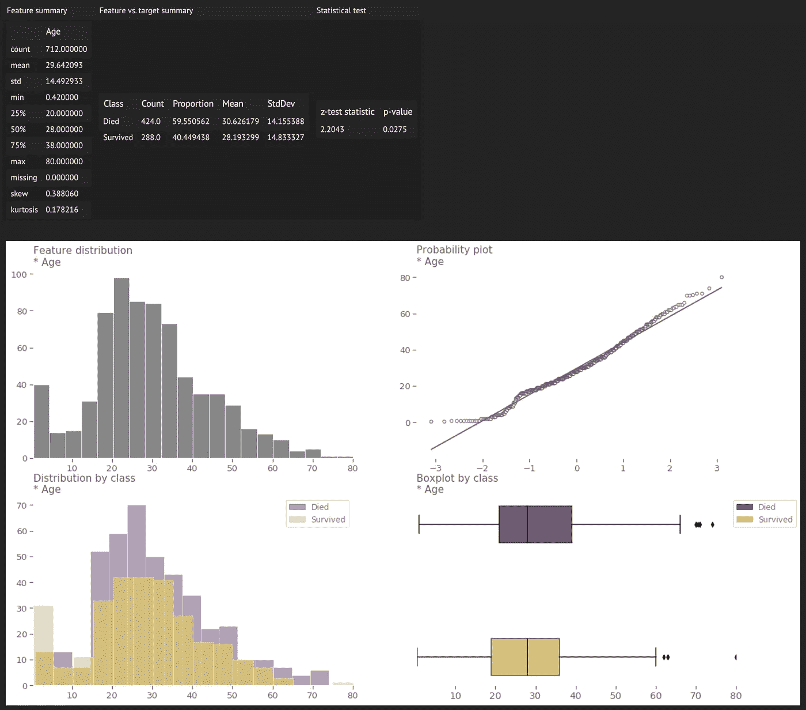*

*`**eda_cat_target_num_feat()**` 是一个方法，在分类目标的上下文中为数字特征生成一个面板。在顶部，我们展示了三只熊猫`**DataFrames**`:*

1.  *特性概要——我们通过执行标准的`**df.describe()**`命令得到的所有概要统计数据，加上“缺失百分比”、“偏斜”和“峰度”。*
2.  *特征与目标摘要-数字特征的计数、比例、平均值和标准差，按目标中的不同类别分组。*
3.  *统计测试——如果目标列只有两个类，则报告 z 测试(或 t 测试，在小样本的情况下)的结果和相关的 p 值。*

*汇总表下面是一个包含四种可视化效果的面板。从左上角开始，从左到右:*

1.  *数字特征的单变量分布图。*
2.  *数字特征的 QQ 图。*
3.  *由目标分面的数值特征的二元分布图。*
4.  *由目标分面的水平方框图。*

***对多类问题的另一种毫不费力的扩展***

*`**eda_cat_target_num_feat()**`还能轻松适应多类问题。让我们看另一个简单的例子:*

*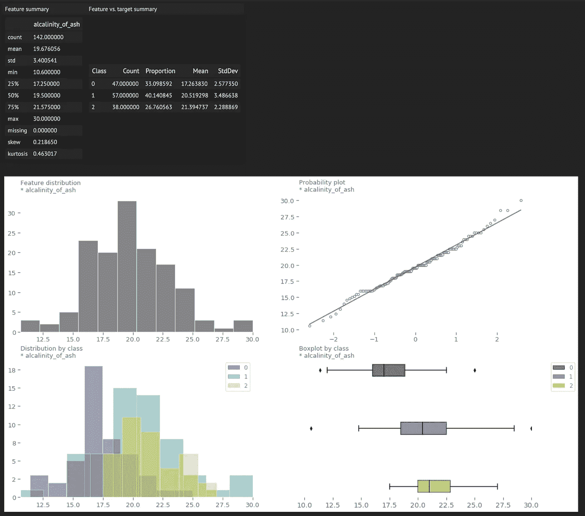*

*我们再次使用 Scikit-learn wine 数据集用同样的最少代码创建这个面板。请注意变化:*

1.  *“功能与目标概要”表展开以反映所有三个类别。*
2.  *分面图扩展以可视化所有三个类。*
3.  *x 轴和 y 轴刻度标签是小数，而不是整数。这种修改是基于被可视化的数据的规模而动态发生的。更少的格式化时间，更多的探索时间。*

*mlmachine 为 EDA 引入了大量的简单性和动态性。现在让我们看看 mlmachine 是如何促进熊猫友好的 ML 实验工作流程的。*

# *熊猫进出管道*

## ***Scikit-learn 拆卸熊猫数据帧***

*将`**DataFrame**`放入 Scikit-learn 转换器的一个主要缺点是底层 NumPy 数组周围的`**DataFrame**`包装器的丢失。这个问题在像`**PolynomialFeatures()**`这样的变形金刚身上尤为突出:*

*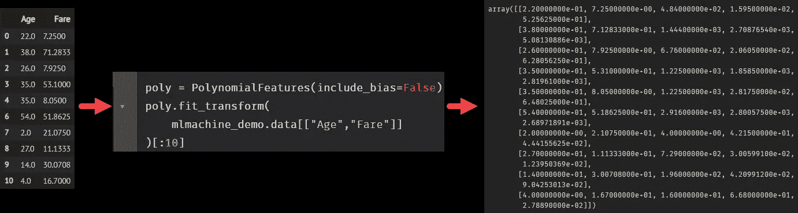*

*如果我们认为我们已经通过访问`**poly.get_feature_names()**`属性战胜了这个 transformer，那么当我们看到输出时，我们会非常失望:*

*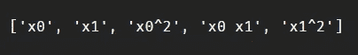*

*没什么帮助。*

*因此，我们失去了以下能力:*

*   *轻松对转换后的数据集执行 EDA*
*   *训练模型后评估特征重要性*
*   *使用模型可解释性方法，如 SHAP 或莱姆*
*   *仅仅识别哪些列是哪些列*

*当然，我们可以将 NumPy 数组反馈到一个`**DataFrame**`，并做任何需要的事情来使列匹配，但是……这是一件多么麻烦的事情。*

## *变形金刚，现在有了数据框架*

*mlmachine 利用一个名为`**PandasTransformer()**`的类来确保如果一个`**DataFrame**`传入一个变压器，另一端会出现一个`**DataFrame**`。*

*我们所要做的就是用`**PandasTransformer()**`包装`**PolynomialFeatures()**`,然后我们得到一个`**DataFrame**`,在另一边有有意义的列名:*

*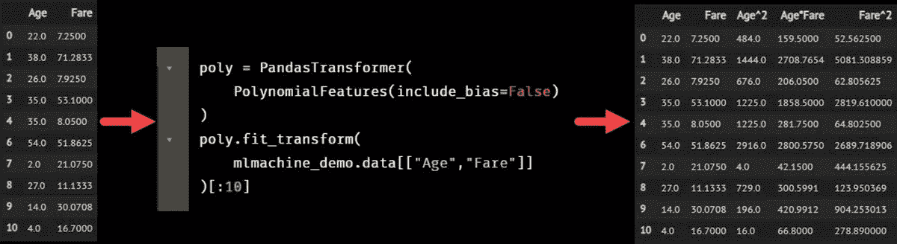*

*就这么简单。*

*既然我们已经看到了如何在执行单个转换时保留我们的`**DataFrame**`,那么让我们在此基础上使用 Scikit-learn 的`**Pipeline()**`和`**FeatureUnion()**`功能来一次对多组特征执行多个操作。*

# *PandasFeatureUnion & data frame selector-直观、熟悉、灵活*

## *香草特色联盟*

*Scikit-learn 包含一个名为`**FeatureUnion()**`的类。引用文档中的话，`**FeatureUnion()**`“连接多个 transformer 对象的结果…这对于将几个特征提取机制合并到一个 transformer 中很有用。”*

*对于将不同的数据处理操作应用于不同的要素，这是一个非常好的工具。例如，我们可能希望表示估算连续特征和模式估算分类特征:*

*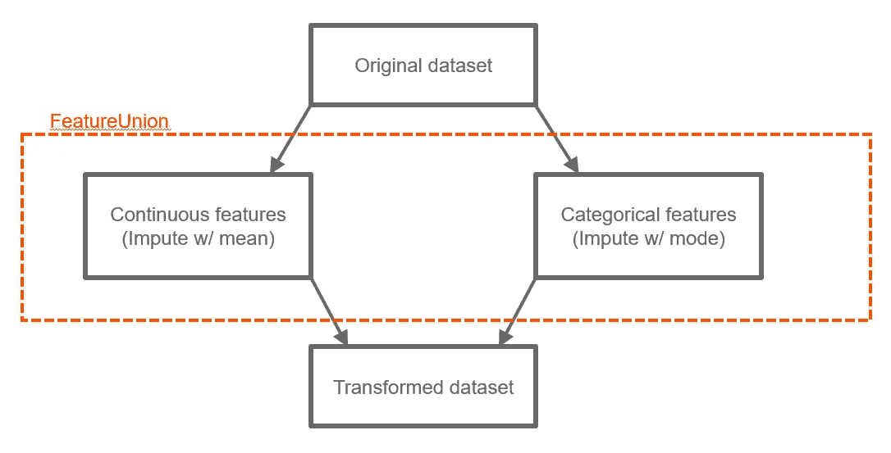*

*不幸的是，`**FeatureUnion()**`也遭受了和其他变形金刚一样的缺点——它返回一个 NumPy 数组。这就是`**PandasFeatureUnion()**`前来救援的地方。*

## *PandasFeatureUnion & data frame selector*

*就像我们需要`**PandasTransformer()**`来保留`**DataFrame()**`后变换一样，我们需要`**PandasFeatureUnion()**`来维护最终的`**DataFrame**`后拼接。*

***基本示例***

*我们从这里重新开始，再次实例化一个名为`**mlmachine_titanic**`的`**Machine()**`对象。然后我们使用 mlmachine 的`**PandasFeatureUnion()**`类创建一个`**DataFrame**`友好的、`**FeatureUnion**`风格的管道，称为`**impute_pipe**`。这里是输出，仍然在一个`**DataFrame**`:*

**

*具体来说，我们对有空值的三个不同列执行三种不同类型的插补:*

*   *用平均值估算“年龄”*
*   *用模式估算“已装船”*
*   *用常数值(X)输入“客舱”。*

*敏锐的观察者会注意到每条管道中存在另一个类别。这个类是`**PandasFeatureUnion()**`工作流的一个基本元素，根据它的使用方式有不同的用途。在第 30、34 和 38 行，`**DataFrameSelector()**`用于选择 union 的特定分支的列。使用`**include_columns**` 参数按名称选择列。*

*在第 42 行，我们做了一些不同的事情。由于按照设计，`**FeatureUnion()**`操作作用于特定的列并连接结果，我们将只剩下*和*转换后的列，无需进一步干预。*

*这就是为什么`**DataFrameSelector()**`可以灵活选择所有列*，除了那些指定的列*。通过`**exclude_columns**`参数，我们选择除我们估算的特征之外的所有特征。这确保了我们保留完整的数据集。*

*现在我们已经填充了空值，让我们使用`**PandasFeatureUnion()**`工作流前进到稍微复杂一点的预处理步骤。如果对`**mlm_dtypes**`的目的有任何疑问，现在将变得更加清楚。*

***不太基本的例子***

*我们现在有了一个带有编码列的`**DataFrame**`，它们都被明确命名为:*

*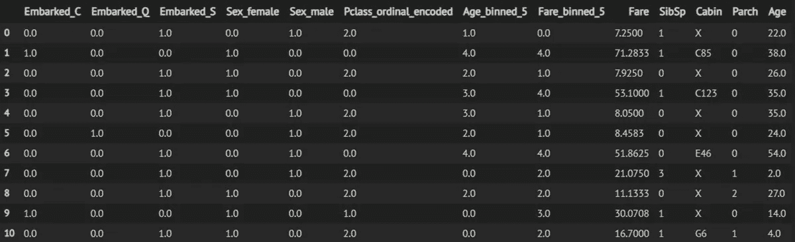*

*让我们把这个`**PandasFeatureUnion**`一个分支一个分支:*

*   *“名义”管道——这里我们看到了`**DataFrameSelector()**`的灵活性。首先，我们通过将`**[“nominal”]**`传递给`**include_mlm_dtypes**` 参数来选择所有名义列。`**DataFrameSelector()**`直接引用`**mlm_dtypes**`进行栏目选择。其次，我们通过将特征名称传递给`**exclude_columns**`参数来排除“Cabin”(也是一个名义特征)。`**DataFrameSelector()**`通过选择除“客舱”之外的所有标称列*来协调我们的包含/排除规格。最后，我们将选择的列传递给`**OneHotEncoder()**`，包装在`**PandasTransformer()**`中。**
*   *“序数”管道——我们再次使用了`**DataFrameSelector()**`参数`**include_mlm_dtypes**`，这次是为了选择所有序数列。然后我们将结果传递给`**OrdinalEncoder()**`，用`**PandasTransformer()**`包装。我们还提供编码说明。当我们实例化我们的`**Machine()**`对象时，我们传入了一个名为`**ordinal_encodings**`的字典，`**mlmachine_titanic**`将它存储为一个属性。我们将这个字典的值包装在一个列表中，并将其传递给`**OrdinalEncoder()**`参数`**categories**`。这将确保在编码过程中执行所需的层次结构。*
*   *“bin”管道-我们再次使用`**include_mlm_dtypes**`选择所有连续特征，并将结果传递给`**KBinsDiscretizer()**`，包装在`**PandasTransformer()**`中。*
*   *“diff”管道——最后一步是重新组合任何在联合操作中会丢失的特性，并删除任何我们不再需要的特性。我们对`**mlm_dtypes**`属性执行列表理解以删除“Cabin ”,并将`**mlmachine_titanic.ordinal_encodings**`的键附加到结果中。这将确保原始的标称和序数特征在转换的数据集中是*而不是*，但是我们保留“小屋”。注意，我们没有排除连续列，尽管我们用`**KBinsDiscretizer()**`转换了这些特性。原因很简单——我们希望在数据集中保留原始的连续列。*

*我们用熟悉的`**fit_transform()**`方法来称呼`**encode_pipe**`。*

***更新 mlm_dtypes***

*因为数据集中有了新的特性，所以最好的做法是在`**fit_transform()**`之后加上`**update_mlm_dtypes()**`。*

*正如本文前面提到的，我们可以更新`**mlm_dtypes**`来反映`**data**`属性的当前状态。让我们来看一个前后对比，清楚地看到`**mlm_dtypes**`字典是如何变化的:*

*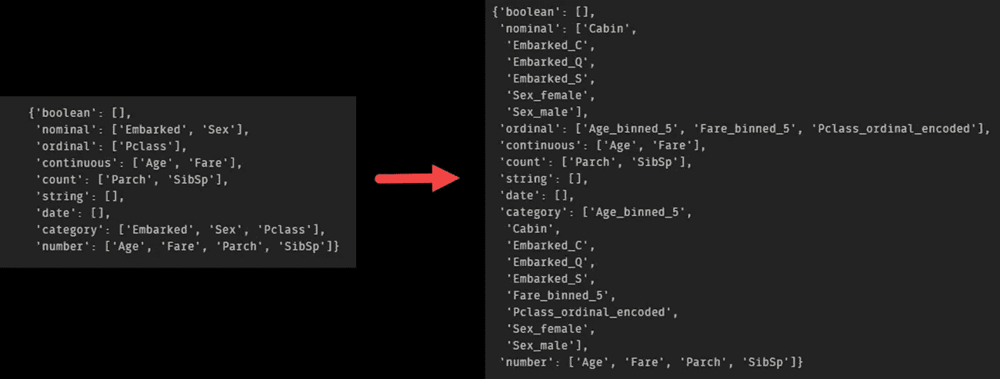*

*我们更新的`**mlm_dtypes**`字典在右边。我们看到没有标称列“apollowed”和“Sex ”,取而代之的是虚拟列的名称，如“apollowed _ C”和“Sex_male ”,由`**PandasTransformer(OneHotEncoder())**`产生。还要注意,“nominal”键仍然包含“Cabin”特性，我们选择在这里不处理它。*

*“ordinal”键包含我们的 binned 版本的“Age”和“Fare ”,以及“Pclass ”,它的命名方式清楚地表明了所应用的编码类型。*

*每当我们修改`**data**`时，我们简单地调用`**update_mlm_dtypes()**`，而`**mlm_dtypes**`会自动更新以反映数据集的当前状态。唯一真正的工作是从一开始就确定每个特性的 mlm dtype，这是我们每次都应该做的事情。*

*让我们通过利用`**mlm_dtypes**`字典来对我们的新特性快速执行一点 EDA，从而得出结论。这一次，我们将遍历所有的顺序功能:*

*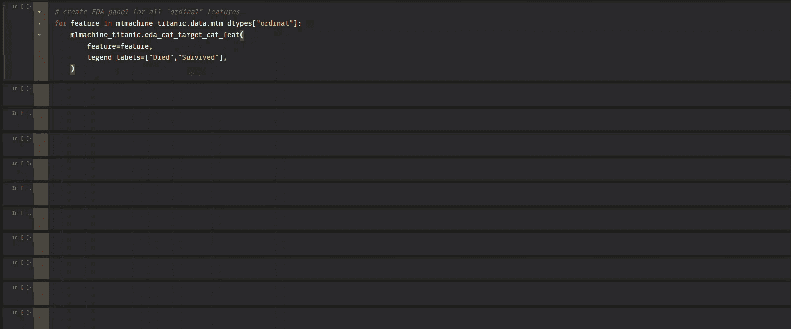*

*我们覆盖了很多领域，但我们才刚刚开始探索 mlmachine 的功能。*

*查看 [GitHub 库](https://github.com/petersontylerd/mlmachine)，并继续关注其他专栏条目。*