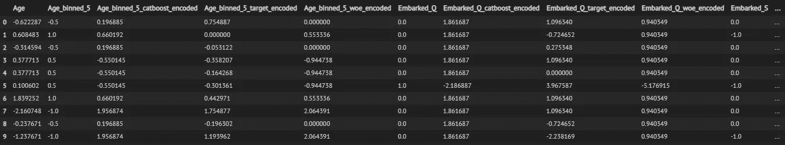
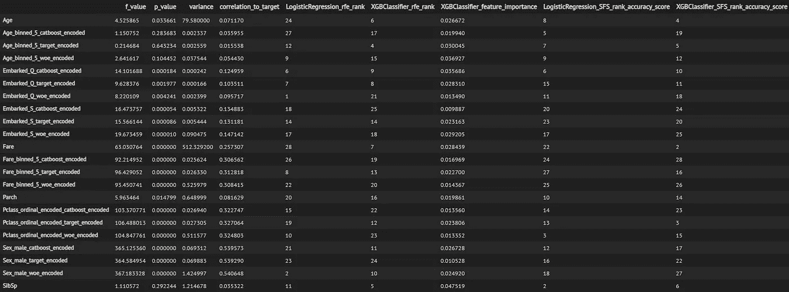
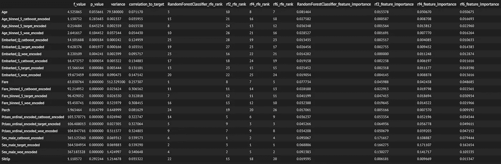
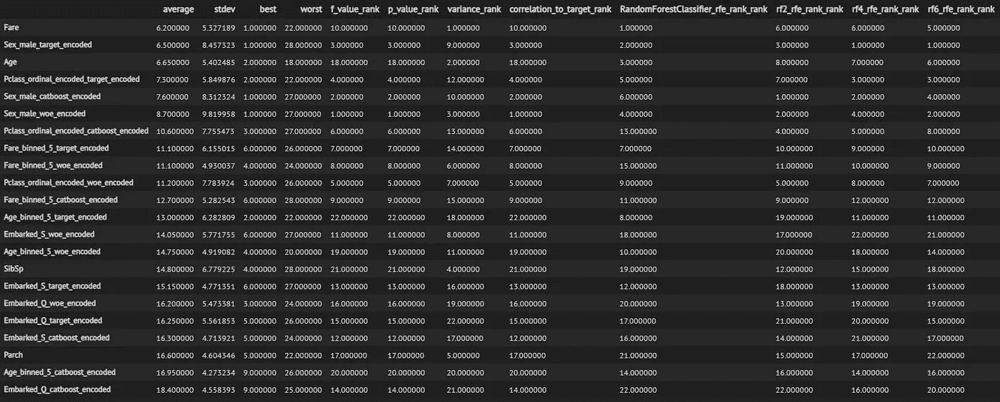
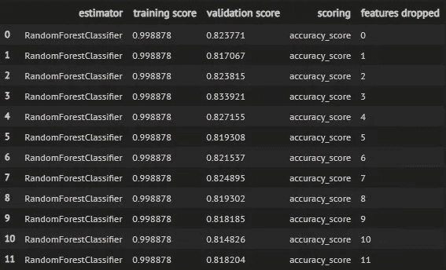
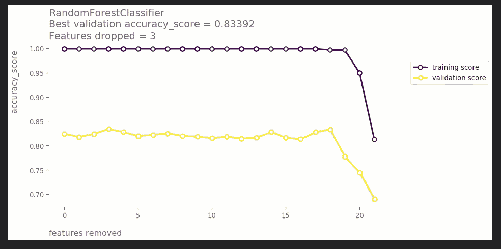
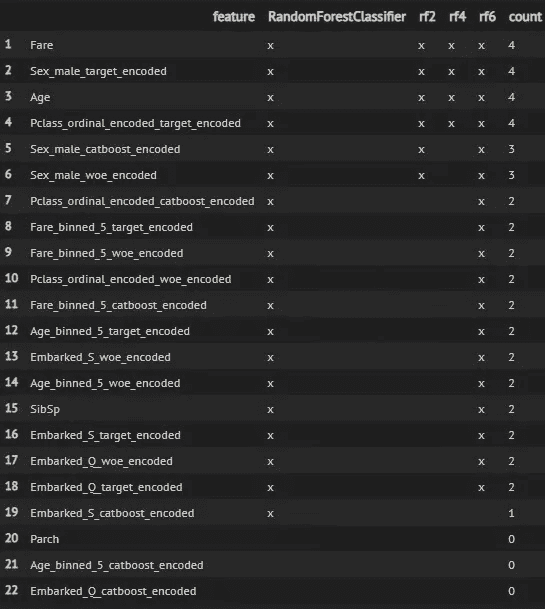
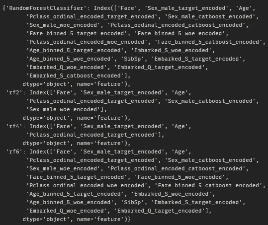

# mlmachine -众包特征选择

> 原文：<https://towardsdatascience.com/mlmachine-crowd-sourced-feature-selection-50cd2bbda1b7?source=collection_archive---------54----------------------->

图片由[阿雷克索查](https://pixabay.com/users/qimono-1962238/?utm_source=link-attribution&amp;utm_medium=referral&amp;utm_campaign=image&amp;utm_content=1872665)从[皮克斯拜](https://pixabay.com/?utm_source=link-attribution&amp;utm_medium=referral&amp;utm_campaign=image&amp;utm_content=1872665)发来

## 多层机器

## 这个新的 Python 包加速了基于笔记本的机器学习实验

## TL；速度三角形定位法(dead reckoning)

mlmachine 是一个 Python 库，用于组织和加速基于笔记本的机器学习实验。

在本文中，我们使用 mlmachine 来完成原本需要大量编码和工作的操作，包括:

*   众包特征重要性估计
*   通过迭代交叉验证的特征选择

查看这篇文章的 [Jupyter 笔记本](https://github.com/petersontylerd/mlmachine/blob/master/notebooks/mlmachine_part_3.ipynb)。

在 GitHub 上查看[项目](https://github.com/petersontylerd/mlmachine)。

并查看过去的 mlmachine 文章:

 [## mlmachine -干净的 ML 实验，优雅的 EDA 和 Pandas 管道

### 这个新的 Python 包加速了基于笔记本的机器学习实验

towardsdatascience.com](/mlmachine-clean-ml-experiments-elegant-eda-pandas-pipelines-daba951dde0a)  [## ml machine-group by inputr、KFoldEncoder 和倾斜校正

### 这个新的 Python 包加速了基于笔记本的机器学习实验

towardsdatascience.com](/mlmachine-groupbyimputer-kfoldencoder-and-skew-correction-357f202d2212) 

# 众包特征重要性估计

## 技术目录

以下是特征重要性估计技术的非穷尽列表:

*   基于树的特征重要性
*   递归特征消除
*   顺序向前选择
*   顺序向后选择
*   f 值/ p 值
*   差异
*   目标相关性

这一系列技术来自几个不同的库。理想情况下，我们使用*所有的*这些技术(在适用的情况下)来广泛理解每个特征在机器学习问题中扮演的角色。这是一系列繁琐的任务。

即使我们花时间去执行每一种方法，不同的执行会导致不同的变量，使整体评估变得乏味。

mlmachine 的`**FeatureSelector()**`类使得运行上面列出的所有特性重要性评估技术变得容易。此外，我们可以同时对各种估计量和各种度量进行这样的操作。让我们看看 mlmachine 的运行情况。

## 准备数据

首先，我们应用数据预处理技术来清理数据。我们将首先创建两个`**Machine()**`对象——一个用于训练数据，另一个用于验证数据:

现在，我们通过输入空值并应用各种宁滨和编码技术来处理数据:

这里是输出，仍然在一个`**DataFrame**`:

## 特征选择器

我们的`**DataFrame**`已经被估算，以多种方式编码，并且有几个新特性。我们准备好迎接`**FeatureSelector()**`。

**示例 1 -评估员类别**

为了实例化一个`**FeatureSelector()**`对象，我们传递训练数据、标签和一个评估者列表。这个估计器列表可以包含估计器类名、实例化模型的变量或两者的组合。在这个例子中，我们传递了`**LogisticRegression()**`和`**XGBClassifier()**`的类名，这利用了估计器的默认设置。

我们的`**FeatureSelector()**`对象包含上述每个特性重要性技术的内置方法，以及一个名为`**feature_selector_suite()**`的方法，该方法将所有技术合并到一次执行中。

为了执行`**feature_selector_suite()**`，我们将“准确性”传递给参数`**sequential_scoring**`，将 0 传递给参数`**sequential_n_folds**`。这些参数影响顺序向后/向前算法。我们还将`**save_to_csv**`设置为 True，以将结果`**DataFrame**`保存到 CSV。这是我们的结果:

在`**DataFrame**`中，一些列捕获指标的值，包括 F 值、P 值、方差、目标相关性和基于树的特征重要性。其余的列根据底层算法捕获选择或消除某个特征的顺序。

**示例 2 -实例化模型**

这是另一个例子。这一次，我们使用包含`**RandomForestClassifier()**`类和三个实例化模型的估计器列表来实例化`**FeatureSelector()**`。每个`**RandomForestClassifier()**`用`**max_depth**`超参数的不同值来实例化。最后，我们将“roc_auc”而不是“accuracy”作为我们的评分标准传递给`**sequential_scoring**`。

注意，在这个`**DataFrame**`中，我们有递归特性消除和基于树的特性重要性的列，它们是专门为我们的评估列表中的实例化模型命名的。

我们已经整理了一份描述特性重要性的摘要，但是我们才刚刚开始。

## 众包

将所有这些信息放在一个地方的价值是显而易见的，但是为了实现对特征重要性的众包式、集合式评估，我们首先需要将这些值标准化。这样便于排名。

除了将价值观放在同一尺度上，我们还需要确保始终如一地处理价值观的方向性。例如，高 F 值表示重要特征，而低 p 值表示重要特征。

mlmachine 让这一切变得简单。`**FeatureSelector()**`包含一个名为`**feature_selector_stats()**`的方法，它逐列应用这个排序。作为一个额外的好处，`**feature_selector_stats()**`添加了几个描述每个特性排名的汇总统计列，并自动按照最佳排名对特性进行排序。

请注意这次更新的`**DataFrame**`(延伸到屏幕外)中的 3 个关键差异:

1.  原始`**DataFrame**`中每列的值现在显示为等级，其中较低的值表示较高重要性的特性。
2.  在`**DataFrame**`的左侧插入额外的汇总统计栏。
3.  `**DataFrame**`按平均排名升序排序。

根据这一总结，这些模型中最重要的前三个特征是“票价”、“性别”的平均目标编码版本和“年龄”。

在这个例子中，我们执行了第二步`**feature_selector_stats()**`，但是我们可以通过将`**feature_selector_suite()**`中的`**add_stats**`参数设置为 True 来跳过这一步。

# 通过迭代交叉验证的特征选择

特性重要性本身是一个好的开始，但是我们的最终目标是只为我们即将到来的模型训练阶段选择最有意义的特性。

我们的分级和排序的特性重要性总结是下一步的基础。为了评估每个子集，`**FeatureSelector()**`使用了一种类似于递归特征消除的方法:

*   使用交叉验证训练具有所有特征的模型
*   获取训练和验证数据集的平均性能
*   从剩余的可用特征中移除最不重要的(1 倍步长)特征
*   重复此操作，直到特性列表耗尽

为了确定“最不重要”，我们依赖于已排序的特征重要性汇总。每次我们删除功能时，我们会从剩余的功能中删除排名最低的功能。

## 简历摘要

让我们看看 mlmachine 的运行情况:

我们的`**FeatureSelector()**`对象包含一个名为`**feature_selector_cross_val()**`的方法。这将执行迭代特征子集评估并存储结果。让我们回顾一下参数:

*   `**feature_selector_summary**`:我们排名排序后的功能重要性汇总
*   `**estimators**`:我们想要用来评估特性的评估器列表
*   `**scoring**`:一个或多个评分标准
*   `**n_folds**`:交叉验证程序中的折叠数
*   `**step**`:每次迭代后要移除的特征数量
*   `**save_to_csv**`:指定是否将结果保存在 CSV 中

让我们回顾一下我们的结果:

在`**DataFrame**`的每一行，我们可以看到单个评估者基于特定评分标准对某个特性子集的性能。“删除的功能”列描述了从全部功能集中删除了多少功能。记住，在每次迭代之后，`**feature_selector_cross_val()**`删除(1 x 步)最不重要的特征，其中重要性基于`**feature_selection_summary**`的排名和排序。

## 可视化性能曲线

`**FeatureSelector()**`还有一个内置方法，用于可视化每个子集的训练和验证分数:

在这里，我们可以看到 4 个`**RandomForestClassifier()**`模型的训练和验证准确性分数趋势。每个图表标题都清楚地告诉我们最佳验证准确性分数，以及达到该分数时从完整功能集中删除了多少功能。

## 结果摘要

最后，`FeatureSelector()`中有几个实用程序可以帮助我们总结和利用交叉验证程序的结果。

首先，方法`**create_cross_val_features_df()**`总结了每个模型在获得最佳验证分数时所使用的特性:

我们的特性构成了这个`**DataFrame**`的索引，我们的估计器被表示为列。在每个特征/估计值对的交叉点，X 表示该特征是否用于达到最佳验证分数的子集中。“计数”列合计了使用某个特性的评估者的数量，而`**DataFrame**`在该列中按降序排列。

第二，方法`**create_cross_val_features_df()**`为每个模型编译最佳特征子集，并在字典中返回结果。估计量是关键，相关值是包含每个估计量的最佳特征子集的列表。

该字典有助于在模型训练阶段快速利用这些特征子集。

# 最后

mlmachine 使得执行各种各样的特征重要性估计技术变得容易，并且有助于彻底的筛选过程来为各种估计器确定最佳特征子集。

查看 [GitHub 库](https://github.com/petersontylerd/mlmachine)，并继续关注其他专栏条目。