# ml machine-group by inputr、KFoldEncoder 和倾斜校正

> 原文：<https://towardsdatascience.com/mlmachine-groupbyimputer-kfoldencoder-and-skew-correction-357f202d2212?source=collection_archive---------32----------------------->

图片由 [Gerd Altmann](https://pixabay.com/users/geralt-9301/?utm_source=link-attribution&amp;utm_medium=referral&amp;utm_campaign=image&amp;utm_content=2764820) 从 [Pixabay](https://pixabay.com/?utm_source=link-attribution&amp;utm_medium=referral&amp;utm_campaign=image&amp;utm_content=2764820) 拍摄

## 多层机器

## 这个新的 Python 包加速了基于笔记本的机器学习实验

## TL；速度三角形定位法(dead reckoning)

mlmachine 是一个 Python 库，用于组织和加速基于笔记本的机器学习实验。

在本文中，我们使用 mlmachine 来完成原本需要大量编码和工作的操作，包括:

*   缺少值-评估和分组估算
*   KFold 编码——无泄漏的奇异编码
*   Box、Cox、Yeo & Johnson - Skew 校正器

查看这篇文章的 [Jupyter 笔记本](https://github.com/petersontylerd/mlmachine/blob/master/notebooks/mlmachine_part_2.ipynb)。

在 GitHub 上查看[项目](https://github.com/petersontylerd/mlmachine)。

查看 mlmachine 系列的其他条目:

 [## mlmachine -干净的 ML 实验，优雅的 EDA 和 Pandas 管道

### 这个新的 Python 包加速了基于笔记本的机器学习实验

towardsdatascience.com](/mlmachine-clean-ml-experiments-elegant-eda-pandas-pipelines-daba951dde0a)  [## mlmachine -众包特征选择

### 这个新的 Python 包加速了基于笔记本的机器学习实验

towardsdatascience.com](/mlmachine-crowd-sourced-feature-selection-50cd2bbda1b7) 

# 缺少值-评估和分组估算

让我们首先实例化两个`**Machine()**`对象，一个用于我们的训练数据，另一个用于我们的验证数据

## **评估**

每个`**Machine()**`对象包含一个以表格和图形形式总结缺失的方法:

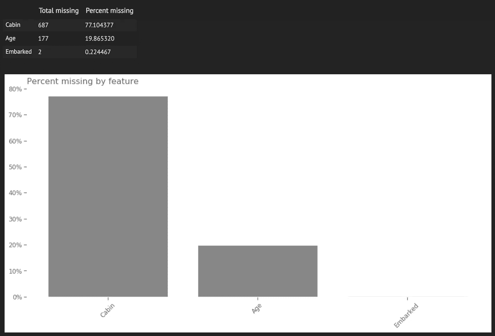

默认情况下，这个方法作用于与`**mlmachine_train**`相关联的`**data**`属性。让我们对验证数据集做同样的事情:

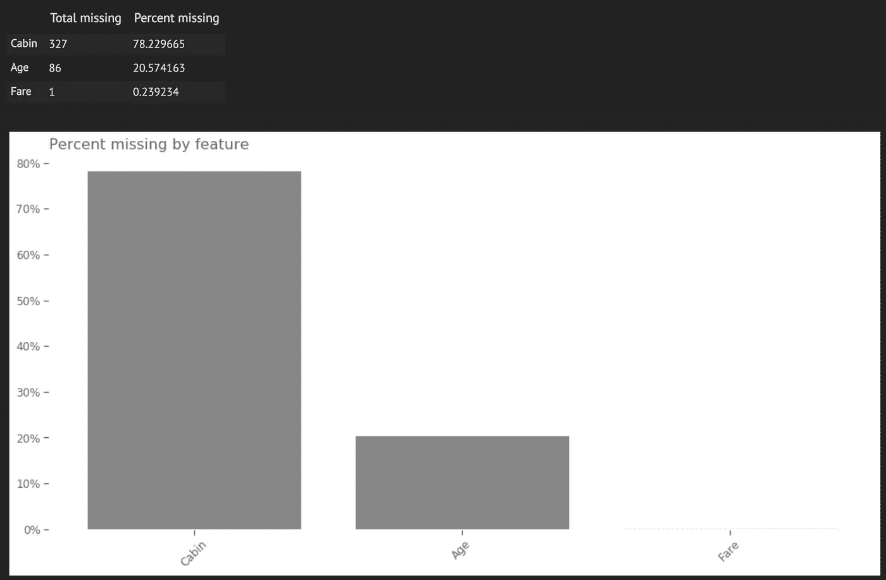

接下来，我们需要确定在训练数据中是否有缺失值的特征，而不是验证数据，反之亦然。这告诉我们应该如何设置我们的转换管道。例如，如果某个特征在验证数据集中有缺失值，但在训练数据集中没有，我们仍然希望在训练数据上对该特征进行拟合变换，以学习插补值，从而应用于验证数据集中的空值。

我们可以观察上面的表格和图像来比较两个数据集中的缺失状态，但是这可能很繁琐，尤其是对于大型数据集。相反，我们将利用我们的`**Machine()**`对象中的一个方法。我们简单地将验证数据集传递给`**mlmachine_titanic_train**`的方法`**missing_col_compare**`，该方法返回一个双向缺失汇总。

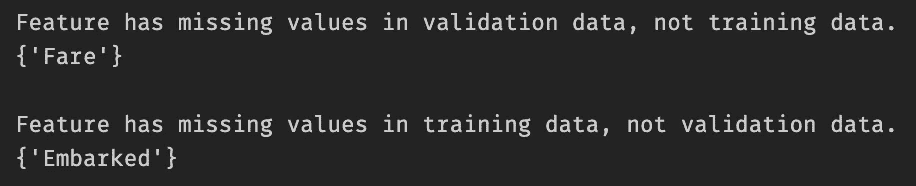

这里的关键观察是“Fare”完全填充在训练数据中，而不是验证数据中。我们需要确保我们的管道知道如何根据训练数据估算这些缺失值，尽管事实上训练数据在该特征中没有缺失任何值。

## `GroupbyImputer`

mlmachine 包括一个名为`**GroupbyImputer()**`的转换器，它可以轻松执行 Scikit-learn 的`**SimpleImputer()**`提供的相同基本插补技术，但增加了根据数据集中的另一个特征进行分组的能力。让我们看一个例子:

在上面的代码片段中，我们指的是由“SibSp”分组的 input“Age”。我们将“Age”传递给`**null_column**`参数以指示哪一列包含空值，并将“SibSp”传递给`**groupby_column**`参数。`**strategy**`参数接收与 Scikit-learn 的`**SimpleImputer()**`相同的指令-“均值”、“中值”和“最频繁”。

为了检查学习到的值，我们可以显示对象的`**train_value**`属性，这是一个包含类别/值对的`**DataFrame**`:

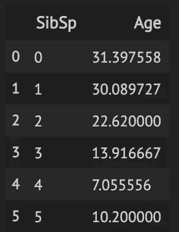

`**GroupbyImputer()**`使用这些对来估算“年龄”中缺失的值。在不太可能的情况下，如果`**groupby_column**`中的某个级别在`**null_column**`中只有空值，那么与该级别相关的缺失值将被估算为整个特征的平均值、中值或众数。

## 归罪

现在我们将在`**PandasFeatureUnion()**`中使用`**GroupbyImputer()**`来估算训练和验证数据集中的空值。

此时，我们已经估算了所有的空值。这里是输出，仍然在一个`**DataFrame**`:

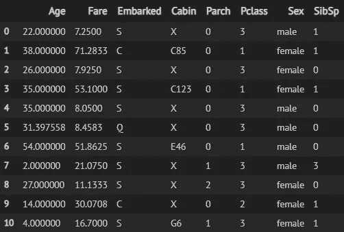

`**GroupbyImputer()**`在这个`**PandasFeatureUnion()**`操作中出现了两次。在第 4 行，我们通过特征“SibSp”分组来估算平均“年龄”值，在第 8 行，我们通过特征“Pclass”分组来估算平均“票价”值。

“上船”和“船舱”的估算以简单的方式完成——“上船”简单地用模式估算，“船舱”用常数值“X”估算。

最后，我们在`**mlmachine_titanic_train.data**`上`**fit_transform()**`了`**PandasFeatureUnion()**`，并通过在`**mlmachine_titanic_valid.data**`上调用`**transform()**`来完成填充我们的空值。

# KFold 编码——无泄漏的奇异编码

基于目标值的编码技术，如均值编码、CatBoost 编码和证据权重编码，经常在 Kaggle 竞赛中讨论。这些技术的主要优点是它们使用目标变量来通知编码特性的值。然而，这也带来了将目标信息泄露到编码值中的风险。

KFold 交叉验证有助于避免这个问题。关键是将编码值仅应用于折叠外观察值。这种可视化说明了一般模式:

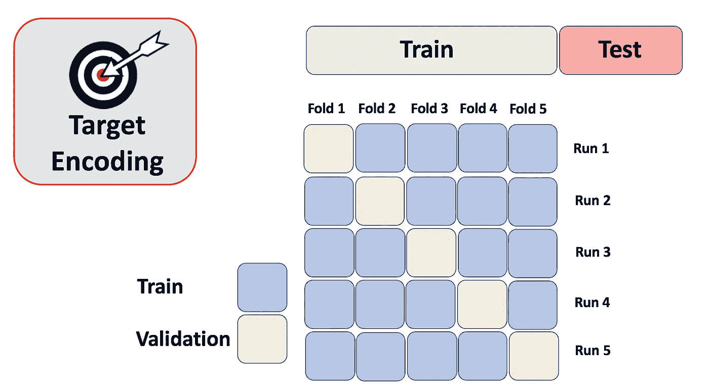

由 [Pourya](https://medium.com/@pouryaayria) 在[介质](https://medium.com/@pouryaayria/k-fold-target-encoding-dfe9a594874b)上拍摄的照片

*   将验证子集从训练数据集中分离出来。
*   从训练数据和相关联的目标值中学习编码值。
*   仅将学习值应用于验证观察。
*   对 K-1 剩余的折叠重复该过程。

## KFoldEncoder

mlmachine 有一个名为`**KFoldEncoder()**`的类，它通过选择一个编码器来促进 KFold 编码。让我们使用一小部分功能来看看这是如何工作的。

我们希望对两个特征进行目标编码:“Pclass”和“Age”。由于“年龄”是一个连续的特征，我们首先需要将值映射到 bin，这实际上是一个有序的分类列。我们在下面简单的`PandasFeatureUnion`中处理所有这些:

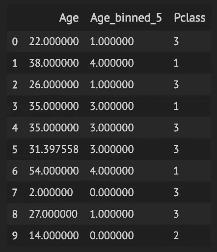

该操作返回“Age”的装箱版本，以及原始的“Age”和“Pclass”特性。

接下来，我们使用包 category_encoders 提供的均值编码、CatBoost 编码和证据权重编码对“Pclass”和“Age_binned_5”进行目标编码。

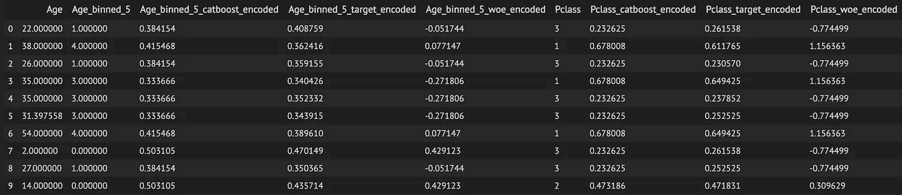

让我们回顾一下关键的`**KFoldEncoder()**`参数:

*   `**target**`:我们`**mlmachine_titanic_train**`对象的目标属性
*   `**cv**`:交叉验证对象
*   `**encoder**`:目标编码器类

`**KFoldEncoder()**`学习训练数据上的编码值，并将这些值应用于失调观测值。

对于验证数据，过程更简单:我们计算应用于训练数据的平均出格编码，并将这些值应用于所有验证观察。

# Box、Cox、Yeo & Johnson——我们的偏斜校正器

## 评价

正如我们有一个快速评估缺失的方法一样，我们也有一个快速评估偏斜的方法。

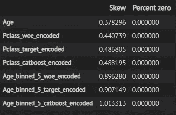

`**skew_summary()**`方法返回一个`**DataFrame**`，它总结了每个特性的偏斜，以及一个“Percent zero”列，它告诉我们特性中为零的值的百分比。

## 菱形校正

mlmachine 包含一个名为`**DualTransformer()**`的类，默认情况下，它将 Yeo-Johnson 和 Box-Cox 变换应用于指定的特征，目的是纠正倾斜。Box-Cox 变换自动寻找使对数似然函数最大化的λ值。

由于 Box-Cox 变换要求特征中的所有值都大于零，当违反此规则时，`**DualTransformer()**`应用两个简单特征调整中的一个:

*   如果要素中的最小值为零，则该要素中的每个值在变换前都会增加 1。
*   如果最小值小于零，则每个特征值将增加该特征中最小值的绝对值，再加上变换前的 1。

让我们使用`**DualTransformer()**`来看看我们是否可以最小化原始“年龄”特征中的偏差:

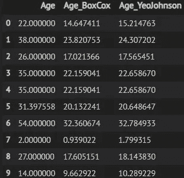

`**DualTransformer()**`增加了“Age_BoxCox”和“Age_YeoJohnson”功能。让我们再次执行`**skew_summary()**`,看看`**DualTransformer()**`是否解决了我们原始特性中的倾斜:

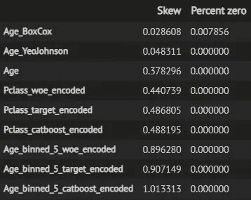

“Age_BoxCox”和“Age_YeoJohnson”的偏斜度分别为 0.0286 和 0.0483。

# 最后

我们刚刚学习了如何使用 mlmachine 来执行新颖的插补技术、奇异的分类特征编码和有效的偏斜校正。

查看 [GitHub 库](https://github.com/petersontylerd/mlmachine)，并继续关注其他专栏条目。