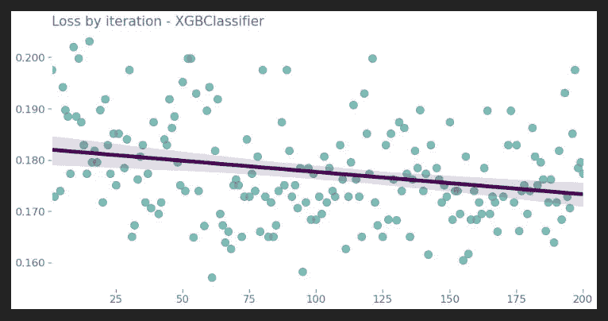
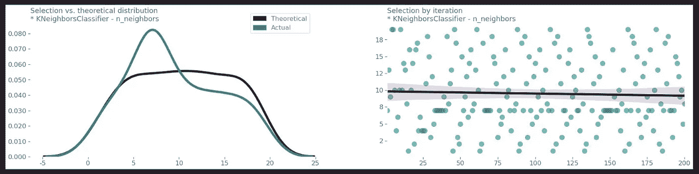

# 基于贝叶斯优化的多机超参数整定

> 原文：<https://towardsdatascience.com/mlmachine-hyperparameter-tuning-with-bayesian-optimization-2de81472e6d?source=collection_archive---------32----------------------->

图片来自 [Pixabay](https://pixabay.com/?utm_source=link-attribution&amp;utm_medium=referral&amp;utm_campaign=image&amp;utm_content=4197733) 的[托尔斯滕·弗伦泽尔](https://pixabay.com/users/ThorstenF-7677369/?utm_source=link-attribution&amp;utm_medium=referral&amp;utm_campaign=image&amp;utm_content=4197733)

## 多层机器

## 这个新的 Python 包加速了基于笔记本的机器学习实验

## TL；速度三角形定位法(dead reckoning)

mlmachine 是一个 Python 库，用于组织和加速基于笔记本的机器学习实验。

在本文中，我们使用 mlmachine 来完成原本需要大量编码和工作的操作，包括:

*   一次多估值器的贝叶斯优化
*   结果分析
*   模型再现

查看这篇文章的 [Jupyter 笔记本](https://github.com/petersontylerd/mlmachine/blob/master/notebooks/mlmachine_part_4.ipynb)。

在 GitHub 上查看[项目](https://github.com/petersontylerd/mlmachine)。

并查看过去的 mlmachine 文章:

 [## mlmachine -干净的 ML 实验，优雅的 EDA 和 Pandas 管道

### 这个新的 Python 包加速了基于笔记本的机器学习实验

towardsdatascience.com](/mlmachine-clean-ml-experiments-elegant-eda-pandas-pipelines-daba951dde0a)  [## ml machine-group by inputr、KFoldEncoder 和倾斜校正

### 这个新的 Python 包加速了基于笔记本的机器学习实验

towardsdatascience.com](/mlmachine-groupbyimputer-kfoldencoder-and-skew-correction-357f202d2212)  [## mlmachine -众包特征选择

### 这个新的 Python 包加速了基于笔记本的机器学习实验

towardsdatascience.com](/mlmachine-crowd-sourced-feature-selection-50cd2bbda1b7) 

# **一次多估值器的贝叶斯优化**

贝叶斯优化通常被描述为超越穷举网格搜索的进步，这是正确的。这种超参数调整策略通过使用先验信息来通知给定估计器的未来参数选择而成功。查看 [Will Koehrsen 关于 Medium](/an-introductory-example-of-bayesian-optimization-in-python-with-hyperopt-aae40fff4ff0) 的文章，获得关于该包的精彩概述。

mlmachine 使用 hyperopt 作为执行贝叶斯优化的基础，并通过简化的工作流将 hyperopt 的功能性向前推进了一步，该工作流允许在单个流程执行中优化多个模型。在本文中，我们将优化四个分类器:

*   `**LogisticRegression()**`
*   `**XGBClassifier()**`
*   `**RandomForestClassifier()**`
*   `**KNeighborsClassifier()**`

## 准备数据

首先，我们应用数据预处理技术来清理数据。我们将首先创建两个`**Machine()**`对象——一个用于训练数据，另一个用于验证数据:

现在，我们通过输入空值和应用各种宁滨、特征工程和编码技术来处理数据:

这里是输出，还在一个`**DataFrame**`:

## 功能重要性摘要

作为第二个准备步骤，我们希望为每个分类器执行特征选择:

## **穷举迭代特征选择**

对于我们最后的准备步骤，我们使用这个特征选择概要对每个估计量的越来越小的特征子集进行迭代交叉验证:

从这个结果中，我们提取每个估计量的最佳特征集的字典:

关键字是估计器名称，相关值是包含每个估计器的最佳性能特征子集的列名的列表。以下是`**XGBClassifier()**`的键/值对，它仅使用了 43 个可用特征中的 10 个来实现验证数据集上的最佳平均交叉验证准确性:

有了经过处理的数据集和最佳特征子集，是时候使用贝叶斯优化来调整 4 个估计器的超参数了。

## 概述我们的特征空间

首先，我们需要为每个估计量的每个参数建立我们的特征空间:

字典最外层的键是分类器的名称，用字符串表示。关联的值也是字典，其中键是参数名，表示为字符串，值是从中选择参数值的超点采样分布。

## 运行贝叶斯优化作业

现在，我们准备运行我们的贝叶斯优化超参数调优工作。我们将使用一个属于我们的`**Machine()**`对象`**exec_bayes_optim_search()**`的内置方法。让我们看看 mlmachine 的运行情况:

让我们回顾一下参数:

*   `**estimator_parameter_space**`:我们上面设置的基于字典的特征空间。
*   `**data**`:我们的观察。
*   `**target**`:我们的目标数据。
*   `**columns**`:可选参数，允许我们对输入数据集特征进行子集划分。接受功能名称列表，该列表将同等地应用于所有估算器。还接受一个字典，其中键表示估计器类名，值是与相关估计器一起使用的功能名称列表。在这个例子中，我们通过传入由上面的`**FeatureSelector()**`工作流中的`**cross_val_feature_dict()**`返回的字典来使用后者。
*   `**scoring**`:待评估的评分标准。
*   `**n_folds**`:交叉验证程序中使用的折叠数。
*   `**iters**`:运行超参数调整过程的总迭代次数。在这个例子中，我们运行了 200 次实验。
*   `**show_progressbar**`:控制进程中进度条是否显示和主动更新。

任何熟悉远视的人都会想知道目标函数在哪里。mlmachine 抽象掉了这种复杂性。

过程运行时间取决于几个属性，包括硬件、使用的估计器的数量和类型、折叠次数、特征选择和采样迭代次数。运行时可能会很长。因此，`**exec_bayes_optim_search()**`自动将每次迭代的结果保存到一个 CSV 文件中。

# 结果分析

## **结果汇总**

让我们从加载和检查结果开始:

我们的贝叶斯优化日志保存了每次迭代的关键信息:

*   迭代次数、估计量和评分标准
*   交叉验证汇总统计数据
*   迭代训练时间
*   使用的参数字典

该日志为我们分析和评估贝叶斯优化过程的有效性提供了大量数据。

## **模型优化评估**

首先也是最重要的，我们想看看性能在迭代过程中是如何提高的。

让我们通过迭代来可视化`**XGBClassifier()**`损失:

每个点代表我们 200 个实验之一的表现。需要注意的关键细节是，最佳拟合线有一个明显的向下斜率——这正是我们想要的。这意味着，与之前的迭代相比，每次迭代的模型性能都会有所提高。

## **参数选择评估**

贝叶斯优化最酷的部分之一是看到参数选择是如何优化的。

对于每个模型和每个模型的参数，我们可以生成两个面板的视觉效果。

对于数字参数，如`**n_estimators**`或`**learning_rate**`，双视觉面板包括:

*   参数选择 KDE，过度强调理论分布 KDE
*   通过迭代散点图和最佳拟合线进行参数选择

对于分类参数，如损失函数，双视觉面板包括:

*   参数选择和理论分布条形图
*   通过迭代散点图选择参数，按参数类别分面

让我们回顾一下`**KNeighborsClassifier()**`的参数选择面板:

内置方法`**model_param_plot()**`循环遍历估计器的参数，并根据每个参数的类型显示适当的面板。让我们分别看一下数值参数和分类参数。

首先，我们将查看数字参数`**n_neighbors**`的面板:

在左侧，我们可以看到两个重叠的核密度图，总结了实际参数选择和理论参数分布。紫色线对应于理论分布，正如所料，这条曲线是平滑和均匀分布的。蓝绿色线对应于实际的参数选择，很明显，hyperopt 更喜欢 5 到 10 之间的值。

在右侧，散点图显示了迭代过程中的`**n_neighbors**`值选择。随着贝叶斯优化过程在 7 左右的值上磨砺，最佳拟合线稍微向下倾斜。

接下来，我们将查看分类参数`**algorithm**`的面板:

在左侧，我们看到一个条形图，显示了参数选择的计数，按实际参数选择和理论分布选择分面。代表理论分布选择的紫色条比代表实际选择的蓝绿色条更均匀。

在右侧，散点图再次显示了迭代过程中的`**algorithm**`值选择。在迭代过程中，“ball_tree”和“auto”的选择明显减少，而“kd_tree”和“brute”更受青睐。

# 模型再现

## 顶级模型识别

我们的`**Machine()**`对象有一个名为`**top_bayes_optim_models()**`的内置方法，它根据我们的贝叶斯优化日志中的结果为每种估计器类型确定最佳模型。

使用这种方法，我们可以根据平均交叉验证分数来确定每个估计量的前 N 个模型。在这个实验中，`**top_bayes_optim_models()**`返回下面的字典，它告诉我们`**LogisticRegression()**`在第 30 次迭代中确定了它的顶级模型，`**XGBClassifier()**`在第 61 次迭代中，`**RandomForestClassifier()**`在第 46 次迭代中，`**KNeighborsClassifier()**`在第 109 次迭代中。

## 将模型投入使用

为了重新实例化一个模型，我们利用了我们的`**Machine()**`对象的内置方法`**BayesOptimClassifierBuilder()**`。为了使用这个方法，我们传递我们的结果日志，指定一个估计类和迭代次数。这将使用存储在日志记录中的参数实例化一个模型对象:

这里我们看到了模型参数:

用`**BayesOptimClassifierBuilder()**`实例化的模型使用`**.fit()**`和`**.predict()**`的方式应该感觉很熟悉。

让我们以一个非常基本的模型性能评估来结束本文。我们将在训练数据和标签上拟合此`**RandomForestClassifier()**`，使用训练数据生成预测，并通过将这些预测与实际情况进行比较来评估模型的性能:

任何熟悉 Scikit-learn 的人都应该有宾至如归的感觉。

# 最后

mlmachine 使得一次有效地优化多个估计器的超参数变得容易，并且便于模型改进和参数选择的可视化检查。

查看 [GitHub 库](https://github.com/petersontylerd/mlmachine)，并关注其他专栏条目。