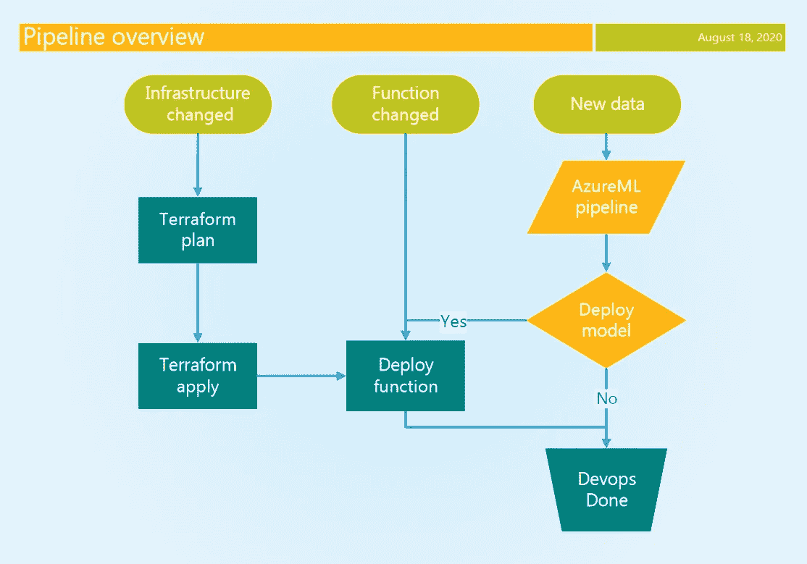
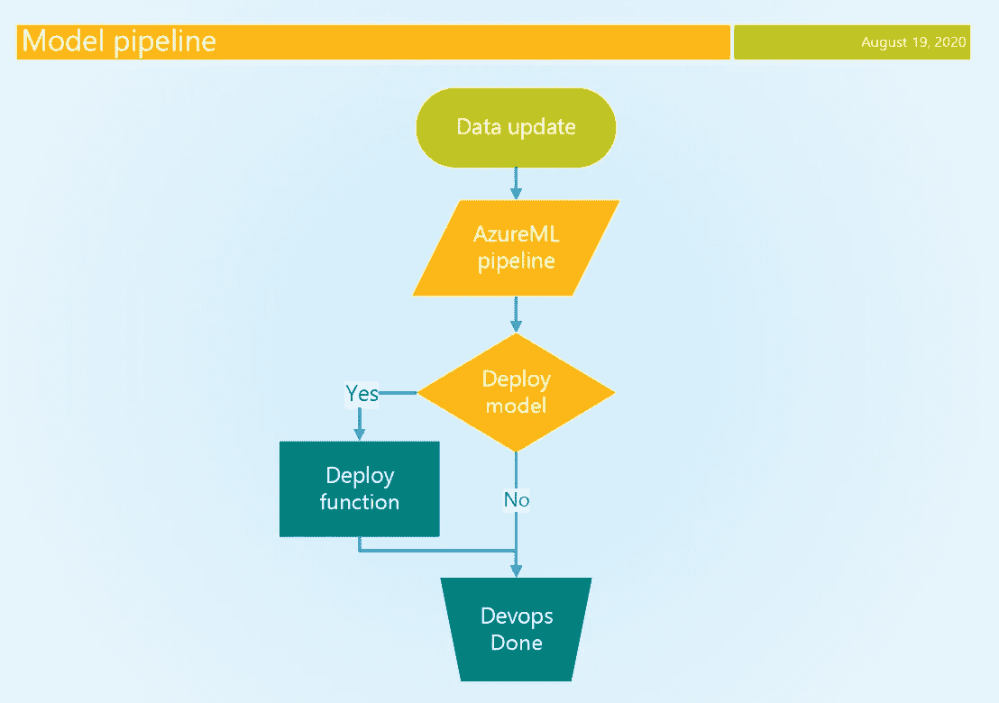

# MLOps:两条蓝色管道的故事

> 原文：<https://towardsdatascience.com/mlops-a-tale-of-two-azure-pipelines-4135b954997?source=collection_archive---------42----------------------->

## Azure 上的连续 AI

卢克·范·德·维尔登

# 目标

MLOps 寻求通过持续集成、持续培训和持续交付机器学习系统来提供新鲜可靠的人工智能产品。当新数据变得可用时，我们更新 AI 模型，并使用 DevOps 实践部署它(如果改进的话)。 [Azure DevOps pipelines](https://docs.microsoft.com/en-us/azure/devops/pipelines/get-started/what-is-azure-pipelines?view=azure-devops) 支持此类实践，是我们的首选平台。然而，人工智能或机器学习专注于 [AzureML](https://azure.microsoft.com/en-us/services/machine-learning/) ，它有自己的管道和工件系统。我们的目标是在一个端到端的解决方案中结合 DevOps 和 AzureML 管道。我们希望不断训练模型，并有条件地将它们部署在我们的基础设施和应用程序上。更具体地说，我们的目标是持续更新 Azure 函数中运行的 PyTorch 模型。


图片来自 [**Pexels**](https://www.pexels.com/photo/silver-pipes-2310904/?utm_content=attributionCopyText&utm_medium=referral&utm_source=pexels)

# 解决方案概述

下图显示了我们的目标解决方案。顶部显示了三个触发器。对基础设施代码的更改会触发 [Terraform](https://www.terraform.io/) 基础设施管道。对函数的 Python 代码的更改会触发 Azure 函数部署管道。最后，调度上的新数据触发模型训练管道，如果新模型执行得更好，则该管道用新模型进行功能的有条件部署。



DevOps 绿色和青绿色、天蓝色橙色，图片由作者提供

# 1 个 DevOps 基础设施管道

在 DevOps 管道中，我们几乎可以组织 Azure 云的任何方面。它们允许可重复和再现的基础设施和应用程序部署。一些关键特征是:

1.  支持自动化几乎所有的 Azure 服务
2.  卓越的秘密管理
3.  与 Azure DevOps 集成，用于团队协作和规划

## 1.1 管道作业、步骤和任务

DevOps 管道是用 [YAML](https://docs.microsoft.com/en-us/azure/devops/pipelines/yaml-schema) 编写的，有几个可能的组织层次:阶段、作业、步骤。阶段由多个作业组成，作业由多个步骤组成。在这里，我们将重点放在作业和步骤上。每个作业都可以包含一个执行条件，并且它的每个步骤都包含一个特定于某个框架或服务的任务。例如，部署基础设施的[地形任务](https://github.com/microsoft/azure-pipelines-extensions/tree/master/Extensions/Terraform/Src)或者管理秘密的 [Azure KeyVault 任务](https://docs.microsoft.com/en-us/azure/devops/pipelines/tasks/deploy/azure-key-vault?view=azure-devops)。大多数任务需要一个链接到我们 Azure 订阅的服务连接，才能被允许访问和更改我们的资源。在我们的例子中，我们使用 Azure CLI 任务完成的身份验证，使用正确的凭证运行 Python 脚本，以与我们的 AzureML 工作区进行交互。

## 1.2 基础设施即代码

使用 Terraform 和 Azure Resource Manager 之类的工具来管理我们的基础设施有很好的理由，我们将尽量不在这里重复。对我们来说重要的是，这些工具可以从我们的 DevOps 管道中重复启动，并且总是导致相同的结果基础设施(幂等)。因此，我们可以经常启动基础设施管道，而不仅仅是在基础设施代码发生变化时。我们使用 Terraform 来管理我们的基础设施，这需要适当的服务连接。

以下 Terraform 定义(代码 1)将使用其存储帐户和标准应用服务计划创建一个函数应用服务。我们将它包括在内，因为[记录的 Linux 示例](https://www.terraform.io/docs/providers/azurerm/r/function_app.html)对我们不适用。对于完整的无服务器优势，我们能够部署在一个消费计划(弹性)上，但是用于 Terraform 的 azurerm provider 似乎有一个干扰性的 bug，阻止我们在这里包括它。为简洁起见，我们没有包括应用 Terraform 的 DevOps 管道步骤，而是参考了相关的[文档](https://github.com/microsoft/azure-pipelines-extensions/tree/master/Extensions/Terraform/Src)。

```
# Code 1: terraform function app infrastructure
resource "azurerm_storage_account" "torch_sa" {
  name                     = "sa-function-app"
  resource_group_name      = data.azurerm_resource_group.rg.name
  location                 = data.azurerm_resource_group.rg.location
  account_tier             = "Standard"
  account_replication_type = "LRS"
}resource "azurerm_app_service_plan" "torch_asp" {
  name                      = "asp-function-app"
  location                  = data.azurerm_resource_group.rg.location
  resource_group_name       = data.azurerm_resource_group.rg.name
  kind                      = "Linux"
  reserved                  = truesku {
    tier = "Standard"
    size = "S1"
  }
}resource "azurerm_function_app" "torch" {
  name                      = "function-app"
  location                  = data.azurerm_resource_group.rg.location
  resource_group_name       = data.azurerm_resource_group.rg.name
  storage_account_name       = azurerm_storage_account.torch_sa.name
  storage_account_access_key = azurerm_storage_account.torch_sa.primary_access_key
  app_service_plan_id       = azurerm_app_service_plan.torch_asp.id
  storage_connection_string = 
  os_type                   = "linux"
  version                   = "~3"

  app_settings = {
    FUNCTIONS_EXTENSION_VERSION = "~3"
    FUNCTIONS_WORKER_RUNTIME = "python"
    FUNCTIONS_WORKER_RUNTIME_VERSION = "3.8"
    APPINSIGHTS_INSTRUMENTATIONKEY = "<app_insight_key>"
  }
  site_config {
    linux_fx_version = "PYTHON|3.8"
  }
}
```

# 2 AzureML 管道

除了 Databricks 和传统的 HDInsight 集群，AzureML 是在 Azure 上进行数据科学的方法之一。我们使用 Python SDK for AzureML 来创建和运行我们的管道。在 AMLCompute 目标上设置 AzureML 开发环境和运行训练代码我在这里解释。在那篇博客的第 2 部分中，我描述了 AzureML 环境和估计器，我们将在接下来的章节中使用它们。AzureML 管道将预处理与估算器结合起来，并允许使用 [PipelineData](https://docs.microsoft.com/en-us/python/api/azureml-pipeline-core/azureml.pipeline.core.pipelinedata?view=azure-ml-py) 对象进行数据传输。

一些好处是:

*   可复制人工智能
*   重用数据预处理步骤
*   管理步骤之间的数据依赖关系
*   注册 AI 工件:模型和数据版本

## 2.1 管道创建和步骤

我们的估算器包装了一个 PyTorch 训练脚本，并向它传递命令行参数。我们通过用 EstimatorStep 类(代码 2)包装管道来添加一个估计器。

```
# Code 2: wrap estimator in pipeline step
from azureml.core import Workspace
from azureml.pipeline.steps import EstimatorStep

from tools import get_compute
from model import train_estimator

workspace = Workspace.from_config()
model_train_step = EstimatorStep(
    name="train model",
    estimator=train_estimator,
    estimator_entry_script_arguments=[],
    compute_target=get_compute(workspace, CLUSTER_NAME),
)
```

为了创建一个 AzureML 管道，我们需要传入实验上下文和一个按顺序运行的步骤列表(代码 3)。我们当前估算器的目标是向 AzureML 工作空间注册一个更新的模型。

```
# Code 3: create and run azureml pipeline
from azureml.core import Experiment, Workspace
from azureml.pipeline.core import Pipelinedef run_pipeline():
    workspace = Workspace.from_config()
    pipeline = Pipeline(
        workspace=workspace, 
        steps=[model_train_step, model_evaluation_step]
    )
    pipeline_run = Experiment(
        workspace, EXPERIMENT_NAME).submit(pipeline)
    pipeline_run.wait_for_completion()
```

## 2.2 模型工件

PyTorch(和其他)模型可以用 Model 类序列化并注册到 AzureML 工作区。注册一个模型将它上传到集中的 blob 存储，并允许它以 Docker 容器的形式发布到 Azure Docker 实例和 Azure Kubernetes 服务。我们希望保持简单，将 AzureML 模型注册视为工件存储。我们的估计器步骤加载一个现有的 PyTorch 模型，并根据新获得的数据对其进行训练。每次管道运行时，这个更新的模型都以相同的名称注册(代码 4)。型号版本会自动递增。当我们在没有指定版本的情况下检索我们的模型时，它将获取最新的版本。在每次模型迭代中，我们决定是否要部署最新的版本。

```
# Code 4: inside an azureml pipeline step
import torch
from azureml.core import RunMODEL_PATH = "./outputs/model.p"updated_model = train_model(model, data)
torch.save(updated_model, MODEL_PATH)run_context = Run.get_context()
run_context.upload_file(model_path, model_path)run_context.register_model(
    model_name="pytorch_model",
    model_path=model_path,
    description=f"updated model: {run_context.run_id}",
)
```

# 3 结合 AzureML 和 DevOps 管道

## 3.1 DevOps 以管道为中心的架构

在我们的 MLOps /连续人工智能方法中，DevOps 渠道处于领先地位。它比 AzureML 管道有更好的秘密管理和更广泛的功能。当新数据可用时，DevOps 管道启动 AzureML 管道，并等待它完成是否部署模型的条件决策。这个决定是基于该模型与以前的最佳模型相比的性能。当使用 [cron 触发器](https://docs.microsoft.com/en-us/azure/devops/pipelines/process/scheduled-triggers?view=azure-devops&tabs=yaml)预期有新数据时，我们定期调度模型 DevOps 流水线。



DevOps 绿松石、天蓝色橙色，图片由作者提供

## 3.2 从 DevOps 启动 AzureML

Azure CLI 任务使用我们的服务连接对任务进行身份验证，该服务连接可以访问我们的 AzureML 工作区。Python 脚本使用这种访问来创建工作空间和实验上下文，以允许我们使用 AzureML SDK 运行管道。我们等待 AzureML 管道完成，超时时间可配置。DevOps 总超时时间为 2 小时。博客的最后讨论了这一点的含义。显示了一个基本的 Python 脚本(代码 5)，它从代码 3 开始启动 AzureML 管道。

```
# Code 5: calling our run function form Code 3
from aml_pipeline.pipeline import run_pipelinerun_pipeline()
```

这个脚本从 AzureCLI 任务(代码 6)启动，用于所需的身份验证。注意:我们需要一个拥有 Azure 订阅级别权限的帐户来与 AzureML 交互，即使是最基本的操作，比如下载模型，这并不理想。

```
# Code 6: launch the azureml pipeline with a devops task
- task: AzureCLI@2
  name: 'amlTrain'
  displayName: 'Run AzureML pipeline'
  inputs:
    azureSubscription: $(serviceConnection)
    scriptType: bash
    scriptLocation: inlineScript
    inlineScript: 'python run_azure_pipeline.py'
    workingDirectory: '$(System.DefaultWorkingDirectory)/aml_pipeline'
```

## 3.3 devo PS 中的条件模型部署

根据定义，用最新数据训练的更新模型不会表现得更好。我们想根据最新型号的性能来决定是否部署它。因此，我们希望传达我们将模型从 AzureML 部署到 DevOps 管道的意图。为了向 DevOps 上下文输出一个变量，我们需要向 Python 脚本的 stdout 中写入一个特定的字符串。

在我们的实现中，AzureML 管道中的每一步都可以通过创建以下本地空文件“outputs/trigger”来触发部署。“输出”目录是特殊的，Azure 自动将其内容上传到中央 blob 存储，可通过 PipelineRun 对象和 ML studio 访问。AzureML 管道完成后，我们检查 PipelineRun 中的步骤是否存在触发文件(代码 7)。基于此，输出变量作为任务输出变量写入 DevOps 上下文(代码 7)。

```
# Code 7: expanded run function with devops output variable
def run_pipeline():
    workspace = Workspace.from_config()
    pipeline = Pipeline(
        workspace=workspace, 
        steps=[model_train_step, model_evaluation_step]
    )
    pipeline_run = Experiment(
        workspace, EXPERIMENT).submit(pipeline)
    pipeline_run.wait_for_completion()

    deploy_model = False
    steps = pipeline_run.get_steps()
    for step in steps:
        if "outputs/trigger" in step.get_file_names():
            deploy_model = True
    if deploy_model:
        print("Trigger model deployment.")
        print("##vso[task.setvariable variable=deployModel;isOutput=true]yes") else:
        print("Do not trigger model deployment.")
        print("##vso[task.setvariable variable=deployModel;isOutput=true]no")
```

# 4 将模型和代码部署到 Azure 功能

## 4.1 有条件开发运维部署作业

我们已经培训了一个新模型，并希望部署它。我们需要一个 DevOps 作业来处理部署，它根据我们的 AzureML 培训管道的输出有条件地运行。我们可以访问上面描述的输出变量，并在作业的条件子句中执行等式检查。下面的代码 8 显示了在部署作业的情况下，我们如何从前面的训练作业中访问任务输出变量。

```
# Code 8: Conditional deploy job based on train job output
- job: deploy_function
  dependsOn: train
  condition: eq(dependencies.train.outputs['amlTrain.deployModel'], 'yes')
...
```

## 4.2 检索最新型号版本

为了从 AzureML Workspace 中检索最新的模型，我们使用 Azure CLI 任务来处理所需的身份验证。在其中，我们运行一个 Python 脚本，该脚本附加到我们的 AzureML 工作区，并在保存我们的函数的目录中下载最新的模型(代码 9)。当我们部署我们的函数时，这个脚本被调用来用我们的 Python 代码和需求打包我们的模型(代码 10，任务 3)。因此，每个模型版本都意味着一个功能部署。

```
# Code 9: retrieve latest model for devops deployment of function
import os
import shutilfrom azureml.core import Model, WorkspaceMODEL_NAME = "pytorch_model"workspace = Workspace.from_config()
model_path = Model.get_model_path(MODEL_NAME, _workspace=workspace)os.makedirs("./model", exist_ok=True)
shutil.copyfile(model_path, "./model/model.p")
```

## 4.3 将模型和代码部署到我们的功能应用程序

azure-functions-core-tools 支持功能应用的本地开发和部署。对于我们的部署，函数构建代理用于安装 Python 需求并将包复制到函数应用程序。有一个专门的 DevOps [任务](https://github.com/Microsoft/azure-pipelines-tasks/blob/master/Tasks/AzureFunctionAppV1/README.md)用于功能部署，你可以探索一下。目前，我们在 DevOps 构建代理(Ubuntu)上安装 azure-functions-core-tools 并使用它发布我们的功能(代码 10，步骤 5)有了更好的体验。

```
# Code 10: devops pipeline template for function deployment
parameters:
  - name: serviceConnection
    type: string
  - name: workingDirectory
    type: string
  - name: funcAppName
    type: stringsteps:
  - task: UsePythonVersion@0
    inputs:
      versionSpec: '3.8'
  - task: Bash@3
    displayName: 'Install AzureML dependencies'
    inputs:
      targetType: inline
      script: pip install azureml-sdk
  - task: AzureCLI@2
    displayName: 'package model with function'
    inputs:
      azureSubscription: ${{ parameters.serviceConnection }}
      scriptType: bash
      scriptLocation: inlineScript
      inlineScript: 'python ../scripts/package_model.py'
      workingDirectory: '${{ parameters.workingDirectory }}/torch_function'
  - task: Bash@3
    displayName: 'Install azure functions tools'
    inputs:
      targetType: inline
      script: sudo apt-get update && sudo apt-get install azure-functions-core-tools-3
  - task: AzureCLI@2
    displayName: 'publish and build the function'
    inputs:
      azureSubscription: ${{ parameters.serviceConnection }}
      scriptType: bash
      scriptLocation: inlineScript
      workingDirectory: '${{ parameters.workingDirectory }}/torch_function'
      inlineScript: func azure functionapp publish ${{ parameters.funcAppName }} --python
```

# 讨论

在这篇博客中，我们展示了一个管道架构，它支持 Azure 上的连续人工智能，只需要最少的移动部件。我们遇到的其他解决方案添加了 Kubernetes 或 Docker 实例来发布 AzureML 模型，供面向前端的功能使用。这是一个选项，但是它可能会增加您团队的工程负荷。我们确实认为添加数据块可以通过协作笔记本和更多的交互式模型培训来丰富我们的工作流程，尤其是在项目的探索阶段。AzureML-MLFlow API 允许您从 Databricks 笔记本中注册模型，并在那时挂钩到我们的工作流。

## 全模型训练

我们的重点是增量更新的模型训练，训练时间以小时或更少来衡量。当我们考虑以天为单位的完整模型训练时，流水线架构可以扩展到支持非阻塞处理。如上所述，数据砖块可以是 GPU 上的平台全模型训练。另一个选择是使用 Azure Datafactory 运行 AzureML 管道[，这适合于长时间运行的数据密集型作业的编排。如果经过训练的模型被认为是可行的，则可以触发后续的 DevOps 管道来部署它。一个低技术含量的触发选项(具有有限的身份验证选项)是与每个 DevOps 管道相关联的](https://docs.microsoft.com/en-us/azure/data-factory/transform-data-machine-learning-service) [http 端点](https://docs.microsoft.com/en-us/rest/api/azure/devops/pipelines/runs/run%20pipeline?view=azure-devops-rest-6.0)。

## 用例

人工智能不是我们方法的唯一用例，但它是一个重要的用例。相关的用例是在 streamlit 上运行的交互式报表应用程序，它可以包含必须更新的知识表示。机器学习模型、交互式报告和来自数据湖的事实协同工作，以通知管理层或客户并导致采取行动。感谢您的阅读。

*原载于*[*https://codebeez . nl*](https://codebeez.nl/blogs/mlops-tale-two-azure-pipelines/)*。*