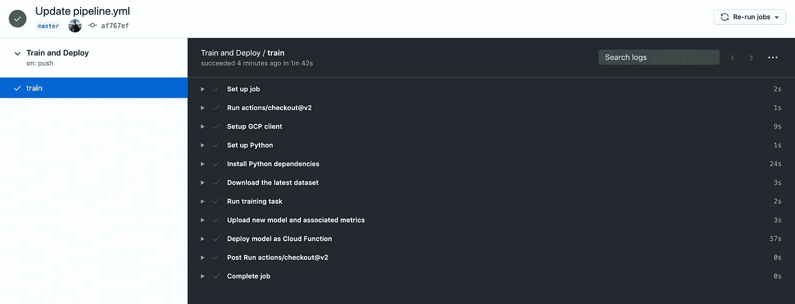

# MLOps:建立持续的培训和交付渠道

> 原文：<https://towardsdatascience.com/mlops-building-continuous-training-and-delivery-pipelines-6d03fc86cf0e?source=collection_archive---------48----------------------->


JJ·英在 Unsplash 上的照片

# 你会学到什么

这篇文章旨在帮助你开始构建健壮的、自动化的 ML 管道(在预算范围内！)用于自动重新训练、跟踪和重新部署您的模型。它包括:

*   MLOps 运动的起源和目标概述；
*   介绍几个关键的 MLOps 概念:
*   使用 GitHub 操作和 Google Cloud 功能设置持续培训/持续交付(CT/CD) ML 管道的教程。

教程部分旨在利用免费(或几乎免费的 T2)服务，所以跟随它最多花你几便士。如果您正在开发一个 MVP，并且需要一些 ML 基础设施，但是想要避免 AWS SageMaker 或 Azure ML 部署的价格和技术开销，您可能会发现这个例子也很有用。最后，如果你有兴趣了解教程是如何组合起来为你自己端到端地运行它的，你应该[看看本系列中关于将轻量级 ML 模型部署为无服务器函数的前一篇文章](https://mark.douthwaite.io/serverless-machine-learning/)。

和往常一样，对于那些想要深入了解代码的人来说，请查看这里的 GitHub 工作流文件(`.github/workflows/pipeline.yml`):

[](https://github.com/markdouthwaite/serverless-scikit-learn-demo) [## markdouthwaite/无服务器-scikit-learn-demo

### 一个提供演示代码的存储库，用于部署基于轻量级 Scikit-Learn 的 ML 管道心脏病建模…

github.com](https://github.com/markdouthwaite/serverless-scikit-learn-demo) 

如果你知道什么是 ML Ops，只是想按照教程，请随意跳过。

# 什么是 MLOps？

在过去十年左右的时间里，通常被称为“DevOps”的运动已经在软件工程领域获得了大量的专业追随者，大量专门的 DevOps 角色在世界各地的开发团队中涌现出来。这一运动的动机是将软件开发(Dev)的各个方面与操作(Ops)软件活动的元素相结合，目的是在持续的基础上加速可靠的、工作的软件的交付。

DevOps 运动支持者的一个主要关注点是建立和维护持续集成和持续交付(CI/CD)管道。在实践中，设计良好且实施干净的 CI/CD 管道为团队提供了持续修改其软件系统的能力，以(原则上)显著减少新软件补丁和功能的价值实现时间，同时最小化与发布这些补丁和功能相关的错误和中断带来的负面风险。运行这种交付机制的成熟实现的团队通常每小时发布一次更新(或者更快！)能够在变更引入 bug 时快速、干净地回滚变更(尽管大多数这些*应该在管道中的某个地方被捕获)。*

相比之下，发布软件的“传统”方法本质上是为预定义的发布窗口(可能是每周、每月或每季度)储备补丁和特性。虽然这种方法并不是*一致认为*一个糟糕的方法，但它确实在发布窗口周围引入了很多压力，会在产品集成和发布过程周围产生很多复杂性，并最终增加了严重服务中断的风险，进而损害品牌。

# 这和机器学习有什么关系？

在这一点上，你很可能会想‘这一切都很好，但这与机器学习有什么关系？’。就像成功的商业软件产品一样，成功的商业机器学习(ML)项目*需要*ML 服务的用户信任他们消费的服务的*有效性*和*稳定性*。重要的是，*这必须持续进行*——可能一次持续数年。

因此，*临时*模型培训和评估活动需要大量人工干预，类似于数据科学团队的“传统”软件交付流程——这在数据科学领域是司空见惯的——可能会给服务的生命周期带来严重的技术和业务风险，应被视为特别有害的技术债务形式。

> *与成功的商业软件产品非常相似，成功的商业机器学习(ML)项目要求 ML 服务的用户信任他们所消费的服务的*有效性*和*稳定性*。*

这就是 MLOps 的用武之地。这个新生的运动可以被视为 DevOps 运动的超集:它的目标是在持续的基础上加速可靠的、工作的 *ML* 软件的交付。因此，它以与 DevOps 非常相似的方式关注 CI/CD 管道，但也增加了这些 CI/CD 问题的特定变化。[最值得注意的是，持续培训(CT)的概念被加入到组合中。](https://cloud.google.com/solutions/machine-learning/mlops-continuous-delivery-and-automation-pipelines-in-machine-learning#mlops_level_1_ml_pipeline_automation)你问 CT 是什么？

这里的目标是允许 ML 从业者快速自信地将他们最新最好的模型部署到生产中，同时保持依赖它们的服务的稳定性。

# 入门指南

ML 世界越来越认识到需要有能力*自主*开发和部署“生产级”ML 解决方案的团队——特别是在以产品为中心的 ML 应用中——以及由此产生的拥有组织孤立的 ML/技术能力的潜在技术(和商业)风险。在许多方面，这与更广泛的软件工程社区认识到“传统”软件应用程序的类似需求(和风险)的知识是一致的。

> 与之前更广泛的软件工程生态系统一样，ML 工具链正在商品化:进入门槛(成本、专业知识)正在逐渐降低，市场竞争越来越激烈。

这种认识导致了一个围绕上述许多问题的新兴生态系统。每个月都有新的工具和平台推出，明确针对 ML/MLOps 挑战。正如之前更广泛的软件工程生态系统一样，ML 工具链正在商品化:进入壁垒(成本、专业知识)正在逐渐降低，市场竞争越来越激烈。对于那些希望开始使用 MLOps(或一般意义上的 ML)的人来说，这是一个非常令人兴奋的参与时机:你可以花很少的成本走很长一段路来拥有“生产就绪”的 ML 管道。以下是方法。

# 创建 ML 管道

好了，该上教程了！

这里展示的 ML 管道是使用 GitHub 的工作流自动化工具 [GitHub Actions](https://github.com/features/actions) 构建的。如果你注册了 GitHub 账户，你就可以免费使用这个功能*。有[使用](https://docs.github.com/en/actions/getting-started-with-github-actions/about-github-actions)和[资源](https://docs.github.com/en/actions/reference/virtual-environments-for-github-hosted-runners)限制(如你所料)，但是作为一个免费软件，这些限制出奇的慷慨。如果你能保持你的模型相对轻量级，你可以单独在免费提供的基础上构建一个小产品，所以对于那些有一些很酷的 MVP 想法的人来说，这可能是一个很好的起点。另外，如果免费资源不能满足你的需求，[你也可以创建“自主”行动](https://github.blog/2020-08-04-github-actions-self-hosted-runners-on-google-cloud/)。*

*那么这里给出的管道示例将会做什么呢？该管道将是一个基本的 CT/CD 管道，构建在[上，即上一篇文章](https://mark.douthwaite.io/serverless-machine-learning/)中讨论的无服务器 ML 示例之上。如果你还没有读过，值得一读:*

*[](/serverless-ml-deploying-lightweight-models-at-scale-886443d88426) [## 无服务器 ML:大规模部署轻量级模型

### 将 ML 模型作为可伸缩的 API“部署到生产中”可能会很棘手。这篇文章着眼于一个选择，使模型…

走向科学，来吧](/serverless-ml-deploying-lightweight-models-at-scale-886443d88426) 

具体而言，管道将:

1.  设置您的环境并安装依赖项。
2.  下载数据集的最新可用版本。
3.  在最新数据集上训练和评估模型的新版本。
4.  上传新模型和评估结果。
5.  如果前面的步骤成功，那么触发新模型作为 API 的重新部署。

此外，您将看到如何*安排*这个工作流作为`cron`作业定期运行(再次使用 GitHub 操作)。

# 开始之前

如果您想运行管道(和代码示例)，您需要注册一个 Google Cloud 帐户。在撰写本文时，您的帐户中将增加 300 美元的信用点数。这将比在本教程中运行代码的成本更多(无论如何，这基本上是免费的！).您可以在此找到更多信息:

[](https://cloud.google.com/free) [## GCP 免费等级免费扩展试用和永远免费|谷歌云

### 20 多种免费产品免费体验热门产品，包括计算引擎和云存储，最高可达…

cloud.google.com](https://cloud.google.com/free) 

接下来，你应该[创建一个库](https://docs.github.com/en/github/getting-started-with-github/fork-a-repo)的 [到你的个人 GitHub 账户。完成这些后，您需要设置几个 GitHub 秘密来允许您的管道访问您的 Google 云服务。你可以在 GitHub 文档](https://github.com/markdouthwaite/serverless-scikit-learn-demo)中找到如何[设置秘密。具体来说，您需要添加:](https://docs.github.com/en/free-pro-team@latest/rest/reference/actions#secrets)

*   `GCP_PROJECT_ID` -唯一的谷歌云项目 ID。你可以在谷歌云控制台找到你的项目 ID。如果您不确定，Google [提供了一个找到这个值](https://cloud.google.com/resource-manager/docs/creating-managing-projects#identifying_projects)的文档。
*   `GCP_SA_KEY` -服务账户(SA)密钥。这是一个安全密钥，用于访问项目中的特定云服务。在本例中，为了简单起见，您将使用一个具有提升权限的默认 SA。在实践中，[您应该考虑创建一个特权减少的服务协议](https://cloud.google.com/iam/docs/granting-changing-revoking-access)。*您需要为您的 SA 创建一个新密钥，并将其作为一个秘密复制到 GitHub。*同样， [Google 有一个关于如何生成这个密钥的详细文档](https://cloud.google.com/iam/docs/creating-managing-service-account-keys)。

**注意**:和机密/安全信息一样，不要和任何人分享你的 SA 密钥！理想情况下，当您完成这个示例时，删除它(当然，除非您想在自己的项目中继续使用它)。

设置好之后，你需要启用你的谷歌云构建、云功能和云存储 API。要做到这一点，只需浏览谷歌云控制台左侧的导航栏，并选择相关的云服务。如果相关的 API 没有被激活，当你点击服务的时候，你可以选择激活它。

最后，在下面的管道定义中，您需要在您的 Google 云存储中定义一个唯一的*bucket 名称。示例管道定义(如下)中使用的名称是`pipeline-example`。您应该在分叉之后，但在*尝试运行示例之前，用您自己的 bucket 的名称替换它。此外，您会想要将存储库中的`datasets/default.csv`数据集上传到`{your-bucket-name}/heart-disease/dataset.csv`。

现在，不管是好是坏，是时候来点 YAML 了——云的语言。

# 管道定义

[管道被定义为 YAML 文件](https://github.com/markdouthwaite/serverless-scikit-learn-demo/blob/master/.github/workflows/pipeline.yml)。如果你想看得更透彻，你也应该看看 GitHub 的[工作流文件格式介绍](https://docs.github.com/en/actions/configuring-and-managing-workflows/configuring-a-workflow)。如果你喜欢 YAML，这可能很容易做到，但不管怎样，下面是它的分解方式:

# 0.作业设置和调度

文件的这一部分将工作流命名为`Train and Deploy`(这将是 GitHub 在 GitHub UI 中显示您的工作流的方式)，然后提供将触发您的管道运行的*事件触发器*。在这种情况下，您会看到有两个触发器:`push`和`schedule`。

在`push`的情况下，管道将在每次更新您的存储库的`master`分支时运行(具体的分支可以在`branches`字段中列出)。实际上，这意味着每次您将存储库中的代码变更合并到`master`中时，管道将重新训练模型并重新部署它。这对于将代码变更立即传播到活动的 ML 服务是非常有用的。

对于`schedule`触发器，您只需为您的管道设置一个`cron`运行时间表。换句话说:管道运行的固定时间表。下面提供的示例值将在每个工作日早上 08:00 运行管道。如果你不确定如何配置一个`cron`时间表，这里有[一个很棒的交互式编辑器](https://crontab.guru/)供你使用。

```
name: Train and Deploy

on:
  push:
    branches:
      - master
  schedule:
    - cron:  '0 8 * * MON-FRI'
```

随意摆弄[其他触发器](https://docs.github.com/en/actions/reference/events-that-trigger-workflows)。此外，你也可以编写自定义触发器，[如果你觉得有趣的话](https://docs.github.com/en/actions/reference/events-that-trigger-workflows#workflow_dispatch)。这些自定义触发器可以帮助您建立一个“真正的”事件驱动架构。只是一个想法。

# 1.环境设置

现在是无聊但非常重要的一步。键`train`定义了步骤的名称。在这里你有一个单一的工作。在这里，您必须定义将要运行作业的虚拟机(`runs-on`)。在这个例子中，我们使用了`ubuntu-latest`。接下来，定义作业中的每个`steps`。

第一，`actions/checkout@v2`跑了。这将运行 GitHub 提供的`checkout`动作。这将克隆并检出您的存储库的默认(通常是`master`)分支。

接下来，作业设置`gcloud` [命令行工具](https://cloud.google.com/sdk/gcloud)。这一步使用 Google Cloud 提供的动作[让你的生活变得更简单。这允许后续步骤访问`gcloud`和`gsutils`命令行工具。稍后，您将使用这些工具从/向 Google Cloud 下载/上传数据，并重新部署您的模型 API。](https://github.com/GoogleCloudPlatform/github-actions)

在这之后，您有两个 Python 相关的步骤。第一部分设置了一个基本的 Python 3.7 环境。第二步安装顶层`requirements.txt`文件中的所有依赖项。这样，您的工作就可以正确地运行您的管道了。现在是有趣的部分。

```
train:
    runs-on: ubuntu-latest
    steps:
    - uses: actions/checkout@v2

    - name: Setup GCP client
      uses: GoogleCloudPlatform/github-actions/setup-gcloud@master
      with:
        version: '290.0.1'
        project_id: ${{ secrets.GCP_PROJECT_ID }}
        service_account_key: ${{ secrets.GCP_SA_KEY }}
        export_default_credentials: true

    - name: Set up Python
      uses: actions/setup-python@v2
      with:
        python-version: 3.7

    - name: Install Python dependencies
      run: |
        python -m pip install --upgrade pip
        pip install -r requirements.txt
```

请注意，`run`键允许您在虚拟机的 shell 中执行命令——这里是默认的 Ubuntu shell。

# 2.下载数据集

首先，作业从`pipeline-example`桶下载最新的可用数据集。在实践中，管道将在提供的路径上获得最新版本的数据集。这允许您创建一个独立于*的*数据管道来加载和转换数据集，以便 ML 管道在下次运行时拾取。

```
- name: Download the latest dataset
      run: |
        gsutil cp gs://pipeline-example/heart-disease/dataset.csv datasets/default.csv
```

你会看到该步骤使用了`gsutil`，谷歌的[云存储命令行实用程序](https://cloud.google.com/storage/docs/gsutil)。这让你可以从谷歌云复制文件。简单！

# 3.训练和评估模型

现在作业已经加载了最新的数据集，是时候运行“核心”训练任务了。在这种情况下，这与前面的无服务器 ML 教程中给出的例子相同。

```
- name: Run training task
      run: |
        python steps/train.py --path=datasets/default.csv
```

另外，`steps/train.py`脚本将以下元数据和指标写入`artifacts/metrics.json`路径。正如您将看到的，这也会上传到 Google Cloud，因此您可以查看模型性能(和训练持续时间)如何随时间变化。这可以派上用场！

```
metrics = dict(
    elapsed = end - start,
    acc = acc,
    val_acc = val_acc,
    roc_auc = roc_auc,
    timestamp = datetime.now().strftime(TIMESTAMP_FMT)
)
```

新训练的模型被写入`artifacts/pipeline.joblib`。这也将上传到谷歌云存档。

# 4.上传模型和指标

下一步是将您的新模型和指标推送到 Google 云存储。您将看到管道上传了三个文件:

*   `latest.joblib`——这款车型的‘最新’版本。这将是管道生产的最新“有效”模型。
*   `${{ env.GITHUB_RUN_ID }}.joblib` -上述模型的存档版本(由生产它的唯一 GitHub 运行 ID 标识)。
*   `metrics/${{ env.GITHUB_RUN_ID }}.json` -上述模型指标的存档版本(由产生它的唯一 GitHub 运行 ID 标识)。可以按创建日期对它们进行排序，以生成显示模型性能随时间变化的时间序列。

```
- name: Upload new model and associated metrics
      run: |
        gsutil cp artifacts/pipeline.joblib gs://pipeline-example/heart-disease/models/latest.joblib
        gsutil cp artifacts/pipeline.joblib gs://pipeline-example/heart-disease/models/${{ env.GITHUB_RUN_ID }}.joblib
        gsutil cp artifacts/metrics.json gs://pipeline-example/heart-disease/models/metrics/${{ env.GITHUB_RUN_ID }}.joblib
```

现在你有了一个新的模型，一些指标，所有这些都整齐地存档在谷歌云存储中。

# 5.重新部署云功能

最后，完成所有这些工作后，是时候重新部署您的最新模型了。

```
- name: Deploy model as Cloud Function
      run: | 
        gcloud functions deploy heart-disease --entry-point=predict_handler --runtime=python37 --project=${{ secrets.GCP_PROJECT_ID }} --allow-unauthenticated --trigger-http
```

这将触发您的模型的云功能与您的最新模型一起重新部署。如果你想了解传递给`gcloud`的参数是做什么的，请确保[查看本系列的前一篇文章](https://mark.douthwaite.io/serverless-machine-learning/)。几分钟后，你的新型号将被投入使用。

# 收尾工作

仅此而已。如果您的管道成功完成，您将能够为每个成功的步骤看到一个漂亮的绿色勾号列表。



现在，您已经有了一个自动化的管道来加载新数据、重新训练模型、归档新模型及其指标，然后按照固定的时间表重新部署您的模型 API。很酷，是吧？

# 后续步骤

这只是一个婴儿 ML 管道。你可以做很多事情让它变得更复杂。一些初步想法可能是:

*   创建一个云函数，当模型性能下降到给定值以下时，它会在上传模型指标时触发，以通知您(可能通过 Slack 或电子邮件)。
*   如果评估结果比先前的模型(或者一些测试用例)更差，添加一个步骤来中止模型重新部署。
*   添加自定义云函数触发器，以便在数据集更新时运行工作流(而不是在固定的基础上运行，这可能是不必要的)。
*   添加一个 StreamLit 控制面板，以便随时查看模型和指标。

如果你有任何问题，请随时联系我们！

# 进一步阅读

如果您有兴趣了解更多关于 MLOps 的信息，以下是一些您可能会感兴趣的链接:

*原载于*[*https://mark . douthwaite . io*](https://mark.douthwaite.io/continuous-training-and-delivery/)*。**