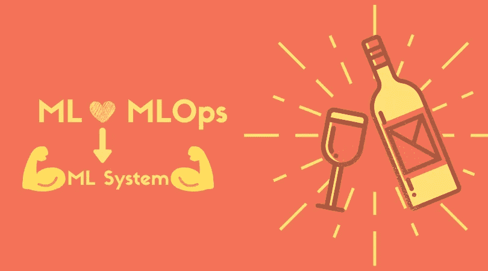

# MLOps:即将到来的闪亮之星

> 原文：<https://towardsdatascience.com/mlops-the-upcoming-shining-star-dcf9444c493?source=collection_archive---------10----------------------->

## 构建全栈机器学习系统的正确路径。MLOps 是简化 ML 生命周期管理的新兴实践。

## 为什么我不应该优先考虑建立“完美模型”呢？

> 在进一步阅读之前，我建议你先看一下这篇文章。它详细讨论了所有相关的问题。

开发 ML 应用程序时通常会遇到的主要障碍有:

## 生产机器学习模型的当前挑战

**复杂模型抽象边界**

传统的软件工程实践表明，使用封装和模块化设计的强大抽象边界有助于创建可维护的代码，在这些代码中很容易进行单独的更改和改进。但是在 ML 的情况下，执行严格的动作变得困难，因为它依赖于外部数据。

**数据依赖**

> 数据依赖比代码依赖花费更多

在数据科学家沙盒中，将数据输入培训和评估阶段完成的步骤在现实场景中可能会有很大不同。根据用例，数据随时间变化和缺乏规律性会导致 ML 模型性能不佳。

## 简单到复杂的管道

训练一个简单的模型，并将其用于推理和生成预测是获得业务洞察力的简单方法，但这是不够的。在现实世界中，需要规律性，时间模型需要根据从数据湖中提取的新数据进行重新训练。因此，将会有许多模型&由人来决定选择哪一个模型用于生产。在联邦管道中，维护变得更加困难。

**配置债**

任何大型系统都有广泛的可配置选项，包括使用哪些功能、如何选择数据、各种算法特定的学习设置、潜在的预处理或后处理、验证方法等。在一个正在积极开发的成熟系统中，配置的行数可以远远超过传统代码的行数。每个配置行都有可能出错。

**再现性债务**

我们可以重新运行实验并获得类似的结果是很重要的，但设计真实世界的系统以实现严格的可重复性是一项艰巨的任务，因为随机化算法、并行学习中固有的非确定性、对初始条件的依赖以及与外部世界的交互。

## 生产 ML 风险

如果 ML 模型在预期范围内执行，则总是存在 ML 模型不执行的风险，并且需要持续的监控和评估。实时数据指标，如准确度、精确度、召回率等。无法使用，因为实时数据没有标签。

## 流程和协作

在生产中，ML 需要多种能力来处理生产级 ML 系统，如数据科学家、数据工程师、业务分析师和运营。不同的团队将关注不同的结果。数据科学家将专注于提高准确性和检测数据偏差，业务分析师希望提高 KPI，运营团队希望看到正常运行时间和资源。与数据科学家沙箱不同，生产环境有许多对象，如模型、算法、管道等。难以处理，它们的版本控制是另一个问题，需要对象存储来存储 ML 模型，而源代码控制库不是最佳选择。

# 什么是 MLOps？

MLOps 建立了一种文化和环境，在这种文化和环境中，ML 技术可以通过优化 ML 生命周期来自动化和扩展 ML 计划以及优化生产中 ML 的商业回报，从而产生商业利益。MLOps 具有数据科学家和服务的混合能力

*MLOps 支持不同用户(如数据科学家、数据工程师、业务分析师和 ITOps)在 ML 操作上的协作，并支持 ML 操作对业务应用的影响或 ROI(投资回报)的数据驱动的持续优化。*

# 为什么是 MLOps？

从上面的内容可以很清楚地看出，在人工智能的现代时代，什么是对“MLOps”的需求，什么导致了这种混合方法的兴起。现在从“是什么”前进到“为什么”让我们来解释一下最初导致使用 MLOps 的原因。

## 多个管道的协调

*   机器学习模型的开发不是单一的代码文件任务。相反，它涉及不同管道的组合，这些管道各司其职。
*   预处理、特征工程模型训练和模型推理等主要过程的流水线。参与到机器学习模型发展的大局中。
*   MLOps 在这些多管道的简单编排中起着重要作用，以确保模型的自动更新。

## 管理 MLOps 的整个生命周期

*   机器学习模型的生命周期由不同的子部分组成，这些子部分应被单独视为一个软件实体。
*   这些子部分有自己的管理和维护需求，通常由 DevOps 处理，但使用传统的 DevOps 方法管理它们是一项挑战。
*   MLOps 是一种新出现的技术，它包括人、过程和技术的组合，为快速和安全地优化和部署机器学习模型提供了优势。

## 扩展 ML 应用

*   如题目前面所说，模型的开发不是一个需要担心的问题，真正的问题在于规模化的模型管理。
*   同时管理数以千计的模型是一项非常繁琐和具有挑战性的任务，它测试模型的大规模性能。
*   通过使用 MLOps，它可以自然地扩展管理生产中数以千计的模型管道。

## 保持 ML 健康

*   在 ML 模型部署之后保持 ML 健康是后处理中最关键的部分。这是至关重要的，以便 ML 模型可以操作和管理完美。
*   MLOps 通过自动检测不同的漂移(模型漂移、数据漂移)提供最新的 ML 健康方法。
*   它可以提供在系统中使用最新的边缘切割算法来检测这些漂移的能力，从而可以在这些漂移开始影响 ML 健康之前避免它们。

## 持续集成和部署

*   持续集成和部署是整个唯一的目的之一，这导致了在任何软件产品开发过程中使用 DevOps。
*   但是由于 ML 模型的可操作性的规模，很难使用用于其他软件产品的持续集成和部署的相同方法。
*   MLOps 可以帮助使用不同的专用工具和技术，以确保 ML 模型领域的持续集成和部署服务。

## 模型治理

*   在模型治理下，MLOps 可以通过大规模监控属性来提供丰富的模型性能数据。
*   它还能够拍摄管道快照，用于分析关键时刻。
*   此外，MLOps 下的日志记录设施和审计跟踪可用于报告和合规性的连续性。

# MLOps 和 DevOps 有什么不同？

*   数据/模型版本化！=代码版本
*   模型重用与软件重用完全不同，因为模型需要基于场景和数据进行调整。
*   当重用一个模型时，需要进行微调。把学习转移到 it 上，这就导致了一个培训管道。
*   再训练能力需要随需应变，因为模型会随时间衰减。

# 我们来谈谈全栈机器学习开发，好吗？

因为你可能已经有了要点，但是让我们谈论一些细节。

*   开发一个 ML 系统不仅仅是开发一个模型，而是更多。配置、数据收集、部署、服务等(如上面的摘要所示)。
*   因此，为了快速但安全、高度可信但通用、开发友好但生产友好，我们需要在 ML 开发中复制所有软件开发的最佳实践。
*   正如 DevOps 正在帮助软件开发进入全栈开发一样，MLOps 也将帮助 ML 开发进入全栈 ML 开发。

将 Mlops 纳入 ML 开发将始终确保对 ML 系统的信心。

我将发布一个关于构建正确的全栈式 ML 系统的新系列。我会随时通知你……:)