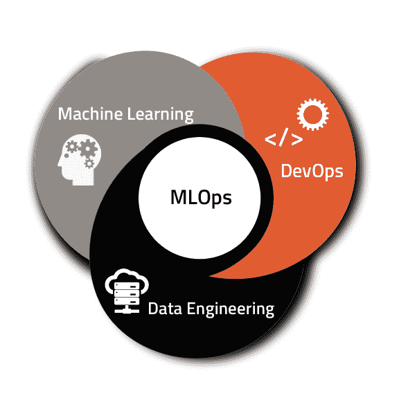
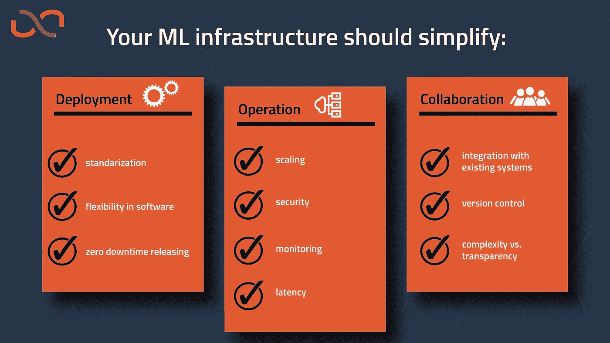

# “你应该永远攀登”MLOps 的 10 条戒律

> 原文：<https://towardsdatascience.com/mlops-thou-shalt-always-scale-10-commandments-of-mlops-152c11e711a5?source=collection_archive---------45----------------------->

## 对基础设施的十项要求，允许您以持久、轻松和灵活的方式部署 ML 应用程序。

取自 Pixabay

如果你现在从事任何类型的机器学习，并且你曾经想过将你正在研究的人工智能投入生产，那么这篇文章就是为你准备的。无论你是(首席)数据科学家、数据工程师、产品负责人还是其他任何参与机器学习的人，我都可能会读到你对下一个挑战的想法。

假设你的团队已经训练了一个惊人的模型，优化了所有的超参数，并且发布了一些令人印象深刻的预测，如果你可以这么说的话！是时候让它挣脱办公室服务器的枷锁，走出测试版，进入现实世界了。然而，有一件事让你夜不能寐:**你如何确保你的 ML-pipeline 在生产中一直平稳运行？**您是应该建立自己的服务器，还是最好将其交给外部机构？面对如此多的供应商，您如何确定哪种服务最适合您呢？你绝对需要考虑的事情是什么？

# **MLOps**

你应该考虑的事情被称为 **MLOps** :这个新兴领域完全专注于封装 ML 模型的基础设施，确保发布到生产顺利进行，没有麻烦。MLOps 也被描述为 ML、DevOps 和数据工程的交集。

机器学习+ DevOps +数据工程的横截面= MLOps。由 [UbiOps](https://ubiops.com/) 设计

虽然这个领域仍然相对较新，但还没有一个适用于所有规模的明确的“最佳实践”。然而，对于 ML 的健壮部署，有一些明显的需求是必要的。为了能够为你的 ML 设计一个架构，重要的是首先要知道它应该有什么能力，以及它在哪里可以使你的生活更容易。无论 ML 应用程序是由复杂的、多面的 ML 体系结构组成，还是由一行代码组成，对 ML 管道基础设施的要求都是一样的。

本文概述了一个流畅的 ML 基础设施的最重要的需求，换句话说:

# **MLOps 的 10 条戒律**

**1。汝应始终缩放**

这可能是或者应该是一个显而易见的问题，但是仍然是:你的架构应该允许你以一种灵活的方式控制资源。您永远不知道您的管道将来会占用多少(或几个)资源，因此基础设施应该总是适当地(自动地)扩展。这允许您的管道处理波动的数据量/请求数，并且还将防止您在将来必须调整它以更有效或更好地伸缩。此外，由于未使用的资源会自动关闭，因此无需担心为未使用的资源付费。

**2。你会安全的**

适当的 ML 基础设施的一个非常重要的特征是处理安全性的方式。一些公司甚至认为这是他们选择的关键特征，因为隐私法规变得越来越严格，而且(敏感)数据泄露在你公司的简历上看起来不太好。考虑数据的安全性(将数据上传到云，而不是数据不离开公司服务器)，当然也要考虑您宝贵的 ML intel 的安全性。

**3。你的目标是标准化**

也许 ML 基础设施最容易被忽视的一个方面是，它为您提供了标准化管道部署的机会，与“常规”软件部署没有什么不同。

在软件工程中，有一些关于如何在团队中编写代码的设计模式，一个部署迫使团队走到一起彻底测试和检查代码，从而尽早发现错误并提高整体质量。ML-deployment 不必与众不同，因为它提供了测试和基准测试新管道的机会，并且标准化部署带来了 ML 代码编写和部署的结构。ML 基础设施为您的团队提供了一个以固定方式编写代码的框架，使其在应用程序之间保持一致，这极大地提高了质量并改进了工作流程。最后，标准化部署为自动部署铺平了道路:在上传并通过测试之后，新管道将自动部署到生产中。对于总是需要根据最新数据进行(重新)训练的系统来说，这可能会很方便:为您省去每天早上 05:00 手动部署管道的麻烦。

**4。尊重您的数据集成**

基础设施应该毫不费力地与您现有的数据管道和存储集成。在大多数情况下，进出管道的数据迁移越少越好。将数据存储在正在处理的地方不仅节省了时间和金钱，还最大限度地降低了数据泄露的风险。如果这根本无法实现，基础架构应该能够轻松集成到您现有的数据工程管道中，并且应该提供足够的选项来连接到您的存储。

**5。你不应该低估监控的重要性**

正如模型/管道在训练时很重要一样，在生产过程中监控其性能对于保持结果的绿色性仍然至关重要。我不仅谈论 ML 指标，如准确性和 F1 分数，还谈论基础设施性能指标，如延迟(运行请求时基础设施增加的时间)和错误:我的所有管道都可用吗，或者有错误吗？如果处理一个请求的时间突然从 0.01 秒上升到 52 秒，这表明有问题。数据科学团队和 IT 部门应该能够对管道进行监控，因为这两个部门在维护系统健康方面都扮演着重要角色。

**6。你应该灵活选择软件和编程语言**

如果您选择接受基础设施提供商提供的服务，请确保检查他们支持什么软件。没有什么比被供应商锁定，却发现自己选择的软件包或语言不受支持更令人沮丧的了。您的代码应该决定基础结构，而不是相反。基础设施是否非常僵化，是否只允许供应商预先选择的包？或者在 Python 模型和基于 R 的模型之间切换就像点击按钮一样简单吗？

**7。您将拥有零停机发布**

在应用程序不停机的情况下部署 ML-pipelines 听起来是不是像一个梦？有了好的 MLOps 基础设施，就触手可及。如果您的基础架构允许多个相同的环境并行运行，这是可以实现的。生产管道将在生产环境中运行，同时可以对在测试环境中运行的模型进行测试和调整。然后，当截止日期到来时，部署一个新版本只需切换环境，停机时间最少甚至根本不用停机。这同样适用于管道中重新训练的模型:基础设施应该只允许您用重新训练的模型替换旧的模型，并保持其余的模型不变，而不会中断通过管道的数据流。

**8。你应该有版本控制和数据沿袭追踪**

这一点与您的管道的监控有关(戒律 5)，但是有一个区别:监控允许您查看性能是否以及何时下降，版本控制/数据沿袭跟踪允许您准确地查明是哪个模型版本或数据批次导致了性能下降。因为 ML 应用程序经常将代码、模型和数据交织在一起，所以跟踪代码+模型和数据是很重要的。此外，这将使并排比较不同版本的模型变得更加容易。

**9。考虑你的复杂性/透明度**

优秀的 MLOps 基础设施的一个指标是它是否将复杂的(云)基础设施抽象化，以便即使没有太多基础设施知识的人也可以轻松部署模型。然而，它也不应该是这样一个“黑箱”，当错误发生时，没有办法告诉什么是错的，为什么。深入了解基础设施的内部流程是调试问题的必要条件。因此，透明度和复杂性之间的适当平衡至关重要。如果您的 ML 基础设施依赖于外部服务提供商，请确保检查是否有日志记录系统，该系统可以指示内部正在发生的事情。

10。你应该有低延迟

这取决于您的使用情形，但如果实时预测是必要的，则不能有 15 秒的基础架构相关延迟。基础设施的延迟通常取决于模型/管道如何在内部存储和旋转，如何检索数据，以及如何再次返回结果。一定要检查应用程序上基础设施的额外延迟，因为不同服务之间的延迟可能会有很大差异。

由 [UbiOps](https://ubiops.com/) 制定的 MLOps 十诫

作为一名数据科学家，您可能正在阅读这篇文章，并且想知道:“**我为什么要关心 MLOps？**我已经做出了模型，将它投入生产难道不是 it 团队的工作吗？”对于拥有独立 IT /数据科学部门的大型公司来说，这可能是真的，但对于大多数以[数据科学起步的公司来说，](https://medium.com/dutch-analytics-tech/from-proof-of-concept-to-production-with-data-science-cc12d6d2143f)现实是设计算法的人也将是部署算法的人，这使得对 MLOps 的良好了解变得非常宝贵。此外，很有可能对方不像你一样了解你的管道以及如何将它部署到生产中。让他们跟上速度需要付出很大的努力，而从一开始就共同努力设计一个好的 MLOps 架构将节省两个部门的时间，并可能减少许多挫折。

# **您的基础设施是否为您服务？**

在设计或选择 MLOps 基础设施时，需要考虑很多因素，一开始可能会让人不知所措。记住没有业务案例是相同的，重点可以放在部署周期的不同方面，这也是很好的。也许对你的应用程序来说，快速运行比始终可用更重要？或者，只要提供自动化部署，基础架构就不必透明？

无论您的团队是仍处于 ML 应用程序产品化的起步阶段，还是已经有了一个合适的基础设施，考虑一下您的基础设施是否仍然让您的生活变得轻松(或者至少不会比它更困难)总是好的。**最佳的 MLOps 基础设施可满足您的需求；您不应该根据基础设施来调整您的需求。**基础设施服务提供商的市场仍在不断扩大，当您的服务不符合要求时，最好再看看。

*你想和类似的话题保持同步吗？关注* [*我们的博客*](https://medium.com/dutch-analytics-tech) *上媒或* [*网站。*](https://ubiops.com/)