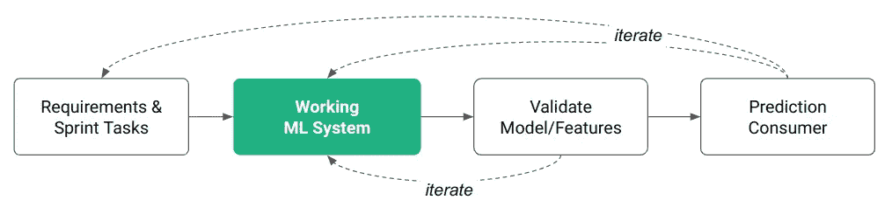
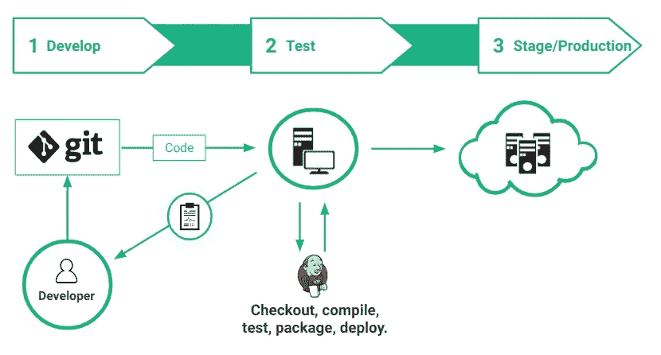
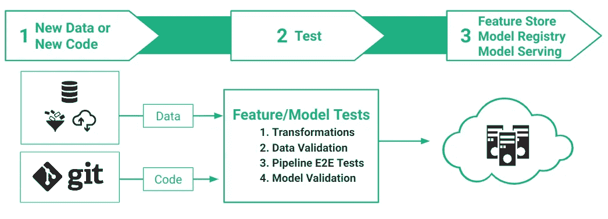
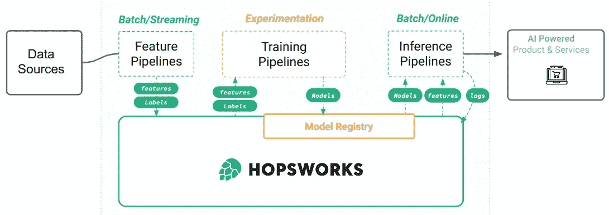
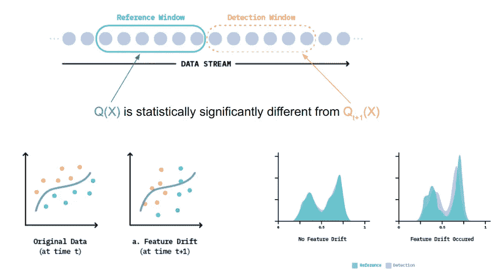
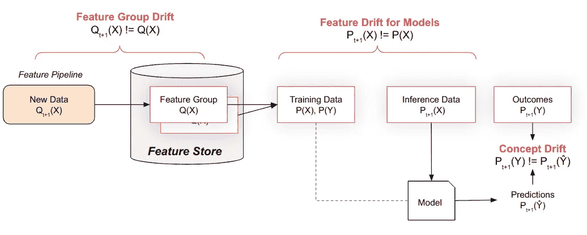

# 使用功能商店的 MLOps-hops works

> 原文：<https://towardsdatascience.com/mlops-with-a-feature-store-816cfa5966e9?source=collection_archive---------6----------------------->

TLDR；如果人工智能要嵌入到企业计算系统的 DNA 中，企业必须首先重新调整他们的机器学习(ML)开发流程，以包括 ML 资产(特征和模型)的自动化测试、版本控制、治理和存储。这篇博客详细介绍了如何用特性库实现 MLOps 过程。

# 什么是 MLOps？

MLOps 是一个最近的术语，描述了如何应用 DevOps 原理来自动化 ML 系统的构建、测试和部署。[连续交付基金会的 SIG-MLOps](https://github.com/cdfoundation/sig-mlops) 将 MLOps 定义为“DevOps 方法的扩展，将机器学习和数据科学资产作为 DevOps 生态中的一等公民”。MLOps 旨在统一 ML 应用程序开发和 ML 应用程序的操作，使团队更容易更频繁地部署更好的模型。[Martinfowler.com 将 MLOps](https://martinfowler.com/articles/cd4ml.html) 定义为:
“一种软件工程方法，在这种方法中，跨职能团队基于代码、数据和模型，以小而安全的增量生产机器学习应用程序，这些应用程序可以在短的适应周期内随时重现并可靠发布。”

MLOps 的目标是尽可能快地获得一个完整的工作 ML 系统，并进行增量更改以改进该系统，测试功能和模型，以增强您在不破坏下游模型消费者的情况下进行小更改的能力的信心。

与 DevOps 相比，MLOps 的具体挑战是如何测试、版本化、存储、管理和使用 ML 系统中产生的两个主要资产:**特性**和**模型**。相比之下，DevOps 关心的主要资产是源代码。

# DevOps 与 MLOps

由源代码更改触发的传统 DevOps CI/CD 工作流。

Git 是世界上最流行的源代码版本控制系统。它用于跟踪源代码随时间的变化，并支持不同版本的源代码。对版本控制的支持是自动化和[持续集成](https://cloud.google.com/solutions/devops/devops-tech-continuous-integration) (CI)解决方案的先决条件，因为它能够以全自动的方式对任何环境进行可重复的配置。也就是说，我们假设提供环境所需的配置信息存储在版本控制系统中，以及我们将要测试的系统的源代码。通常，在使用 DevOps 时，每次提交 Git 都会触发包的自动创建，只需使用版本控制中的信息就可以将这些包部署到任何环境中。

在许多 DevOps 设置中， [Jenkins](https://jenkins.io/) 与 Git 一起用作自动化服务器，以可控和可预测的方式构建、测试和部署您的版本化代码。Jenkins 遵循的 CI/CD 管道的典型步骤是:提供测试虚拟机(VMs 容器，将代码签出到机器上，编译代码，运行测试，打包二进制文件，以及部署二进制文件。对于 Java，这涉及到运行一个像 maven 这样的构建工具来编译、测试和打包 Java 二进制文件，然后再将二进制文件部署到某个登台或生产系统中。对于 Docker 化的应用程序，这意味着编译 Docker 文件，然后构建 Docker 映像并将其部署到 Docker 注册表中。

MLOps:特征工程和模型训练的 CI/CD 工作流可以由源代码或数据的变化触发。

也许 MLOps 最具定义性的特征是需要管理数据和代码，以便为训练模型提供可重现的工作流。Git 不适合作为对大量数据进行版本控制的平台。

然而，Git 和 Jenkins 对于 MLOps 来说是不够的，在 MLOps 中，构建过程涉及运行复杂的分布式工作流，我们需要**版本化代码*和*版本化数据*来确保可复制的自动化构建。但是数据不是管理特征和模型的正确抽象层次。*

***特征是特征存储中的可变数据** —用于创建特征的新数据应该不断到达，否则使用这些特征进行推理的模型将不再创造任何价值。特征还具有模式、自定义元数据，并且在被模型用于训练或推断之前可能需要特定于模型的转换。(特定于模型的转换发生在特征存储之后(例如标准化一个数字特征)，因此特征数据可以更容易地在不同模型之间重用)。特征数据也应该被验证，例如，使用像[远大前程](https://www.hopsworks.ai/post/data-validation-for-enterprise-ai-using-great-expectations-with-hopsworks)这样的框架。*

***模型是模型注册表中不可变的数据**。模型是版本化的，可以通过推理或训练管道安全地下载和缓存。模型还具有用于治理的模式和定制元数据(例如，描述如何以及在哪里可以使用模型)。还应该对模型进行验证，以确保它们在看不见的数据上有足够好的性能，没有偏差(通过测试模型在不同测试数据切片上的表现)，并且对非分布特征值具有鲁棒性。*

# *Hopsworks 特征库(和模型注册表)*

**

*特性库使您能够将您的整体 ML 管道重构为 3 个管道，每个管道都可以以自己的节奏运行:一个特性管道、一个训练管道和一个推理管道。*

*功能存储解决了整体式 ML 管道的以下问题:*

*   *通过在不同模型中启用功能重用，实现功能的发现和重用；*
*   *为相同的特性启用双离线/在线 API:对用于训练和批量推断的特性数据的高吞吐量批量访问，以及对在线模型的特性的低延迟读取；*
*   *确保特征、训练和推理管道中转换的一致性——用于计算特征的函数的单个定义在三个不同的管道中重复使用；*
*   *确保训练数据中特征的时间点正确性(确保没有数据泄漏)；*
*   *分离特征、训练和推理管道，以便操作管道(特征、推理)可以以它们自己的节奏运行，并且训练可以按需完成。*

# *F‍eature 管道公司*

*特征管线与数据管线共享许多相同的最佳实践 DevOps 实践。数据/特征的一些自动测试类型包括:*

*   *所有特性化代码的单元测试和集成测试(当代码被推送到 Git 时，Jenkins 可以运行这些测试)；*
*   *测试特征值是否在预期范围内；*
*   *测试特性的唯一性、完整性和独特性；*
*   *测试特性分布是否符合您的期望；*
*   *测试每个特征和标记之间的关系，以及单个信号之间的成对相关性；*
*   *测试每个功能的成本；*
*   *测试个人身份信息不会泄露到功能中(自定义测试)。*

*当特征存储可用时，特征管线的输出存储在特征存储中称为*特征组*的表中。理想情况下，目标数据接收器将支持版本化数据，例如在 Apache 胡迪的 Hopsworks 功能存储中。在 Hopsworks 中，特征管线将数据向上插入(插入或更新)到现有的特征组中，其中特征组是一起计算的一组特征(通常是因为它们来自相同的后端系统，并且通过一些实体或键相关)。每次为要素组运行要素管道时，它都会在汇胡迪数据集中创建一个新的提交，并且还可能会更新在线数据库中的最新要素值。*

# *模型培训渠道*

*在模型验证步骤中执行的自动化测试类型包括:*

*   *在看不见的数据上测试模型的性能，*
*   *测试模型在不同数据切片上的表现以检查偏差，*
*   *测试模型对非分布特征值的稳健性。*

# *推理管道—特征监控和预测监控*

*可以监控特征的漂移——与特征数据的*参考窗口*相比，特征数据的*检测窗口*中有意义的(也可能是统计上显著的)变化。类似地，*模型预测*可以与*结果*进行比较，以查看预测性能是否有有意义的变化。乔希·托宾很好地描述了在这里寻找什么。*

**

*图片来自[[https://concept-drift.fastforwardlabs.com/](https://concept-drift.fastforwardlabs.com/)*

*在上图中，我们可以看到，我们有时可以直观地比较漂移数据的分布。在 Hopsworks 要素存储中，我们仅有的实际数据集是要素组和训练数据集。当一个特征组(或一个特征组的子集)是参考窗口时，我们可以检测*特征组漂移*。当在其上训练的模型的训练数据集是参考窗口时，我们可以检测模型的*特征漂移。**

**

*特征组转移是在数据被写入特征存储之前，模型的特征漂移是为了识别已部署模型的特征分布中的漂移，而概念漂移是为了测试模型的陈旧性。*

*上图显示了监控基础设施可以识别的三种不同类型的漂移:*

*   ***特征存储中特征的特征漂移**，在特征存储中，我们监控将要写入特征组的特征分布的变化；*
*   ***已部署模型的特征漂移**，其中我们监控模型的推断数据窗口与模型的训练数据的特征分布相比的漂移；*
*   ***概念漂移**模型产生的预测变得越来越差(例如，与模型评估期间相比，您根据看不见的数据评估模型性能)。*

## *摘要*

*我们现在已经介绍了一个基于 MLOps 原则的端到端 ML 管道和一个特性库。对管道代码或新到达的数据的更新使得变化能够被持续地测试，并且模型能够被持续地更新和部署到生产中。我们展示了特征库如何使整体的端到端 ML 管道分解成特征管道和模型训练管道。我们还讨论了如何利用现代数据湖框架(如 Apache 胡迪)实现数据版本控制。在下一篇博客中，我们将更详细地介绍 ML 管道和可重复实验 Hopsworks，以及如何轻松地将管道从开发环境迁移到生产环境。我们还将展示如何使用 Airflow 开发特征管道和模型训练管道。*

## *Hopsworks 入门*

*   *[app . hops works . ai](https://app.hopsworks.ai)(5 分钟后开始)*
*   *[docs.hopsworks.ai](https://docs.hopsworks.ai)*
*   *[www.hopsworks.ai](https://www.hopsworks.ai)*

# *参考*

*   *[机器学习的特征库](http://www.featurestore.org/)*
*   *[hops works 功能商店](https://www.hopsworks.ai/the-python-centric-feature-store)*
*   *[斯卡利等人，你们的 ML 测试成绩是多少？ML 生产系统的规则](https://storage.googleapis.com/pub-tools-public-publication-data/pdf/45742.pdf)*
*   *[Baylor 等人，TFX:基于 TensorFlow 的生产规模机器学习平台](http://stevenwhang.com/tfx_paper.pdf)*
*   *[CDF 特殊兴趣小组— MLOps](https://github.com/cdfoundation/sig-mlops)*
*   *[机器学习的连续交付](https://martinfowler.com/articles/cd4ml.html)*

**本文于 2020 年 3 月首次发表，并于 2023 年 2 月 21 日进行了大量编辑。这篇文章的原文可以在* [*逻辑时钟的博客*](https://www.logicalclocks.com/blog/mlops-with-a-feature-store) *上找到。**