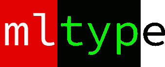
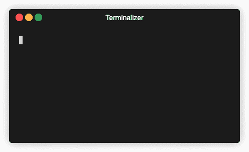

# ml type——程序员打字练习

> 原文：<https://towardsdatascience.com/mltype-typing-practice-for-programmers-ae580cce693f?source=collection_archive---------29----------------------->

mltype

mltype 是一个提高打字技巧的命令行工具。它通过一点点深度学习做到了这一点。

如果你点击了这篇文章，希望能学到一些关于静态类型、类型注释或类似的东西，那么这篇文章是不合适的。我在这篇文章中谈论的打字是你用键盘做的事情。或者准确地说

> 用打字机或计算机写作的行为或技巧。

# 动机

几个月前，我决定学习触摸打字！我知道你在想什么…"你打字比以前快了吗？所有的痛苦都值得吗？"我肯定会说是和是。然而，互联网上充满了类似的前后推荐书，我不打算写另一个。

我想说的是，我真的很惊讶，用编程语言练习触摸打字的资源如此之少。快速谷歌搜索后，你可能会发现以下网站:

*   http://www.speedcoder.net/
*   【https://typing.io/ 

虽然上述网站有多个优点，但让我指出它们的一些缺点

*   缺乏可变性和惊喜元素
*   手动选择源文件和相应的行
*   不可定制
*   不自由(typing.com)
*   还不够无聊——难道不能在终端里做吗？

基于上面提到的原因，我决定试一试，自己写一个打字练习软件: **mltype** 。

# 它是做什么的？

简而言之，就是一个命令行工具(用 Python 写的)。它使用神经网络来生成看起来像编程语言(或普通语言)的文本。此外，它还提供非机器学习功能，如从文件或标准输入中读取文本。

如果你想知道它背后是什么样的“神经网络”,我会鼓励你去(重新)读一读安德烈·卡帕西的《循环神经网络的不合理有效性》。mltype 在后台做着或多或少相同的事情。准确的说，有一个字符级的语言模型。它给出了前一个字符在下一个字符上的概率分布。最重要的是，它试图向用户隐藏训练和推理的所有复杂和枯燥的细节。从现有模型生成文本和训练新模型都可以在一个命令中完成。

下面是一些不同编程语言的例子。生成它们的所有模型和许多其他预训练模型都可以下载(参见 github 上的 README.md)。

# 例子

C++

去

计算机编程语言

# 想试试吗？

如果你想了解更多并亲自尝试，请访问下面的链接！

*   **github**:【https://github.com/jankrepl/mltype 
*   **文件**:[https://mltype.readthedocs.io/en/latest/](https://mltype.readthedocs.io/en/latest/)