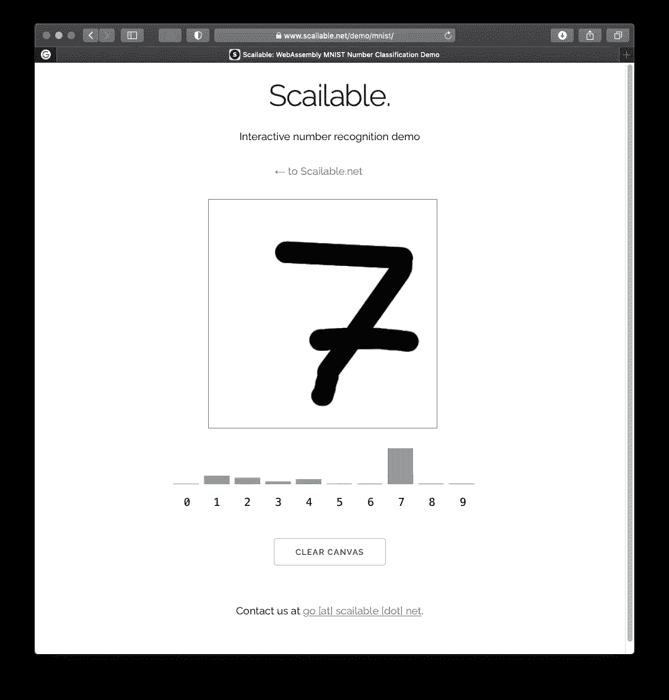

# 浏览器中的 MNIST

> 原文：<https://towardsdatascience.com/mnist-in-the-browser-f03cc4f055a1?source=collection_archive---------53----------------------->

## 将复杂的人工智能模型部署到浏览器(以及更远的地方)非常容易。

多年来，在实践中使用人工智能模型一直是一个挑战。是的，确实存在许多很好的例子，但根据我们的经验，大多数公司首先面临的挑战是整合数据，然后是构建和验证有用的模型，最后是将这些模型部署到最需要的地方(无论是内部、云中还是边缘)。

然而，在过去几年中，这些挑战变得越来越容易。它们中没有一个是微不足道的，但是这个过程的每一步都有大量的工具。甚至在浏览器中部署相对复杂的[卷积神经网络](https://en.wikipedia.org/wiki/Convolutional_neural_network)也变得相当简单:让我来分享一下如何实现。

# 1.训练模型:手写数字识别

为了演示 CNN 在浏览器中的部署，我们选择了一个 CNN 经常擅长的简单任务:图像识别。为了便于演示，我们将重点放在众所周知的 [MNIST](http://yann.lecun.com/exdb/mnist/) 数据集上。[本教程](https://github.com/Microsoft/CNTK/blob/master/Tutorials/CNTK_103D_MNIST_ConvolutionalNeuralNetwork.ipynb)展示了如何使用[微软的认知工具包](https://docs.microsoft.com/en-us/cognitive-toolkit/)来训练一个具有相当令人印象深刻的性能的模型。然而，你并不真的需要自己训练模型；在 [ONNX 模型动物园](https://github.com/onnx/models)可以直接下载[ONNX 格式的](https://github.com/onnx/models/tree/master/vision/classification/mnist)。

> ONNX 是一种开放格式，用于表示机器学习模型。这是存储使用不同工具(pyTorch、tensorflow、sklearn 等)创建的训练模型(包括预处理和后处理)的一种非常统一的方式。).

# 2.模型转换:易于部署的 WebAssembly。

既然我们已经有了一个经过训练的数字识别模型，我们想在浏览器中直接使用它。这样做的一个选择是使用 [javascript ONNX 运行时(ONNX.js)](https://github.com/microsoft/onnxjs) 。然而，我们更喜欢首先将 ONNX 转换成一个 [WebAssembly](https://webassembly.org) 可执行文件(。WASM)部署前。

虽然 ONNX.js(以及其他边缘设备可用的 ONNX 运行时)可能看起来更容易，但由于跳过了向 WebAssembly 的传输步骤，ONNX 运行时通常比 WASM 运行时大得多，执行起来也更慢(参见 [Wasmer](https://wasmer.io) 收集)。我们建议感兴趣的读者[参考这篇文章](https://medium.com/@maurits.kaptein/object-recognition-on-the-edge-fc8aaaeb2c53)，了解 ONNX.js 和 WebAssembly 运行时比较的更多细节。在任何情况下，根据我们的经验，目前可用的(各种)ONNX 运行时在实际(边缘)生产环境中比简单、独立的 WebAssembly 二进制文件更难维护和管理。

[scascalable](https://www.scailable.net)提供了(大部分)ONNX 到。不到一美元的 WASM(前 100 次转换是免费的)。描述转换过程的详细教程可以在[这里找到](https://github.com/scailable/sclbl-tutorials/tree/master/sclbl-pytorch-onnx)。实际上，它就像上传。ONNX 文件到 web 窗体。

> Scailable 目前支持 ONNX 1.3 到。WASM；对 ONNX 1.7(包括 IR 5 和 OPS 13)的支持即将到来。

转换之后，我们得到了一个非常小的(472 Kb) [。WASM 可执行的](https://cdn.sclbl.net:8000/task/be269568-dbf7-11ea-b0d0-9600004e79cc.wasm)可以用来进行数字识别。

# 3.浏览器中的模型部署(带后备)。

在转换到 WebAssembly 之后，CNN 的实际部署是小菜一碟。大多数浏览器支持运行现成的 WebAssembly *和由。这里描述了由 Scailable 创建的 WASM[。因此，如果您熟悉 javascript，自己编写`I/O` 相对容易。然而，使用](https://github.com/scailable/sclbl-tutorials/blob/master/sclbl-create-your-own-wasm/README.md) [Scailable-Webnode](https://github.com/scailable/sclbl-webnode) 可能更容易；最低限度。将运行的 WASM 运行时。WASMs 由 Scailable 尽可能在浏览器中创建，如果浏览器不支持 WebAssembly，则在云中创建。*

将所有这些放在一起，我们得到了以下实现:

实现出人意料地精简和快速，并且模型的性能不相上下。[你可以在这里尝试一下](https://www.scailable.net/demo/mnist/)(显然，查看该页面的源代码，看看 UX 是如何完成的)。

# 包裹

像 ONNX 这样的中间表示，以及像 WebAssembly 这样有效、快速和可移植的编译目标，正在缓慢但肯定地改变我们在各种目标上部署 AI 的方式。这太棒了。对我们来说，上述过程很有吸引力，原因有很多:

*   **性能:** WebAssembly 速度超快，运行在一个微小的容器中。在计算预测和最小内存占用时，它提供了接近本机的性能。
*   **可移植性:** ONNX 允许从几乎任何现代数据分析工具中存储*任何*模型(包括预处理和后处理管道)，并且随后 WebAssembly 二进制文件可以在任何地方有效地运行。
*   **隐私:**我们经常在隐私敏感的情况下部署模型；在这些情况下，我们希望模型的输入数据保留在本地(例如，在医院)。我们不是四处发送敏感数据，而是四处发送模型。
*   **治理:**与 ONNX 运行时(或用于创建模型推理的 docker 容器)相比，它的巨大优势在于它是独立的。WASM 二进制文件很容易进行版本控制和检查。我们可以保证模型预测的有效性，而不必担心它的周围环境(python 版本、库等)。).

希望这个小教程(以及其中的参考资料)对其他人入门有用！

# 放弃

*值得一提的是我自己的参与:我是 Jheronimus 数据科学院的数据科学教授，也是 Scailable 的联合创始人之一。因此，毫无疑问，我对 Scailable 有既得利益；我有兴趣让它成长，这样我们就可以最终将人工智能投入生产并兑现它的承诺。这里表达的观点是我自己的。*