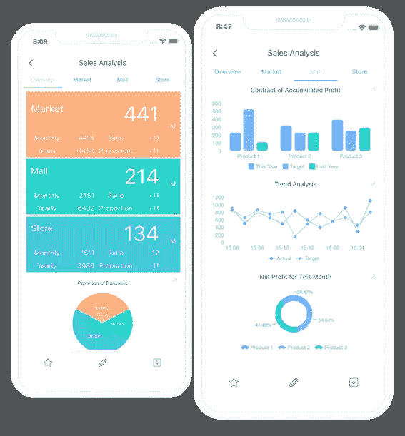
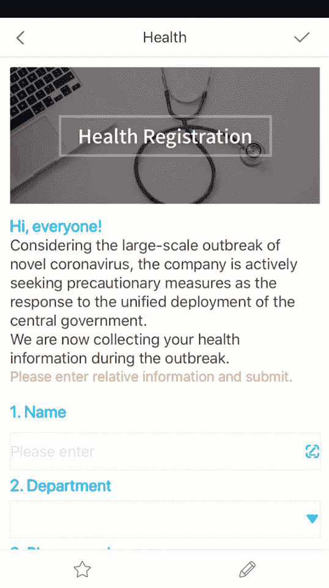
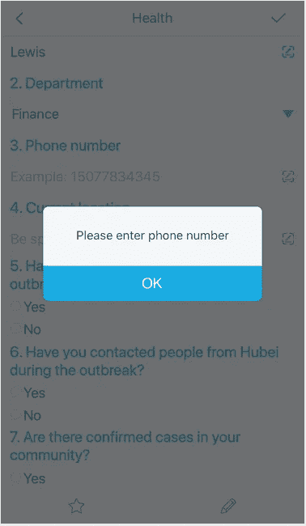
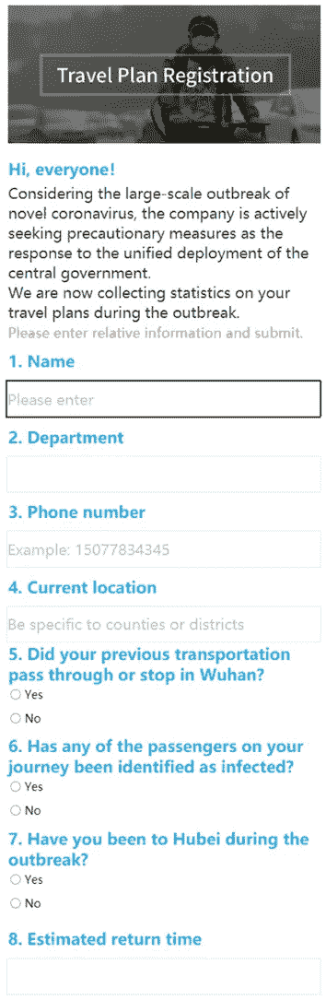
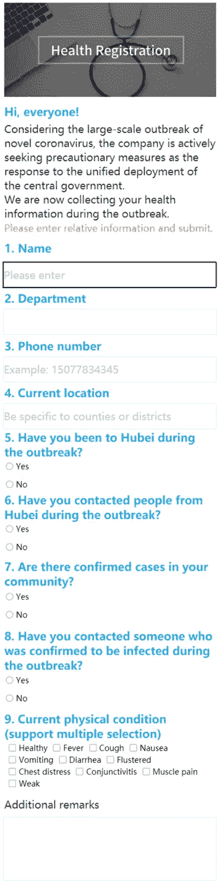
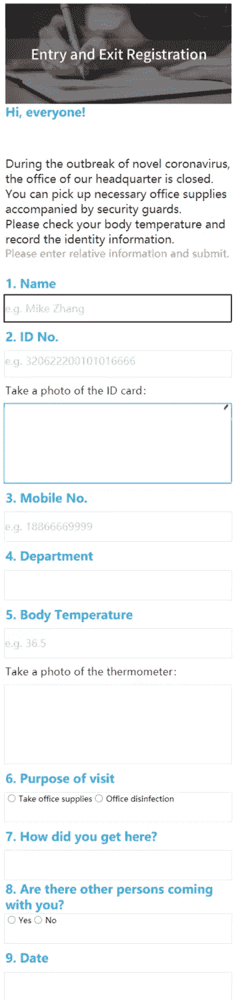
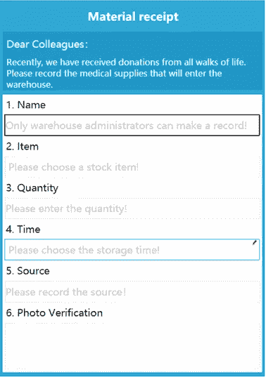
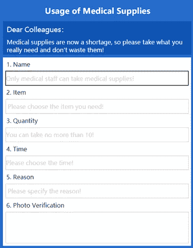
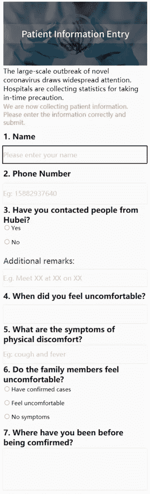
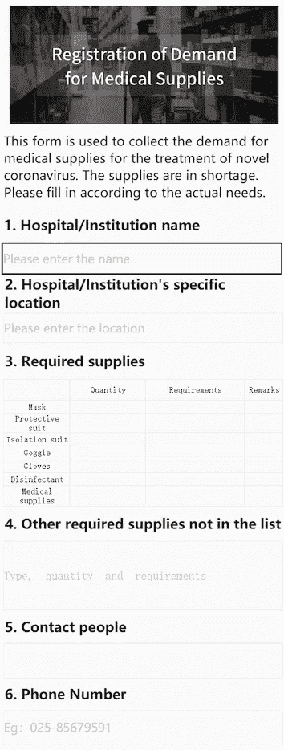

# 移动数据收集:它是什么和它能做什么

> 原文：<https://towardsdatascience.com/mobile-data-collection-what-it-is-and-what-it-can-do-714dae3e0a18?source=collection_archive---------21----------------------->

数据收集并不是什么新鲜事，但移动设备的引入让它变得更加有趣和高效。在移动技术出现之前，我们需要使用笔和纸在现场记录信息，或者手动将其输入计算机来组织信息。但现在，移动数据收集意味着信息可以在来源处以数字方式记录在移动设备上，无需在收集信息后输入数据。

来自 [FineReport](https://www.finereport.com/en/?utm_source=medium&utm_medium=media&utm_campaign=blog&utm_term=Mobile%20Data%20Collection%3A%20What%20it%20is%20and%20what%20it%20can%C2%A0do)

# 1.什么是移动数据收集？

移动数据收集是一种借助移动设备收集不同类型信息的方法。它帮助我们节省时间、金钱和人力资源。节省无数纸张，更环保。有时，通过这种非接触方式在现场收集数据增加了人员的安全性。

# 2.移动数据收集如何帮助企业？

## 2.1 移动数据采集效率更高，保证数据准确性。

在手机上填写移动表单更快，并最大限度地减少了手动数据输入错误。用户可以从列表、单选按钮、复选框或扫描的数据中选择数据，而不必手动输入信息。

移动表单的列表和单选按钮

此外，移动数据收集包括基于数据类型和必填字段的自动数据验证。数据验证和更少的手动输入有助于减少错误并节省大量时间。

移动数据收集的数据验证

## 2.2 移动数据收集实时跟踪收集过程并管理团队。

您可以随时随地更新[移动表单](https://www.finereport.com/en/features/mobilebi?utm_source=medium&utm_medium=media&utm_campaign=blog&utm_term=Mobile%20Data%20Collection%3A%20What%20it%20is%20and%20what%20it%20can%C2%A0do)的变化(设备和用户之间自动同步)。您可以在几分钟内在线调整相应的移动表单，所有团队成员都可以立即访问相同的信息。

移动数据收集有助于实时查看收集的数据并监控项目。您可以使用权限来管理团队角色(项目经理、外业工作队、分析师……)，以控制谁可以收集或更新数据，从而简化任务分配和决策。

# 3.移动数据收集的例子

移动数据采集可以应用于任何行业和任何工作流程。

最近全世界都在关注中国的冠状病毒疫情。事实上，这种病毒已经逐渐影响到其他国家。在这种危机下，及时收集人员信息成为防控病毒的重要一环。只有及时了解疫情，才能及时部署防控措施。

为此，我做了 8 个移动数据录入模板，可以应用于以下五个场景，帮助组织和企业收集信息。下面，我将具体解释为什么此时移动数据采集更高效、更安全。

## 3.1 健康信息收集

*   旅行计划登记

冠状病毒的大规模爆发发生在中国的春节。在此期间，大量的人在全国范围内迁移。因此，我们需要统计学生或员工的旅行情况:是否有武汉(病毒起源)接触史或与武汉人有过接触。通过广泛的调查和及时的隔离，我们希望将病毒扼杀在摇篮中。

*   健康登记

通过对个人身体状况的调查，可以提高人们对疫情情况的了解，及早识别患者，送医院治疗。

## 3.2 远程办公

为了减少人群聚集，阻断病毒传播，中国很多公司已经开始允许员工在家办公。为此，我们可以制作人事考勤移动表单，让员工在手机上打卡。企业可以由此获取员工所在地信息，从而了解某个员工所在城市的疫情情况。通过这种移动数据采集产生的考勤数据，方便 HR 统计。例如，下面的移动表单是一个远程办公环境调查。

*   远程办公环境调查

## 3.3 出入境登记

在这次病毒危机中，各个地区都采取了人员出入限制。人员进出需要登记。传统的纸笔登记存在相互感染病毒的风险，管理人员无法实时查看出入记录。于是我做了一个移动报名表，实现电子注册。参观者只需使用一部手机就可以在线填写登记表，管理人员也可以在手机上查看实时访问记录，方便出现问题时排除故障。

## 3.4 库存管理

现在，世界正在向中国捐赠大量物资。库存的管理尤为重要。如何有效地管理仓库的进入、货物的交付和材料的及时分发也成为问题。我们可以使用移动数据采集来简化物料仓库流程管理。

*   输入仓库

*   耗材使用

## 3.5 医院管理

疫情期间，医院除了需要企业和社区进行数据收集外，还需要高效地进行防疫统计，如患者信息收集、患者日增加量、病历和报告、材料申请等。

*   患者信息输入

*   医疗用品需求登记

> 注:本文中所有的移动表格都是用 BI 报告和仪表板软件 [**FineReport**](https://www.finereport.com/en/?utm_source=medium&utm_medium=media&utm_campaign=blog&utm_term=Mobile%20Data%20Collection%3A%20What%20it%20is%20and%20what%20it%20can%C2%A0do) 制作的。这个工具是由我工作的数据研究所开发的。个人使用完全免费。您可以 [**下载它**](https://www.finereport.com/en/download2?utm_source=medium&utm_medium=media&utm_campaign=blog&utm_term=Mobile%20Data%20Collection%3A%20What%20it%20is%20and%20what%20it%20can%C2%A0do) 练习制作移动表格、图表、报告和仪表板。

# 结论

移动数据收集无疑提高了业务运营效率。实践证明，这种方法可以提高数据收集的速度和准确性、服务提供的有效性以及员工的绩效。

借助移动数据收集，每个团队成员都可以做更多工作，做出明智的业务决策。团队中的每个人都可以立即访问收集到的信息，并迅速采取行动。因此，不要犹豫，尝试移动数据收集，我向你保证，它会让你的生活更轻松，并使你免受与数据丢失和错误相关的问题。

 [## Lewis Chou -区域经理- FineReport 报告软件| LinkedIn

### 查看世界上最大的职业社区 LinkedIn 上的 Lewis Chou 的个人资料。刘易斯有 3 份工作列在他们的…

www.linkedin.com](https://www.linkedin.com/in/lewis-chou-a54585181/) 

> 如果你想获得这些移动数据收集模板，你可以在 LinkedIn 上联系我，我很乐意与你分享。

# **您可能也会对…** 感兴趣

 [## 数据可视化在对抗新型冠状病毒的战斗中有什么帮助？

### 我为五种情况设计了仪表板，以帮助监控冠状病毒爆发的情况，并执行…

towardsdatascience.com](/what-can-data-visualization-help-in-the-battle-against-the-novel-coronavirus-bad9b2c7fb2b)  [## 2019 年 6 大数据分析工具

### 谈到数据分析工具，我们总是有疑问。这么多数据分析有什么区别…

towardsdatascience.com](/top-6-data-analytics-tools-in-2019-4df815ebf82c)  [## 动态图表:让您的数据移动

### 动态图表给我们一种直观和互动的体验。这篇文章将解释什么是动态图表和…

towardsdatascience.com](/dynamic-charts-make-your-data-move-19e540a06bd3)