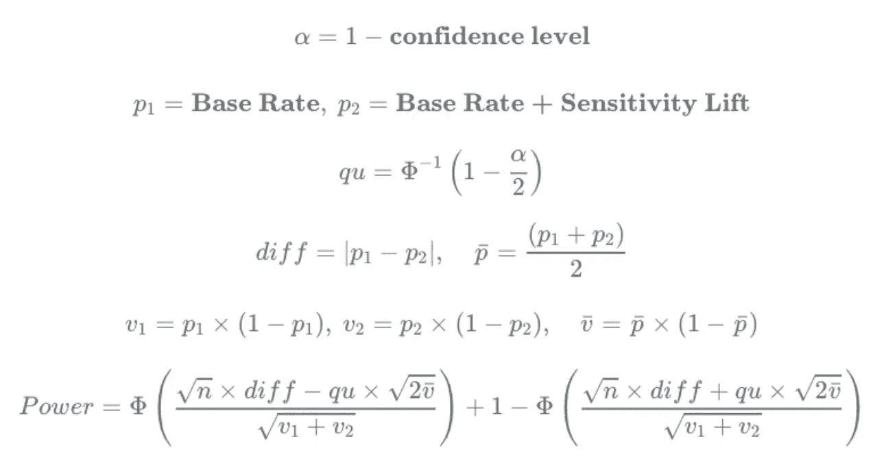
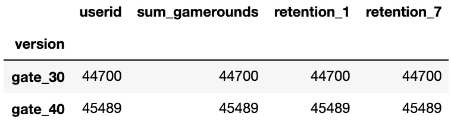
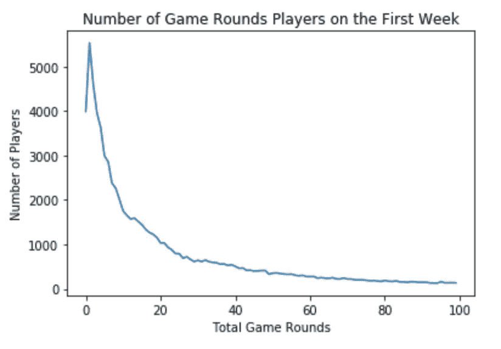
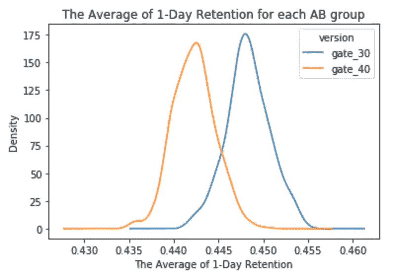
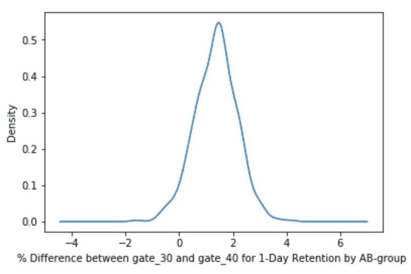
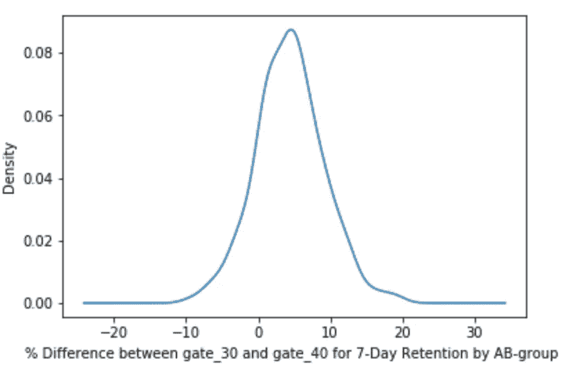

# 如何进行 A/B 测试

> 原文：<https://towardsdatascience.com/mobile-games-a-b-testing-with-cookie-cats-2290fcb247c4?source=collection_archive---------15----------------------->

## 理解 Python 中用于 A/B 测试的函数

# A/B 测试的功能

最近，我在 DataCamp 上学习了“[客户分析&Python 中的 A/B 测试](https://www.datacamp.com/courses/customer-analytics-ab-testing-in-python)”课程。本课程涵盖了如何使用 Python 来分析客户行为和业务趋势的细节，以及如何创建、运行和分析 A/B 测试以做出主动的、数据驱动的业务决策。


https://then extweb . com/DD/2015/07/24/marketing-the-tnw-way-2-deep-dive-on-ab-testing/上的图片

## 幂函数

统计功效是指当**零假设为假**时，发现具有统计显著性结果的概率。



统计功效公式(数据营课程图片)

```
from scipy import statsdef get_power(n, p1, p2, cl):
    alpha = 1 - cl
    qu = stats.norm.ppf(1 - alpha/2)
    diff = abs(p2-p1)
    bp = (p1+p2) / 2

    v1 = p1 * (1-p1)
    v2 = p2 * (1-p2)
    bv = bp * (1-bp)

    power_part_one = stats.norm.cdf((n**0.5 * diff - qu * (2 * bv)**0.5) / (v1+v2) ** 0.5)
    power_part_two = 1 - stats.norm.cdf((n**0.5 * diff + qu * (2 * bv)**0.5) / (v1+v2) ** 0.5)

    power = power_part_one + power_part_two

    return (power)
```

## 样本容量函数

get_sample_size 函数决定了在各种情况下测试组和控制组需要多少用户。

```
def get_sample_size(power, p1, p2, cl, max_n=1000000):
    n = 1 
    while n <= max_n:
        tmp_power = get_power(n, p1, p2, cl)

        if tmp_power >= power: 
            return n 
        else: 
            n = n + 100

    return "Increase Max N Value"
```

## p 值函数

假设零假设是正确的，p 值是获得至少与测试期间实际观察到的结果一样极端的测试结果的概率。p 值函数接受测试和控制转换率以及每个组的大小。

```
def get_pvalue(con_conv, test_conv, con_size, test_size):
    lift = -abs(test_conv - con_conv)

    scale_one = con_conv * (1 - con_conv) * (1 / con_size)
    scale_two = test_conv * (1 - test_conv) * (1 / test_size)
    scale_val = (scale_one + scale_two) ** 0.5

    p_value = 2 * stats.norm.cdf(lift, loc = 0, scale_val)
    return p_value
```

## 置信区间函数

置信区间是我们估计值的范围，并为我们的估计过程提供背景。

```
def get_ci(test_conv, con_conv, test_size, con_size, ci):

    sd = ((test_conv * (1 - test_conv)) / test_size + (con_conv * (1 - con_conv)) / con_size) ** 0.5
    lift = test_conv - con_conv

    val = stats.norm.isf((1 - ci) / 2)
    lwr_bnd = lift - val * sd
    upr_bnd = lift + val * sd

    return((lwr_bnd, upr_bnd))
```

这是我之前在 [DataCamp](https://www.datacamp.com/projects/184) 上做的 AB 测试项目。

# 用曲奇猫测试手机游戏 A/B

## 猫和饼干

饼干猫是由[触觉娱乐](http://tactile.dk/)开发的一款非常受欢迎的手机益智游戏。这是一个经典的“连接三个”风格的益智游戏，玩家必须连接相同颜色的瓷砖，以清除董事会和赢得水平。随着玩家在游戏关卡中前进，他们偶尔会遇到一些关卡，迫使他们等待相当长的时间或进行应用内购买才能前进。除了推动应用内购买之外，这些关卡还有一个重要的目的，那就是让玩家暂时停止玩游戏，希望能够增加和延长玩家对游戏的享受。但是门应该放在哪里呢？所以让我们把数据加载进去看看吧！

```
import pandas as pd
df = pd.read_csv('datasets/cookie_cats.csv')
df.head()
```

## AB 测试数据

我们拥有的数据来自 90189 名在 AB 测试运行时安装游戏的玩家。这些变量是:

*   `userid` -识别每个玩家的唯一号码。
*   `version` -玩家是被放在控制组(`gate_30`-30 级的门)还是移动门的组(`gate_40`-40 级的门)。
*   `sum_gamerounds` -玩家在安装后的前 14 天内玩的游戏回合数。
*   `retention_1` -玩家安装后 1 天回来玩**了吗？**
*   `retention_7` -玩家安装后 7 天回来玩**了吗？**

当玩家安装游戏时，他或她被随机分配到`gate_30`或`gate_40`。



```
df.groupby(by='version').count()
```

## 游戏回合的分配



这个测试的重点将是大门的位置如何影响玩家的保留，所以让我们绘制第一周玩家游戏回合数的分布。

```
%matplotlib inlineplot_df = df.groupby(by='sum_gamerounds')['userid'].count()ax = plot_df.head(100).plot(x='sum_gamerounds', y='userid')
ax.set_xlabel("Total Game Rounds")
ax.set_ylabel("Number of Players")
ax.set_title("Number of Game Rounds Players on the First Week")
```

## 总保留时间为 1 天

在上面的图中，我们可以看到一些玩家安装了游戏，但从来没有玩过，一些玩家在第一周只玩了几轮，还有一些玩家真的上瘾了。视频游戏行业的一个常见指标是 **1 天留存率**:玩家在安装游戏一天后回来玩游戏的百分比。1 天留存越高，越容易留住玩家，建立庞大的玩家群。

```
print('The 1-Day Retention Rate: {:f}' .format(df['retention_1'].mean()))The 1-Day Retention Rate: **0.445210**
```

## AB 组保留 1 天

所以，我们理解，只有不到一半的玩家在安装游戏一天后回来。让我们来看看两个 AB 组的 1 天保留时间有何不同。

```
df.groupby('version')['retention_1'].mean()gate_30    #  **0.448188**
gate_40    #  **0.442283**
```

## 我们应该对差异有信心吗？



当门移动到级别 40 时(44.2%)，与处于级别 30 时的对照(44.8%)相比，1 天保持率似乎略有下降。这里我们使用自举:我们将重复对数据集进行重新采样(替换)，并计算这些样本的 1 天保留时间。1 天保留时间的变化将向我们显示保留时间的不确定性。

```
boot_1d = []
iterations = 500
for i in range(iterations):
    boot_mean = df.sample(frac=1, replace=True).groupby(by='version')['retention_1'].mean()
    boot_1d.append(boot_mean)

boot_1d = pd.DataFrame(boot_1d)

ax = boot_1d.plot.kde()
ax.set_xlabel("The Average of 1-Day Retention")
ax.set_title("The Average of 1-Day Retention for each AB group")
```

## 放大差异



上面这两个分布代表了两个 AB 组潜在的 1 天保留时间的 bootstrap 不确定性。让我们放大一下 1 天保留时间的差异。

```
boot_1d['diff'] = ((boot_1d['gate_30'] - boot_1d['gate_40']) / boot_1d['gate_40'] * 100)ax = boot_1d['diff'].plot.kde()
ax.set_xlabel("% Difference between gate_30 and gate_40 for 1-Day Retention by AB-group ")
```

## 差异的概率

从这个图表中，我们可以看到最有可能的%差异在 1%-2%左右，并且大部分分布在 0%以上，有利于 30 级的门。但是差异在 0%以上的概率有多大？

```
# Calculating the probability that 1-day retention is greater when the gate is at level 30
prob = (boot_1d['diff'] > 0).mean()('{:.1%}').format(prob)      #  **95.8%**
```

## AB 组保留 7 天

让我们从计算两个 AB 组的 7 天保留时间开始。

```
df.groupby('version')['retention_7'].mean()gate_30    #  **0.190201**
gate_40    #  **0.182000**
```

## 再次引导差异



与 1 天保留期一样，我们看到当关卡处于 40 级时，7 天保留期(18.2%)略低于关卡处于 30 级时(19.0%)。这种差异也大于 1 天的保留，大概是因为更多的玩家有时间击中第一个门。但是像以前一样，让我们使用 bootstrap 分析来计算我们应该对 AB 组之间的差异有多确定。

```
boot_7d = []
for i in range(500):
    boot_mean = df.sample(frac=0.1, replace=True).groupby('version')['retention_7'].mean()
    boot_7d.append(boot_mean)

boot_7d = pd.DataFrame(boot_7d)boot_7d['diff'] = ((boot_7d['gate_30'] - boot_7d['gate_40']) / boot_7d['gate_40'] * 100)ax = boot_7d['diff'].plot.kde()
ax.set_xlabel("% Difference between gate_30 and gate_40 for 7-Day Retention by AB-group ")prob = (boot_7d['diff'] > 0).mean()# Pretty printing the probability
('{:.1%}').format(prob)      #  **84.4%**
```

# 结论

bootstrap 结果告诉我们，有强有力的证据表明，当 gate 处于 30 级时，7 天保留时间比处于 40 级时更长。结论是:如果我们想保持高留存率——1 天和 7 天留存率——我们应该**而不是**将关卡从 30 级移到 40 级。当然，我们还可以查看其他指标，比如两个 AB 组玩的游戏回合数或游戏内购买量。但是保留是最重要的指标之一。如果我们不保留我们的玩家基础，他们在游戏中花多少钱都没用。

```
# Should we move the gate from level 30 to level 40 ?
move_to_level_40 = False
```

创建这篇文章的源代码可以在我的 [Github](https://github.com/shirley0823/Machine-Learning-with-Python/tree/master/AB_Testing) 中找到。

# 关于我

非常感谢您阅读我的文章！大家好，我是雪莉，目前在亚利桑那州立大学攻读商业分析硕士学位。如果您有任何问题，请随时联系我！

```
Email me at ***kchen122@asu.edu***and feel free to connect me on [**LinkedIn**](https://www.linkedin.com/in/kuanyinchen-shirley/)!
```