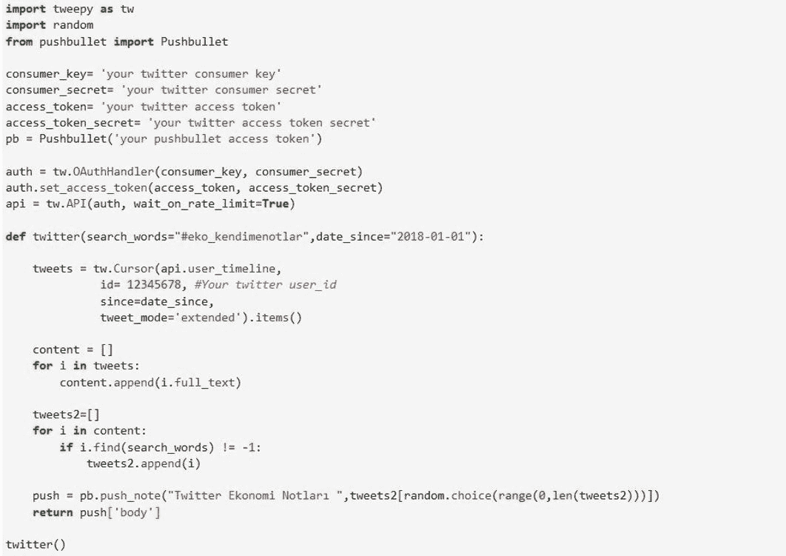
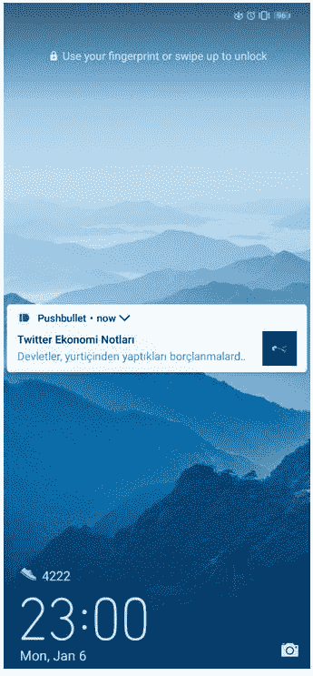

# Twitter API 上使用 Python 的移动推送通知研究

> 原文：<https://towardsdatascience.com/mobile-push-notification-with-python-on-twitter-api-study-af2a5577fc40?source=collection_archive---------30----------------------->

## 将你的 Twitter 账户变成你的个人#笔记本

萨拉·库菲在 [Unsplash](https://unsplash.com?utm_source=medium&utm_medium=referral) 上拍摄的照片

数据现在无处不在，几乎和你的指纹一模一样。今天，技术进步和数字可访问性已经包围了我们，不幸的是，让我们的手机或笔记本电脑远离视线并不容易。

简单来说，

*   我们应该在哪里保存数据？
*   真的能满足我们的需求吗？

然后，

*   我们应该从哪里开始？

我认为数据科学是制作美味佳肴的艺术。烹饪时，您可以添加不同的配料或改变烹饪风格，以达到新的口味或增强现有配料的风味。同样，在处理数据时，您可以尝试不同的方法和材料来获得结果。就像吃饭的乐趣和快乐一样，在一天结束时，如果你的最终结果对你或你的观众来说不好吃，你可能会觉得你做的所有工作都是无用的。我们谈到的大多数数据问题都是看不见摸不着的。事实上，你会发现自己处于一个持续的说服之旅中。如你所知，关于**【数据】**最重要的一点是提出正确的问题，并对可能的答案进行正确的排序。

为了捕捉上面提到的味道，在开始处理数据之前，我通常会问自己以下三个问题:

*   什么最能描述我的问题，期望的结果是什么？
*   我可以使用哪些技术/方法来满足我的需求并使我的工作可持续发展？
*   我的工作有成本效益吗？

# 让我先描述一下我的问题:

当阅读书籍、文章或任何新闻时，我总是很难找到我写下的笔记、突出显示或下划线。过了一段时间，难免记不住所有记下的信息。因此，我想我可以开发一个工具，在特定的时间间隔为我的笔记设置提醒，从而改善我的记忆，让它们保持更长的时间。

或许市场上可以有笔记提醒应用程序。然而，我想开发自己的笔记提醒工具。

# 如何满足我的需求并使其可持续发展？

显然，我不想开发一个具有单一用户管理和一次性使用的静态结构的工具。对我来说，拥有一个灵活的架构至关重要，这样每个人都可以根据自己的利益修改和改进工具。

当然，也可以通过移动应用程序来实现这一功能。我确信你们当中许多成功的应用程序开发人员可以很容易地编写程序来添加这一功能。然而，我想在这里实现的是用我有的食材准备一顿美餐。对我来说，另一个关键点是通过节省时间和成本，用最少的努力获得最大的收益。

为此，我想我可以把 Twitter 当作一个记事本。

***有何不可？***

最终，Twitter 是一个可以根据你的目的用作个人笔记本的平台。多亏了 Twitter 的**#标签**机制，我甚至可以毫不费力地将我的笔记本分成若干部分。

***嗯，我能让它持续吗？***

是的，我的笔记本将继续存在，除非 Twitter 关闭或者我的用户 ID 从他们的数据库中删除。这样，不仅是我，其他 Twitter 用户也将能够使用我的笔记本作为信息的洪水。

***学习是否划算？***

是的，托管服务器是这项工作的主要成本。然而，由于我已经有了一台服务器，我不需要额外花钱。因此，我在这方面没有任何花费。

# 我们开始工作吧！

***先来解决问题:***

经济学和金融市场一直是我感兴趣的领域。我喜欢阅读很多关于这些话题的文章。因此，我的第一个动机是把我的经济学读物转换成笔记。我在推特上给自己设置的标签是[# eko _ kendimenotlar](https://twitter.com/hashtag/eko_kendimenotlar?src=hashtag_click)(**eko:**经济的缩写，**kendimenotlar:**notestomyself)。在这个标签下，我开始分享我的阅读笔记，所以作为第一步，我开始填充我的数据仓库。

现在我需要找到一种方法来访问我在 Twitter 上的数据仓库。幸运的是，Twitter API 拯救了我。通过在 Twitter 上开一个[开发者账户](https://developer.twitter.com/en/docs/tweets/search/overview)，我能够通过 Twitter API 访问我的账户。我使用 [Tweepy](http://docs.tweepy.org/en/v3.5.0/getting_started.html) 包来访问 Twitter API 和作为编程语言的 Python。事实上，我想做的很简单:

*   在 Twitter 上找到我的帐户并收集我的推文，然后用#hashtag 将它们分开。
*   定期将收集的推文发送到我的手机作为提醒。

我用 Python 无缝地编写了第一步，但在最后一部分，我确实需要找到一个解决方案:

***向我的手机发送通知？***

我最初计划将我的想法实现为一个移动应用程序。然而，我在这方面没有足够的经验，这将需要更多的时间和额外的努力来学习它，然后相应地实施。因此，我决定使用一种叫做 Pushbullet 的附加服务。[push pullet](https://www.pushbullet.com/)是一家服务提供商，可以轻松地在设备之间提供信息共享，以实现更好的同步。我使用 Pushbullet 的服务将通知推送到手机上，这大大节省了我的时间。多亏了 Pushbullet Python 包，我将 push 命令集成到了我的脚本中，并消除了通过他们的移动应用程序向我的手机发送通知的问题。这是我为这项工作编写的 Python 脚本:

Twitter API 上使用 Python 的移动推送通知研究

现在，我可以在 Twitter 上找到我的 [#eko_kendimenotlar](https://twitter.com/hashtag/eko_kendimenotlar?src=hashtag_click) 标签，并将我的笔记作为通知发送到我的手机上。然后，下一个问题出现了:我如何使它自动化？

起初，我想到了在 Windows 任务管理器或 UIPath 中实现自动化。我所要做的就是创建 **myscript.bat** 文件，并将其重定向到任务管理器和 UIPath 自动化机器人。然而，我不想依赖于本地，于是我想我可以在 Dreamhost 的服务器上创建一个 Cron 作业。您可以将 Cron 作业想象成一种定期运行计划任务的结构，就像任务管理器一样。您可以在互联网上找到许多可以创建 Cron 作业的服务。

当然，为了激活 Cron 作业，我首先通过 **SSH(安全 Shell)** 将我的 Twitter 脚本上传到我的服务器。因此，Cron 作业在我指定的时间开始在服务器上运行这个脚本。

这是结果😊

> 现在，我能够一天两次获得我的“推特经济笔记”🚀🚀🚀

仅用上面您看到的 26 行代码，我就能够为自己的个人使用创建一个经济高效的服务。当然，这是一个非常简单的应用，但我想在这里指出的是，强大的品牌或渠道如果有效地结合起来，将如何提供强大的解决方案。这是一个很好的案例研究，它表明您编写的代码作为独立的代码对您来说意义重大，但是，如果它得到业务模型的支持，它会产生更大的影响。

**以下几点可以改进:**

*   使用[随机 Python 包](https://docs.python.org/3/library/random.html)，我将收集到的 tweets 随机发送到我的手机上。我的主要目标是在这里创建一个快速的解决方案，但如果你的笔记的时间线对你来说很重要，作为这个解决方案的替代方案，你可以对我提供的脚本进行轻微的修改，创建一个数据库，并将收集的推文按时间顺序发送到你的手机上。
*   虽然脚本中的方法具有可编辑的#hashtag 结构，但是我只能通过 SSH 在脚本中修改它。对于更动态的结构，可以创建移动应用程序，其中可以根据所需的 hashtag 构造各种查询。
*   这里，由于 Twitter API 的免费[搜索方法](https://developer.twitter.com/en/docs/tweets/search/overview)有 7 天的限制，我继续使用 **user_timeline** 方法，然后过滤相应的 **#hashtag** 。高级或企业开发人员帐户可以跳过此选项卡，直接通过搜索方法继续。

非常感谢以下所有环境使我能够完成这项工作:

为了未来，

塞尔詹·耶尔德兹