# 对数正态分布的模式

> 原文：<https://towardsdatascience.com/mode-of-a-log-normal-distribution-b9da073e0927?source=collection_archive---------37----------------------->

## 使用模拟和数学建立直觉

[M. B. M.](https://unsplash.com/@m_b_m?utm_source=medium&utm_medium=referral) 在 [Unsplash](https://unsplash.com?utm_source=medium&utm_medium=referral) 上拍摄的照片

正态分布在统计学和数据建模中很流行，因为它无处不在。现实世界充满了服从正态分布的随机变量的例子。而且，这种分布在统计学中起着核心作用([中心极限定理](https://en.wikipedia.org/wiki/Central_limit_theorem))。使用正态分布可以得到一个有趣的分布，称为对数正态分布。对数正态分布在金融中被广泛使用，因为股票价格被假定遵循这种分布。顾名思义，对数正态随机变量可以推导如下:

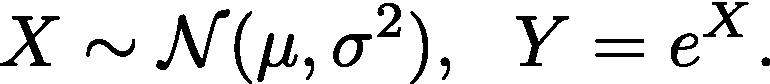

上式中的随机变量 **Y** 被称为遵循对数正态分布。换句话说， **X** 是从均值为μ、方差为σ的正态分布中采样得到的， **Y** 是通过使用指数函数对其进行变换得到的。在这篇文章中，我试图理解这个发行版的模式。我写这篇文章的一个原因是，这个问题迫使我更新了我对答案的错误直觉。

回答这个问题的思路可以是这样的:众数是一组数据中最频繁出现的值，或者是随机变量中最频繁出现的值。在概率术语中，Mode 表示出现概率最高的值。因为我们在这里看到的是连续的随机变量，我们可以有把握地说，众数是一个使概率密度函数(pdf)最大化的值。我们知道正态分布的 pdf 类似于图 1。

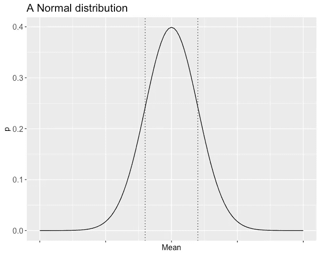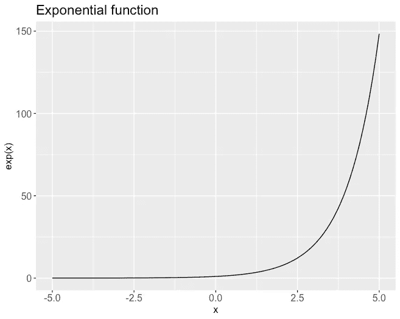

图 1(左)和图 2(右)。图 1 描述了正态分布的概率分布函数。可以观察到，分布围绕标记μ ∓ σ的中间线和虚线对称。图 2 描述了指数函数。

我们可以观察到最常见的(/可能的)值是平均值。在图 2 中，我们可以观察到指数函数，它是一个严格递增函数(因为它的导数> 0)。因此，如果我们设想从正态分布中对 X 的许多值进行采样，并将这些值插入指数函数中，我们将得到 Y 的多个值，即我们将对随机变量 Y 的值进行采样。如果 Mode 表示一个数 Y 的最可能值，那么μ不是对数正态分布的模式吗？不，这不是正确的答案。在继续读下去之前，我建议你暂停一下，试着想一想你是否能在论点中找到任何漏洞，并且大概猜出正确的数字(至少在方向上相对于μ)。

在下文中，我将用两种方法来回答这个问题。首先，我们将查看一些计算机模拟，以获得一些直觉，知道我哪里出错了(如果你已经发现了缺陷，那就太好了)，然后我们将使用数学推导出这个值的解析表达式。

在深入研究以上任何一个问题之前，让我给你一个手动论证。指数函数在 x=0 时的值是 1，并且总是正的。这意味着所有的 x < 0 values are mapped to [0,1) and x≥0 are mapped to [1, ∞). In other words, if we pass the real number line through an exponential function, half of the line maps to values between [0,1) and the other half to [1, ∞). This is why an exponential function is called non-linear (compared to this, a linear function, for instance, a straight line would map the real line equally). This is exactly why the Mode of a Log-Normal distribution is not at the mean (which is the most frequent value for a Normal distribution), i.e. due to this non-linear mapping from X to Y, the collection of negative values are getting compressed in a smaller region (compared to the positive values collection), and this shifts the mode slightly to the right. Now, let’s picture this idea with computer simulations.

To keep the discussion simple, I am **都假设一个标准的**正态分布，μ=0，而σ =1。模拟的程序如下，

1.  选择要采样的点数，N
2.  使用正态分布的 pdf，我们抽样 n 个点(也称为 x 的实现):{x₁，x₂，…
3.  计算 Y = exp(X)
4.  标记 x ≥ 0 的值(因为我们对研究两个区域中点的压缩感兴趣)
5.  计算两组(x≥0 和 x<0)压缩的粗略度量，我称之为点密度，定义如下，

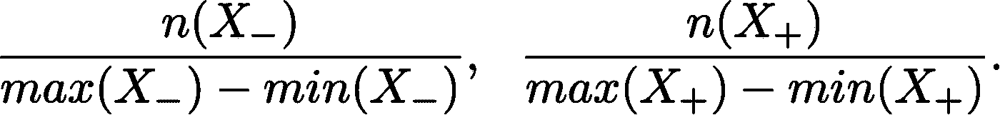

这里，X₋表示所有那些 x<0 的值的集合。为了避免混淆，这不再是随机的，因为我们在第 2 步采样时已经知道了这些值。关于点密度测量需要注意的一些事情。粗略地说，它捕获了(我前面谈到的真实线的)压缩量，因为它代表了长度区间中的平均点数(我使用 max 和 min 来计算区间长度的原因是我们正在采样随机值。所以，我们永远不知道我们是否真的会到达区间的终点。不要担心，你会在下面的模拟结果中看到这一点)。另一件要注意的事情是，这是一个粗略的度量，因为它没有考虑曲率(这可能看起来很傻，因为曲率实际上是驱动整个练习的原因)。但是，这种近似的测量方法目前是可行的。我们走吧。

我对 N = 10、100、1000、10000 重复了上述过程，结果如下所示。每个图标题描述了点数(n)和为 X₋(负 x)和 X₊(位置 x)计算的点密度值。红色和蓝色的点分别属于集合 X₋和 X₊。背景中的虚线突出显示了指数曲线。

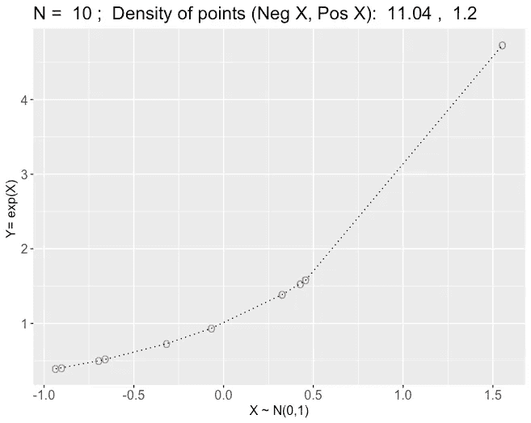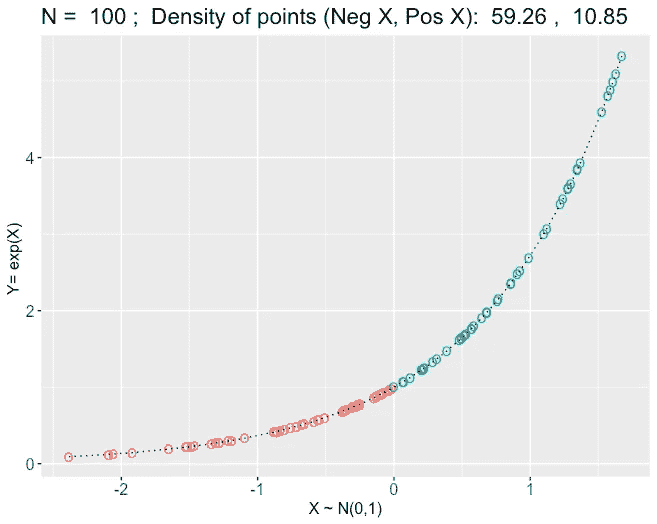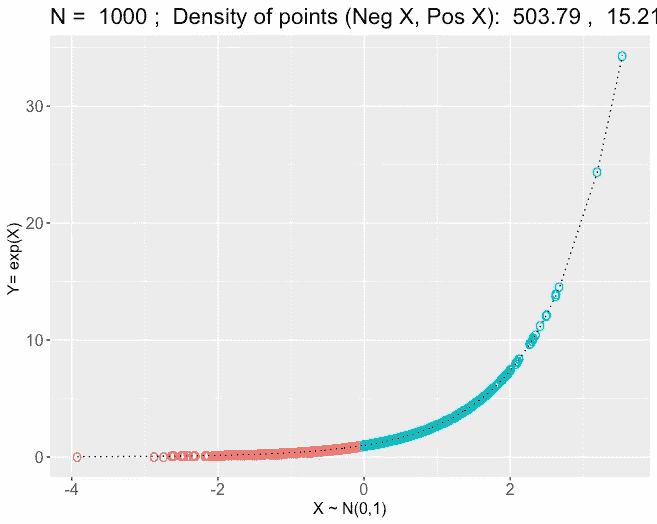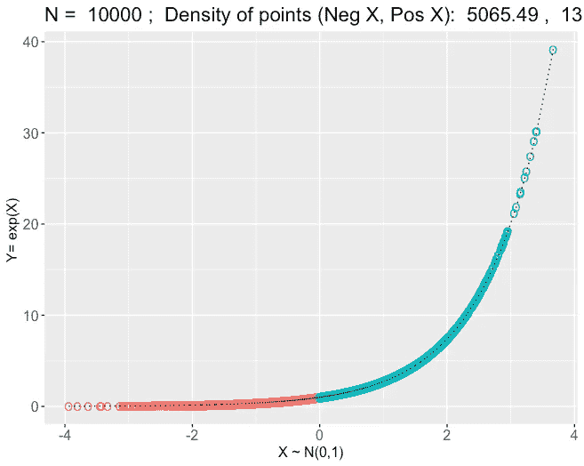

从左到右，从上到下:不同 N = 10、100、1000、10000 值的 Y v/s X 图。每个图的顶部给出了点密度测量值。

通过这些结果，我们可以立即看到压缩。首先，注意 y 轴的刻度是如何随着采样点数 N 的增加而变化的。这是因为当我们采样的点越多，越稀少的点就越容易接近(就特定事件的频率而言)。这是我们在上面定义的点密度测量中考虑间隔长度的一个原因。其次，观察 y 轴上区间[0，1]内的值(因为这正是实直线负部分映射的地方)。随着采样点数量的增加，更多的红色点被压缩在[0，1]区域，这也在 X₋的点密度测量中突出显示，从 11.04 增加到 5065.49！最后，让我们看看采样点的分布，以及对数正态的 pdf。

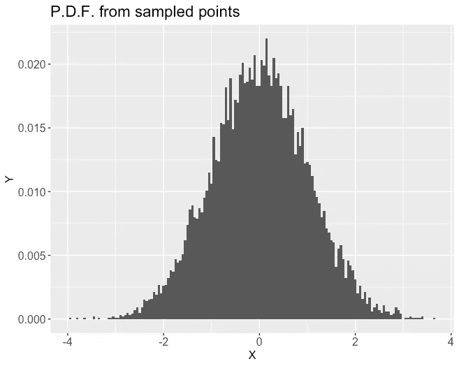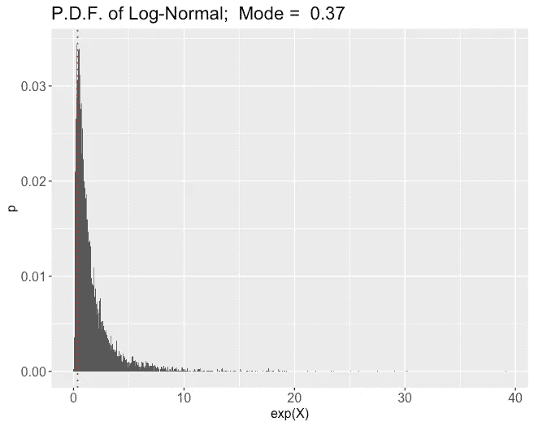

左图:标准正态分布(N=10，000)中采样点的概率密度函数。右图:对数正态分布的概率密度函数。红色虚线表示这种分布的模式，大约为 0.37。

在左图中，我们可以观察到从中抽取 10，000 个样本的标准正态分布的 pdf。该直方图类似于正态分布，在 n 值较高时看起来更好。在右图中，我们可以观察到对数正态分布。我还突出显示了该图上的模式(红线)，该模式在大约 0.37 处向正态分布的μ (=0)右侧移动。现在，让我们试着用分析计算来调和这个结果。

让我们从找到 Y 的 [C.D.F.](https://en.wikipedia.org/wiki/Cumulative_distribution_function) 开始，我们可以用它来找到 [P.D.F.](https://en.wikipedia.org/wiki/Probability_density_function)

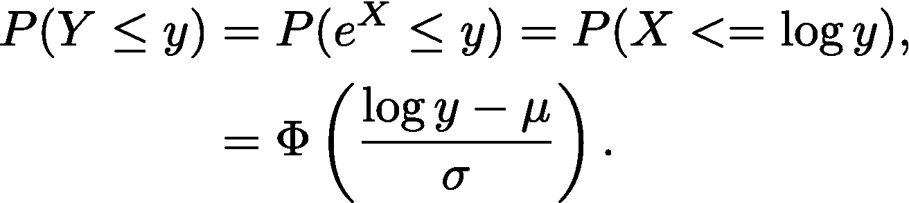

在上面，我们使用对数函数的单调性。φ表示标准正态分布的 [CDF。在最后一步，我们](https://en.wikipedia.org/wiki/Normal_distribution#Cumulative_distribution_function)[标准化](https://en.wikipedia.org/wiki/Standard_score) X，即将其转换为标准正态(我们在这里求解一般情况，其中均值为μ，方差为σ)。接下来，我们可以对此进行微分以找到 PDF。

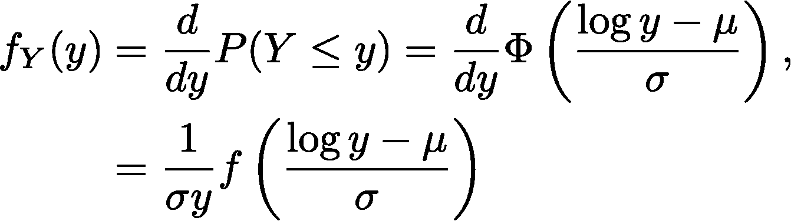

如果我们看一下一个标准法线的 CDF 的[方程，这个计算并没有那么难。最后，为了找到模式，我们可以最大化 PDF，这相当于为对数正态分布找到最频繁的值。](https://en.wikipedia.org/wiki/Normal_distribution#Cumulative_distribution_function)

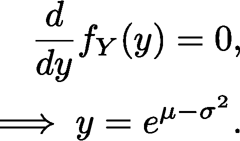

这给出了从正态分布生成的对数正态分布模式的一般表达式。让我们验证一下我们是否得到了与模拟相同的答案。

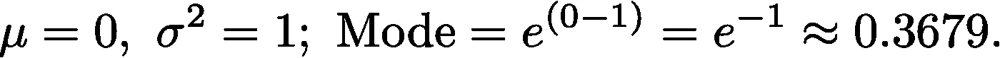

尽管估计的模式似乎与真实值略有偏差，但根据[大数定律](https://en.wikipedia.org/wiki/Law_of_large_numbers)，它收敛到真实值(快速证明:如果我们对模式使用指示函数，并计算我们对模式采样的次数，则当 N → ∞时，比例将收敛到 e⁻)。

感谢你阅读这篇文章。我希望你和我一样喜欢探索这个想法。如果你对代码(用 R 写的)感兴趣，你可以在这里找到它[。](https://github.com/sahilgupta2105/Medium-Articles)