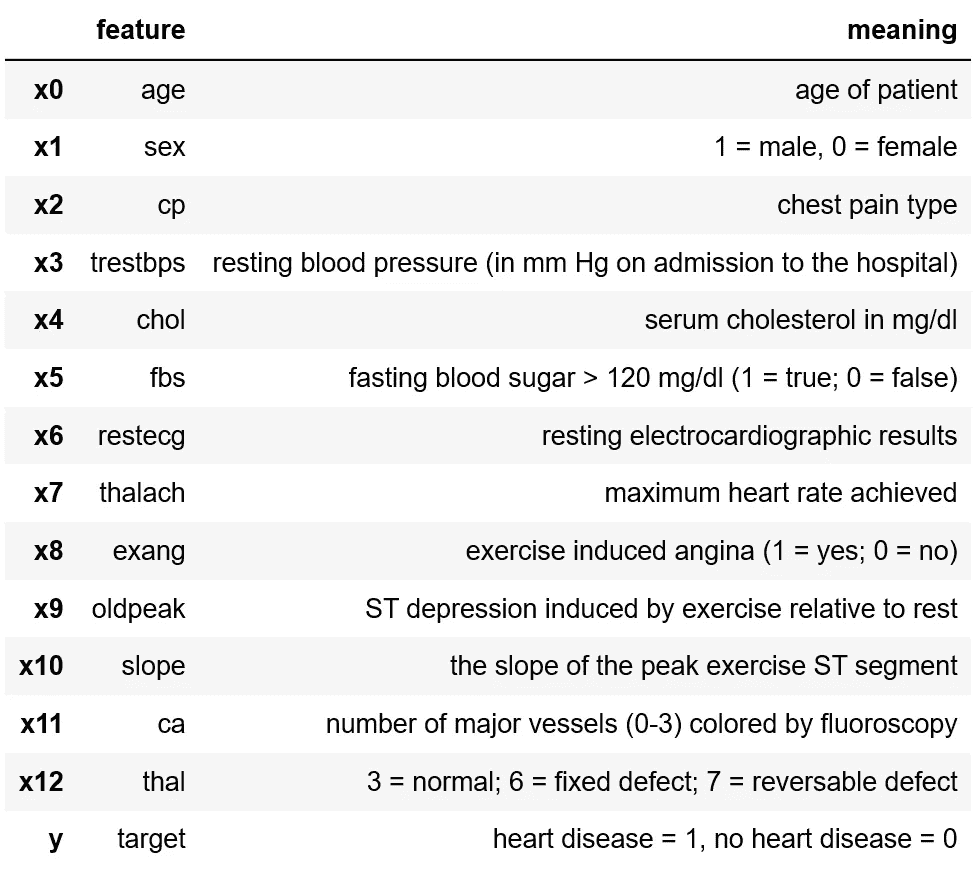
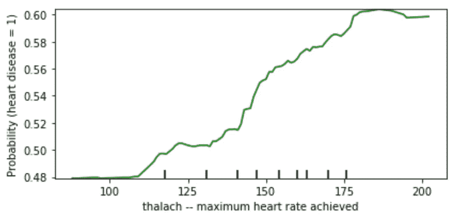
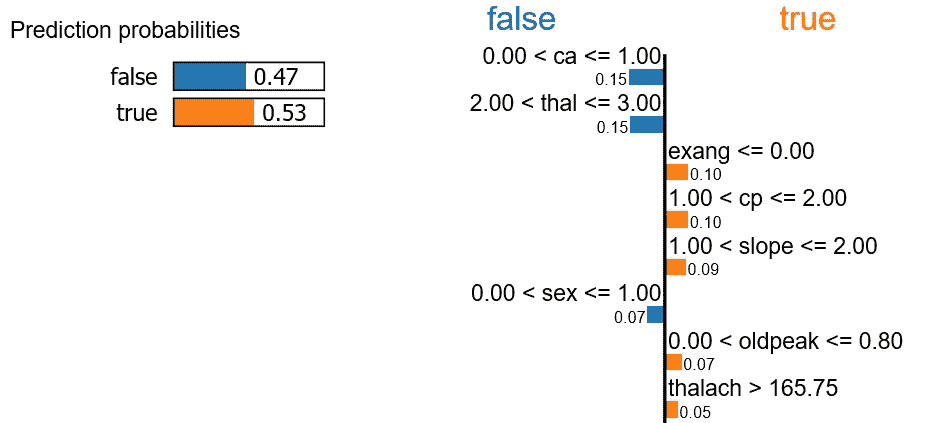

# 解释任何机器学习模型的模型不可知方法

> 原文：<https://towardsdatascience.com/model-agnostic-methods-for-interpreting-any-machine-learning-model-4f10787ef504?source=collection_archive---------7----------------------->

## 解释方法概述:排列特征重要性，部分依赖图，石灰，SHAP 等。

Lukasz Szmigiel 在 [Unsplash](https://unsplash.com?utm_source=medium&utm_medium=referral) 上的照片

**越来越多的公司正在使用复杂的机器学习模型，比如神经网络和梯度推进机器。他们使用复杂模型的原因是因为它们优于传统模型，如决策树或逻辑回归。使用复杂模型的负面影响是你不能直接解释那些模型。你不想要一个有偏见的模型，或者一个根据陌生或不相关的知识做出选择的模型。过去的经验，如亚马逊或教师的经历，表明了解释复杂模型的重要性。了解模型做出决策的原因有积极的副作用，例如，您可以了解模型发现的新模式，并了解更多关于您的数据的信息。**

对于机器学习模型的可解释性已经做了很多研究。有不同的方法来解释机器学习模型。最容易的划分是在可解释模型和模型不可知方法之间。可解释的模型是解释它们自己的模型，例如从决策树中你可以很容易地提取决策规则。模型不可知方法是可以用于任何机器学习模型的方法，从支持向量机到神经网络。在本文中，重点将放在与模型无关的方法上。还有另一篇关于可解释模型的文章。

## 资料组

您可以使用模型可解释性的一个领域是医疗保健。为了了解模型如何决定一个人是否患有心脏病，我们使用了克利夫兰数据库中具有以下特征的数据集:

我们将尝试用随机森林来预测目标，并用模型不可知的方法来解释这个模型。你可以在 Kaggle 上找到[心脏病 UCI 数据集。](https://www.kaggle.com/ronitf/heart-disease-uci)

## 密码

这篇关于模型不可知方法的文章(以及关于可解释模型的文章)的代码可以在 [GitHub](https://github.com/henniedeharder/interpretability-heart/blob/master/Demo_Forest_SHAP_Heart.ipynb) 上找到。

# 模型不可知的方法

不幸的是，直接解释大多数机器学习模型是不可能的。对于像随机森林、梯度增强机器和神经网络这样的流行模型，你需要与模型无关的方法。目前有一些有趣的方法可用，如排列特征重要性，部分依赖图(PDP)，个体条件期望(ICE)图，全局代理模型，局部可解释模型不可知解释(LIME)和 Shapley 加法解释(SHAP)。我们将深入研究这些方法，并讨论它们的优缺点。

## 置换特征重要性

你使用 scikit-learn⁴的特征重要性吗？这些特征的重要性基于标准的平均减少，如基尼系数(对于决策树和随机森林)。最好使用排列特征重要性。使用这种方法，重要度是基于在置换要素值时测量预测误差的增加。因此，您需要计算两次预测误差，在特征置换之前和之后。预测误差之间的差异越大，该特征越重要。

现在，我们将比较随机森林的 scikit-learn 特征重要性和置换特征重要性:

sci kit-了解随机森林的要素重要性

随机森林的置换特征重要性

哇！如果您将 scikit-learn 特征重要性中的特征顺序与置换特征重要性进行比较，一切都会被打乱！根据最后一张图片，我们应该尝试排除 chol 和 exang，因为当这些特征被置换时，模型执行得更好！对于特征 fbs、trestbps 和 age，什么都不会发生(如果我们忽略方差)。

## *部分相关图(PDP)*

这些图有助于可视化预测目标和一个或多个特征之间的平均部分关系。通过强制所有实例具有相同的特征值来创建图。然后对这些实例进行预测，并对它们进行平均，这就给出了该特征值的平均预测值。由于可视化，大多数时候只研究一两个特征。

为了对 PDP 有一个概念，下面你可以在心脏病数据集中看到 PDP 的例子。前两个图像在 x 轴上有一个特征，在 y 轴上有心脏病的概率。在第三幅图中，您可以看到两个特征(一个在 x 轴上，一个在 y 轴上)。

一般来说，如果心率加快，患心脏病的可能性就会增加。

胸痛类型是一个分类变量。如果这个值等于 1、2 或 3，那么当这个值等于 0 时，你患心脏病的可能性更大。

该图显示了 oldpeak 和 cp 与平均预测值的关系。当胸痛类型等于 1、2 或 3 且 oldpeak 具有低值时，患心脏病的概率(> 0.63)比 cp 等于 0 且 oldpeak 具有高值(< 0.37).

In PDPs, you force all the instances to have the same feature value. The plots can be misleading if you only have a small amount of instances who have a certain feature value. It’s better to include data distributions in your plot, so you can see if the data is equally distributed.

Watch out with PDPs! It is assumed that features for which you compute the partial dependence are independent. So they shouldn’t be correlated with other features. You can also easily miss complexity of the model, because the predictions are averaged.

## Individual Conditional Expectation (ICE)

A way to deal with the problem of missing complexity in the model with PDPs is to show them in combination with ICE plots⁵. ICE plots are more detailed and show how the prediction of each instance changes when a feature value is changed. In the following images, every blue line represents one instance.

Combined PDP and ICE plot for the ‘sex’ variable.

The ICE plot for the sex (female = 0, male =1) variable is shown above. The average is the thick line in the middle (same line as in the PDPs). You see that for some instances the prediction changes a lot when sex is changed to male, but for some instances the prediction almost stays the same, although it always has a negative effect to be female. On the bottom of the image you see the data distribution.

Combined PDP and ICE plot for the ‘chol’ variable.

This is interesting! The cholesterol variable shows that the pattern is more complicated than you would expect from the PDP, because the instances are spread out all over the place and often they don’t follow the pattern of the thick line. Sometimes a higher cholesterol has a (small) positive effect and sometimes the effect is negative. There are not that many instances that have a cholesterol value above 400 (check out the distribution on the bottom) so we should be careful here!

With ICE plots we solved the problem of PDPs by showing more complexity, but what about the independent features problem? That problem isn’t solved with ICE plots, because the feature you plot still needs to be uncorrelated with the other features.

## Global Surrogate Models

Workflow for a global surrogate model.

Global surrogates are really easy to understand, that’s an advantage of this method. First you build a black box model on the training data with the real labels. Then you let the model predict the labels for the same data and you build an interpretable model on the data with the *预测*标记)时高得多。因为代理模型是可解释的，并且建立在黑盒模型的预测之上，所以您将了解黑盒模型是如何做出预测的。

这种方法很好，因为它很直观。有一些缺点。可解释模型的性能会比黑盒模型差(否则你应该替换黑盒模型)。您需要决定对于可解释模型的性能，什么是可接受的度量。除此之外，可解释模型得出关于黑盒模型的结论，而不是关于数据的结论。

## 局部可解释的模型不可知解释(LIME)

当你想解释一个单独的预测时，你可以用石灰。用 LIME 训练一个局部代理模型。这个可解释的替代模型可以用来解释个体预测。您不仅可以在表格数据上使用石灰，还可以在图像或 text⁶.上使用石灰

下图直观地展示了 LIME 的工作方式。红色加号和蓝色圆点是来自不同班级的样本。粉色和蓝色区域之间的边界是黑盒模型的决策边界。如果您想解释下图中的大红色加号，您可以创建其他实例，这些实例与可解释模型的局部决策边界(虚线)非常接近。这个局部决策边界比粉红色和蓝色区域之间的边界(黑盒模型的决策边界)更容易解释。

让我们从测试集中取一个新记录:

而现在，让我们用石灰来解释这个记录的预言:

千钧一发！我们看到，对于真(心脏病= 1)的预测概率略高于假(心脏病= 0)的预测概率。在右侧，我们可以看到哪些特征对预测贡献最大。

就像其他解释方法一样，你需要小心使用石灰。同一个记录解释两次，解释可以不一样！另一个缺点是你只能解释一个实例，所以不可能解释整个黑盒模型。

## *沙普利加法解释(SHAP)*

如果您想要一种非常好的方式来显示特征值对预测的贡献，您应该使用 SHAP。对于这种方法，沙普利值(来自博弈论)和石灰是 combined⁷.简而言之，shapley 值使用联合来查看某个特征值对最终预测的贡献。

被调查的记录和我们用于石灰的记录是一样的。预测概率等于 0.53。该值略低于基准值 0.5486。红色特征，如 cp 和 oldpeak 增加了患心脏病的可能性，而 ca 和 thal 降低了患心脏病的可能性。

如果我们将测试集中的所有样本旋转 90 度，将它们堆叠并按相似性排序，我们会得到上面的图像。

上面的汇总图显示了高或低特征值的不同 SHAP 值。如果您查看 ca 特征，您会发现当该特征的值较低时，SHAP 值较高，这意味着患心脏病的可能性较高。该图还向我们展示了最重要的特征到最不重要的特征(从上到下)。

SHAP 值有一些优势，因为我们可以用它们来进行局部和全局的解释。而且他们有很强的理论基础。开始时，它们不能处理相关的特性，但是研究表明，它们可以和相关的 features⁸.一起使用 SHAP 值的一个问题是计算速度，当您拥有许多要素时，计算时间将显著增加。

希望您可以使用这些方法来调查您的数据和模型！

[1] J. Dastin，[亚马逊废除了对女性有偏见的秘密人工智能招聘工具](https://www.reuters.com/article/us-amazon-com-jobs-automation-insight/amazon-scraps-secret-ai-recruiting-tool-that-showed-bias-against-women-idUSKCN1MK08G) (2018)，路透社

[2]c·奥尼尔，[数学毁灭的武器](https://we.riseup.net/assets/404114/Weapons+of+Math+Destruction+Cathy+O%27Neil.pdf) (2016)，新冠

[3] A. Altmann 和 L. Toloş，[排列重要性:一个修正的特征重要性度量](https://academic.oup.com/bioinformatics/article/26/10/1340/193348) (2010)，生物信息学

[4] T. Parr，K. Turgutlu，C. Csiszar 和 J. Howard，[当心默认随机森林重要性](https://explained.ai/rf-importance/index.html) (2018)，解释. ai

[5] A. Goldstein，A. Kapelner，J. Bleich 和 E. Pitkin，[窥视黑盒内部:用个体条件期望图可视化统计学习](https://arxiv.org/pdf/1309.6392.pdf) (2014)，《计算和图形统计杂志》

[6] M. T .里贝罗，s .辛格和 C. Guestrin，[“我为什么要相信你？”解释任何分类器的预测](https://www.kdd.org/kdd2016/papers/files/rfp0573-ribeiroA.pdf) (2016)，ResearchGate

[7] S. Lundberg 和 S. Lee，[解释模型预测的统一方法](https://papers.nips.cc/paper/7062-a-unified-approach-to-interpreting-model-predictions.pdf) (2017)，NIPS

[8] K. Aas 和 M. Jullum，[解释特征相关时的个体预测:更精确地逼近 Shapley 值](https://arxiv.org/pdf/1903.10464.pdf) (2019)，ArXiv