# 模型的复杂性、准确性和可解释性

> 原文：<https://towardsdatascience.com/model-complexity-accuracy-and-interpretability-59888e69ab3d?source=collection_archive---------11----------------------->

## 可解释的人工智能(XAI)

## 模型可解释性的重要性以及可解释性如何随着复杂性的增加而降低


平衡之举:模型准确性与可解释性|鸣谢:kasiastock/Shutterstock

# **简介**

复杂的现实世界挑战需要建立复杂的模型，以最大的准确性给出预测。然而，它们最终并不具有高度的可解释性。在本文中，我们将探讨复杂性、准确性和可解释性之间的关系。

# 动机:

我目前是一名机器学习研究员，正在从事一个关于可解释机器学习的项目。本系列基于我对克里斯托弗·莫尔纳尔的书的实现:[“可解释的机器学习”](https://christophm.github.io/interpretable-ml-book/)。

# **系列:可解释的机器学习**

**第 1 部分:模型的复杂性、准确性和可解释性**

我们将使用真实世界的数据集来展示机器学习模型的复杂性、准确性和可解释性之间的关系。我们将尝试越来越复杂的机器学习模型，看看准确性如何提高，可解释性如何降低。

**第 2 部分:拆箱“黑盒”模型**

我们将使用最复杂的模型作为我们的最终模型，因为它提供了非常高的准确性，并使用[“可解释的机器学习”](https://christophm.github.io/interpretable-ml-book/)实施模型不可知的方法来解释该模型，请参考此处:

[https://medium . com/@ sajee . a/unboxing-the-black-box-models-23b 4808 a3 be 5](https://medium.com/@sajee.a/unboxing-the-black-box-models-23b4808a3be5)

# 内容:

1.  准确性与可解释性
2.  复杂性和准确性
3.  可解释性的重要性
4.  实施——复杂性如何增加，可解释性如何降低

# 模型准确性与可解释性

在现实世界中，在处理任何问题时，理解模型准确性和模型可解释性之间的权衡是很重要的。业务用户希望数据科学家建立更高精度的模型，而数据科学家面临的问题是向他们解释这些模型如何做出预测。

**什么更重要？？** —拥有一个对未知数据给出最佳精确度的模型，或者即使精确度很低也能理解预测。下面我们比较了传统模型的准确性和可解释性。

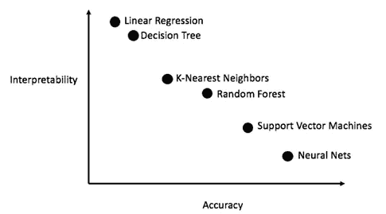

准确性与可解释性

该图显示了一些最常用的机器学习算法以及它们的可解释性。就机器学习模型在下面如何工作而言，复杂性增加了。它可以是参数模型(线性模型)或非参数模型(K-最近邻)、简单决策树(CART)或集成模型(Bagging 方法-随机森林或 Boosting 方法-梯度 Boosting 树)。复杂的模型通常能提供更准确的预测。然而，解释它们更困难。

# 模型复杂性和准确性

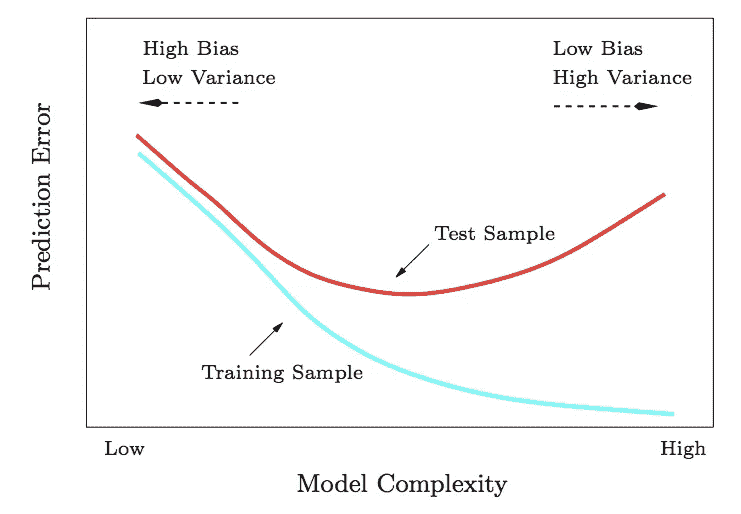

典型的精度-复杂度权衡

任何监督机器学习算法的目标都是实现低偏差和低方差。然而，这在现实生活中是不可能的，我们需要在偏差和方差之间进行权衡。

**线性回归**假设线性，但实际上关系相当复杂。这些简化的假设给了**很高的偏差**(训练和测试误差很高)，并且模型趋向于**欠拟合**。高偏差可以通过使用复杂函数或添加更多功能来降低。这时复杂性增加了，准确性也提高了。在某一点上，模型将变得过于复杂，并且倾向于**过度拟合**训练数据，即**低偏差**但**高方差**用于测试数据。像**决策树**这样的复杂模型往往会过度拟合。

通常有过度拟合机器学习模型的趋势，因此，为了克服这一点，我们可以使用重采样技术(**交叉验证**)来提高对未知数据的性能。

# 模型可解释性的重要性

在预测的影响较高的用例中，理解**【为什么】**做出某个预测是非常重要的。知道“为什么”可以帮助你更多地了解问题、数据和模型可能失败的原因。

了解可解释性的原因:

1.  **好奇心&学习**
2.  **安全措施** —确保学习无误
3.  调试到**检测模型训练中的偏差**
4.  可解释性增加**社会接受度**
5.  **调试和审计**机器学习模型

# **实施:**

**数据集—自行车租赁预测**

自行车租赁数据集可以从 http://archive.ics.uci.edu/ml/datasets/Bike+Sharing+Dataset 的 UCI 机器学习库[找到。](http://archive.ics.uci.edu/ml/datasets/Bike+Sharing+Dataset)

该数据集包含华盛顿自行车租赁公司 Capital-Bikeshare 每天租赁自行车的数量，以及天气和季节信息。

**目标:** **根据天气和当天的情况预测将会租出多少辆自行车。**

**输入变量:**

1.  Total_count (target):租赁自行车总数，包括休闲自行车和注册自行车
2.  年:年(0: 2011，1:2012)
3.  月:月(1 到 12)
4.  小时:小时(0 到 23)
5.  Temp:以摄氏度为单位的标准化温度。这些值是通过(t-t_min)/(t_max-t_min)，t_min=-8，t_max=+39(仅限于小时刻度)得出的
6.  Atemp:归一化的感觉温度，单位为摄氏度。这些值是通过(t-t_min)/(t_max-t_min)，t_min=-16，t_max=+50(仅在小时范围内)得出的
7.  湿度:标准化湿度。这些值除以 100(最大值)
8.  风速:归一化风速。这些值除以 67(最大值)
9.  假日:一天是否是假日
10.  工作日:一周中的某一天
11.  工作日:如果一天既不是周末也不是假日，则为 1，否则为 0
12.  季节:季节(1:冬天，2:春天，3:夏天，4:秋天)
13.  天气:

*   1:晴朗，少云，部分多云，部分多云
*   2:薄雾+多云，薄雾+碎云，薄雾+少云，薄雾
*   3:小雪，小雨+雷雨+散云，小雨+散云
*   4:暴雨+冰托盘+雷雨+薄雾，雪+雾

**功能:**

```
Index(['month', 'hr', 'workingday', 'temp', 'atemp', 'humidity', 'windspeed','total_count', 'season_Fall', 'season_Spring', 'season_Summer','season_Winter', 'weather_1', 'weather_2', 'weather_3', 'weather_4','weekday_0', 'weekday_1', 'weekday_2', 'weekday_3', 'weekday_4','weekday_5', 'weekday_6', 'holiday', 'year'],dtype='object')
```

**探索性数据分析:**

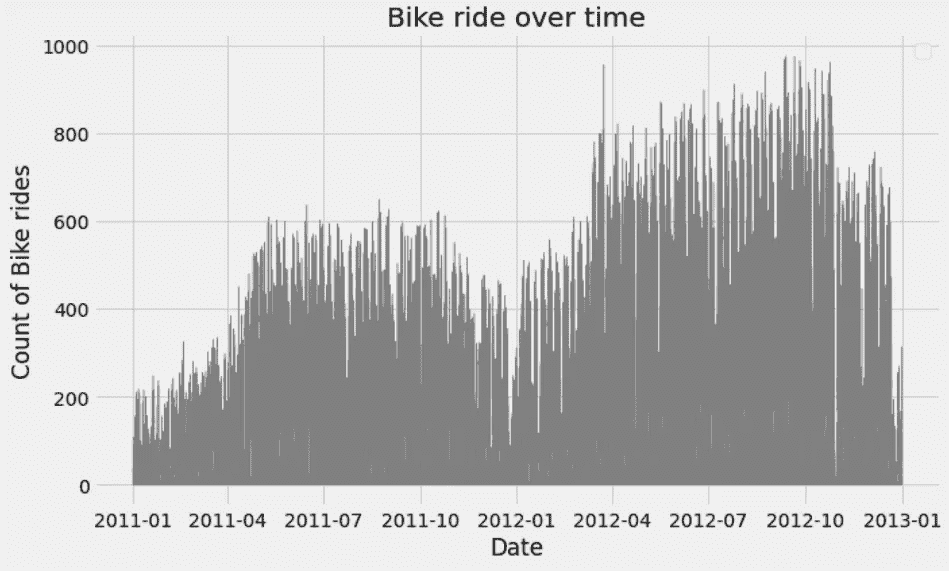

骑自行车的人在一段时间内会增加

从 2011 年到 2012 年的两年间，骑自行车的次数增加了。

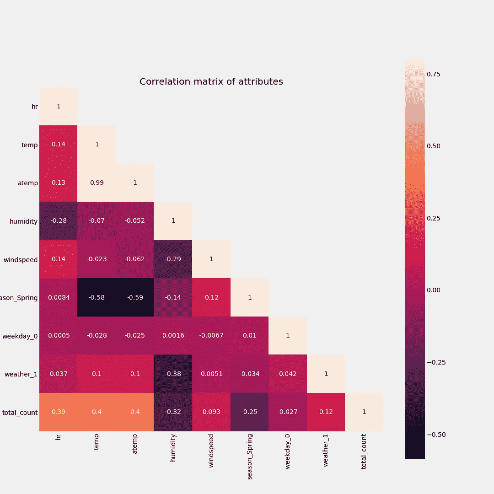

相关矩阵

风速和湿度略有负相关。Temp 和 atemp 携带相同的信息，因此高度正相关。因此，为了构建模型，我们可以使用 temp 或 atemp。

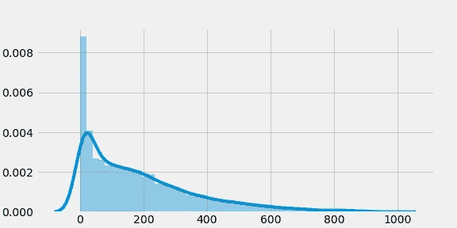

目标直方图:大部分时间骑自行车的次数在 20-30 次/小时左右

**预处理:**

删除像因果图这样的特征，因为它们与 total_count 相同。同样，对于与 temp 相同的 atemp 等要素，删除一个要素以减少多重共线性。对于分类特征，使用 OneHotEncoding 方法将其转换为更适合回归模型的格式。

**模型实现:**

我们将研究越来越复杂的模型，看看可解释性如何降低。

1.  多元线性回归(线性，单一性)
2.  决策树回归器
3.  梯度推进回归器

## **多元线性回归:**

涉及多个变量的线性回归称为“多元线性回归”或“多元线性回归”。

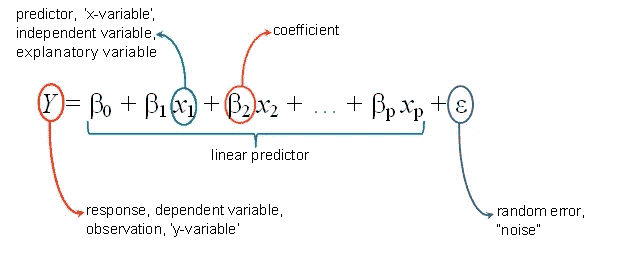

[来源](https://hackernoon.com/an-intuitive-perspective-to-linear-regression-7dc566b2c14c)

多元线性回归(MLR)的目标是对解释变量(自变量)和响应变量(因变量)之间的线性关系进行建模。从本质上说，多元回归是普通最小二乘(OLS)回归的延伸，涉及一个以上的解释变量。

回归带有一些在真实世界数据集不实用的假设。

1.  线性
2.  同方差(恒定方差)
3.  独立性ˌ自立性
4.  固定功能
5.  多重共线性缺失

线性回归实现:

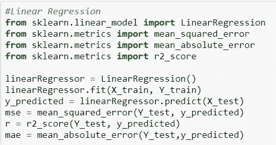

线性回归结果:

```
Mean Squared Error: 19592.4703292543
R score: 0.40700134640548247
Mean Absolute Error: 103.67180228987019
```

使用交叉验证:

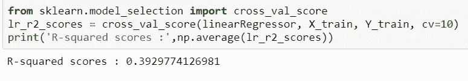

**解读多元线性回归:**

解释线性模型更容易，我们可以研究每个变量的系数，以了解它对预测的影响以及截距的斜率。

**方程的截距(Bo):**

**截距**表示当没有任何特征有任何影响(x=0)时 y(目标)的值。

```
18.01100142944577
```

对应于 x 列的系数有助于我们理解每个特征对目标结果的影响。

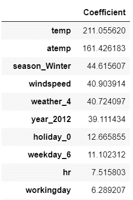

这意味着“温度”每增加一个单位，自行车骑行次数就会增加 211.05 个单位。这同样适用于 rest 特征

# 决策树回归器:

决策树的工作原理是以贪婪的方式将数据反复分割成不同的子集。对于回归树，它们被选择来最小化所有子集内的 MSE(均方误差)或 MAE(平均绝对误差)。

**CART —分类和回归树:**

CART 采用一个特征，并确定哪个分界点使回归任务的 y 方差最小。方差告诉我们一个节点中的 y 值围绕其平均值分布了多少。分割基于最小化基于决策树中使用的所有子集的平均值的方差的特征。

```
DecisionTreeRegressor(ccp_alpha=0.0, criterion='mse', max_depth=None,max_features=None, max_leaf_nodes=15,
min_impurity_decrease=0.0, min_impurity_split=None,
min_samples_leaf=1, min_samples_split=10,
min_weight_fraction_leaf=0.0, presort='deprecated',
random_state=None, splitter='best')
```

**决策树结果:**

决策树回归结果更符合数据。

```
Mean Squared Error: 10880.635297455
R score: 0.6706795022162286
Mean Absolute Error: 73.76311613574498Decision tree split:
```

决策树比线性回归更适合模型。 **R 平方值约为 0.67** 。

**使用交叉验证:**

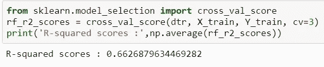

**决策树图:**

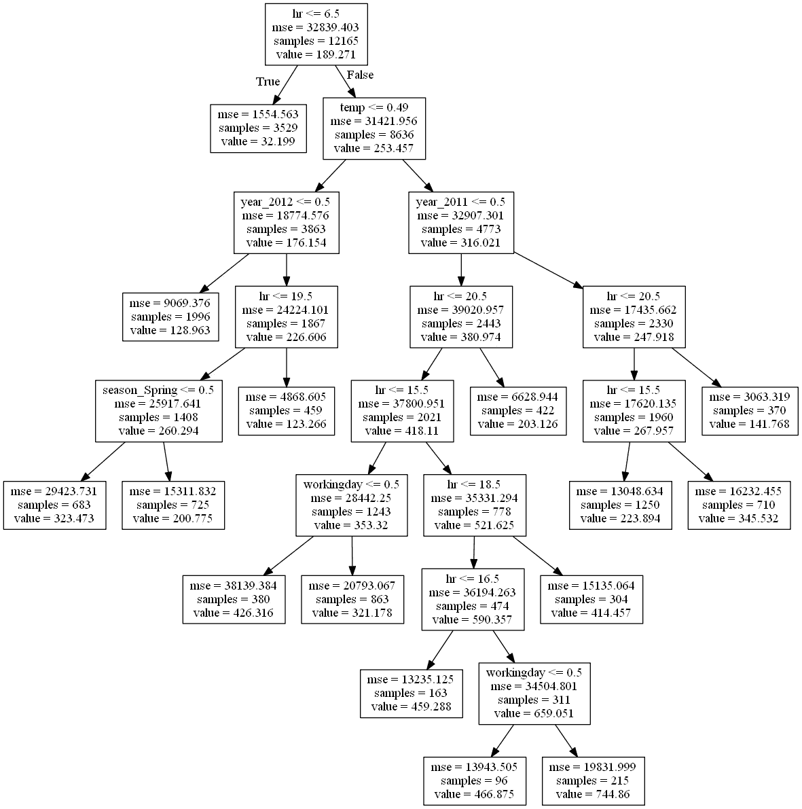

决策树回归器输出

**解释决策树:**

**特征重要性:**

特征重要性基于减少使用该特征的所有分割的最大方差的重要性。一个特征可以用于多个分割，或者根本不使用。我们可以将每个 p 特征的贡献相加，并得到每个特征对预测贡献的解释。

我们可以看到特征:hr、temp、year、workingday、season_Spring 是用来分割决策树的特征。

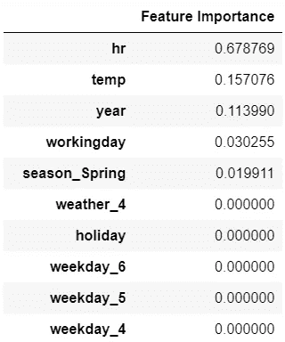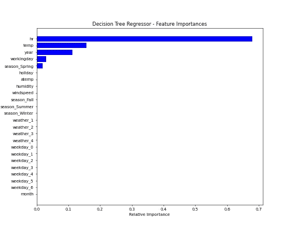

决策树回归器—特征重要性条形图

# 梯度推进回归器:

增强是一种集合技术，其中预测器不是独立产生的，而是顺序产生的。梯度提升使用决策树作为弱模型。

Boosting 是一种将弱学习者转化为强学习者的方法，通过以渐进、累加和顺序的方式训练许多模型，并在最终模型中**最小化损失函数**(即回归问题的**平方误差**)。

GBR 因其 Boosting 技术而比其他回归模型具有更高的精度。这是竞赛中最常用的回归算法。

```
GradientBoostingRegressor(alpha=0.9, ccp_alpha=0.0, criterion='friedman_mse',init=None, learning_rate=0.1, loss='ls', max_depth=6,max_features=None, max_leaf_nodes=None, min_impurity_decrease=0.0, min_impurity_split=None, min_samples_leaf=1, min_samples_split=2,
min_weight_fraction_leaf=0.0, n_estimators=100, n_iter_no_change=None, presort='deprecated',random_state=None, subsample=1.0, tol=0.0001,validation_fraction=0.1, verbose=0, warm_start=False)
```

来自 GBR 的结果如下:

```
Mean Squared Error: 1388.8979420780786
R score: 0.9579626971080454
Mean Absolute Error: 23.81293483364058
```

**梯度推进回归器给出了最佳的 R2 平方值 0.957** 。然而，要解释这个模型是非常困难的。

**解释集合模型:**

集合模型肯定属于“**黑盒**”模型的范畴，因为它们由许多潜在复杂的个体模型组成。

使用随机选择的特征对袋装数据按顺序训练每棵树，因此通过检查每棵树来获得对决策过程的全面理解是不可行的。

**第二部分:解释梯度推进回归器模型的模型不可知方法—**[https://medium . com/@ sajee . a/unboxing-the-black-box-models-23b 4808 a3 be 5](https://medium.com/@sajee.a/unboxing-the-black-box-models-23b4808a3be5)

**参考文献:**

[https://christophm.github.io/interpretable-ml-book/](https://christophm.github.io/interpretable-ml-book/)