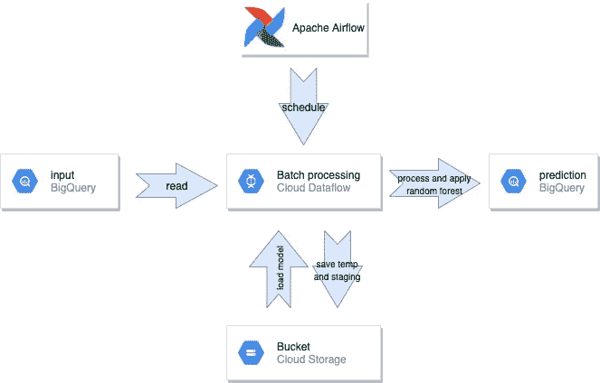
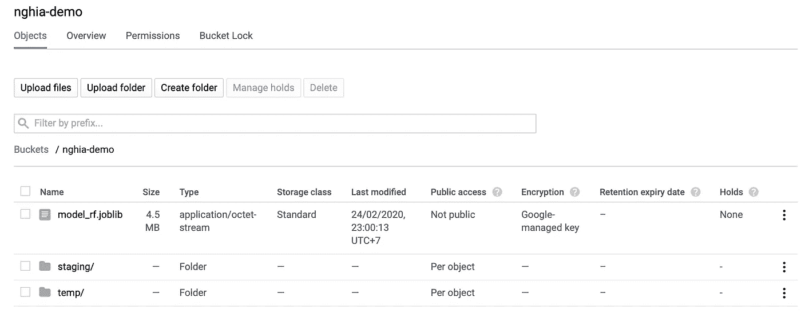
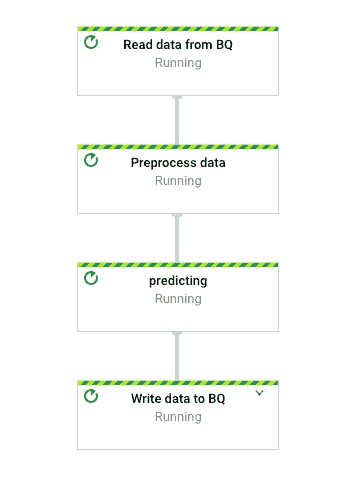
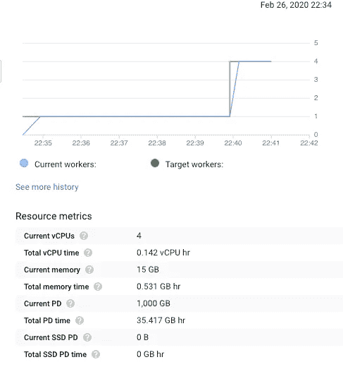
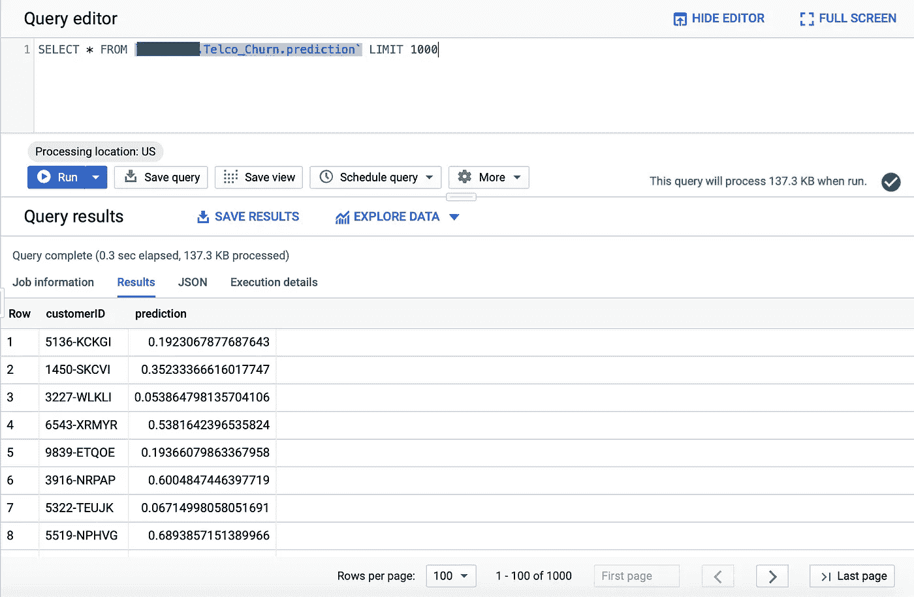

# 使用 Apache Beam 和数据流进行模型部署

> 原文：<https://towardsdatascience.com/model-deployment-with-apache-beam-and-dataflow-be1175c96d1f?source=collection_archive---------13----------------------->

## 使用 Apache Beam / Dataflow、BigQuery 和 Scikit-learn 快速简单地操作分析模型的选项


照片来自 Pixabay

对于一些数据科学家来说，操作数据科学模型有时可能会有压力。你的模型越复杂，生产时你面临的困难就越多。在开发客户流失分类器时，你是否后悔过将 5 个不同的模型集合在一起？别担心，阿帕奇光束来救援了。

在开始使用 Apache Beam 之前，让我们看看您有哪些选项来操作您的模型。第一个选项是在云上创建一个虚拟机(VM)来执行计算任务。很公平，但是设置和管理虚拟机将是一件令人头痛的事情，因为它需要大量的手动工作(您的云工程师不会喜欢它！).Cloud Dataproc 有助于释放管理需求，并且是另一个值得考虑的好选择，因为它提供的计算资源只在一次运行期间有效。然而，您需要花一些时间将 Python 代码转换成 PySpark 或 Scala，更不用说您可能无法完全复制您在 Python 中使用这些编程语言所做的事情。如果这些问题对你来说不是一个挑战，请查看我的同事发来的[这篇精彩的帖子](https://medium.com/vinid/what-i-learned-about-deploying-machine-learning-application-c7bfd654f999)，但是如果是，数据流可能是一个不错的选择，因为:

1.  您可以使用 Apache Beam Python SDK 编写 Python3 来创建运行在 DataflowRunner 后端的数据管道。那是什么意思？这意味着您可以编写 Python3 来构建您的管道，并直接操作您基于 Python 构建的 ML 模型，而无需将它们转换为 Scala 或 PySpark。
2.  Dataflow 是一项完全托管的服务，通过自动扩展员工资源来最大限度地减少延迟、处理时间和成本。

# 简介:什么是什么？

你可能会对“Google Cloud Dataflow”和“Apache Beam”这两个术语感到困惑，就像我第一次知道它们一样，那么这些术语是什么意思呢？Apache Beam 是一个开源的统一模型，它允许用户通过使用一个开源的 Beam SDK(Python 就是其中之一)来定义数据处理管道，从而构建一个程序。然后，管道由 Beam 管道运行器翻译，由分布式处理后端(如 Google Cloud Dataflow)执行。越来越清晰了？好，我们开始吧！

# **用例**

假设您是一家电信公司的数据科学家，您的工作是使用您的数据工程团队准备的客户数据来预测哪些客户将会流失。为了便于说明，我将在本教程中使用常见的电信客户流失数据集。这是一个非常小的公共数据集，形状为(7043，21)。你可以下载一下，在这里快速看一下专栏描述[。](https://www.kaggle.com/blastchar/telco-customer-churn)

理解数据后，让我们对其进行预处理，并使用 Scikit-learn 的 RandomForestClassifier 开发一个简单的模型。

预处理输入并开发分类器模型

该模型在测试集上给出了 81.17%的准确度和 AUC = 0.7023，然而这不是理想的性能。让我们假设您的涉众对此有些满意，那么您将需要转储这个模型以将其部署到生产中。

```
from joblib import dump
dump(clf, 'model_rf.joblib')
```

# 您的数据管道

图 1 展示了管道的组件。在高层次上，这是一个 *BigQuery-to-BigQuery 流*，其中你的 BigQuery (BQ)表形式的输入数据随后被云数据流处理，并被馈送到包含你的客户的 *ID 和流失概率的输出 BQ 表*。在处理过程中，云数据流需要云存储来保存临时和暂存文件，以及加载您开发的随机森林模型。气流组件用于调度此作业，因为您的公司可能需要每周或每月运行客户流失预测。日程安排是一个完全不同的话题，不是这篇文章的重点(我可能会在以后写另一篇关于这个话题的文章)。



图 1:通用数据管道

# 循序渐进的指导

## **设置 GCP**

为了运行数据管道，您需要做一些初始设置。我假设你已经有了一个 GCP 账户，那么你需要遵循 6 个步骤来设置这里提到的数据流服务，否则你需要注册一个 300 美元的免费账户，[链接](https://cloud.google.com/free/)。

您还需要在云存储中创建一个 bucket，其中包括您的模型(作为 joblib 或其他序列化形式)和两个文件夹:temp 和 staging。



图 2: GCS 存储桶结构

接下来，您需要在 BigQuery 中创建一个数据集和一个表。为了便于说明，我将使用去掉标签的相同训练数据集(来自上面的 Kaggle 链接)，*，但在实践中*，您将对新的和未标记的数据运行预测。上传数据到 BQ 是非常简单的，你可以很容易地按照[这个指令](https://cloud.google.com/bigquery/docs/loading-data)去做。注意，在上传之前您需要清理一下您的数据，因为`TotalCharges`中有非数字值。

上传前的小数据清理

## **对数据流进行编码**

首先，每个波束管道中有 4 个关键术语:

1.  **流水线:**每个 Beam 程序的基础部分，一个`Pipeline`包含整个数据处理任务，从 I/O 到数据转换。下面的代码片段展示了一个 4 步管道图；三个关键元素`I/O transform`、`PCollection`、`PTransform`被包裹在`Pipeline`里面。

波束管道示意图

2. **I/O 转换:**读取输入，写入输出。

3.**p 集合:**表示某种形式的数据，可能是分布式的。初始输入`PCollection`通常从某个数据集加载，通常是 JSON 格式(类似于带字典的),包括键和键值`{“key1”: “key_value1”, “key2”: “key_value2”,…, “keyn”: “key_valuen”}`。在上面的例子中，`p`是一个`PCollection`。

4. **PTransform:** `PTransform`是通过管道运算符(`|`)应用于`PCollection`的每个元素的变换操作。束核变换有几种类型，包括:`ParDo`(并行 do)`GroupByKey``CoGroupByKey``Combine``Flatten``Partition`。更多详情请参考官方[梁文档](https://beam.apache.org/documentation/programming-guide/)，本帖不一一介绍。

回到我们的用例，类似于开发阶段，您需要实现两个转换步骤，包括输入格式化和预测。应用这些步骤需要由分布式处理功能以`DoFn`对象的形式定义的`ParDo`转换。下面的代码片段展示了与上面提到的两个步骤相对应的两个`DoFn`对象。

用于 ParDo 变换的 DoFn 类

最后，输出数据通过 WriteToBigQuery 模块写入 BigQuery。如果目标表不存在，可以通过设置`create_disposition` = 'CREATE_IF_NEEDED '来创建一个新表，如果目标表已经有一些数据，可以通过设置`write_disposition`参数来截断、追加或引发错误。

有几个强制管道选项需要在代码中或运行时设置为参数(然后您需要在代码中用`ArgumentParser()`定义参数)。

管道选项

## 运行管道

有几种不同的方式来运行管道。您可以从 Cloud Shell、本地终端或您的编程 IDE 运行它。这真的取决于你。在本教程中，我选择从本地终端运行作业。

首先，记得激活您用来编写管道代码的 Python 虚拟环境。我是通过 Anaconda 创建的，所以我需要运行:

```
conda activate /path/to/your/venv
```

如果您没有将环境变量`GOOGLE_APPLICATION_CREDENTIALS`设置为包含您的服务帐户密钥的 JSON 文件的路径。你需要现在就做。之后，您就可以进入包含您的作业的目录并运行它了。

```
cd path/to/your/main.py
python main.py
```

如果作业正在运行，您可以转到 Dataflow 选项卡来查看您的管道，您将能够看到如图 3 所示的管道。



图 3:云数据流管道

如果您在屏幕右侧查看您的工作信息，您将能够看到云数据流的自动缩放机制，它会根据数据量自动将员工数量从 1 增加到 4。



图 4:云数据流作业信息

这项工作通常在 15 分钟内完成(检查您的许可和启动 worker 也需要相当长的时间)。随后，您的输出就可以使用了。让我们尝试运行下面的查询，然后看看输出。

```
SELECT * FROM `your_project.your_dataset.your_tablename` LIMIT 1000
```



图 5:对最终输出的查询

# 关键要点

部署您的数据科学模型有时很困难，但我希望本教程对那些选择云数据流进行操作的人有用。让我总结一下我在本教程中提到的一些要点。

1.  Apache Beam 允许您在 Python 3 中开发数据管道，并作为后端运行程序在云数据流中执行它。
2.  云数据流是一种完全托管的服务，支持资源的自动扩展。
3.  [最终输出 p 集合]=([初始输入 p 集合] | [第一 p 变换] | [第二 p 变换]
4.  您可以通过云外壳、本地终端或 IDE(如 PyCharm)运行数据流作业。

本教程主要关注如何使用 Apache Beam 创建和运行数据管道。实际上，您可能还需要安排作业每天、每周或每月自动运行。此外，我还没有从您的服务帐户中提到 Cloud IAM 的作用。目前，我将它设置为项目的所有者，这已经足够了，我敢打赌你的 Cloud DevOps 团队在实践中很少让这种情况发生。我计划在接下来的文章中讨论这些话题。敬请期待！

感谢阅读。快乐学习。

我的 Github 库:[https://github.com/nghiamab/dataflow-demo](https://github.com/nghiamab/dataflow-demo)

# 参考

[1] Nike Nano，Apache Beam+Scikit learn(sk learn)(2019)，[https://medium . com/@ niklas . sven . hansson/Apache-Beam-Scikit-learn-19 F8 ad 10d 4d](https://medium.com/@niklas.sven.hansson/apache-beam-scikit-learn-19f8ad10d4d)

[2]官方光束编程指南:【https://beam.apache.org/documentation/programming-guide/ 