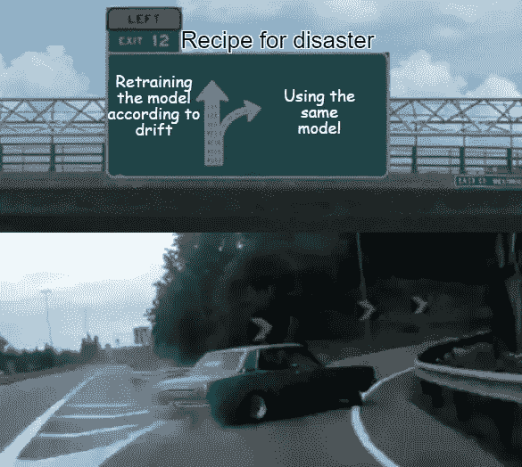
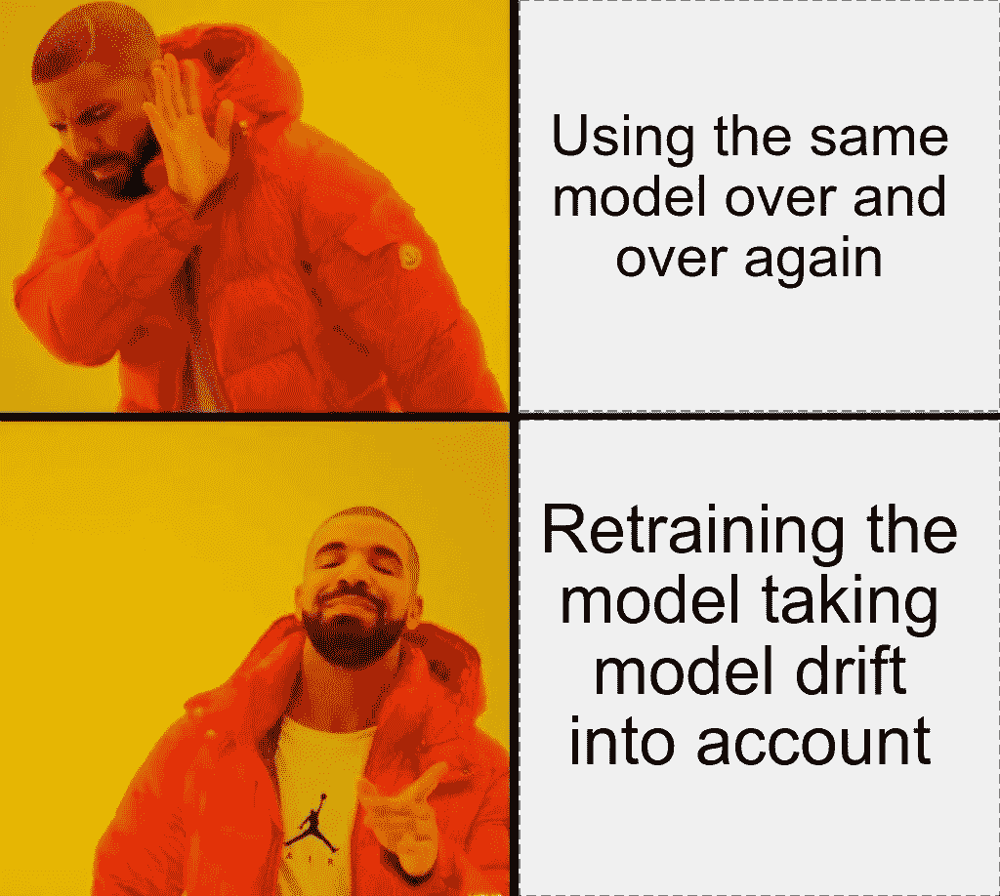

# 机器学习中的模型漂移

> 原文：<https://towardsdatascience.com/model-drift-in-machine-learning-models-8f7e7413b563?source=collection_archive---------12----------------------->

## 机器学习模型应该如何以及何时被重新训练

随着时间的推移，观念、人和社会都发生了巨大的变化。曾经最先进的东西现在已经过时了；同样，现在是新鲜的想法可能几年后会被遗忘。同样，理解变化对企业至关重要。想象一下 15 年前的任何一家手机制造公司。如果他们没有升级到智能手机，他们能养活自己吗？很可能不会。虽然拥有一部普通手机在 15 年前是一种常态，但需求急剧转向智能手机。未能跟上客户行为变化步伐的公司受到的冲击最大。

随着我们进入一个由数据和分析决定的世界，机器学习模型已经成为商业决策的主要驱动力。与任何其他商业战略一样，这些模型需要随着时间的推移进行修改，其背后的技术原因是“模型漂移”。虽然大多数课程、文章和帖子定义了机器学习(ML)生命周期，以数据收集开始，以在各自环境中部署 ML 模型结束，但他们忘记了 ML 生命周期中一个非常重要的特征，即模型漂移。

它本质上意味着目标变量和自变量之间的关系随时间而变化。由于这种漂移，模型不断变得不稳定，预测随着时间不断变得错误。让我们借助简单的线性回归，从技术角度来理解它。在线性回归中，我们简单地映射自变量 x_i 来预测目标变量 *y* :

> y =α+β_ 1 * x1+β_ 2 * x2+β_ 3 * x3+…

其中， *α* 为截距， *β_i* 对应于变量 *x_i.* 的系数

通常，我们假设这种映射是静态的，即我们假设系数 *β_i* (和截距 *α* )不随时间变化，并且控制目标变量 *y* 预测的关系对于未来数据也是有效的。这一假设并不是在所有情况下都适用。如果没有，就会对业务造成严重威胁。这是因为组织的利润在很大程度上依赖于这些模型；虽然这些模型可能代表了开发时的情况，但它们肯定不一定适用于未来。由于潜在条件的这些变化，随着时间的推移，预测将开始变得越来越不准确。

在 [Unsplash](https://unsplash.com?utm_source=medium&utm_medium=referral) 上 [engin akyurt](https://unsplash.com/@enginakyurt?utm_source=medium&utm_medium=referral) 拍摄的照片

## 漂移的类型

模型漂移可以分为两大类。第一种叫做‘概念漂移’。当目标变量本身的统计属性发生变化时，就会发生这种情况。显而易见，如果我们试图预测的变量的真正含义发生了变化，那么这个模型就不能很好地适应这个更新的定义。咄！

第二种也是更常见的类型是“数据漂移”。当预测值的统计属性发生变化时，就会发生这种情况。同样，如果潜在的变量在变化，这个模型注定会失败。这么明显！这种情况可能发生的一个典型例子是当数据中的模式由于季节性而改变时。不管什么样的商业模式在夏天行得通，在冬天可能就行不通了。虽然假期期间航班需求激增，但航空公司很难在淡季保持上座率。另一个例子是当个人偏好改变时，这可以与开头提到的智能手机例子相关。

## 如何解决这个问题？

解决这个问题的最好方法是不断地重新调整模型。基于过去的经验，可以估计漂移何时开始在模型中蔓延。在此基础上，可以主动地重新开发模型，以减轻与漂移相关的风险。

对于数据随时间变化的情况，称重数据可能是一个不错的选择。例如，基于最近的交易来决定某些参数的金融模型可以包含赋予最近的交易更大权重而赋予过去的交易更小权重的特征。这不仅确保了模型的稳健性，也有助于避免与漂移相关的潜在问题。

对抗模型漂移的更复杂的方法是对变化本身建模。开发的第一个模型保持静态，并作为基线。现在，作为最近数据中行为变化的结果，可以建立新的模型来校正该基线模型的预测。

## 模型应该多长时间重新训练一次？

既然我们已经看到了最常见的解决方案涉及到模型的持续重新训练，那么问题就来了，这需要多久进行一次。对此有多种解决方案，每种方案都因情况而异。

有时候，问题会自己出现。虽然等待问题发生不是最优雅的方法，但对于新模型来说，这仍然是唯一的选择，因为没有过去的历史来了解什么时候事情可能会变得任性。当问题出现时，可以对问题所在进行调查，并进行修改以避免将来出现此类问题。

在其他时候，与模型中处理的实体相关的数据观察季节性的模式。在这里，模型应该根据这些季节进行重新训练。例如，随着节日期间消费的增加，信贷机构需要有特殊的模型来处理这种模式的突然变化。

然而，检测漂移的最佳方式是持续监控。需要以连续的时间间隔监控与模型稳定性相关的指标。这个间隔可以是一周、一个月、一个季度等等。这取决于领域和业务。监控模式可以是手动的，也可以是自动脚本，只要观察到突然的异常，就会触发警报和通知。

这就把我们带到了本文的结尾。正如赫拉克利特的名言，“变化是唯一不变的”。记住这一点，准备好接受和监控这些变化的组织注定会成功。

谢谢大家！