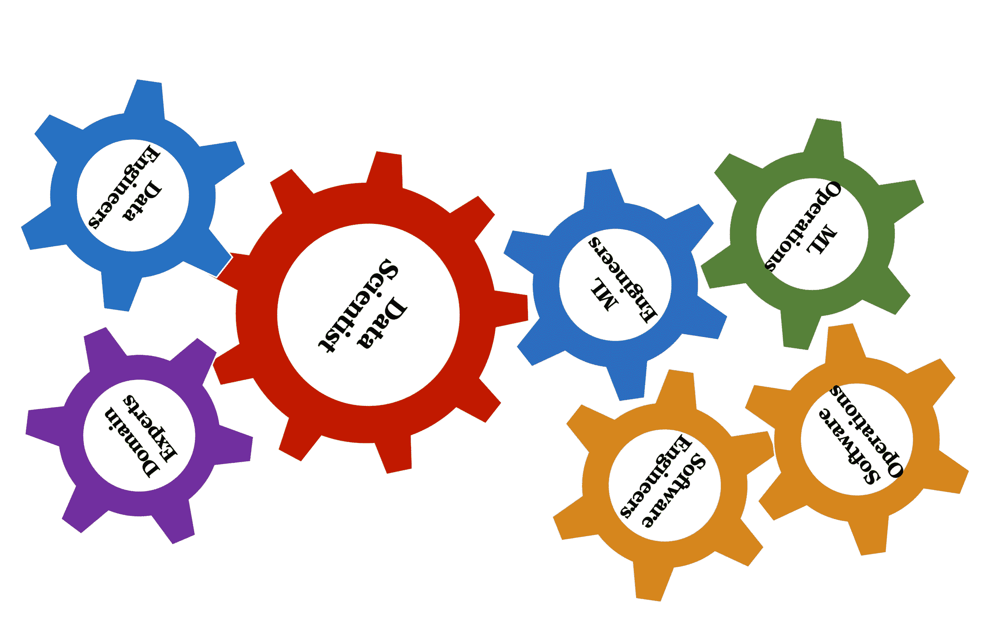
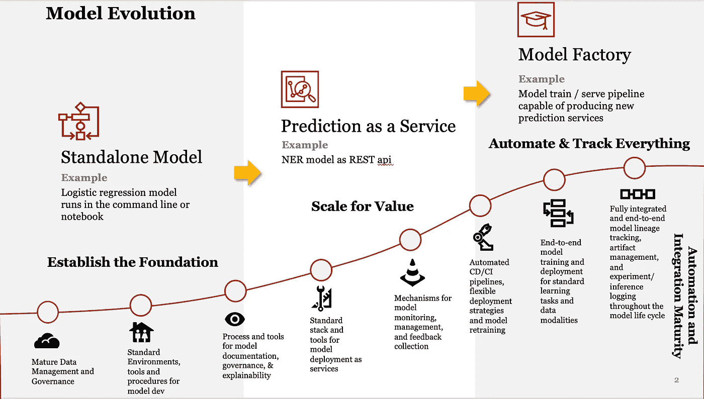
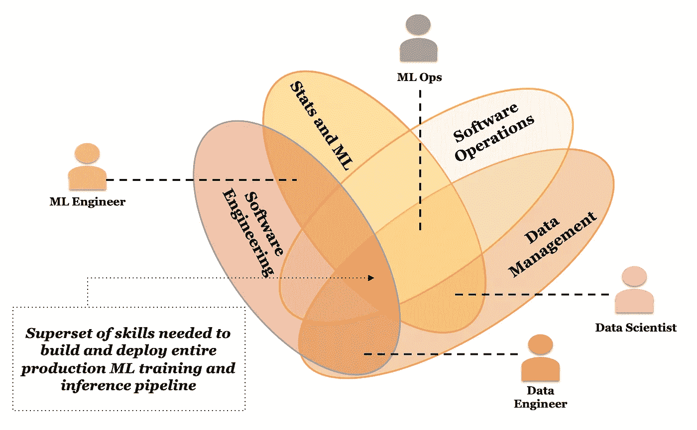
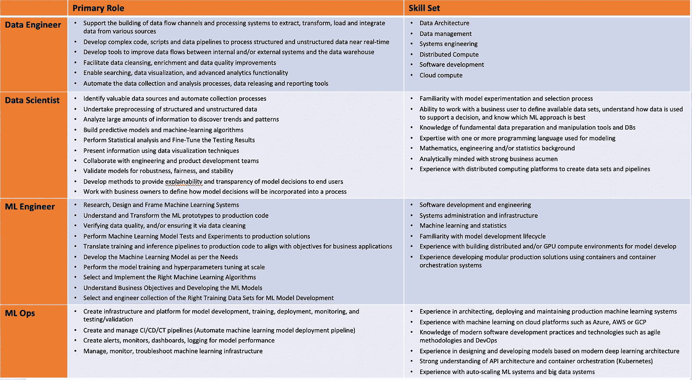

# 模型演进:从独立模型到模型工厂(第 3 部分)

> 原文：<https://towardsdatascience.com/model-evolution-from-standalone-models-to-model-factory-5a8e01fa03cb?source=collection_archive---------40----------------------->

## [数据科学家来自火星，软件工程师来自金星(第三部分)](https://towardsdatascience.com/tagged/model)

## 从火星上的数据科学家到金星上的软件工程师到地球上的模型工

软件、模型和数据交汇处的新兴角色

在本系列的[第 1 部分](/data-scientists-are-from-mars-and-software-developers-are-from-venus-part-1-8dde19fb2eef)中，我们检查了软件和模型之间的关键区别，在[第 2 部分](/consequences-of-mistaking-models-for-software-94d813f115f5)中，我们探索了将模型和软件混为一谈的十二个陷阱。这两篇文章都着重强调了这些问题，但没有提供任何解决方案。在接下来的两篇文章中，我们将重点提供一些解决这些差距的具体实践。

人工智能对全球经济的潜在贡献以及投资人工智能的重要性在商业和技术界得到了广泛认可。在最近的一项首席执行官调查中，超过 85%的首席执行官认为人工智能将极大地改变他们做生意的方式。虽然只有 [6%的受访者承认拥有企业范围的人工智能计划](https://www.pwc.com/gx/en/ceo-survey/2019/report/pwc-22nd-annual-global-ceo-survey.pdf)，但近 [20%的受访者计划在近期内部署企业范围的人工智能](https://www.pwc.com/us/en/services/consulting/library/artificial-intelligence-predictions-2019.html)。在企业范围内部署模型的最大挑战之一是部署模型所花费的时间。在最近的一项调查中，近 [58%的受访公司表示部署模型需要 31 天或更长时间](https://info.algorithmia.com/2020?utm_medium=website&utm_source=resources-page&utm_campaign=IC-1912-2020-State-of-ML)。

## 模型进化

随着我们跟踪并帮助企业从构建简单的分析模型发展到嵌入大型事务性应用程序的更复杂、不断学习的模型，我们看到了三个不同的阶段。

**独立模型阶段:**在这个阶段，公司通常使用命令行界面和 Jupyter 笔记本在独立的基础上部署模型。这些模型通常也更简单，不与数据源或软件应用程序实时交互。公司在一个更大的职能或业务单位的单个团队中使用这些模型。此外，数据科学家通常负责确定模型的范围、设计、构建、部署和维护。这一阶段对于公司证明人工智能/人工智能模型的价值以及了解更广泛使用的挑战至关重要。

**预测即服务阶段:**一旦公司能够展示这些模型的价值，就需要将这些模型的预测提供给企业内的其他团队。此外，随着大公司中的多个团队开始构建他们自己的模型，出现了大量的重复工作、技能，以及架构、设计模式和工具的异构性。这导致了模型交付、部署和监控更多的工程方法。软件工程的进步，包括微服务架构、Dockers 和 Kubernetes，被用来为其他软件系统提供模型预测服务。例如，NER(命名实体识别)模型可以开发一次，然后作为 REST API 服务提供给其他 web 应用程序。

**模型工厂阶段:**更先进的公司正在转向工厂模型，在那里部署数百(如果不是数千)个模型。自动化 CD/CI(持续部署/持续集成)管道正在与 CL(持续学习)管道相结合。这使得公司能够自动接收数据，并定期或持续地对模型进行再培训。这允许公司拥有灵活的部署策略，允许自动或半自动的模型再培训。这解决了我们前面讨论过的部署时间和成本的一些重大挑战。自动化部署还为自动化模型的持续监控提供了机会——这对于解决我们在本系列的第 2 部分中讨论的回报实现陷阱至关重要。最后，集成的端到端模型谱系跟踪、实验和推理日志记录支持模型的工厂式操作。

随着组织沿着这三个阶段前进，他们部署的模型的数量和这些模型的复杂性增加了——本质上，模型构建、部署和监控的规模和范围增加了。第二，数据接收从批处理模式转变为流式和实时模式。这有助于增加数据的数量、种类和速度。数据版本化与模型版本化相集成，以支持模型的快速实验和再训练。第三，软件应用程序封装了传统软件([软件 1.0](https://medium.com/@karpathy/software-2-0-a64152b37c35) 代码)以及机器学习模型([软件 2.0](https://medium.com/@karpathy/software-2-0-a64152b37c35) )，从而真正实现了解决业务问题的“智能软件”。

模型演变:从独立模型到模型工厂(来源:普华永道分析)

## 新兴角色

软件、模型和数据组合的规模和复杂性不断增加，新的角色不断涌现。软件开发的角色包括业务分析师、系统分析师、架构师、开发人员、测试人员、开发运营人员(DevOps)等。当您更仔细地检查时，这些角色反映了软件生命周期的范围、设计、开发、操作和维护阶段。随着机器学习模型和软件 2.0 范式的出现，我们看到了许多新的技能和角色。

**数据科学家**的角色出现在模型进化的独立阶段，当时需要结合[三种技能](https://medium.com/cutshort/how-to-become-a-data-scientist-a-detailed-step-by-step-guide-635b079937e2)——主题或领域专业知识、数学和统计、计算机科学和大数据。在 2012 年的一篇文章中，谷歌首席经济学家哈尔·瓦里安称[数据科学家为 21 世纪最性感的工作](https://hbr.org/2012/10/data-scientist-the-sexiest-job-of-the-21st-century)。

> 未来 10 年最性感的工作将是统计学家。人们认为我在开玩笑，但是谁会想到计算机工程师会是 20 世纪 90 年代最性感的工作呢？

随着我们开始从模型的第一个基础阶段进入预测即服务的第二个阶段，需要有人来扩展和优化由数据科学家开发的概念验证模型。这导致了机器学习或 **ML 工程师**的出现。 [Jeff Hale 对 ML 工程师的角色描述如下](/the-most-in-demand-tech-skills-for-machine-learning-engineers-7498754887d4):

> 机器学习工程师采用科学家创建的显示预测前景的模型数据，并将它们转化为在生产中表现良好的代码。

随着越来越多的 ML 模型被开发、缩放和部署，以手工方式维护这些模型的任务变得不可行。随着组织开始走向模型工厂的第三阶段，我们看到了另一个角色的出现——机器学习或(ML)操作(或简称为 **MLOps** )。 [MLOps 专家](/ml-ops-machine-learning-as-an-engineering-discipline-b86ca4874a3f)寻求在生产中可靠高效地部署和维护 ML 系统。

在模型工厂阶段，我们看到了数据、软件和模型的集成。机器学习管道整合了数据和代码。Cristian Breuel 在他关于 [MLOps:作为工程学科的机器学习](/ml-ops-machine-learning-as-an-engineering-discipline-b86ca4874a3f)的论文中进一步阐述了这一点。

> 根本原因是 ML 和传统软件有一个根本的区别: **ML 不仅仅是代码，它是代码加数据**。ML 模型，即您最终投入生产的工件，是通过将算法应用于大量训练数据而创建的，这将影响模型在生产中的行为。至关重要的是，模型的行为还取决于它将在预测时接收的输入数据，而这是您无法提前知道的。

简而言之，有四个关键维度——软件工程、软件运营、统计和机器学习以及数据管理。数据工程师处于软件工程和数据管理的交叉点；ML 工程师处于软件工程、统计学和机器学习的交汇点。数据科学家处于统计学和机器学习、数据管理和领域专业知识的交汇点(下图中未显示)。最后，MLOps 处于软件操作、统计和 ML 以及数据管理的交叉点。

软件、统计& ML 和数据管理交叉领域的四个新兴角色(来源:普华永道分析)

这四个角色都有非常具体的技能组合。下面给出了详细的角色描述和相关技能。

四个新兴角色的主要角色和技能组合(来源:普华永道分析)

## 摘要

在这篇博客中，我们追踪了软件、模型和数据是如何结合在一起，创建一个解决业务问题的强大方法的演变过程。意识到软件和模型之间的差异([第一部分](/data-scientists-are-from-mars-and-software-developers-are-from-venus-part-1-8dde19fb2eef))允许我们认识到解决构建智能软件中的一些陷阱([第二部分](/consequences-of-mistaking-models-for-software-94d813f115f5))所需的独特技能。虽然它们是必要的，但它们不足以解决我们到目前为止概述的将软件、模型和数据结合在一起的所有挑战。在接下来的几篇博客中，我们将讨论与开发方法和模型生命周期相关的问题。

作者: [Anand S. Rao](https://www.linkedin.com/in/anandsrao/) ， [Joseph Voyles](https://www.linkedin.com/in/joseph-voyles/) 和[张世南](https://www.linkedin.com/in/shinan-zhang-85264221/)