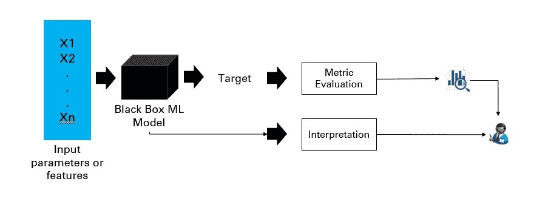
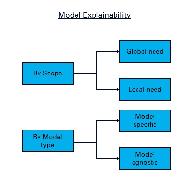
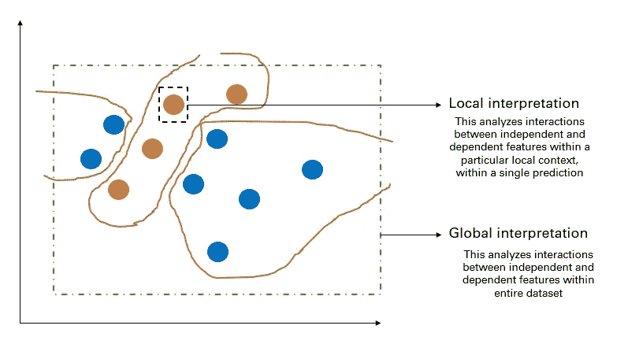
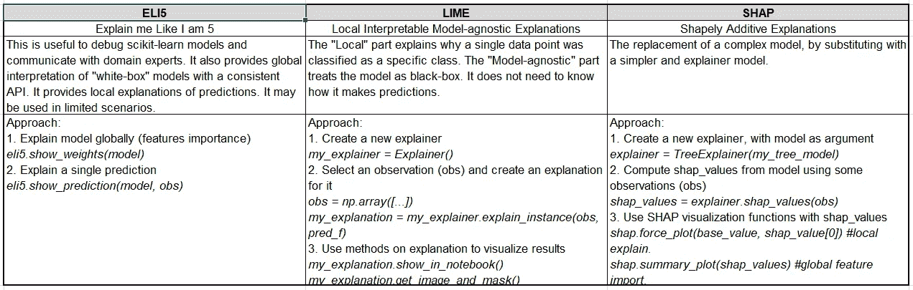
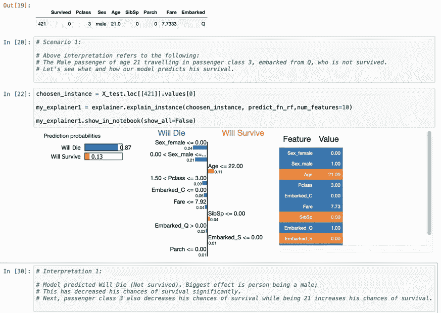
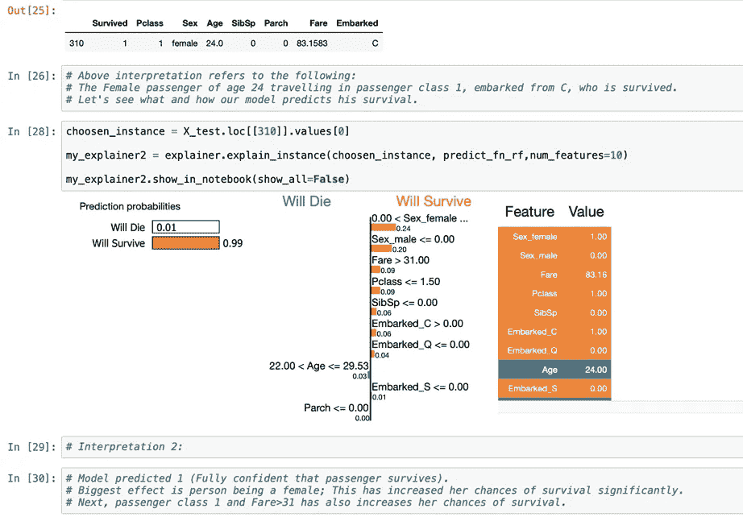

# 模型可解释性与 JRT 人工智能

> 原文：<https://towardsdatascience.com/model-explainability-and-jrt-ai-b420531a0d49?source=collection_archive---------75----------------------->

## *JRT(合理、负责和透明)人工智能在解决数据驱动的业务问题时，在模型可解释性方面变得至关重要*

在今天的场景中，模型可解释性变得越来越普遍，并成为人工智能模型和使用的主流。期望是理解正在发生的细节以及任何算法或模型的“如何”部分，或者关于用于解决业务用例的机器学习管道。企业需要控制人工智能模型的决策，以及它是如何制定的。这里的尝试是涵盖这个主题，考虑围绕这些概念的使用和执行，包括引用几个可以利用的库。

理解模型操作或操作层面也很重要。显然，它更多的是关于采用和使用，因为更多的模型正在被开发，有必要对多个模型、实验等进行模型管理和监控。这与我们为什么要考虑最佳模型以及为什么要考虑这个问题相关。

我们应该把重点放在任何合理、负责和透明的解决方案上。(因此简称为 JRT 人工智能的需要——合理的、负责任的和透明的人工智能)。

我想围绕以下议程要点来组织内容:

*一、模型可解释性的挑战*

*二世。什么是可解释的 AI/ML 解决方案？*

*三。为什么我们需要 AI/ML 解决方案的可解释性？*

*四。我们真的一直需要可解释性吗？*

*五、框架*

*六。各种技术/库*

*七。代码示例*

*八。参考文献*

现在，让我们深入这些维度。

**i)模型可解释性的挑战:**

1.  什么是“可解释的”的定义-通常一些参数用于决策，为什么解决方案达到特定的结果，它最有可能犯的错误以及如何纠正这些潜在的错误。
2.  竞争优势的丧失——当我们看到商业秘密被泄露，那么业务竞争优势也会在某种程度上被泄露。这个理解起来可能简单，也可能不简单。
3.  无法理解解释——让我们假设我们绘制了一个复杂性对时间的图表，AI 解决方案的可解释性的复杂性增加到超过某个特定点。所以我们不能真正理解解释什么，如何解释等等。
4.  有些方面是无法解释的——比如说有些决定很难解释。有时，我们基于人类的情感和非理性因素做出决定，然后通过逆向工程来解读这些决定。如果我们在大多数时候不解释我们的决定，那么就有理由争论机器如何能够做出决定？
5.  各种情况下的几种折衷方案——情况可能有很多种。一个场景是很少或没有可解释性，但质量很高，另一个场景是有更多可解释性，但输出质量很低。权衡并不总是可以接受的。很明显，它会根据业务需求、目标、目的或优先级而有所不同。

需要考虑管理风险方面的某些立法和发展参考，这可能会影响使用数据科学模型、算法或解决方案的决策。可以按照以下参考阅读一些参考资料:

a)[https://the hill . com/policy/technology/364482-立法者-介绍-两党-人工智能-立法](https://thehill.com/policy/technology/364482-lawmakers-introduce-bipartisan-ai-legislation)

b)[https://www . federal reserve . gov/supervision reg/Sr letters/Sr 1107 . htm](https://www.federalreserve.gov/supervisionreg/srletters/sr1107.htm)

什么是可解释的人工智能/人工智能解决方案？

我想到的一些问题是:

我们如何建立对 ML 模型或解决方案的信任？

我们如何知道 ML 解决方案中发生了什么？

我们如何确保我们了解模型/解决方案的细节，以便我们可以期望在未来的一段实施持续时间内保持一致性？(也就是说，如果我的预测精度是 X%，那么在接下来的几个模型中，它如何能保持在 X%左右，或者与一些+-阈值限制保持一致，以及我们如何能控制它？)等等。

图片由 Kamal Mishra 提供

为什么我们需要人工智能/人工智能解决方案的可解释性？

嗯，可能是各方面的原因。

a)模型偏差、伦理、公平:模型结果是否存在任何歧视？例如，根据过去几年的历史数据提升员工，根据性别等特定因素提升员工。贷款违约问题或贷款授予决策——它是否会因某些影响目标参数的预想数据参数而受到影响？

b)特征的因果关系:一组图像上相似外观分类器的例子。我们需要更多的数据来消除因果关系吗？是否有多个背景不同的图像？例子可以是任何这样的方面。

c)监管需求:模型结果是否满足监管需求？例如，当我们考虑跨地理区域的各种法规、欧盟法规、GDPR 相关要点等等时。

d)关键领域和行业特定要求:金融、医疗保健、风险、司法等一些行业领域比其他行业更加重要。

e)调试或故障排除以及了解更多信息的能力:为什么 AI/ML 模型表现得像它正在表现的那样？

可能有许多这样的类别、指针和需求，对于这些类别、指针和需求，对 AI/ML 解决方案内部正在发生的事情的解释变得更加重要。

我们真的一直都需要可解释性吗？

这可能并不总是需要的。我们讨论了可能需要它的几个维度。我们需要理解，这些可能是基于某些特定场景而需要的:

a)它会影响我的最终客户或最终用户吗？—这很重要。如果它不影响我们的最终客户，那么只要我们在解决问题，就可能不需要解释。例如，我们希望改进一些内部流程，但这可能不会影响最终结果。假设我们希望对通话记录进行分类，因为一次通话导致了一位不满意的客户。只要我们取得了不错的业绩和成果，并且满足了最终客户的需求，我们就是好的。

b)我们还可以想出另一个不会再次影响最终客户的例子。这与解决人工智能问题的自动化引擎有关。如果问题研究得很好，我们对最终结果很有信心。对于光学字符识别情况，我们可以获得大量训练数据来训练我们的模型，并且它可以依赖于手头任务的注释的良好性能或结果。所以它并不真正需要引擎内部的可解释性方面。

**五)框架:**

框架可以基于范围和模型类型。

图片由 Kamal Mishra 提供

全球和当地的解释各不相同。如果我们可以基于给定的完整数据集解释因变量和自变量之间的条件交互作用，那么我们认为这是“全局解释”。如果我们能够解释因变量和自变量之间关于单一预测结果的条件交互作用，那么我们可以认为这种情况是“局部解释”。

图片由 Kamal Mishra 提供

**vi)各种技术/库:**

下面是一些用于 ML 模型可解释性的库的例子。还有其他方法，下面并不详尽。

a)石灰(**L**local**I**interpretable**M**model-agnostic**E**x 解释)

SHAP(**Sh**apely**A**additive Ex**p**lanation)

Eli 5(**E**xplain me**l**ike**I**am 5)

d) PDP ( **P** 工艺 **D** 依赖 **P** 批次)

石灰、SHAP 和 ELi5 之间的比较如下图所示，反映了它们之间的比较以及它们通常遵循的方法。

图片由 Kamal Mishra 拍摄——对比图显示 Eli5 与 LIME 和 SHAP

**vii)代码示例:**

本文并不打算展示如何使用 Python 中的这些库进行编码。相反，它使用一个示例来说明实际实现的样本数据集(为了便于理解，我们将引用通用的 titanic 数据集，并使用其中一个库及其方法)以及如何解决业务需求。

**场景 1:**

目的是预测泰坦尼克号数据集中的幸存乘客。在执行了 EDA、特征工程和建模的常规步骤后，我们正试图借助 LIME 软件包解释提供预测的模型。对于我们的场景 1，21 岁的男性乘客乘坐乘客等级 3，从等级 Q 出发，他没有幸存，被认为是一个案例。让我们看看我们的模型如何预测他的生存。

图片由 Kamal Mishra 提供

**解读一:**

模型预测 421 号乘客将会死亡。(87%预测)影响最大的参数是性别(男性)，这大大降低了他的生存几率。下一个参数是乘客等级 3。这也有助于减少他的生存机会。同时，如果我们注意到对“将生存”因素贡献更大的参数是诸如“年龄”的参数。任何年龄小于 22 岁的人都有更高的生存机会，因此由于该乘客年龄为 21 岁，该参数对此有一定影响。总之，从这个简单的例子中，我们可以看出哪些参数的可解释性对模型的整体决策有多大影响。

**场景二:**

我们将乘客 id 310 视为场景 2，并尝试以类似的方式进行分析。下面是类似场景 1 的插图和结果。

图片由 Kamal Mishra 提供

**解读二:**

模型非常有信心这位乘客会活下来，而且“活下来”的几率是 99%。对其起作用的最大因素是性别，该乘客是女性，随后是可以以类似方式分析和解释的其他参数。

详情请参考[我的 GitHub 代码参考此处](https://nbviewer.jupyter.org/github/kkm24132/BRUG/blob/8c5e0d15b1250f86a47d288a6ea9912279fe2b8a/src/MLExplainability_using_LIME.ipynb)。

**总结归纳**，我们可以使用不同特性和库的组合，基于业务案例和数据集进行解读。我们可以看看下面的一般型号的咨询。当然，这些都是基于从业者推荐的某些经验。我们需要了解数据、业务目标和情况，以便能够推荐和使用最有效的方法，并对其进行适当的解释。解释是关键，这也是价值和影响所在。

a)需求:可解释和可预测的需求

*   观察—局部[主要使用石灰、SHAP 等，基于树的方法，基线使用广义线性混合模型]；全局[通用线性混合模型基线、基于树的方法、结构化内容的 SHAP]
*   可以收集—[广义线性混合模型，使用多种算法进行基线预测]

b)需要:仅可解释性

*   结构化数据源—观察[广义线性混合模型，基于树的模型]；可以收集【广义线性混合模型】
*   图像内容来源—本地[SHAP、莱姆等。；];全局[用概念激活向量测试]

c)需求:仅预测

*   准确性可能是这里的关键和最重要的方面
*   神经网络、GBMs、RFs 或 RRFs

**viii)参考文献:**

石灰:

a) [可解释的机器学习:让黑盒模型变得可解释的指南](https://christophm.github.io/interpretable-ml-book/lime.html) —作者克里斯托夫·莫尔纳尔

b) [马可等人的论文(2016)](https://arxiv.org/abs/1602.04938) :“我为什么要相信你？”:解释任何分类器的预测

c) [来自 Marco 的 Github 参考](https://github.com/marcotcr/lime)

d) [参考 Marco](https://marcotcr.github.io/lime/tutorials/Tutorial%20-%20continuous%20and%20categorical%20features.html) 使用 iris 数据集的实例—使用 iris 数据集

SHAP:

a) [论文:解释 Lundberg 和 Lee 模型预测的统一方法](http://papers.nips.cc/paper/7062-a-unified-approach-to-interpreting-model-predictions.pdf)

b) [论文:Lundberg 等人 2019 年](https://arxiv.org/pdf/1802.03888.pdf)为树集合提供一致的个性化特征属性

c) [论文:手术期间预防低氧血症的可解释 ML 预测](https://www.ncbi.nlm.nih.gov/pmc/articles/PMC6467492/pdf/nihms-1505578.pdf)

关于[interpret ML:ML 可解释性的统一框架](https://arxiv.org/pdf/1909.09223.pdf)——Harsha Nori 等人 2019——解释了 blackbox 和 glassbox 的有趣方面。黑盒(包括石灰，SHAP，部分依赖，敏感性分析)和玻璃盒(包括可解释的助推，线性模型，决策树，规则列表)

***免责声明*** *:这里的帖子是来自我的经验、想法和各种来源的阅读的个人观点，不一定代表任何公司的立场、策略或观点。*