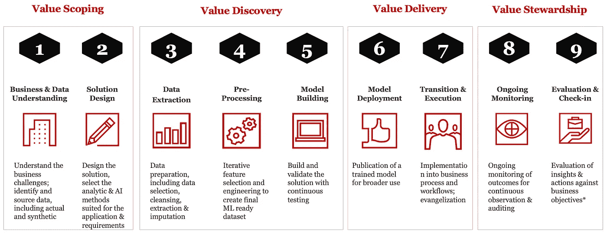
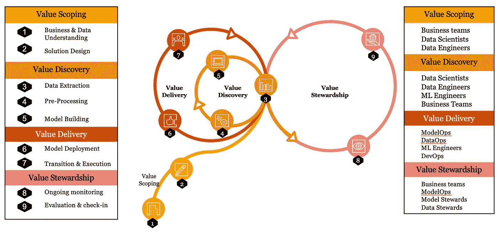

# 模型生命周期:从想法到价值

> 原文：<https://towardsdatascience.com/model-lifecycle-from-ideas-to-value-14e654b7d4a4?source=collection_archive---------36----------------------->

## [数据科学家来自火星，软件工程师来自金星(第四部分)](https://towardsdatascience.com/tagged/modeling)

## 价值范围界定、发现、交付和管理

由作者根据 Youtube 视频创作[帝王蝶蜕变延时 FYV 1080 高清](https://www.youtube.com/watch?v=ocWgSgMGxOc)

在本系列的第 1 部分中，我们研究了软件和模型之间的主要区别；在第 2 部分中，我们探索了用软件合并模型的十二个陷阱；在[第 3 部分](/model-evolution-from-standalone-models-to-model-factory-5a8e01fa03cb)中，我们探讨了模型的演变。在本文中，我们经历了模型的生命周期，从最初构建模型的概念到最终交付这些模型的价值。

我们将模型的整个生命周期分为四个主要阶段——范围界定、发现、交付和管理。虽然这个模型生命周期和典型的软件生命周期有很多相似之处，但是也有很大的不同，这源于我们开始这个系列的软件和模型之间的不同。在这里，我们回顾了四个阶段和这些阶段中的九个步骤。

# 价值范围

这可以说是模型生命周期中最关键的阶段；这是确定在构建模型中是否有任何商业价值、模型的成功度量以及我们打算如何使用模型的阶段。范围界定阶段由两个步骤组成:

## 业务和数据理解

构建一个模型来自动化一项任务、做出一个决策或采取一项行动的想法可以来自各种不同的来源。它可以是来自业务的“拉力”，以提高生产率、减少时间或削减成本(所谓的[自动化路径](https://medium.com/the-innovation/data-automation-analytics-ai-the-unbeatable-quartet-509536b2f097))或做出更好的决策(所谓的[分析路径](https://medium.com/the-innovation/data-automation-analytics-ai-the-unbeatable-quartet-509536b2f097))。它也可以是软件或 It 组织的“拉动”,这些组织已有一个软件或正在构建一个软件，他们希望通过添加独特的个性化、优化、推荐或模型提供的许多其他特征来使其变得“智能”。

它也可以是来自自动化、分析或人工智能组织的“推动”，以利用机器学习模型或机器人的独特特征。这也可能是数据组织的一种“推动”,数据组织看到了其独特数据资产的价值，可以利用这些资产获得竞争优势。

> 例如，已经构建了聊天机器人并证明了其在一个业务部门中提高客户参与度的好处的自动化或人工智能团队可能希望在多个业务领域中构建类似的聊天机器人。类似地，已经建立了 NLP 模型以在一个功能(例如，财务)中提取结构化信息的分析或 AI 组可能会推动在其他功能(例如，法律)中建立类似的模型。

不管是“推动”还是“拉动”来构建模型，这里有一些企业必须寻求回答的关键问题:

1.  什么是业务目标——需要提高效率或效果的业务活动、决策或行动？
2.  使用现有的工具、软件、人员和过程可以实现业务目标吗？
3.  我们有足够的数据来建立模型吗？如果不能，能否在一段时间内对数据进行注释和收集？
4.  业务接受的理想模型性能标准是什么？
5.  当满足业务标准时，将如何使用模型？

回答这些问题需要不同团队的合作，包括业务、数据、分析和软件专业人员。如果问题 2 的答案是肯定的，那么就不需要建立模型(使用 ML、NLP、计算机视觉)。如果第二个问题的答案是否定的，那么就有必要进一步探究这个问题。如果 3-5 的答案不可用，团队应在开始流程的下一步之前努力获得答案。为了真正实现 AI/ML 模型的全部价值，我们认为，在继续下一步之前，必须回答问题 1-5——即使答案可能会基于以下步骤的进一步调查而修改。

## 解决方案设计

一旦我们有了业务模型的规范，我们就可以继续设计解决方案。这里我们指的不仅仅是解决方案的经典定义，即人们通常通过查看 IT 堆栈或技术工具或供应商来实现业务需求的规范。对我们来说，解决方案设计应该包括数据、模型和软件如何相互作用以满足业务需求。它不仅仅是存储和计算基础架构，还应该包括应用程序如何随着环境的变化交付业务功能，包括软件的持续集成和交付、模型的持续监控和学习，以及为模型提供信息的数据管道。

传统的软件工程师和技术架构师关注*构建 vs .购买 vs .租赁*决策，以交付所需的业务功能。对于模型，我们还应该增加一个额外的选择*组装*。有两个原因可以解释为什么应该考虑装配选项。首先，模型通常会做出预测或建议，或者自动执行特定的任务。单一供应商的解决方案可能过于狭隘，无法满足企业的所有需求。因此，从同一个平台组装多个模型，或者多个供应商提供的模型，或者供应商和开源或专有模型的组合通常是必要的。第二，来自大型 ML 平台和供应商解决方案的模型在您的企业外部接受数据训练。通常，当这些模型在您自己的数据集上接受训练时，您可能会看到模型性能的提高。因此，重新训练模型并将它们组装在一起通常更好。

解决方案的设计和应该提出的关键问题取决于[模式演变的阶段](/model-evolution-from-standalone-models-to-model-factory-5a8e01fa03cb)。对于*独立模型*阶段，重点更多的是从其他企业数据仓库或数据湖获取数据，提供给数据科学家，让他们展示模型性能。使用 ML 平台的开源替代方案或预打包模型，可能是确定初始可行性的快速方法。对于*预测即服务*阶段，我们需要担心安全性、模型需要重新训练和重新部署的频率，以及确保数据、模型和软件的可追溯性。对于一个*模型工厂*阶段，解决方案设计的重点要宽泛得多；解决方案设计者需要考虑具有不同专业知识和技能水平的多组人员如何构建、培训、测试、消费和监控模型。他们需要提供一个安全的“沙箱”以及一个生产基础设施，供多个团队在其中运营。围绕开源软件的使用选择正确的云 ML 平台或供应商 ML 解决方案和政策变得至关重要。

流行的 [CRISP-DM 方法](https://www.datascience-pm.com/crisp-dm-2/)将业务和数据理解分为两个不同的步骤。解决方案设计阶段是我们增加的一个额外步骤。正如我们到目前为止所看到的，价值范围界定阶段是业务、IT 和数据科学团队之间的协作。一旦对业务需求和如何使用模型有了合理的说明，数据科学家和数据工程师就可以进入下一阶段。

# 价值发现

这个阶段已经在[数据挖掘](https://www.datasciencecentral.com/profiles/blogs/the-7-most-important-data-mining-techniques)和[数据科学](/data-science-methodology-101-ce9f0d660336)文献中得到很好的研究。这是决定构建和部署模型是否有价值的阶段。在任何给定的情况下，数据科学团队都应该构建和评估许多模型。这些模型应作为“投资组合”进行管理，期望一部分模型能够证明企业设定的绩效标准，而其他一些模型将会失败。正如我们在之前的[博客](/consequences-of-mistaking-models-for-software-94d813f115f5)中所讨论的，如果不以实验的心态来看待这个投资组合，可能会扼杀整个 AI/ML 和数据科学的努力。

## 数据析取

这一步包括决定可以通知模型的内部和外部数据源，然后从这些数据源获取数据。这里要考虑的其他方面是数据的多样性(例如，结构化或非结构化数据)、数量、速度和准确性。在非结构化数据领域，我们需要考虑基于文本的数据以及它们将如何被接收(例如，来自社交媒体或静态文档的流数据)、音频数据、图像、视频和传感器数据。

与传统的数据挖掘不同，我们还需要考虑我们是否需要标记数据，以及我们如何才能促进更好的“过程中”标记。我们已经看到许多数据科学项目由于缺乏足够的标记数据而步履蹒跚。作为领域专家正在进行的过程的一部分，为[数据注释](https://medium.com/anolytics/what-is-data-annotation-and-what-are-its-advantages-95766213351e)创建管道可能是企业中最有价值的举措之一。虽然它可能不会立即产生价值，但它将为收集正确的标记数据奠定基础。

从不同来源提取数据的任务落在了数据工程师和/或数据科学家的肩上。数据提取越小、越本地化，越有利于数据科学家独立处理；由于数据提取涉及到企业数据仓库或事务系统，数据工程师处理这类请求会更好。随着企业沿着[数据、自动化、分析和人工智能连续体](https://medium.com/the-innovation/data-automation-analytics-ai-the-unbeatable-quartet-509536b2f097)开始这一旅程，他们的数据工程师应该能够处理结构化和非结构化数据。

## 预处理

这一步包括获取摄取的数据，对数据进行一些预处理，并为构建机器学习模型做好准备。预处理步骤取决于我们从哪里获取数据(即内部还是外部)、我们正在处理的数据类型(即文本、音频、图像等)以及我们接收数据的速度。

*数据清理*是预处理中的一个子步骤。所需的数据清理量取决于数据的质量。它也因数据类型而异。

> 例如，在文本文档中，需要经过一系列的预处理步骤，如去除标点、词干、词汇化等。，然后运行情感分析等 NLP 任务。在结构化程度更高的数据集中，清理可能采取移除 NAs(字段不可用)或输入缺失像元值的形式。

*数据丰富*是另一个预处理步骤，随着人们能够访问所有外部数据源和合成数据源，这一步骤越来越受欢迎。这个过程需要统计匹配两个数据集的记录，然后用附加变量丰富原始数据集。

> 例如，我们可以从银行获取客户数据，并围绕他们的在线行为或购买模式添加外部信息。这使得银行现在可以根据客户的渠道偏好和属性更好地开展营销活动。

*探索性数据分析*和*特征工程*也可以被认为是预处理步骤的一部分。它们提供有用的信息，说明在收集的数据中哪些数据是有用的，以及需要建立什么类型的模型。

随着这些步骤的进行，任务从数据工程师技能集转移到数据科学家技能集。拥有一个至少由两名成员组成的团队来从事数据科学项目，并且拥有数据工程和数据科学技能的混合，最好具有一定水平的领域知识，这通常是很有用的。

## 模型结构

这是整个发现过程中最具挑战性的阶段之一。CRISP-DM 和其他方法通常将模型构建和模型评估分为两个独立的阶段。然而，我们发现将这两者结合起来很有用，因为我们认为数据科学家应该不断地构建、测试或评估他们的模型。

可用于建立模型的技术取决于模型的目标和数据的 4 V(多样性、容量、速度、准确性)。该模型可以用于各种不同的目的，包括预测、推荐、总结等。模型评估的标准也可以很多——[性能](https://www.analyticsvidhya.com/blog/2019/08/11-important-model-evaluation-error-metrics/)，[公平性](https://www.strategy-business.com/article/What-is-fair-when-it-comes-to-AI-bias?gko=827c0)，[可解释性](https://www.digitalpulse.pwc.com.au/black-box-explainable-ai-artificial-intelligence/)，[健壮性](https://www.digitalpulse.pwc.com.au/robust-secure-artificial-intelligence-c-suite/)，安全性等等。此外，已经表明具有模型集合将产生更好的准确性，并且可能更稳健。考虑到所有这些因素，选择构建模型的技术以及利用数据集中的某些特征来构建这些模型的方式与其说是科学，不如说是艺术。此外，模型构建和评估的方式也可以参数化，通常称为超参数。鉴于这一步的广度和深度(相对于单个博客而言，它值得写一整本书)，我们不会在这里探究所有的细节。

模型发现的这三个步骤是迭代的。根据我们的经验，我们已经看到数据科学家对这些步骤着迷，并努力用更好的技术、更好的数据和更好的数据工程来构建越来越好的模型。虽然这可能是一项有价值的学术努力，但它可能会被证明非常昂贵，并为企业数据科学团队敲响丧钟。我们在别处讨论过的基线模型和时间框建模冲刺是我们将在未来的博客中回头讨论的基本最佳实践。

# 价值传递

只有当组织认为模型发现阶段已经产生了一个满足业务所建立的模型性能标准的模型，或者确信当模型被部署并且被允许在部署后改进其性能时，它能够满足*时，组织才应该进入这个阶段。随着企业在如何构建和使用模型方面的发展，这个阶段变得越来越重要。它还强调了对新技能的需求，如模型操作、ML 操作和 ML 工程师。*

## 模型部署

在这一步中，数据科学家通常在沙盒环境中构建的模型将被部署到生产环境中。如果部署只是“部署一次就忘了”，这一步就没什么可做的了。然而，模型本身就消耗数据，而这些数据改变了久而久之。因此，最初使用历史数据构建的模型的性能开始下降。恶化的速度实际上取决于环境变化的速度和模型消耗的数据量。

> 例如，一个电信提供商构建了一个聊天机器人，作为处理客户查询的第一线支持；如果聊天机器人不能回答询问，聊天会话将被引导到人类代表。在经过广泛的培训和测试后部署该模型时，它具有出色的性能，可以处理 95%的查询。然而，它的性能每周都在下降，几个月后它只能处理 80%的查询。通过进一步调查，很明显，该模型需要至少每周或每月进行一次再培训，以说明新发布设备的品牌、模型和附件以及公司的最新营销活动。

模型部署涉及模块化模型代码(如软件代码)以分离出模型的参数，对参数、超参数、数据和用于训练和测试模型的开源包进行版本控制，并最终自动化模型的实验、训练、测试和回溯测试。根据再训练所需的数据，还必须考虑创建数据管道来为模型的再训练提供信息。

鉴于这一步涉及大量的软件工程和数据工程，您需要将数据科学和软件工程技能结合起来。这导致了 ML 工程师和 ML 操作作为新的角色出现，以处理正在进行的甚至连续的模型部署。

## 过渡和执行

当组织过渡到模型部署时，它需要确保有足够的治理来监控模型的性能及其适当的使用。大多数模型改变了流程中的工作流，或者增强了人类的决策。在这两种情况下，用户都必须重新接受培训或掌握如何使用模型的技能。人类需要对模型做出的预测或建议建立信心，同时也要警惕模型中的潜在错误。变更管理，尤其是何时信任模型以及何时使用人类判断的数据科学文化变得至关重要。

在这一步中，模型离开了数据科学家和软件工程师的“温柔和关爱”,并被具有不同数字或数据科学技能的不同业务利益相关者所使用。企业开始收获模型的价值，因此应该有收集和报告模型 ROI 的机制。

# 价值管理

这是这个过程的最后一个阶段，可能也是最长的一个阶段。该模型已经交付，企业正在使用该模型——可能嵌入到其他应用系统中。这一阶段需要确保正在产生的价值被捕获并持续报告给高级管理层，并且价值没有退化。

## 持续监控

我们已经在上面以及我们之前的博客中看到，模型的价值可能会下降。因此，我们需要持续监控模型的结果，了解与过去的任何偏差，并报告所产生的价值。在一些受监管的行业领域，如金融服务，对监控和向监管机构报告模型有严格的要求。因此，他们有广泛的过程、治理和结构来治理模型。然而，在许多不受监管的部门，很少对模型进行持续监控。当我们在未来的博客中讨论负责任的人工智能时，我们将回到这一步。

## 评估和登记

总有一天，模型的使用寿命会走到尽头。这可能是由于业务变化、技术变化或新数据的可用性。当我们监控和报告一个模型或模型组合的价值时，我们需要跟踪整个组合的价值。我们需要决定何时以及如何退休、重新培训或建立新的模式。这类似于你的财务顾问卖出某些表现不佳的股票，买入某些未来有增长潜力的股票，以确保你的投资组合价值得到保护或正在增长。

价值管理的这两个步骤都应该由企业来完成——尤其是财务组织，并得到业务发起人、数据科学家和软件组织的帮助。此外，这一步应该在模型生命周期开始时就计划好，而不应该在模型已经开始恶化时才想到。

有趣的是，CRISP-DM 方法止于模型部署，并不包括我们上面概述的一些额外步骤。我们的九步流程如下图所示。

九步模型生命周期(来源:普华永道分析)

# 迭代过程

虽然详细的九步流程是按顺序列出的，但是流程本身远不是模型开发和部署的“瀑布”方法。生命周期是迭代的，有三个特定的反馈循环。

第一个反馈回路处于价值发现阶段。流程中的三个步骤是迭代的，并且还可能导致对业务目标的重新检查。第二个反馈过程是在价值交付阶段。这个阶段可能导致返回到价值发现阶段，甚至可能触发价值范围确定阶段。最后的反馈来自价值管理流程。这可能导致回到价值交付、价值发现或价值范围界定流程。四个阶段中所有这些步骤之间的丰富的相互作用导致了模型、数据和软件的非常复杂的管理过程。

迭代模型生命周期过程和过程中涉及的不同角色在下面的图表中被捕获。

九步模型生命周期中的反馈循环(来源:普华永道分析)

尽管我们已经详细描述了模型生命周期过程及其迭代性质，但是我们还没有将它与敏捷软件开发过程进行比较。我们将在下一篇博客中讨论这个问题。

作者:作者: [Anand S. Rao](https://www.linkedin.com/in/anandsrao/) ， [Joseph Voyles](https://www.linkedin.com/in/joseph-voyles/) 和 [Shinan Zhang](https://www.linkedin.com/in/shinan-zhang-85264221/)