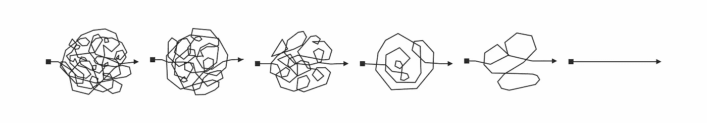
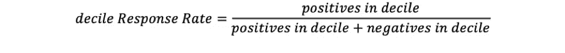
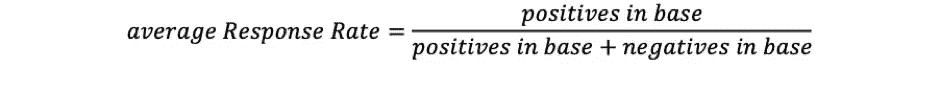
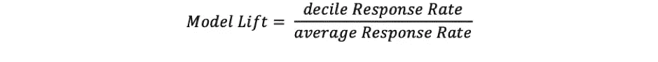
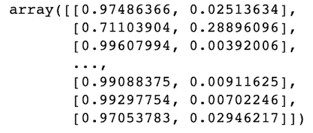
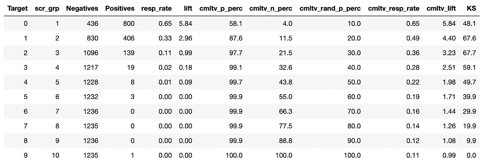
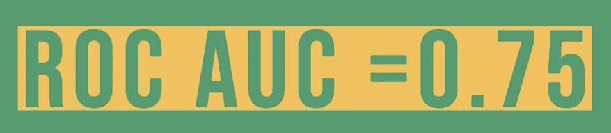
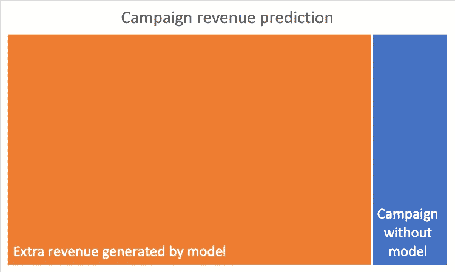

# 模型提升——缺失的一环

> 原文：<https://towardsdatascience.com/model-lift-the-missing-link-70eb37460e67?source=collection_archive---------8----------------------->


安杰伊·西曼斯基

## 如何向非技术观众谈论机器学习的结果

数据建模成功的一半是利益相关者/受众对我们模型的理解。关键是要理解他们的期望，并在我们的演示中使用简单的语言，让非技术人员也能理解。通常，受众是希望在某种交叉销售或保留活动中使用该模型的营销和/或财务团队成员。他们通常更感兴趣的是模型能在多大程度上提高竞选绩效，而不是模型本身有多好。这是一个微妙的区别，我将在稍后解释。

作为数据科学家，我们倾向于关注模型的整体性能，并通过使用 ROC 曲线和混淆矩阵来说明模型在区分积极和消极方面有多好。然而，这并不总是最好的方法。

**对模型在现实生活中如何部署的理解是关键点，它决定了应该如何评估模型。**

在识别欺诈行为、建立信用记分卡或识别癌症患者时，ROC 是一种非常好的评估方法。在这些情况下，我们需要正确识别每个现有的或新的记录。

然而，在市场营销或政治环境中，大多数活动只针对我们基础中的一个狭窄群体——那些对信息最开放的群体(**目标群体**)。因此，当务之急是了解模型在该组中的表现。组外的表现无关紧要。所以用评估整个基数的 ROC，不一定是最好的选择。

*其次*，我们的观众可能不理解一个混淆矩阵或者 ROC。对他们来说，等于 0.6 或 0.75 的 AUC 是一个抽象的、无关紧要的数字。谈论特异性和敏感性是行不通的。我们必须开始用和我们的观众相同的频率广播，用他们自己的语言说话。需要调整的是我们，不是他们！请记住，你在那里不是要用你的知识给他们留下深刻印象，而是要传递一个关于你的模型的发现的明确信息。这条信息应该在几秒钟内就能被理解。为了实现这一点，我们需要比 ROC 更容易理解的东西，以及我们可以容易地对其进行估价的东西。这就是模特升降机的闪光点。



来源:ADOBE STOCK

> 天才的定义是化繁为简
> *阿尔伯特·爱因斯坦*

模型提升告诉我们，通过使用我们的模型，我们可以在多大程度上改进活动。它告诉我们，在我们的选择中找到阳性(*商品*)的几率有多大，与随机找到它们相比如何？使用我们的模型和随机选择的成功率的比较是模型提升。

模型提升的好处在于，我们可以立即为我们的模型分配财务价值。如果我们的前十分位数中的模型提升相等，例如等于 3，我们可以说，使用我们模型的前十分位数，该活动可以产生比基于随机选择的活动多 3 倍的收入。模型提升基本上是投资回报(ROI)，其中投资是我们建立的模型。

要获得模型提升，我们需要遵循以下步骤:

*   获取我们数据库中每个记录的模型概率得分。
*   使用概率分数对基础进行排序，并将其分成相等的组。十分位数似乎是最常见的选择，因此，在本文的其余部分，我将把这些组称为十分位数。
*   计算每十分位数中阳性反应的比例( ***十分位数反应率*** )



*   计算 ***平均响应率***



*   计算 ***模型升力***



为了说明这一点，让我们以一家葡萄牙银行的直接营销活动为例。数据来自 [UCI 机器学习库](http://archive.ics.uci.edu/ml/index.php)并且在这里[可用。在运行数据清理、特征减少和重采样之后，我最终得到了这个数据集。包括数据清理在内的完整代码可以在](https://raw.githubusercontent.com/madmashup/targeted-marketing-predictive-engine/master/banking.csv)[这里](https://github.com/AndrzejSzymanski/TDS/blob/master/Model%20Lift.ipynb)找到。我们的目标是找出有可能对报价做出积极回应的客户。我们的因变量是 y，其中 1=阳性反应(阳性)，0 =无/阴性反应(阴性)。

数据集中的一个要素(呼叫持续时间)导致数据泄漏。通话时间可能是购买的结果，而不是购买的原因。第二，它是未知的，直到活动的数据被选择和调用。因此，它应该从选择用于建模的数据中排除。然而，由于我想专注于模型提升本身，我决定保留数据集中的所有变量。

首先，我们需要将数据分成训练样本和测试样本

```
df= pd.read_csv('banking_campaign.csv')X = df.iloc[:,1:]
y = df.iloc[:,0]X_train, X_test, y_train, y_test = train_test_split(X, y, test_size=0.3, random_state=0)
```

我选择了梯度推进建模

```
from sklearn.ensemble import GradientBoostingClassifier
from sklearn.metrics import classification_reportGBM = GradientBoostingClassifier(learning_rate=0.01, 
                                      n_estimators=1000,
                                      max_depth=6, 
                                      min_samples_split=50, 
                                      min_samples_leaf=25, 
                                      subsample=0.8,
                                      max_features=10, 
                                      random_state=10)
GBM.fit(X_train,y_train)
predictors=list(X_train)
```

让我们简单看一下整体模型性能。

```
print('Accuracy of the GBM on test set: {:.3f}'.format(GBM.score(X_test, y_test)))
pred=GBM.predict(X_test)
print(classification_report(y_test, pred))
from sklearn.metrics import roc_auc_score
print (roc_auc_score(y_test, pred))
```


该模型的 ROC AUC 得分为 **0.75** ，但我们忽略它。

获得模型提升的第一步是获得概率。为此，我们使用 *predict_proba* 。

```
y_pred2=GBM.predict_proba(X_test)
```

**y_pred2** 中的第一个值是概率 0(负数)，第二个值是概率 1(正数)。



要计算模型提升，运行下面的代码。该代码生成一个 pandas 数据框，用于模型的最终评估和构建图形演示。

你需要做的是调用函数，指定你的测试因变量(y_test)，它的预测概率(y_pred2)和你想把基数分成的组数(我决定用十分位数，所以 10)。

```
ModelLift=lift(y_test,y_pred2,10)
```

输出如下所示:



**Scr_grp** 代表我们的十分位数，使用概率分数进行分类和拆分。现在我们可以比较积极和消极在十分位数中的分布。你可以看到，随着我们越来越接近十分位数，阳性反应的数量越来越少。十分位数 1 中有 800 例阳性，而十分位数 10 中只有 1 例阳性！这意味着我们的模型正在做正确的工作。

现在我们可以计算响应率( **resp_rate** )。应答率是十分位数中阳性的比例。对于十分位数 1，它是 800/(800+436)=0.65。同样，你可以看到在十分位数组中，回复率迅速下降。

最后，我们需要计算**升力**。为此，我们需要测试组中阳性和阴性的总体比例，即:1376/12357 = 0.11。现在十分位数 1 的升程是 5.84 (0.65/0.11)。这意味着基于十分之一选择的活动比基于随机选择的活动成功 5.84 倍。

表格中的其他特征有:
cmltv_p_perc:累积阳性百分比
cmltv_n_perc:累积阴性百分比
cmltv_rand_p_perc:累积随机阳性百分比
cmltv_resp_rate:累积响应率
cmltv_lift:累积 lift
KS: Kolmogorov-Smirnov 测试

现在比较这两条消息:



# 和...相对



现在，你告诉我我们的观众会对哪条消息感到兴奋！

创建一个图表是传递信息的最好方式，但是观众应该能够在几秒钟内掌握这个想法。因此，我会避免任何更复杂的东西，比如增益图。

展示结果时，我们需要回答三个问题:

1.  模型有效吗？
2.  选择和模型性能有什么关系？
3.  最优选择是什么？

让我们稍微调整一下输出。我将 dataframe 索引改成了更具信息性的内容，比如 Decile1 到 10，并且只选择了范围内的变量。

```
dec = ['Decile 1','Decile 2','Decile 3','Decile 4','Decile 5','Decile 6','Decile 7','Decile 8','Decile 9','Decile 10',]
MLift=ModelLift[['Positives','Negatives','cmltv_lift','KS']].copy()
MLift.index = (dec)
```

使用下面的代码，我们可以很快看到模型是如何工作的。

```
import cufflinks as cf
cf.go_offline()
cf.set_config_file(offline=False, world_readable=True)MLift[['Positives','Negatives']].iplot(kind='bar',yTitle='Volume',xTitle='Model decile', title='Positives & Negatives by model decile')
```

选择大小和性能之间的关系可以使用累积提升来确定。

```
MLift[['cmltv_lift']].iplot(kind='bar',color='LightSkyBlue',yTitle='Lift',xTitle='Model decile', title='Cumulative Lift', yrange=[1.11, 6])
```

随着目标群体的增加，我们可以期待更小的 ROI(模型提升)。例如，如果我们决定同时使用十分位数 1 和 2，ROI 将从 5.84(仅十分位数 1)下降到 2.87。尽管如此，这项活动将会比随机选择成功将近 3 倍！

使用 Kolmogorov-Smirnov 测试确定最佳选择，该测试用简单的语言评估累积阳性和累积阴性之间的差异。这个测试在我们的数据中找到一个点，在这个点上我们可以用最小的负值得到最大的正值。为了说明这一点，我曾经建立增益图，但我改变了主意，我现在认为条形图更容易阅读！

```
MLift[['KS']].iplot(kind='bar',color='DarkSlateGrey', yTitle='Separation',xTitle='Model decile', title='Target separation')
```

在我们的例子中，最好的分割是大约十分位数 2 和 3。在这一点上，我们已经得到了最大的积极因素和最小的消极因素。这是我们可以使用我们的模型实现收入最大化的点。

概括地说，模型升力优于 ROC 的 3 个主要优点是:

即使是一个普通的模型仍然可以提供一些价值，并对营销活动做出重要贡献。

模型提升可以直接转化为收入。

模型提升容易理解，比混淆矩阵更少混淆！