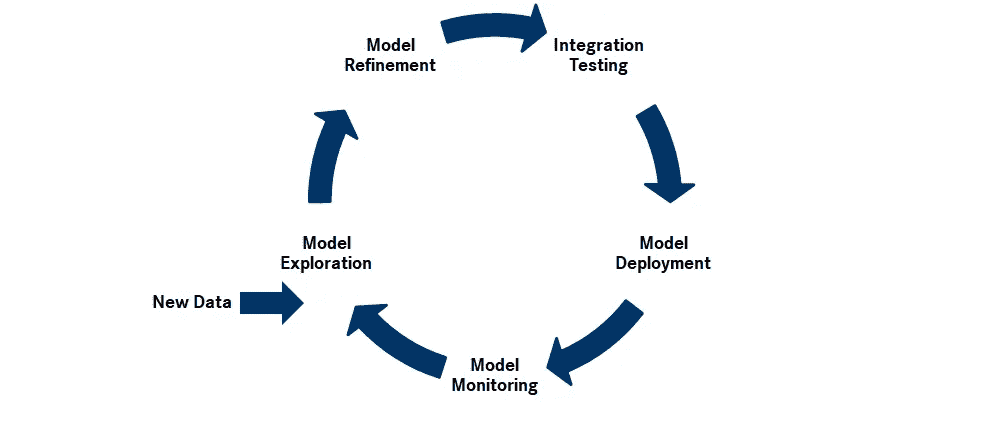
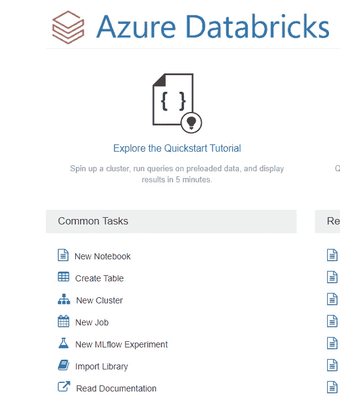
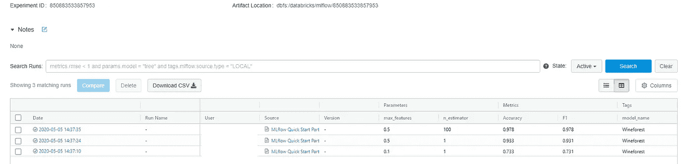
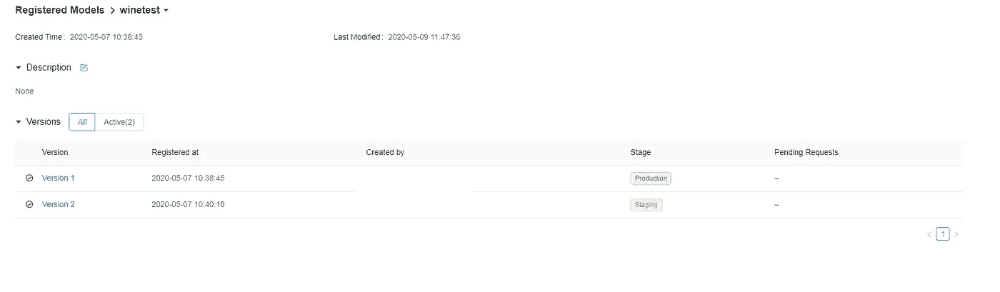
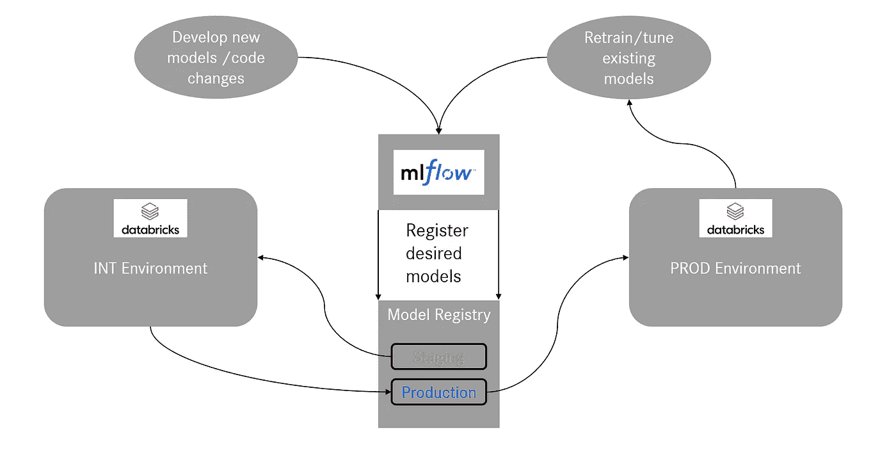

# 生产 ML 软件中的模型管理

> 原文：<https://towardsdatascience.com/model-management-in-productive-ml-software-110d2d2cb456?source=collection_archive---------29----------------------->

## MLflow 简介-


乌默尔·萨亚姆在 [Unsplash](https://unsplash.com/s/photos/bridge?utm_source=unsplash&utm_medium=referral&utm_content=creditCopyText) 上拍摄的照片

为机器学习问题开发一个好的概念证明有时会很困难。您正在处理成吨成吨的数据工程层，测试许多不同的模型，直到您最终“破解了代码”，并在测试集上取得了好成绩。万岁！这是一个好消息，因为现在乐趣真正开始了，你的模型可能会帮助你的公司赚钱或省钱。如果是这样的话，你必须围绕你的模型来构建高效的软件。那是什么意思？您需要一个支持实时数据流的解决方案架构、一个可随数据流扩展的计算组件、一个真正的前端和一个良好的存储解决方案。而这些只是你的主要组件！您还需要一个监控解决方案，以防您的任何软件运行出错，还需要一个 DevOps 工具，负责测试您的新代码版本并将其发布到生产环境中。这只是你的日常数据用例，如果你试图构建人工智能软件，你可能会处理大量数据和非常密集的数据工程层，以将你的原始数据转化为可用于训练/推断机器学习模型的形式。最有可能的是，您将需要一个 ETL 管道工具来在每天的运行中编排您的数据工程。但最后一件事可能是最重要的一块拼图，你需要知道你的 ML 模型随着时间的推移在做什么！

*   今天的模型与昨天的模型相比有多好？
*   它接受了哪些功能的培训？
*   什么是最优超参数？它们会随着时间而改变吗？
*   训练和测试数据如何随时间变化？
*   哪个模型处于生产/集成状态？
*   我如何在这种设置中引入主要的模型更新？

所有这些问题都源于机器学习生命周期的复杂性。因为数据会随着时间的推移而变化，即使在生产性的 ML 环境中，我们也经常处于收集数据、探索模型、提炼模型、最后测试/评估、部署并最终监控我们的模型的循环中。



ML 生命周期

> 我们如何才能保持对这个不断进化的复杂循环的控制？

实际上有一个非常简单的解决方法——把一切都写下来！或者用计算机术语来说:

> 记录所有相关信息！

一个有趣的名字是机器学习模型管理，这是 MLOps 的重要组成部分。在软件执行过程中捕获相关信息并基于这些信息做出自动决策的持续过程。准备、训练和评估期间的指标，以及经过训练的模型、预处理管道和超参数。所有这些都被整齐地保存在一个模型数据库中，以备比较、分析和用于挑选一个特定的模型作为预测层。现在，理论上你可以使用任何普通的数据库作为后端，并编写自己的 API 来测量和存储所有这些信息。然而，在实践中，我们可以利用一些非常酷的预建框架来帮助完成这项任务。 [Azure 机器学习](https://azure.microsoft.com/de-de/services/machine-learning/)、 [Polyaxon](https://polyaxon.com/) 、 [mldb.ai](https://mldb.ai/) 只是几个例子。本文重点介绍 [MLflow](https://mlflow.org/) 。MLflow 由 D [atabricks](https://databricks.com/blog/2018/06/05/introducing-mlflow-an-open-source-machine-learning-platform.html) 的人员开发，并无缝集成到他们的生态系统中。由于我已经在 Databricks 上完成了所有的 ETL 和超参数调优(使用 [hyperopt](https://github.com/hyperopt/hyperopt) 框架),所以这是模型管理框架的一个简单选择。

# MLflow 深潜

MLflow 是一个“机器学习生命周期的开源平台”。 [Databricks](https://databricks.com/) 上的管理版本特别易于使用，您甚至可以通过点击下面的“新 MLflow 实验”使用用户界面创建一个空 MLflow 实验。



[Azure 数据块](https://azure.microsoft.com/de-de/services/databricks/)

您不必担心设置后端数据库，一切都会自动处理。一旦实验可用，就可以在您的代码中使用 [MLflow tracking API](https://www.mlflow.org/docs/latest/tracking.html#where-runs-are-recorded) 来记录各种信息。为了快速浏览，让我们看一个例子:

## Sklearn 的葡萄酒数据集

我看了一下 sklearn 的开源葡萄酒数据集。它包含来自不同意大利葡萄酒种植者的三种不同葡萄酒类型的化学分析数据。目标是创建一个分类器，使用给定的特征(如酒精、镁、颜色强度等)来预测葡萄酒的类别。

首先，您可以打开一个新的 Databricks 笔记本，并加载以下软件包(确保它们已安装):

```
import warnings
from sklearn import datasets
from sklearn.ensemble import RandomForestClassifier
from sklearn.model_selection import train_test_split
from sklearn.metrics import accuracy_score, f1_score
import pandas as pd
import numpy as np
import mlflow
import mlflow.sklearnwarnings.filterwarnings(“ignore”)
```

现在，您可以将数据加载到熊猫数据框架中:

```
# Load wine dataset
wine = datasets.load_wine()
X = wine.data
y = wine.target#create pandas df:
Y = np.array([y]).transpose()
d = np.concatenate((X, Y), axis=1)
cols = ["Alcohol", "Malic acid", "Ash", "Alcalinity of ash", "Magnesium", "Total phenols", "Flavanoids", "Nonflavanoid phenols", "Proanthocyanins", "Color intensity", "Hue", "OD280/OD315 of diluted wines", "Proline", "class"]
data = pd.DataFrame(d, columns=cols)
```

## 设置日志记录

首先，我们需要决定在培训阶段我们想记录什么。原则上，MLflow 允许我们记录任何东西。是的，任何事！在最基本的形式中，我们可以将任何信息写入文件，并让 MLflow 将其作为工件记录。预建的日志记录功能包括:

*   运行 ID
*   日期
*   参数(例如:超参数)
*   韵律学
*   模型(训练模型)
*   工件(例如:经过训练的编码器、预处理管道等)
*   标签(例如:型号版本、型号名称、其他元信息)

在本例中，我们将坚持基本原则，记录 2 个指标、所有超参数以及训练模型，并给它一个模型版本标签。为了简单一点，我们围绕 scikit-learn 构建了一个小包装器。负责 MLflow 日志记录的 fit()方法。然后，我们可以调用包装器，传入不同的超参数，并查看性能如何变化，一切都记录到我们的 MLflow 后端。

让我们从评估函数开始，包括准确性和 F1 分数:

```
from sklearn.metrics import accuracy_score, f1_scoredef eval_metrics(actual, pred):
    acc = accuracy_score(actual, pred)
    f1 = f1_score(actual, pred, average = "weighted")
    return acc, f1
```

然后围绕 scikit-learn 的 RandomForestClassifier 编写我们的包装器，给它两个超参数来调整，即森林中的树的数量，以及树中每个决策拆分使用的特征列的比例。

```
def train_winedata(data, in_n_estimators,  in_max_features):

  warnings.filterwarnings("ignore")
  np.random.seed(40)# Split the data into training and test sets. (0.75, 0.25) split.
  train, test = train_test_split(data, stratify= data["class"])# The predicted column is "class"
  train_x = train.drop(["class"], axis=1)
  test_x = test.drop(["class"], axis=1)
  train_y = train[["class"]]
  test_y = test[["class"]]

  # start run
  with mlflow.start_run():
    rf = RandomForestClassifier(n_estimators = in_n_estimators, 
                                max_features= in_max_features)
    rf.fit(train_x, train_y)  
    acc, f1 = eval_metrics(test_y, rf.predict(test_x))
    print("  Accuracy: %s" % acc)
    print("  F1 Score: %s" % f1)

    #log metrics 
    mlflow.log_metric("F1", f1)
    mlflow.log_metric("Accuracy", acc)
    #log params
    mlflow.log_param("n_estimator", in_n_estimators)
    mlflow.log_param("max_features", in_max_features)

    # add tags
    mlflow.set_tag("model_name", "Wineforest")
    # save the trained model
    mlflow.sklearn.log_model(rf, "model")
```

## 训练模型

在运行培训之前，我们需要告诉我们的 MLflow 客户端在哪里记录所有这些信息。我们将让它指向我们之前通过 Databricks UI 创建的空 MLflow 实验:

```
mlflow.set_experiment("/[Users/](mailto:Users/maxibe@emea.corpdir.net)<your user>/WineClassifier")
```

现在我们可以运行第一组超参数:

```
train_winedata(data, in_n_estimators= 1, in_max_features= 0.1)Accuracy: 0.733   F1 Score: 0.731
```

我们可以看到，单个树每次分裂仅使用 10%的特征就获得了相当不错的准确度和 F1 分数。

现在以 max_features 的 50%重新运行训练:

```
train_winedata(data, in_n_estimators= 1, in_max_features= 0.5)Accuracy: 0.933   F1 Score: 0.931
```

已经给了很高的分数。但是，在随机森林中包含 100 棵树可以进一步提高性能:

```
train_winedata(data, in_n_estimators= 100,  in_max_features= 0.5)Accuracy: 0.98   F1 Score: 0.98
```

让我们快速浏览一下 MLflow 实验的结果:



MLflow 用户界面

我们可以看到一个漂亮的 GUI，其中包含了我们所有的登录信息。我们还可以通过点击日期深入了解单次跑步。在那里，我们发现日志模型作为一个工件，准备好被加载并用于进行预测。现在，我们可以设置我们的服务层来获取最佳模型(例如，根据 F1 分数)，并自动将我们的生产环境部署到该层。当进行广泛的网格搜索时，可以探索不同超参数日志的影响，以潜在地调整超参数网格中的搜索空间。

# 生产级机器学习的架构设置

当构建高效的软件时，我们必须时刻牢记，一个单一的环境很可能不会成功。如果我们有一个生产性的设置在运行，并且我们想要对代码进行更改，我们至少需要一个集成环境，在那里我们可以首先测试任何更改。

随着训练数据随着时间的推移而增加和变化，我们还需要定义重新训练我们的模型、重做超参数调整甚至重新评估机器学习模型整体类型的周期。这需要以自动化的方式发生，并且已经在集成环境中成功测试的最佳模型(在固定的外部数据集上测试)需要一直部署在生产中。如果我们决定改变外部测试数据集或者代码发生重大变化，我们可能想要合并一个新的模型版本，并且只比较比该版本旧的部署模型，等等。有点复杂的过程。

MLflow 中的模型注册中心提供了一个工具，可以帮助完成这个过程。在这里，我们可以用不同的名称、版本和阶段注册来自 MLflow 后端的已训练模型。从“无”、过渡到“准备”到“生产”的阶段。



模型“winetest”的模型注册表项

记录我们之前的葡萄酒分类器，我们只需要从 MLflow 获取 model_uri 并运行:

```
mlflow.register_model(model_uri=model_uri, name="winetest")
```

让我们更仔细地看一下如何使用这个设置管理两个基本的 ML 生命周期场景:定期重新训练和调整已经部署的 PROD 模型，以及将新的或更新的模型代码部署到生产系统中。主要区别:后者需要在 INT 上经历一个测试阶段，因为代码已经改变，而前者没有。代码保持不变，只是模型的性能可能发生了变化。



使用 MLflow 的模型管理设置

想想下面的场景:目前 1.0 版中一个名为 AImodel 的模型注册为“Production”，并部署在 PROD 上。我们每 x 天对模型进行一次再培训和重新调整。一旦进行了重新训练和重新调整，我们就可以从注册表中获取模型，运行我们的训练和调整管道，将 AImodel 版的新模型性能记录到 MLflow 中。现在，我们可以通过比较新训练的 AImodel 1.0 的性能和 AImodel 1.0 在外部数据集上的所有现有性能来启动自动选择过程，并通过用我们选择的模型覆盖“生产”阶段位于模型注册表中的当前 AImodel 1.0 来部署最佳模型(由于某种度量)。现在，我们仍然在产品中使用 AImodel 1.0，只不过(希望)有更好的性能，因为它是在更新(更多)的数据上训练出来的。

这非常简单，允许在生产中不断部署最好的 AImodel 1.0。如果我们想改变 AImodel 1.0 的代码，甚至引入 MLmodel 1.0 来与 AImodel 1.0 竞争生产位置，该怎么办？我们需要利用我们的集成环境！

将代码部署到环境中是由 DevOps 管道管理的，它分别由 int 或 master Git 分支上的拉请求触发。这就给了我们 INT 或 PROD 版本的代码到各自的环境中。让我们想象一下，我们在 AImodel 1.0 的代码中包含了分布式培训。我们通过 DevOps 将 INT Git 分支上的内容部署到我们的 INT 环境中，并运行新配置的培训，再次登录 MLflow(给模型一个 INT 标记)，并将模型注册为 AImodel 2.0 以及“Staging”。现在的关键概念是:我们的两个环境会根据一些标准(如上面使用性能指标所解释的)自动选择用作服务层的模型。由于我们只希望 AImodel 2.0 在 INT 上使用(因此被测试)，而不是在 PROD 上，我们引入了每个环境的模型版本容差。这意味着仅允许 PROD 从≤1.0 版的型号中选择，而允许 INT 选择≤ 2.0 版(或如果我们特别想测试 2.0 版:=2.0)。在完成 INT 的测试阶段后，我们可以将模型转换到注册表中的“生产”，并将 PROD 中的模型版本容差提高到≤ 2.0(或=2.0 或 1.0≤PROD 版本≤2.0 等)。现在，新代码(新模型)已经为 PROD 环境做好了准备。因此，基本上，在 INT 的每个新的训练循环中，我们都在比较并潜在地用一个模型子集替换“Staging”中的当前模型，这是根据 MLflow 中 INT 的版本容差(例如，模型标签模型名称等)进行的。根据产品上的版本余量，使用“生产”中的模型，在产品上也会发生同样的事情。如果我们对代码进行了重大更新(比如想要使用一个完全不同的模型)，我们总是可以用一个新的名字注册这个模型，并从头开始 1.0 版。

这种设置允许自动部署性能最佳的模型，同时仍然可以将新的代码和模型顺利地引入系统。然而，这仍然是一些基本的设置，因为在大多数情况下，调优和训练将异步完成，因为调优工作是非常计算密集型的，因此可能仅在例如每 10 个训练循环中发生一次。现在我们可以考虑使用不同的 MLflow 后端，一个用于调优，一个用于训练，以保持事情清晰和可管理。

总的来说，MLflow 中可用的工具允许非常灵活的模型管理设置，可以直接根据用例的需求进行定制，并满足生产级需求。我们还可以想象在我们的 MLflow 后端之上构建一个仪表板，允许高级用户跟踪性能、版本状态以及参数和功能选择，而无需打开数据块。

尝试一下，让你的机器学习应用更上一层楼:)

## **参考文献:**

**MLflow**

[](https://mlflow.org/) [## MLflow -机器学习生命周期的平台

### 机器学习生命周期的开源平台 MLflow 是一个开源平台，用于管理机器学习生命周期

mlflow.org](https://mlflow.org/) 

**MLflow 车型注册**

 [## 在 MLflow 模型注册表中管理 MLflow 模型的生命周期

### MLflow Model Registry 是一个集中式模型存储和一个 UI 以及一组 API，使您能够管理整个生命周期…

docs.databricks.com](https://docs.databricks.com/applications/mlflow/model-registry.html?_ga=2.191901866.1832504560.1588601145-536696397.1564753281#model-registry-concepts)