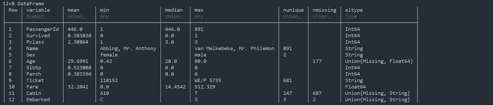
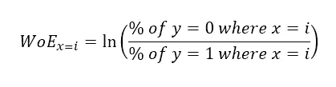
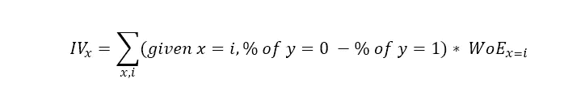
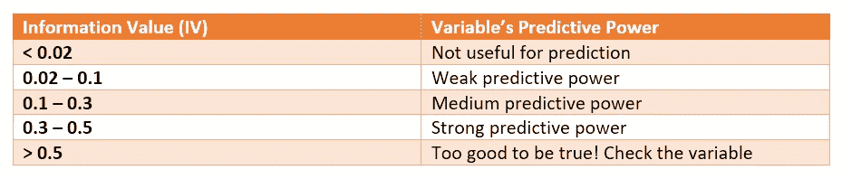

# 模特？还是指证据权重(WoE)和信息价值(IV)？

> 原文：<https://towardsdatascience.com/model-or-do-you-mean-weight-of-evidence-woe-and-information-value-iv-331499f6fc2?source=collection_archive---------8----------------------->

## 使用巨大的数据集来一步一步地解释和实现这两个概念。这是一个在 Julia 中编码的好机会！

作为一名数据科学家，我一直很想知道某些自变量(如职业)如何影响因变量(如收入)。具体来说，在分类问题上，WoE 和 IV 可以讲一个自变量和因变量之间的故事。

这些概念主要是为了解决信用评分问题而开发的，在这种情况下，客户被贴上“好”或“坏”的标签，这是基于他们是否拖欠信用还款。他们的相关变量，如年龄，也被记录下来。

现在，我们正在将这些概念应用于[巨大的数据集](https://www.kaggle.com/c/titanic/data)。

```
using DataFrames, CSV
df = DataFrame(CSV.File("train.csv"))
show(describe(df), allcols=true)
```



泰坦尼克号列车组的描述

# **证据权重**

WoE 的公式是这样的:
对于自变量 *x* 的每一个类 *i* ，我们要求其因变量 *y* 属于某个类的人口的比例/百分比，该类有类 *i* ，后面是自然对数*。*



听起来很困惑？放在上下文中，我们可以把 *x* 作为“性”，把 *y* 作为“幸存”。“性”分为 2 类:“男”&“女”。要算 WoE，
1a。数一数灭亡的男性("性别" = "男性"，"幸存" = 0): 468
1b。将该数字除以遇难乘客总数("幸存" = 0):
468/549 = 0.85246
2a。数一数存活的雄性数量("性别" = "雄性"，"存活" = 1): 109
2b。将该数除以幸存乘客总数("幸存" = 0):
109/342 = 0.31871
3。将(1b)的结果除以(2b)的结果，然后取自然对数得到 WoE:ln(0.85246/0.31871)=**0.98383**

我们对“女性”执行相同的步骤来导出 WoE，即 **-1.52988** 。代码如下:

```
survived = by(df, :Survived, (count = :Survived => length))
sex_df = unstack(by(df, [:Sex, :Survived], (count = :Sex => length)), :Sex, :count)male_event = sex_df[(sex_df.Survived .== 1), :male] / survived[(survived.Survived .== 1), :count]
male_non_event = sex_df[(sex_df.Survived .== 0), :male] / survived[(survived.Survived .== 0), :count]
woe_male = log(male_non_event/male_event)female_event = sex_df[(sex_df.Survived .== 1), :female] / survived[(survived.Survived .== 1), :count]
female_non_event = sex_df[(sex_df.Survived .== 0), :female] / survived[(survived.Survived .== 0), :count]
woe_female = log(female_non_event/female_event)
```

回到公式，WoE，通过符号(+/-)，揭示了在灾难性事件中男性幸存者与男性受害者的比例。然而，我们更感兴趣的是知道自变量(“性别”)和因变量(“存活”)之间的关系。

# 信息价值(四)

这将能够把不同的困境结合在一起，因为在同一个独立变量下。公式是这样的:



继续我们之前的示例，以下是要采取的步骤:
4a。取(1b)结果与(2b)结果之差:
0.85246-0.31871 = 0.53375
4b。将(4a)的结果与(3)的结果相乘，即为结果权重:
0.53375 * 0.98383 =**0.52512**

我们对“女性”执行相同的步骤，得到 **0.81656** 。将两个值相加，我们得到自变量“性别”的 IV = **1.34168** 。代码如下:

```
iv_male = (male_non_event - male_event) * woe_male
iv_female = (female_non_event - female_event) * woe_female
iv = iv_male + iv_female
```

一旦我们有了变量的 IV，我们就可以对照这个表来查看变量的预测能力。正如你所看到的，这个表格在说“性别”这个变量好得令人难以置信！



变量预测能力表

我们在这里做了一些假设:首先，当创建解决信用违约问题的方法时，该表作为指南。在此期间，研究人员希望了解可能影响客户信用评级的变量。研究人员发现，这个表格与他们的问题陈述非常相关。然后它被用作指南。

第二，已经证明泰坦尼克号沉没后幸存的女性多于男性。事故中女性的生还几率高于男性。因此,“性别”这一变量确实是一个异常强大的预测力量也就不足为奇了。

# 好吧，接下来呢？

除了将概念应用于研究目的之外，WoE 的主要实际用途是用于编码，在编码中，您可以用相关的值替换类。例如，在我们的示例中，您可以用 0.98383 替换“男性”，用-1.52988 替换“女性”。原因很明显:机器学习算法主要以数字作为输入，所以我们必须在训练模型之前将字符串转换为数字。

使用 WoE 的另一个积极结果是减少了用于训练模型的输入的列数。假设您有一个包含 10 个不同类的分类变量，并且您执行了一次热编码，您将得到 10 列，其中大部分值为“0”。使用 WoE 技术，类被它们相关的 WoE 值所代替。

至于变量，它们为我们进一步深入分析自变量和因变量之间的关系提供了基础。此外，如果变量是定性类型，我们可以使用宁滨方法，然后使用 WoE 和 IV 概念来设计有意义的特征。

现在的解释就到此为止。如果有任何方法可以提高我的 Julia 编码技能，请给我留言，因为我最近才学会这门语言。干杯！