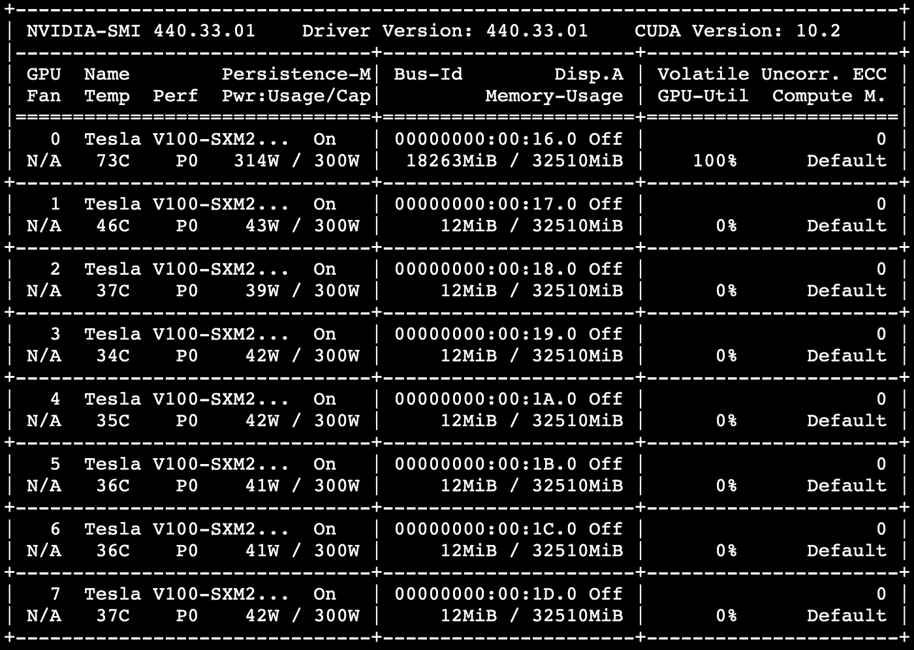
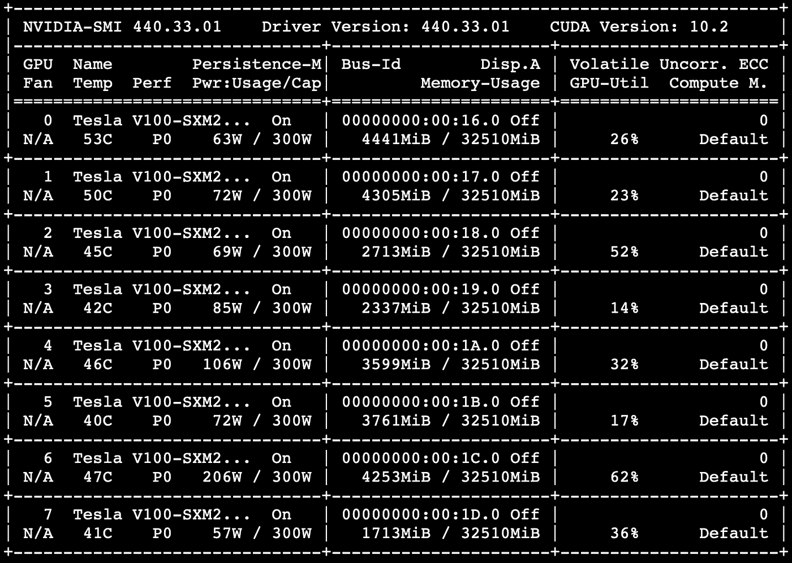
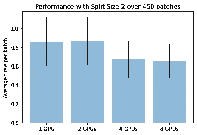
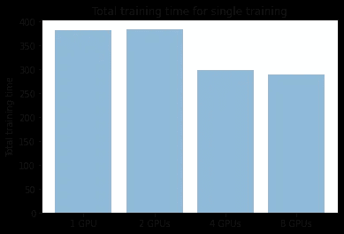
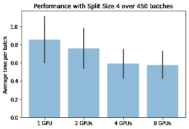
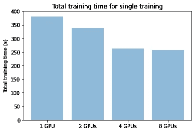
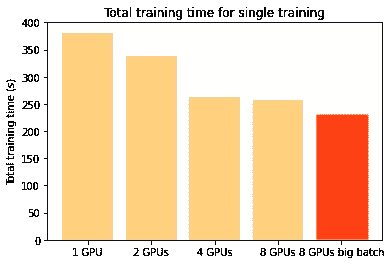

# 在一行代码中模拟并行性

> 原文：<https://towardsdatascience.com/model-parallelism-in-one-line-of-code-352b7de5645a?source=collection_archive---------26----------------------->

利用多个 GPU 对大型图像进行训练


保罗·德拉古纳斯在 [Unsplash](https://unsplash.com?utm_source=medium&utm_medium=referral) 上的照片

# TL；DR；

当由于内存限制而无法在单个 GPU 上运行训练时，应该使用模型并行。这种技术将模型分割到多个 GPU 上，并在不同的加速器上执行每个部分。通过这种方式，巨大的模型可以被拆分，以适应内存。

这种技术在过去实现起来相当复杂。模型的公平分割、对 GPU 的正确分配和高效执行是不容易实现的功能。

[艾森](http://eisen.ai) 0.0.5 在一行代码中实现了模型并行，因此对于任何使用不止一个 GPU 并苦于内存问题的人来说，模型并行都是显而易见的。

# 更新！

主分支中的[当前 Eisen 代码库](https://github.com/eisen-ai/eisen-core)(以及 eisen==0.1.6 和 eisen-core==0.0.5 之后的未来版本**)已经更新，以进一步简化模型并行的实现方式。现在可以在没有 Eisen 工作流的情况下使用模型并行性(不要担心，您仍然可以像使用任何其他模型一样在工作流中使用它),其方式几乎与 PyTorch 中的数据并行性相同！**

现在它看起来真的像一行程序！

```
model = eisen.utils.ModelParallel(model, split_size=2)
```

以前处理过体积医学数据(CT、MRI 等)。)我的研究一直受到单个 GPU 可用内存量的限制。回到 V-Net 时代，我们必须在 GTX 1080 显卡上的 8GB 显存上运行我们的 3D 卷积模型。后来，由于我可以使用高达 32GB 视频内存的更大的 GPU，我们可以提高数据分辨率并改善我们的结果。

一旦我在一台机器上有了多个 GPU，我就可以限制我的数据的分辨率，以便单个图像能够适合一个 GPU，并且我将求助于数据并行性来运行更大批量的训练。数据并行会将计算分布在多个 GPU 上，但整个模型仍需要放在一个 GPU 中。

我仍然相信，当您至少可以在单个 GPU 上运行每批单个图像的训练时，数据并行是首选。但是，如果您需要在非常高分辨率的数据上训练一个复杂的模型，在这种情况下，只有少数几个层而不是整个模型可以放在单个 GPU 上，该怎么办？在这种情况下，您需要模型并行性！

在 Tensorflow (1.x)中，启动数据并行或模型并行纯粹是一场噩梦。

在 PyTorch 中，我看到人们在一行代码中很好地实现了梯度**检查点**(另一种以牺牲性能为代价处理大型模型的技术)，以及**数据** **并行性**。这行代码:

```
model = torch.nn.DataParallel(model)
```

但是对于模型并行性**来说，没有只包含一行代码的解决方案。PyTorch 团队有一本[优秀指南](https://pytorch.org/tutorials/intermediate/model_parallel_tutorial.html#speed-up-by-pipelining-inputs)，解释了如何在 PyTorch 中获得模型并行性，以及如何通过流水线执行获得出色的性能，但仅此而已。你必须重新实现。**

正如我在[之前的帖子](https://medium.com/@faustomilletari/reinventing-the-wheel-for-the-last-time-cba43860f8cf)中解释的那样，任何人都不应该浪费时间通过重新实现已经理解的东西来制造 bug 和问题。这就是为什么 [Eisen](http://eisen.ai) 0.0.5 以遵循 PyTorch 建议的方式，在一行代码中为任何模型、任何应用和任何架构*实现了模型并行性。

*(*只要架构有多层)*

【Eisen 的模型并行在一行代码中完成。这行代码:

```
model = EisenAutoModelParallelModuleWrapper(
    module=YourModule,  # Python module
    number_gpus=8,  # Desired parallelism
    split_size=2, # How to split batch for pipelining 
    input_names=['inputs'],  # input names for Eisen workflow
    output_names=['labels'],  # output names for Eisen workflow
)# please note that this has been changed as of 
# eisen > 1.6.0 and eisen-core > 0.0.5
```

这行代码的作用是:

*   将模型实例化为“YourModule”的实例
*   当 forward 方法被调用时(第一次)，它对模型本身占用的 GPU 内存进行惰性评估
*   跨 GPU 分割图层，并将其分配给设备
*   根据需要实现在 GPU 之间移动张量的自动方式
*   自动为模型定义流水线执行策略，以便尽可能多地使用所有的 GPU

作为这种策略的结果，我们获得了(1)模型在指定 GPU 上的平衡分割，以及(2)与单个 GPU 模型相比更快的执行。实现这个特性的源代码可以在这里找到。

我整理了一个 python 笔记本，在模型并行性和单 GPU 训练之间做了一些比较。你可以在这里找到笔记本。这是来源于官方[艾森教程](http://docs.eisen.ai/eisen/tutorials.html)之一。

我决定在配备 32GB Tesla V100 的 8 GPU AWS 实例 p3dn.24xlarge 上运行以下实验:

*   对于固定模型、固定数据集、固定批量:
    -使用分割大小为 2 的 1、2、4 和 8 个 GPU 运行训练
    -使用分割大小为 4 的 1、2、4 和 8 个 GPU 运行训练
*   对于固定的模型、固定的数据集，尝试将整个数据集**放入一个批处理** :
    -使用 8 个 GPU 和模型并行性运行训练

第一个实验是使用 [MSD](http://medicaldecathlon.com) 任务 04 数据集运行的，批量大小为 32，分辨率为 64x64x64 体素，以 1 毫米立方重采样数据。你可以在笔记本里找到更多[。批量大小为 32 时，1 个 GPU 上的内存使用量约为 18GB。](https://colab.research.google.com/drive/1x26OJPFtRWwG_sNtneYRCAP2YIA-BUSc)



用一个 GPU 一个有感觉这个美好的 p3dn.24xlarge 浪费的差不多了。

我想澄清的是，在这个特定的场景中，由于我们能够在一个 GPU 上一批安装 32 个图像，因此应该使用**数据并行而不是**模型并行。与数据并行相比，模型并行有一些缺点。其中一些问题与内存传输开销和高效的流水线执行有关。

在这个玩具示例中，我有目的地在**错误类型的工作负载**上运行模型并行。事实上，只有在最大的 GPU 无法容纳批量 1 时，才应该使用模型并行。在这里，我们可以在单个 GPU 上安装 32 个图像，如果我们想一次处理 260 个(见下文)图像，我们可以求助于数据并行(这要简单得多)，而不去管整个模型并行的事情。

但是为了**公平比较**，我们希望能够展示在一个 GPU 上运行所有东西和跨 2、4 和 8 个 GPU 运行所有东西之间的性能差异。

当我通过 Eisen 打开模型并行时，我在所有 GPU 上获得了更低的内存消耗。真的管用！！



模型并行可以利用系统中的所有 GPU，由于流水线执行，所有 GPU 都可以并行运行。现在我们的 p3dn.24xlarge 实例运行正常。

在获得了看到所有 GPU 并行运行的快感并享受了 8 Tesla V100 和 32GB 内存同时运行的感觉后，我们准备看看一些性能。这些是在 260 个图像的数据集上获得的，批次大小为 32，50 个时期(450 个批次)，分割大小为 2:



第一个实验:在固定数据集上运行，固定批量大小，分割大小为 2(用于流水线)。



分割大小为 2 的单次训练的总时间(用于流水线)。

当我将分割大小增加到 4 时，为了获得更有效的流水线操作并最大化 GPU 的使用开销，情况得到了改善:



当使用更大的分割大小来“填满”GPU 的计算资源时，所有场景的情况都会得到改善。



单次训练的时间也相应增加。

此时，我想看看由于模型并行性，我还能在内存中容纳多少数据。

批量大小为 32 时，我在单个 GPU 上获得了 18GB 的内存使用量。现在，我想一次运行数据集中的所有 260 幅图像。这不一定是我们在真实用例中想要做的事情，无论如何，如上所述，在这种情况下运行数据并行比运行模型并行要好得多。但我想我想看看 GPU 和艾森如何处理批量大小为 260、分割大小为 20 和 50 的时期。下面是对比。



当将整个数据集作为一批处理并使用分割大小 20 时，运行训练的时间进一步减少。显然，通信开销和流水线仍然是一个问题。

总之，当由于图像分辨率、维度和模型架构而无法在 GPU 中容纳哪怕一个训练示例时，应该使用模型并行。然后，模型并行将在不同的 GPU 之间分割模型梯度和激活，以便进行训练。

艾森似乎能够自动处理模型并行性**，因此提供了类似于拥有一个巨大的 GPU(本例中为 256 GB)进行训练的体验。**