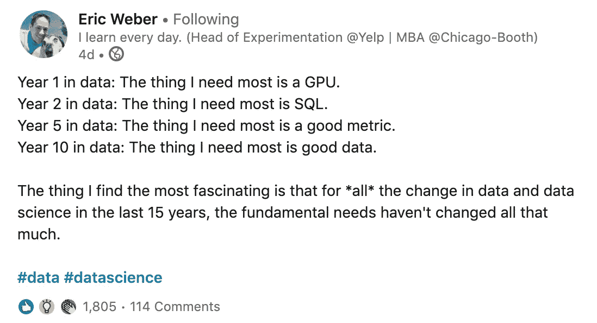

# 如何让您的数据科学项目经得起未来考验

> 原文：<https://towardsdatascience.com/model-selection-and-deployment-cf754459f7ca?source=collection_archive---------50----------------------->

## [入门](https://towardsdatascience.com/tagged/getting-started)

## ML 模型选择和部署的 5 个关键要素

[摄](https://unsplash.com/@thecreative_exchange?utm_source=medium&utm_medium=referral) [Unsplash](https://unsplash.com?utm_source=medium&utm_medium=referral) 上的创意交流

[87%的数据科学项目**从未投入生产**](https://venturebeat.com/2019/07/19/why-do-87-of-data-science-projects-never-make-it-into-production/) **。这个统计数字令人震惊。然而，如果你像大多数数据科学家一样，这可能不会让你感到惊讶。*非技术利益相关者努力定义业务需求。跨职能团队面临着为可复制的数据交付建立健壮管道的艰苦战斗。部署很难。机器学习模型可以拥有自己的生命。***

这里列出了**五个实用步骤**，让您的模型能够应对模型选择和部署的挑战。如果你在过去忽略了这些关键因素，你可能会发现你的部署率飙升。您的数据产品可能依赖于正确部署本文中的技巧。

# 1.0 不要低估可解释性

一个可解释的模型是一个内在可解释的模型。例如，基于决策树的方法——随机森林、Adaboost、梯度树提升——提供了其底层决策逻辑的清晰视图**。**

[德乐思教授](https://unsplash.com/@andreasdress?utm_source=medium&utm_medium=referral)在 [Unsplash](https://unsplash.com?utm_source=medium&utm_medium=referral) 上的照片

在受到严格监管的刑事司法和金融领域，可解释性可能是强制性的。它也往往是一个强大的数据科学项目中被低估的元素。

除了固有的可解释性，决策树模型还有以下有用的特性:

*   容易以视觉形式描述
*   能够检测任何非线性双变量关系
*   跨多种使用案例的良好预测能力
*   提供分级的功能重要性
*   对特征预处理的要求低
*   使用`sklearn.OneHotEncoder​`处理分类特征
*   很好地处理异常值，不容易过度拟合
*   可用于分类或回归

由于这些原因，决策树是研究许多典型业务问题的一个可靠的初始模型。

在做出决策时，利益相关者更可能相信一个无法解释的黑盒神经网络还是一个随机森林？想想看，一个非常注重细节(或者非常无聊)的业务人员可以清楚地追踪每一个底层决策树中的逻辑，如果他们愿意的话。如果首席数据官的工作是让首席执行官免受牢狱之灾，那么这种水平的可解释性显然是一种胜利。

无法解释的模型冒着[延续社会不平等](https://medium.com/atlas-research/ethical-ai-tools-b9d276a49fea#c918)的风险，比如人类和基于人工智能的抵押贷款系统对黑人家庭的系统性“划红线”——除非采取具体措施减轻对弱势群体的偏见。奥古斯特·黎塞留在[像素](https://www.pexels.com/photo/family-making-breakfast-in-the-kitchen-4259140/?utm_content=attributionCopyText&utm_medium=referral&utm_source=pexels)上拍摄的照片。

除了决策树之外，可解释模型家族还包括[朴素贝叶斯分类器](https://scikit-learn.org/stable/modules/naive_bayes.html)、[线性](https://scikit-learn.org/stable/modules/generated/sklearn.linear_model.LinearRegression.html)和[逻辑回归](https://scikit-learn.org/stable/modules/generated/sklearn.linear_model.LogisticRegression.html)以及 [K 近邻](https://scikit-learn.org/stable/modules/generated/sklearn.neighbors.KNeighborsClassifier.html)(用于聚类和回归)。这些本质上可解释的模型具有额外的好处，即相对于黑盒神经网络，它们**在训练和服务**方面节省了大量的时间和资源，而预测性能的成本可以忽略不计。

## 1.1 如何**选择合适的型号**

无论是否以可解释性为目标，都要使用这种资源(*决策树无处不在！*)指导您选择型号:

via [sklearn](https://scikit-learn.org/stable/tutorial/machine_learning_map/index.html)

## 1.2 阅读更多关于型号选择的信息

 [## 型号选择综合指南

### 选择正确算法的系统方法。

medium.com](https://medium.com/atlas-research/model-selection-d190fb8bbdda) 

# 2.0 生产化修剪

当然，有时候使用神经网络可能是你最好的选择。也许你正在做图像识别或自然语言处理(NLP)。也许你正在处理一个非常复杂的数据集。如果你使用神经网络，你应该考虑如何在[投入生产](/data-science-planning-c0649c52f867#dfc4)之前削减模型。

照片由 [Pixabay](https://www.pexels.com/@pixabay) 在[像素](https://www.pexels.com/@pixabay)上拍摄

用[马克·库尔茨](https://medium.com/u/bcb31cd617bf?source=post_page-----cf754459f7ca--------------------------------)的话说，机器学习引领[神经魔法](https://neuralmagic.com/):

> 神经网络中的大多数权重实际上是无用的。

训练后，**60–90%的重量可以减轻，而不会影响表现**。结果是更快的推理时间、更小的模型规模和更低的服务用户的成本。事实上，Neural Magic 团队认为，这种稀疏化可以使基于 CPU 的架构和“无硬件”人工智能复兴。

 [## ICML 论文:归纳和利用激活稀疏性进行快速神经网络推理

### 2020 年 7 月，在机器学习国际会议上，我们提交了一篇关于最大化…

neuralmagic.com](https://neuralmagic.com/resources/icml-activation-sparsity/) 

修剪包括移除神经网络中未使用的路径，保留必要的路径。 [**渐进量级修剪** (GMP)](https://arxiv.org/abs/1506.02626) [已经成为一种最受欢迎的技术](https://arxiv.org/abs/2003.03033)。一般来说，非结构化修剪——即去除特定权重而不是整个神经元——允许对稀疏化过程进行更大的控制，从而获得更好的性能。

## 2.1 如何在生产前修剪模型

*   以比培训中使用的最终学习率略高的学习率重新培训网络
*   在时段 1 的开始，将所有要修剪的层的所有稀疏度设置为 5%
*   每个时期迭代地移除最接近零的权重一次，直到达到指定的稀疏度
*   在降低学习率的同时，在剩余的再训练中保持稀疏度不变

## 2.2 阅读更多关于彩票假设的信息

 [## 5 篇必读的数据科学论文(以及如何使用它们)

### 让您在数据科学领域保持领先的基本理念。

towardsdatascience.com](/must-read-data-science-papers-487cce9a2020) 

# 3.0 防止数据和模型漂移

部署后，漂移的力量将不可避免地冲击您的模型，并导致其性能随着时间的推移而下降。当模型的**基础输入随着一个或多个数据特征改变**时，数据漂移就会发生。当**环境条件改变**时，模型漂移发生，模型不再可靠地代表真实世界。

照片由[艾琳娜·麦克吉尼斯](https://unsplash.com/@ellenaalice?utm_source=medium&utm_medium=referral)在 [Unsplash](https://unsplash.com?utm_source=medium&utm_medium=referral) 拍摄

## 3.0a 数据漂移

数据漂移通常是数据收集过程中发生变化的结果。例如，一家制造厂的传感器可能会发生故障，在问题得到解决之前会记录几个小时的零度温度。然后，新的五月传感器可以记录摄氏温度，而不是以前的华氏温度。如果没有这些变化的背景，零值和切换到新的测量标准将对下游模型产生不利影响。

定性信息的变化也是如此。调查数据收集方法——例如，从邮寄问卷转变为固定电话调查——将对受访者的人口统计产生影响。即使问题措辞方式的微小变化也会对模型从数据集中得出纵向推论的能力产生不利影响。

数据漂移也可能是由数据集中字段定义的更改引起的。例如，制造工厂的数据所有者可以决定术语“废料”不仅指无用的材料，还指最终将被再加工成回收产品的材料。术语的这种变化也会影响模型的性能。

## 3.0b 模型漂移

真实世界环境的变化可能会降低模型的预测能力。

鉴于 2020 年是一个灾难性的一年，消费者行为模型通常需要被踢到路边。 [Carl gold](https://medium.com/u/fbfc6b1ae37a?source=post_page-----cf754459f7ca--------------------------------) 是 Zuora 的首席数据科学家，Zuora 是一家为订阅业务提供服务的公司，通过先进的数据产品帮助他们超越分析。在最近的一次采访中，他分享了他对疫情影响的看法:

> 我告诉每个人更新他们的模型。现在，如果你做一个新的客户流失模型，你应该尽可能只使用 COVID 以来的数据。
> 
> 只有拥有大量观察数据的消费公司才有可能做到这一点。一般来说，B2B 公司面临一个小的数据挑战。所以改装你的模型有这么多相互竞争的问题。
> 
> 一旦部署，工作就不会停止。
> 
> 你应该持续监控你的模型预测的准确性，因为这实际上会给你一个警告信号，如果你已经很久没有重新训练的话。

## 3.1 如何使您的模型对漂移具有鲁棒性

*   与数据源所有者签订**数据共享协议**，以接收数据漂移的提前警告
*   对照原始训练数据监控传入数据的分布——您可以使用 [**Kolmogorov-Smirnov (K-S)测试**](https://www.statisticshowto.com/kolmogorov-smirnov-test/) 或简单地比较 [**z 值**](https://www.statisticshowto.com/probability-and-statistics/z-score/) 来实现这一点
*   监控时间序列数据集相对于前一时间段的漂移-您可能需要部署 [**群体稳定性指数(PSI)**](https://www.listendata.com/2015/05/population-stability-index.html) 指标来实现这一目的
*   定期重新培训您的模型——例如每五个月一次——或者通过**在线学习**,其中模型会不断获取新的培训数据，并在持续集成/持续部署过程中发布新版本。

## 3.2 阅读更多关于模型再培训的信息

 [## 针对漂移和噪声数据流的在线集成学习

### 挖掘数据流是机器学习中最重要的当代课题之一。这种情况需要适应性…

www.researchgate.net](https://www.researchgate.net/publication/321627304_Online_Ensemble_Learning_with_Abstaining_Classifiers_for_Drifting_and_Noisy_Data_Streams) 

via [LinkedIn](https://www.linkedin.com/posts/eric-weber-060397b7_data-datascience-activity-6725400328046567424-pO4f)

# 4.0 利用正反馈循环

算法是支持数据驱动行动的强大工具。通过对成对的预测数据和实际数据进行再训练，模型的结果随着时间的推移变得越来越复杂。

[**数据产品**](https://districtdatalabs.silvrback.com/the-age-of-the-data-product) 的输出在集成回数据生命周期时提供高质量的信号。把这个概念称为[**良性循环的艾**](https://www.youtube.com/watch?v=21EiKfQYZXc) 。*哈佛商业评论*称其为 [**洞察引擎**](https://hbr.org/2016/09/building-an-insights-engine) 。

诺埃米·马卡韦-卡特茨在 [Unsplash](https://unsplash.com?utm_source=medium&utm_medium=referral) 上拍摄的照片

对数据驱动的决策及其结果的有力捕捉可以进一步丰富数据收集过程。希望很快，更多的反馈收集机会将被内置到仪表板、网络界面和其他数据产品中。反馈收集可以增强终端用户的能力，并改进洞察引擎。

## 4.1 如何利用正循环

*   **在[规划过程的开始](/data-science-planning-c0649c52f867)与利益相关者交流有效的机器学习模型的巨大好处**
*   从部署的模型中创建**数据收集管道**
*   确保**元数据**的准确性

## 4.2 阅读更多关于有效数据产品的内容

 [## 数据产品的时代

### 我们正在经历一场信息革命。像任何经济革命一样，它对…产生了变革性的影响

districtdatalabs.silvrback.com](https://districtdatalabs.silvrback.com/the-age-of-the-data-product) 

# 5.0 防止负反馈循环

提醒一句:数据产品远不是一个自我维持的系统，它需要持续的监控。虽然算法反馈循环可以创建一个洞察丰富的数据集，但它也可以生成一个**偏差永久化循环**。有许多例子表明，机器学习工具的部署，特别是那些可解释性和可解释性有限的工具，意外地加深了社会偏见。

[李凯文](https://unsplash.com/@kevin_lee?utm_source=medium&utm_medium=referral)在 [Unsplash](https://unsplash.com?utm_source=medium&utm_medium=referral) 上拍照

例如，一家数据科学承包公司创建了一个预测累犯的算法，该算法被部署在纽约、威斯康星、加利福尼亚、佛罗里达和其他司法管辖区。 [ProPublica](https://www.propublica.org/article/how-we-analyzed-the-compas-recidivism-algorithm) 发现**该算法将现有的不平等延续到一个广为使用的反馈循环中**。

尽管被告的种族被明确排除在特征集之外，但该算法使用了与种族高度相关的特征，这些特征提供了无意中有偏见的判断。这些特征也应该被消除，以减少机器学习系统的判断差异。 [*阅读本文*](https://medium.com/atlas-research/model-selection-d190fb8bbdda#1ac9) *中关于这些风险的更多内容。*

作为负反馈循环停滞的轻松解决方案，一位计算机科学家发明了一种随机性发生器来改变他的社交生活:

 [## 随机生活

### 从 2015 年开始，我让电脑决定我住在哪里，做了两年多的事情。它把我送到了世界各地…

maxhawkins.me](https://maxhawkins.me/work/randomized_living) 

## 5.1 如何避免螺旋式下降

*   从一份 [**清单**](https://deon.drivendata.org/) 开始，帮助你思考你的模型的伦理含义
*   在模型训练的预处理、处理和后处理阶段，彻底地 [**调查偏差的潜在来源**](https://github.com/Trusted-AI/AIF360)——然后补救偏差的来源
*   [**在文档中的保护类之间交流模型性能**](https://modelcards.withgoogle.com/)

## 5.2 阅读更多关于反偏见工具的信息

 [## 伦理人工智能的 3 个开源工具

### 在将人工智能集成到您组织的工作流程中之前，请考虑这些工具来防止机器…

medium.com](https://medium.com/atlas-research/ethical-ai-tools-b9d276a49fea) 

# 摘要

***没有计划就是计划失败。本杰明·富兰克林在雷暴中从卧室窗户放风筝被闪电击中之前如是说。***

我喜欢认为，如果他今天还活着，100 美元钞票的创始人应该已经在构建一个基于 GPU 的深度学习盒子，定期向开源项目提交 pr，并像老板一样选择和部署模型。

通过以稳健的规划流程开始下一个数据科学项目，你可以确保你的模型比 [**1:9 的几率**投入生产](https://venturebeat.com/2019/07/19/why-do-87-of-data-science-projects-never-make-it-into-production/)。使用这些技巧来更好地选择和部署模型:

1.  [不要低估可解释性](#ed8f)
2.  [生产化修剪](#5afc)
3.  [防止数据和模型漂移](#1c0d)
4.  [利用正反馈循环](#4d19)
5.  [防止负反馈循环](#911a)

如果你想让[被错误引用](https://quoteinvestigator.com/2018/07/08/plan/)到数据科学文章中，只有在雷雨天气时在你的卧室窗外放风筝。

**如果你喜欢这篇文章**，请在 [Medium](https://medium.com/@nicolejaneway) 、 [LinkedIn](http://www.linkedin.com/in/nicole-janeway-bills) 、 [YouTube](https://www.youtube.com/channel/UCO6JE24WY82TKabcGI8mA0Q?view_as=subscriber) 和 [Twitter](https://twitter.com/Nicole_Janeway) 上关注我，了解更多提高你的数据科学技能的想法。

你如何让你的机器学习模型适应未来？请在评论中告诉我。

# 培养数据科学技能的资源

 [## 你从未听说过的最好的数据科学认证

### 数据策略最有价值培训实用指南。

towardsdatascience.com](/best-data-science-certification-4f221ac3dbe3)  [## 如何在 2020 年打入数据科学

### 今年，我完成了一个训练营，并立即获得了一份数据科学的工作。如果我不得不回到过去，通过…

towardsdatascience.com](/new-data-science-f4eeee38d8f6)  [## 作为一名数据科学家，我在 6 个月里学到了什么

### 我从新兵训练营开始，然后找到了我梦寐以求的工作。以下是一些关键要点。

towardsdatascience.com](/6-months-data-science-e875e69aab0a)  [## 10 项被低估的 Python 技能

### 使用这些技巧来改进您的 Python 编码，以获得更好的 EDA、目标分析和功能，从而提升您的数据科学水平

towardsdatascience.com](/10-underrated-python-skills-dfdff5741fdf)  [## 数据仓库综合指南

### 了解数据仓库作为分析就绪数据集的主存储库的角色。

towardsdatascience.com](/data-warehouse-68ec63eecf78)