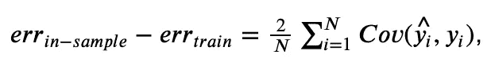
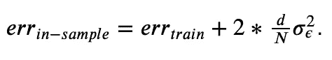
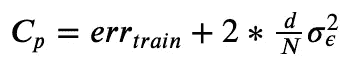
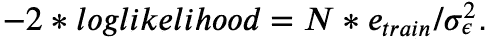
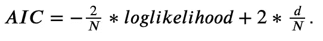
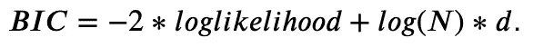

# 模型选择和评估

> 原文：<https://towardsdatascience.com/model-selection-assessment-bb2d74229172?source=collection_archive---------43----------------------->

## 超越火车价值测试分裂


图片来源:[https://pix abay . com/illustrations/cubes-choice-one-yellow-light-2492010/](https://pixabay.com/illustrations/cubes-choice-one-yellow-light-2492010/)

标准的建模工作流会将您的数据划分为训练集、验证集和测试集。然后，您将使您的模型适合训练数据，然后使用验证集来执行**模型选择**，最后，评估测试数据上的最佳选择模型，以查看它可以预期的泛化性能(**模型评估**)。这个流程大概是您的最佳选择，以确保您选择了正确的模型，并且一旦您将它部署到生产中，您就不会感到吃惊。

也就是说，人们不能总是奢侈地将数据放在一边以形成验证和测试集。如果你的数据很少，你宁愿把它全部用于训练。在本文中，我们将讨论选择和评估模型的方法，这些方法可以让您做到这一点——不需要验证也不需要测试集！

本文基于 Hastie，t .，Tibshirani，r .，& Friedman，J. H. (2009)的一章。统计学习的要素:数据挖掘、推理和预测。第二版。纽约:斯普林格。


# 关于模型误差

在比较竞争模型时，您可能会选择在新的、看不见的数据上表现最好的模型。这就是您通常使用验证集的目的:模型拟合时，验证数据是不可见的，因此选择最适合这些数据的模型是一个好策略。唉，在我们的设置中，您没有验证数据来检查不同的模型！为了了解如何解决这个问题，我们先来介绍几个误差测量方法:

*   **训练误差**是当你在训练模型的相同数据上运行训练模型时得到的误差。
*   **测试(或推广)误差**是当你在全新的、看不见的数据上运行你的模型时你得到的误差。
*   假设在对模型进行训练后，您观察到响应变量的新值与训练数据中的属性值相同。例如，假设您根据房间数量来预测房子的价格。在您的训练数据中，您有一个价值$300𝑘的房子，有 5 个房间，现在您观察一个为$350𝑘出售的房子，也有 5 个房间。模型对这些新数据产生的误差被称为**样本内误差**(因为特征的值与训练样本中的值相同——我同意这不是最直接的表示法)。

现在考虑这个量:**样本内误差—训练误差**。它通常是正的:训练误差较小，因为它基于模型被优化的完全相同的数据。但是这到底意味着什么呢？嗯，可以证明(达到预期)它认为



其中，𝑁是观察值的数量，最后一项是训练集响应与其预测值之间的协方差。这个协方差越大，我们对训练数据的模型拟合就越强(达到过拟合的程度)，因此训练误差下降，增加了等式的左侧。

让我们假设(这是一个重要的假设)我们正在处理一个参数是**线性的模型。这意味着我们在谈论[线性](/a-comparison-of-shrinkage-and-selection-methods-for-linear-regression-ee4dd3a71f16)或[逻辑](/linear-classifiers-an-overview-e121135bd3bb)回归模型、[非线性样条](/non-linear-regression-basis-expansion-polynomials-splines-2d7adb2cc226)或自回归模型。在这种情况下，上面的协方差项简化为 *d ** σϵ，其中𝑑是模型复杂性的度量(线性回归中的要素数量，回归样条中的基函数数量)，σϵ是误差方差。在替换这种简化并重新排列术语后，我们得到**



这给了我们什么？如果我们可以估计最右边的项，那么我们可以将它添加到训练误差中，以获得样本内误差的估计值。而**样品内误差正是我们选型所需要的**！当然，它没有给我们关于模型的泛化性能的信息(这是**模型评估**的作用，请继续阅读)。此外，我们并不真正关心样本内错误的具体值——在部署后看到与训练数据中相同的特征值是相当罕见的。但是**不同模型的样本内误差的相对大小允许我们选择最好的一个**。


# 基于信息准则的模型选择

上述公式也被称为**软糖的𝐶𝑝** :



当模型符合平方损失时，它可用于模型选择，我们只需选择具有最低𝐶𝑝.的模型

如果模型不一定符合平方损失，我们需要稍微调整 Mallows 的𝐶𝑝。回想一下，我们讨论的是参数线性的模型:想想线性或逻辑回归、回归样条或 ARIMA 模型。它们通常由最大似然估计，在高斯模型下，它保持(直到一个常数)



求解𝑒_𝑡𝑟𝑎𝑖𝑛并将其代入𝐶𝑝公式，我们得到**阿凯克信息标准或 AIC** :



AIC 基本上是一个惩罚的可能性。它随着模型复杂性𝑑的增加而上升，随着模型与数据的拟合度(对数似然)的增加而下降，权衡这两者。我们选择 AIC 最低的型号。最好的一点是**尽管 AIC 是仅使用训练数据计算的，但最小化它在渐近上等价于最小化留一交叉验证均方误差**，这对于模型选择来说非常好。关于 AIC 的更多警告(也是在时间序列预测的背景下),请查看 Rob Hyndman 的这篇[精彩文章，他是 R 的`forecast`软件包的作者。](https://robjhyndman.com/hyndsight/aic/)

现在让我们看一个用 AIC 进行模型选择的 Python 例子。我们将使用来自 scikit-learn 数据集的臭名昭著的波士顿住房数据。我们来拟合两个解释房价的线性回归模型。我们将为此使用`statsmodels`包，因为它可以方便地为我们计算 AIC。这两个模型都将使用房间数量和房龄作为特征。模型 1 将在此基础上使用社区犯罪率，而模型 2 将使用到大型就业中心的距离。这两种型号哪个更好？

```
Model1 AIC: 3268.8701039911457
Model2 AIC: 3300.3758836602733
```

就 AIC 而言，模型 1(使用犯罪率的模型)更好，因为它的 AIC 值更低。

AIC 不是唯一的信息标准。另一个是 **BIC，或贝叶斯信息准则**，也称为施瓦兹准则。与 AIC 类似，BIC 也是一个被处罚的可能性，但处罚条款不同:



这种惩罚比 AIC 更倾向于惩罚更复杂的模型。让我们看看这两个房价模型在 BIC 的表现如何。

```
Model1 BIC: 3285.7762506682957
Model2 BIC: 3317.2820303374233
```

同样，模型 1 是首选，因为它得分较低的 BIC。在我们的例子中，这两个标准是一致的，但情况并不一定如此。那么我们应该根据什么标准来选择模型呢？没有放之四海而皆准的答案，但请记住以下几点:

*   BIC 是渐近一致的，这意味着当呈现一组竞争模型时，它有很高的概率选择*真*模型(根据该模型生成数据)。
*   AIC 没有一致性，但是你相信有一个真正的模型可以选择吗？
*   BIC 喜欢更节俭的模式。对于小数据样本，它可能会选择过于简单的模型。另一方面，对于大样本，AIC 倾向于选择过于复杂的样本。


# 交叉验证的模型评估

现在，我们已经选择了包含犯罪率特性的模型，如果能知道它部署后的预期性能，那就太好了。**这就是模型评估的工作——评估模型的测试误差。**

一种方法是通过众所周知的交叉验证程序。我们将数据随机分成𝑘子集或褶皱，然后迭代通过它们，留下当前的褶皱，并用剩余的𝑘−1 褶皱拟合模型。然后，我们评估模型在遗漏折叠上的误差，并进行下一次迭代。这样，我们获得了𝑘误差估计。一旦取平均，它们就形成了测试误差的交叉验证估计值。很简单，对吧？但是𝑘的价值应该是什么呢？

**像机器学习中的许多其他选择一样，𝑘的选择是在偏差和方差之间。**走极端设置𝑘=𝑁会导致所谓的留一交叉验证。在这种情况下，每个观察构成了它自己的折叠。因此，训练集在褶皱上非常相似，事实上，它们只有一个观察结果不同。因此，测试误差的 CV 估计值可能会受到高方差的影响。另一方面，当𝑘很小的时候，我们就有高度偏见的风险。这是因为𝑘越小，构成𝑘−1 训练褶皱的观测值就越少。例如，考虑一下𝑁=100 的观察。对于𝑘=10，每个折叠有 10 个观察值，因此每次训练都基于 90 个观察值。对于𝑘=4，每次训练仅使用 75 个观察值。如果模型性能随着训练数据的减少而降低，过低的𝑘将导致高估的误差。

最终，𝑘的选择应取决于您的应用。𝑘=𝑁很少是一个好主意——运行起来计算量也很大(𝑁模型需要训练)！您最了解您的数据-如果您愿意假设(或已经证明)更少的数据不会对您的模型的性能产生太大影响，那么您可以选择 3 或 5 这样的小𝑘。但是如果你只有很少的数据，情况可能就不一样了(如果你有大数据，你可以遵循标准的训练/验证/测试分割，忽略这篇文章)。因此，稍微大一点的𝑘，比如 10，可能值得一试。还有一点需要考虑:如果你的𝑘太小，误差将会被**高估**，这意味着真实的测试误差可能会比你的简历告诉你的要小。如果您对交叉验证的误差估计值感到满意，您可能会对生产性能更加满意。

让我们用 10 重交叉验证来评估我们选择的模型。为此，我们将使用`scikit-learn` API。

```
Cross-validated testing MSE: 43.925463559757674
```


# 结束语

总结一下:刚刚发生了什么？如果您没有足够的数据来留出验证和测试集，您需要其他方法来进行模型选择和评估。我们已经展示了什么是信息标准以及如何将它们用于模型选择，然后如何通过交叉验证来估计所选模型的预期真实性能。

为什么不用 CV 来选模型，我听到你问。你可以的！然而，对于小数据，信息标准往往更可靠。如果你的简历会因为数据太少而有偏差，至少你会知道你选择的模型是正确的——即使它的交叉验证测试误差估计远非完美。

感谢阅读！我希望你已经学到了对你的项目有益的东西🚀

如果你喜欢这篇文章，试试我的其他文章。不能选择？从这些中选择一个:

[](/boost-your-grasp-on-boosting-acf239694b1) [## 增强你对助推的把握

### 揭秘著名的竞赛获奖算法。

towardsdatascience.com](/boost-your-grasp-on-boosting-acf239694b1) [](/a-comparison-of-shrinkage-and-selection-methods-for-linear-regression-ee4dd3a71f16) [## 线性回归中收缩法和选择法的比较

### 详细介绍 7 种流行的收缩和选择方法。

towardsdatascience.com](/a-comparison-of-shrinkage-and-selection-methods-for-linear-regression-ee4dd3a71f16) [](/non-linear-regression-basis-expansion-polynomials-splines-2d7adb2cc226) [## 非线性回归:基础扩展、多项式和样条

### 如何用多项式和样条捕捉非线性关系？

towardsdatascience.com](/non-linear-regression-basis-expansion-polynomials-splines-2d7adb2cc226) 

# 来源

1.  Hastie，Tibshirani，r .，，j . h . Friedman(2009 年)。统计学习的要素:数据挖掘、推理和预测。第二版。纽约:斯普林格。
2.  https://robjhyndman.com/hyndsight/aic/