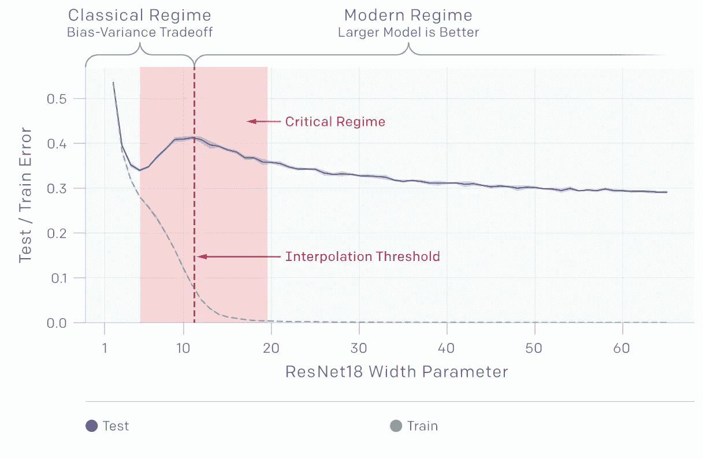
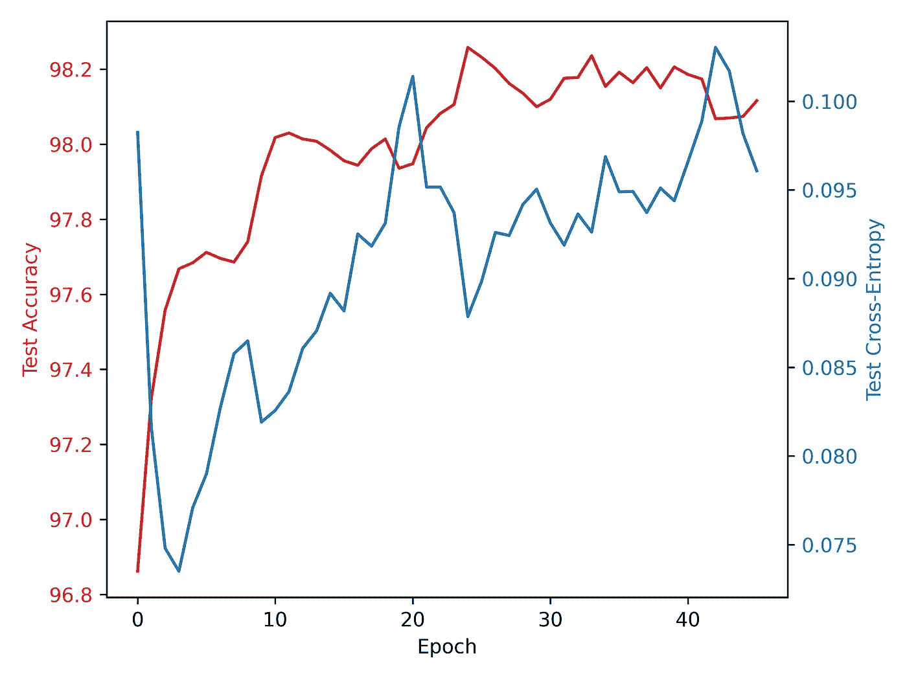
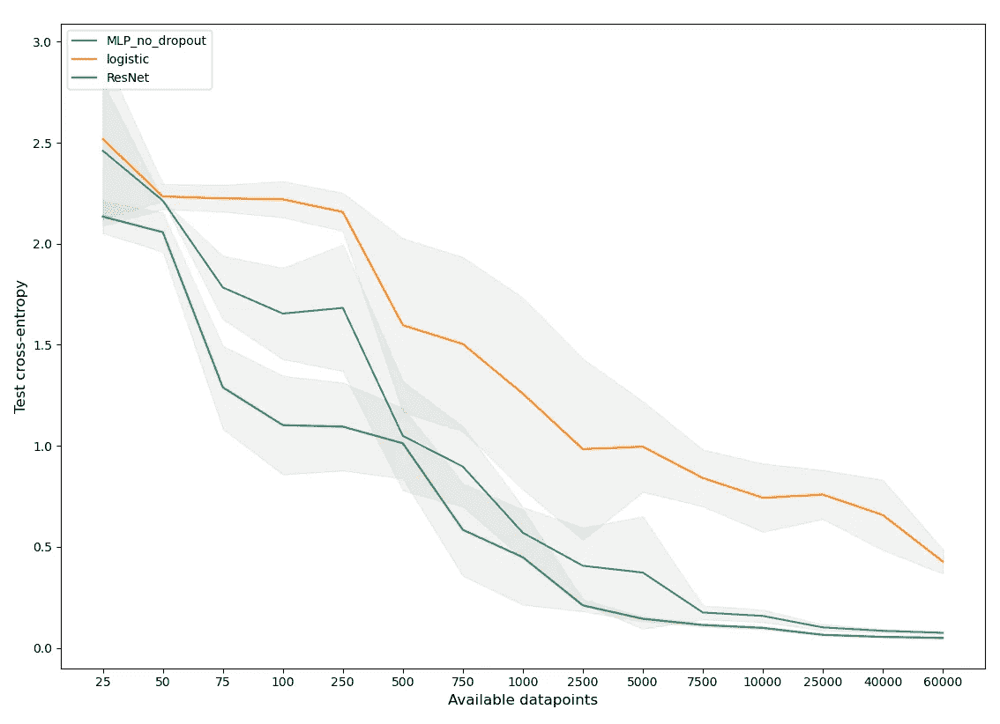
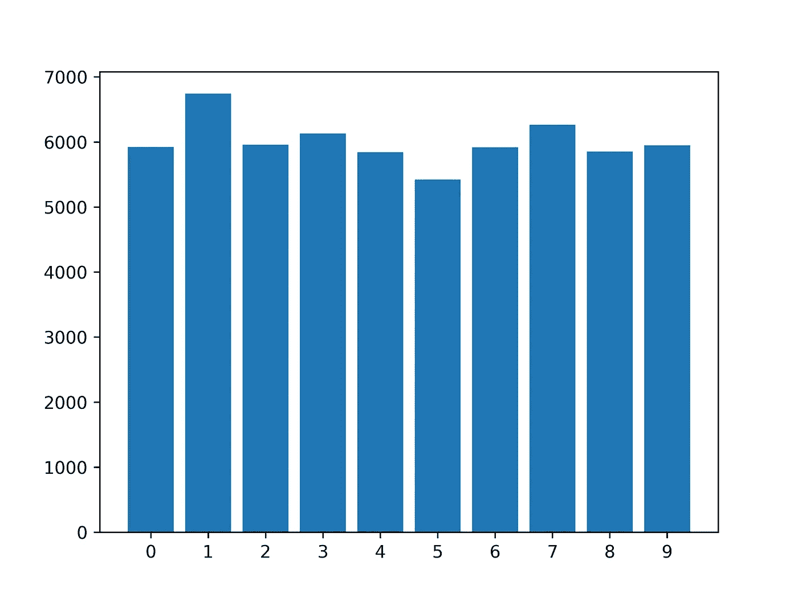

# 大神经网络和小数据的模型选择

> 原文：<https://towardsdatascience.com/model-selection-with-large-neural-networks-and-small-data-955b4d929d55?source=collection_archive---------30----------------------->

## 高度超参数化的神经网络可以表现出很强的泛化性能，即使是在小数据集上

[张家瑜](https://unsplash.com/@danielkcheung?utm_source=unsplash&utm_medium=referral&utm_content=creditCopyText)在 [Unsplash](https://unsplash.com/s/photos/small?utm_source=unsplash&utm_medium=referral&utm_content=creditCopyText) 上拍照

**标题声明**当然是一个大胆的主张，我怀疑你们中的许多人现在正在摇头。

> 根据统计学习的经典教导，这与众所周知的偏差-方差权衡相矛盾。这个理论定义了一个最佳点，如果你进一步增加模型的复杂性，泛化误差会增加(典型的 U 型测试误差曲线)。

您可能会认为这种影响对于参数数量 *p* 大于观察数量 *n* 的**小数据集**更为明显，但**不一定如此。**

在最近由 [Deepmind](https://proceedings.icml.cc/static/paper_files/icml/2020/6899-Paper.pdf) (Bornschein，2020)发表的一篇 ICML 2020 论文中，人们可以**在训练数据的更小子集**上进行训练，同时保持可概括的结果，即使对于大型的过度参数化模型也是如此。如果这是真的，我们可以**显著降低模型选择和超参数调整的计算开销**。

思考一下这件事的**含义**。这可能会极大地改变我们选择最佳模型或调整超参数的方式(例如在 Kaggle 比赛中)，因为我们可以在网格搜索中包括更多的模型(等等)。

> 这好得令人难以置信吗？我们如何证明这一点？

在我们开始之前，这里有一些要点:

*   **模型选择**可能只使用训练数据的**子集，从而**节省计算资源** ( *相对排序假设*)**
*   大型**过度参数化的神经网络**能够**惊人地推广** ( *双重下降*)
*   达到最小值后，**测试交叉熵倾向于随时间逐渐增加，同时测试准确度提高** ( *过度自信*)。这可以通过使用**温度刻度**来避免。

让我们开始吧。

# 1.偏倚-方差权衡的经典理论述评

在我们开始之前，我会给你两个选择。如果你已经厌倦了第 100 次听到偏差-方差权衡，请阅读第 1 部分末尾的 **TLDR** ，然后继续阅读第 2 部分。否则，我将简要介绍理解基础知识所需的最低要求，然后再继续讨论实际的论文。

所有监督学习算法的预测误差可以分为三个(理论上的)部分，这对于理解偏差-方差权衡是必不可少的。这些是；1)偏差 2)方差 3)不可约误差(或噪声项)

**不可约误差**(有时称为噪声)是一个与所选模型无关的术语，永远无法减少。这是由于问题的框架不完善而产生的数据的一个方面，这意味着我们永远无法捕捉数据的真实关系——无论我们的模型有多好。

**偏差**一词通常是人们在提到模型(预测)误差时想到的。简而言之，它衡量“平均”模型预测和实际情况之间的差异。在这种情况下，平均可能看起来很奇怪，因为我们通常只训练一个模型。这么想吧。由于我们数据中的小扰动(随机性),即使使用相同的模型，我们也可以得到稍微不同的预测。通过平均由于这些扰动而得到的预测范围，我们得到了偏差项。**高偏差**是模型拟合差(拟合不足)的标志，因为它在训练集和测试集上都有很大的预测误差。

最后，**方差**项是指给定数据点的模型预测的可变性。这听起来可能很相似，但关键区别在于“平均值”和“数据点”。**高方差**意味着高泛化误差。例如，虽然模型在训练集上可能相对准确，但它在测试集上的拟合度却相当差。当训练过度参数化的神经网络时，后一种情况(高方差、低偏差)通常是最有可能的，即我们所说的**过度拟合**。

这些术语的实际含义意味着平衡偏差和方差(因此得名权衡)，通常通过模型复杂性来控制。最终目标是获得低偏差和低方差。这是你以前可能见过的典型的 U 型测试误差曲线。

来自[https://www.digitalvidya.com/blog/bias-variance-tradeoff/](https://www.digitalvidya.com/blog/bias-variance-tradeoff/)

好吧，我假设你对偏差-方差权衡有足够的了解，可以理解为什么最初声称**过度参数化的神经网络不一定意味着高方差**确实令人困惑。

> TLDR；高方差、低偏差是过度拟合的标志。当模型在训练集上达到高精度，但在测试集上达到低精度时，就会发生过度拟合。这通常发生在过度参数化的神经网络中。

# 2.现代政体——型号越大越好！

在实践中，我们通常使用带有(例如)提前停止的验证集来优化偏差-方差权衡。有趣的是，这种**方法可能是完全错误的**。在过去的几年中，研究人员发现，如果你继续拟合越来越灵活的模型，你会得到所谓的*双下降*，即泛化误差在达到中间峰值后将再次开始下降。这一发现在 [Nakkiran et al. (2019)](https://arxiv.org/pdf/1912.02292.pdf) 关于现代神经网络架构的已建立和挑战性数据集上得到了经验验证。见下图来自 OpenAI，展示了这个场景；

来自[https://openai.com/blog/deep-double-descent/](https://openai.com/blog/deep-double-descent/)

*   测试误差最初下降，直到它达到(局部)最小值，然后随着复杂性的增加再次开始增加。在临界状态下，我们不断增加模型的复杂性是很重要的，因为测试误差将开始再次下降，最终达到(全局)最小值。

这些发现表明，由于双下降现象，较大的模型通常更好，这挑战了长期以来关于过度参数化神经网络的过度拟合的观点。

# 3.相对排序假设

已经确定大型超参数化神经网络可以很好地推广，我们想更进一步。进入**相对排名假设**。在我们解释假设之前，我们注意到，如果被证明为真，那么**您**可以为您的下一个实验对您的训练数据集的一个小子集执行**模型选择和超参数调整，这样做可以节省计算资源和宝贵的训练时间。**

我们将简要介绍这个假设，然后用几个实验来验证这个说法。作为文献中未包括的额外实验(据我们所知)，我们将调查一个可能使相对排名假设无效的设置，即**不平衡数据集**。

## a)理论

Bornschein (2020)的一个关键假设是；

> *“当在训练集的任意小的子集上训练时，过度参数化的模型架构似乎保持了它们在泛化性能方面的相对排名”*。

他们称这一观察为相对排名假说。

用**外行人的话说**；假设我们有 10 个型号可供选择，编号从 1 到 10。我们在训练数据的 10%子集上训练我们的模型，并且发现模型 6 是最好的，其次是模型 4，然后是模型 3，等等..

**排序假设假定，当我们逐渐将子集百分比从 10%增加到 100%时，我们应该获得最优模型的完全相同的排序。**

如果这个假设是真的，我们可以在原始数据的一个小的子集上执行模型选择，从而获得更快收敛的额外好处。如果这还不够有争议的话，作者甚至更进一步，因为他们发现了一些实验，在这些实验中，对小数据集的训练导致了更鲁棒的模型选择(更少的方差)，这当然似乎是违反直觉的，因为我们预计较小的数据集会有相对更多的噪声。

## b)温度校准

训练神经网络分类器时的一个奇怪现象是，**交叉熵误差有增大的趋势，而分类误差**减小。这种**看似违反直觉的**，其实只是因为模型在预测中变得**过于自信**([郭等(2017)](https://arxiv.org/pdf/1706.04599.pdf) )。我们可以使用一种叫做**温度缩放**的东西，它可以在一个小的保留数据集上校准交叉熵估计。与经典的交叉熵相比，这产生了更一般化和性能更好的结果，特别是与过度参数化的神经网络相关。作为一个粗略的类比，你可以认为这提供了更少的关于过度拟合情况的“假阴性”。

虽然 Bornschein (2020 年)没有提供他们论文中使用的 softmax 温度校准程序的明确细节，但我们在实验中使用了以下程序:

*   我们定义了一个保持校准数据集 C，相当于训练数据的 10%。
*   我们将温度标量初始化为 1.5(如郭等人(2017 年)所述)

## 对于每个时期；

*   1)在我们的校准集 C 上计算交叉熵损失
*   2)在校准集上使用梯度下降优化温度标量([参见郭等人的 Github 报告(2017)](https://github.com/gpleiss/temperature_scaling) )
*   3)在梯度下降期间，使用更新的温度标量来校准常规交叉熵
*   在训练 50 个时期后，我们计算校准的测试误差，该误差应该不再表现出过度自信的迹象。

现在让我们转向实验设置。

# 4.实验

在这篇文章中，我们将进行两个实验。一个用于验证 MNIST 数据集上的相对排名假设，一个用于评估如果我们综合地使 MNIST 不平衡，我们的结论会如何变化。Bornschein (2020)论文中的没有包括后一个实验**，并且可能会使不平衡数据集的相对排序假设无效。**

## MNIST

我们从复制 Bornschein (2020)对 MNIST 的研究开始，然后继续进行不平衡数据集实验。这并不意味着否定论文中的任何说法，而只是为了确保我们尽可能地复制了他们的实验设置(做了一些修改)。

*   分别对训练集和校准集进行 90%/10%的拆分
*   随机抽样(根据论文，平衡子集抽样没有提供任何额外的好处)
*   50 个时代
*   具有固定学习率的 Adam[10e-4]
*   批量= 256
*   具有 3 个隐藏层和 2048 个单元的全连接 MLPs
*   没有辍学(使我们的结果太不稳定，无法纳入)
*   具有 4 层、5×5 空间核、跨距 1 和 256 个信道的简单卷积网络
*   逻辑回归
*   10 种不同的种子来显现不确定性带(原始论文中有 30 种)

作者还提到了用 tanh、batch-norm、layer-norm 等替换 ReLU 的实验。，但不清楚这些测试是否包括在他们的最终结果中。因此，我们只考虑使用上述设置的实验。

## 实验一:梯度下降过程中的温度标度如何影响泛化？

作为初始实验，我们希望验证为什么需要温度缩放。为此，我们分别使用 ReLU 和 3 个 2048 个单位的隐藏层来训练 MLP。我们不包括辍学者，我们培训 50 个纪元。

**我们的假设是:**随着时间的推移，测试交叉熵应该逐渐增加，而测试精度会逐渐降低(首先是温度缩放的动机，即模型过度自信)。

**下面是这个初步实验的结果:**

显然，测试熵确实在开始时下降，然后随着时间逐渐增加，同时测试精度不断提高。这是支持假设 1 的证据。Guo 等人(2017 年)的图 3 展示了对 CIFAR-100 的完全相同的影响。
*注:*我们对结果做了一点平滑处理(5 窗口滚动平均)使效果更明显。

**实验 1 的结论:**

*   如果我们持续训练大型神经网络足够长的时间，我们会开始看到过于自信的概率预测，使它们在样本外变得不那么有用。

为了补救这种影响，我们可以**结合温度缩放**

*   **a)** 确保样本外的概率预测更加稳定和可靠，以及
*   **b)** 在梯度下降过程中，通过缩放训练交叉熵来提高泛化能力。

## 平衡数据集

已经表明需要温度缩放，我们现在转向主要实验，即测试交叉熵如何作为我们训练数据集大小的函数而变化。我们的结果如下:

测试交叉熵作为 MNIST 训练集大小的函数

注意，我们没有获得与 Bornschein (2020)完全相同的“平滑”结果。这很可能是因为我们没有完全复制他们的实验，因为他们包括了更多不同的种子。尽管如此，我们可以得出以下结论:

*   有趣的是，相对较大的 ResNet-18 模型在训练过程中的任何时候都不会比逻辑回归拟合得更好！
*   相对排序假设得到了证实
*   超过 25000 次观察(大约是 MNIST 训练数据集的一半)，明显更大的 ResNet 模型仅比相对更快的 MLP 模型略好。

# 不平衡数据集

我们现在将针对不平衡数据集的情况进行一个实验，该实验并不包括在实际的论文中，因为它可能是一个测试假设无效的设置。

我们采样一个类似于[郭等(2019)](https://arxiv.org/pdf/1706.04599.pdf) 的人为失衡版本的。程序如下。对于数据集中的每个类，我们对原始训练和测试数据集进行 0%到 100%的二次抽样。我们使用下面的 [GitHub repo](https://github.com/ufoym/imbalanced-dataset-sampler/blob/master/examples/mnist.ipynb) 进行采样。

然后，我们选择类似于先前实验的校准数据集，即，在训练和校准之间随机 90/10%分割。

我们包括了**原始 MNIST 训练数据集**的类分布的可视化

MNIST 每个等级的频率计数

还有**不平衡版**

不平衡 MNIST 中每个类的频率计数

鉴于这种频率分布的巨大差异，你可以清楚地看到这个版本比原来的 MNIST 更加不平衡。

虽然存在大量不同的方法来克服不平衡数据集的问题(参见下面的[综述论文](https://arxiv.org/pdf/1710.05381.pdf))，但我们希望研究和隔离不平衡数据集对相对排序假设的影响，即相对排序假设在不平衡数据设置中是否仍然成立？

我们使用这个综合不平衡的 MNIST 数据集再次运行我们的所有模型，并获得以下结果:

测试作为不平衡 MNIST 的训练集大小的函数的交叉熵

那么结论改变了吗？

**不是真的**！

这是一个非常乐观的结果，因为我们现在更有信心，在不平衡数据集的情况下，相对排序假设大多是正确的。我们认为这也可能是引用 Bornschein (2020 年)论文中关于抽样策略的原因；

> *“我们试验了平衡子集抽样，即确保所有子集在每类中都包含相同数量的样本。但是我们没有观察到这样做有任何可靠的改进，因此我们又回到了简单的 i.i.d .采样策略。”*

平衡版本和不平衡版本之间的主要区别是更多的"**跳动的**"结果，这是有意义的，因为测试集中可能有在所选模型的训练期间看不到的类。

# 5.摘要

**总结我们的发现:**

*   由于*相对排序假设*，对于平衡和不平衡数据集，我们可以仅使用我们的训练数据的**子集来执行**模型选择**，从而**节省计算资源****
*   大型**过度参数化的神经网络**能够**惊人地推广**，甚至在小型数据集上(*双重下降*)
*   我们可以通过应用**温度标度**来**避免过度自信**

我希望你能够在下一次机器学习实验中应用这些发现，并且记住，越大(几乎)总是越好。

**感谢您的阅读！**

# 6.参考

[1] J. Bornschein，F. Visin 和 S. Osindero,《小数据，大决策:小数据体制中的模型选择》( 2020 年)，载于机器学习国际会议(ICML)。

[2] P. Nakkiran，G. Kaplun，Y. Yang，B. T. Barak 和 I. Sutskever，深度双重下降:更大的模型和更多数据的伤害(2019)，arXiv 预印本 arXiv:1912.02292。

[3]郭、普莱斯、孙和温伯格(2017 年)。关于现代神经网络的校准(2017)，arXiv 预印本 arXiv:1706.04599。

[4] T. Guo，X. Zhu，Y. Wang，和 F. Chen，用于深度不平衡学习的判别样本生成(2019)，载于人工智能组织国际联合会议(IJCAI)(第 2406-2412 页)。

*原载于 2020 年 8 月 14 日*[*https://holm dk . github . io*](https://holmdk.github.io/2020/08/14/deep_learning_small_data.html)*。*