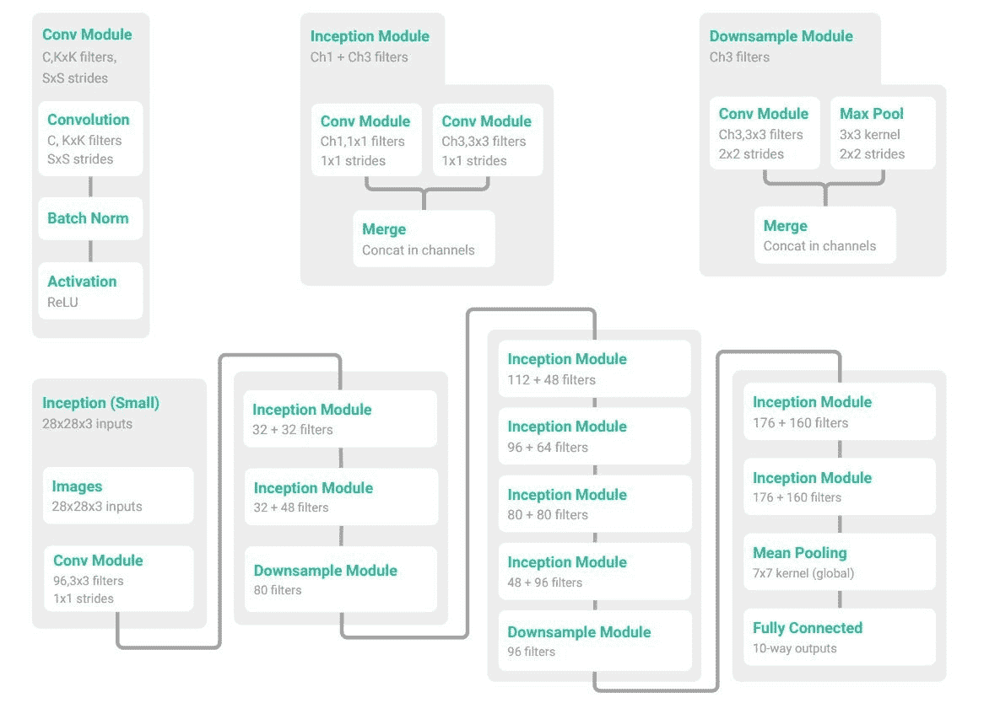
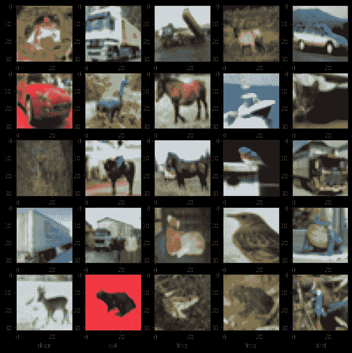
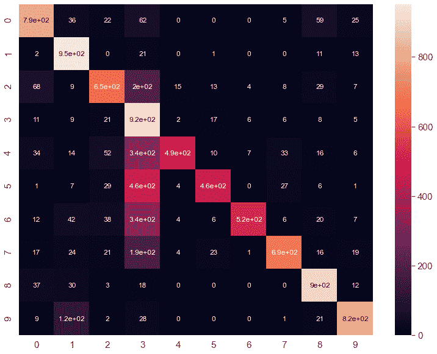

# TensorFlow 2 中从头开始的模型子分类和自定义训练循环

> 原文：<https://towardsdatascience.com/model-sub-classing-and-custom-training-loop-from-scratch-in-tensorflow-2-cc1d4f10fb4e?source=collection_archive---------0----------------------->

## 对 TF.Keras 中模型子类化和自定义训练循环的各种组件的简单介绍。


图片由 [Unsplash](https://unsplash.com/t/nature?utm_source=unsplash&utm_medium=referral&utm_content=creditCopyText) 上的[尼玛·萨拉姆](https://unsplash.com/@nima_sarram?utm_source=unsplash&utm_medium=referral&utm_content=creditCopyText)拍摄

在本文中，我们将尝试从 **TensorFlow 2** 中的开始理解**模型子类 API** 和**自定义训练循环。这可能不是一个初学者或高级介绍，但目的是获得他们都是什么粗略的直觉。本帖分为三个部分:**

1.  **tensor flow 2 中的可比建模策略**
2.  **用模型子类化 API 建立一个初始网络**
3.  **端到端培训，从头开始定制培训循环**

因此，首先，我们将了解使用 TensorFlow 2 定义模型的几种方法以及它们之间的区别。接下来，我们将看到使用 TF 2 中引入的模型子类化 API 来构建一个复杂的神经架构是多么的可行。然后我们将实现一个定制的训练循环，从头开始端到端地训练这些子类化模型。我们还将在我们的定制训练循环中使用 Tensorboard 来跟踪每一批的模型性能。我们还将看到如何在训练后保存和加载模型。最后，我们将通过混淆矩阵和分类报告等来衡量模型的性能。

# TensorFlow 2 中的可比建模策略

在**中 *TF。Keras*** 我们基本上有三种方式可以定义一个神经网络，即

*   **顺序 API**
*   **功能 API**
*   **模型子类化 API**

其中，**顺序 API** 是最容易实现的方法，但有一定的局限性。例如，使用这个 API，我们不能创建一个与另一个层共享特性信息的模型，除了它的后续层。此外，多输入和多输出也不可能实现。在这一点上，**功能 API** 确实很好地解决了这些问题。像 Inception 或 ResNet 这样的模型在函数式 API 中实现是可行的。但深度学习研究人员通常希望对网络和训练管道的每个细微差别有更多的控制，这正是**模型子类化 API** 所服务的。模型子类化是一种完全可定制的方式，以面向对象的方式实现定制设计的深度神经网络的前馈机制。

让我们使用这三个 API 创建一个非常基本的神经网络。这将是相同的神经架构，并会看到什么是实现差异。这当然不会展示全部潜力，尤其是对于**功能**和**模型子类 API** 。架构将如下所示:

```
Input - > Conv - > MaxPool - > BN - > Conv -> BN - > Droput - > GAP -> Dense
```

很简单。如上所述，让我们分别用顺序、功能和模型子类创建神经网络。

## 顺序 API

```
# declare input shape 
seq_model = tf.keras.Sequential()
seq_model.add(tf.keras.Input(shape=imput_dim))

# Block 1
seq_model.add(tf.keras.layers.Conv2D(32, 3, strides=2, activation="relu"))
seq_model.add(tf.keras.layers.MaxPooling2D(3))
seq_model.add(tf.keras.layers.BatchNormalization())

# Block 2
seq_model.add(tf.keras.layers.Conv2D(64, 3, activation="relu"))
seq_model.add(tf.keras.layers.BatchNormalization())
seq_model.add(tf.keras.layers.Dropout(0.3))

# Now that we apply global max pooling.
seq_model.add(tf.keras.layers.GlobalMaxPooling2D())

# Finally, we add a classification layer.
seq_model.add(tf.keras.layers.Dense(output_dim))
```

## 功能 API

```
# declare input shape 
input = tf.keras.Input(shape=(imput_dim))

# Block 1
x = tf.keras.layers.Conv2D(32, 3, strides=2, activation="relu")(input)
x = tf.keras.layers.MaxPooling2D(3)(x)
x = tf.keras.layers.BatchNormalization()(x)

# Block 2
x = tf.keras.layers.Conv2D(64, 3, activation="relu")(x)
x = tf.keras.layers.BatchNormalization()(x)
x = tf.keras.layers.Dropout(0.3)(x)

# Now that we apply global max pooling.
gap = tf.keras.layers.GlobalMaxPooling2D()(x)

# Finally, we add a classification layer.
output = tf.keras.layers.Dense(output_dim)(gap)

# bind all
func_model = tf.keras.Model(input, output)
```

## 模型子类 API

```
class ModelSubClassing(tf.keras.Model):
    def __init__(self, num_classes):
        super(ModelSubClassing, self).__init__()
        # define all layers in init
        # Layer of Block 1
        self.conv1 = tf.keras.layers.Conv2D(
                          32, 3, strides=2, activation="relu"
                     )
        self.max1  = tf.keras.layers.MaxPooling2D(3)
        self.bn1   = tf.keras.layers.BatchNormalization()

        # Layer of Block 2
        self.conv2 = tf.keras.layers.Conv2D(64, 3, activation="relu")
        self.bn2   = tf.keras.layers.BatchNormalization()
        self.drop  = tf.keras.layers.Dropout(0.3)

        # GAP, followed by Classifier
        self.gap   = tf.keras.layers.GlobalAveragePooling2D()
        self.dense = tf.keras.layers.Dense(num_classes)

    def call(self, input_tensor, training=False):
        # forward pass: block 1 
        x = self.conv1(input_tensor)
        x = self.max1(x)
        x = self.bn1(x)

        # forward pass: block 2 
        x = self.conv2(x)
        x = self.bn2(x)

        # droput followed by gap and classifier
        x = self.drop(x)
        x = self.gap(x)
        return self.dense(x)
```

在**模型子类**中有两个最重要的函数 ***__init__*** 和 ***调用*** 。基本上，我们将在 ***__init__*** 方法中定义所有可训练的 ***tf.keras*** 层或自定义实现的层，并在用于执行前向传播的 ***call*** 方法中根据我们的网络设计调用这些层。(反正和 PyTorch 里用来建模型的 ***forward*** 方法挺像的。)

让我们在 MNIST 数据集上运行这些模型。我们将从***TF . keras . datasets****加载。*然而，输入图像是 **28** 乘 **28** 并且是灰度形状。我们将重复这个轴三次，这样如果需要的话，我们就可以用预训练的重量进行可行的实验。

```
(x_train, y_train), (x_test, y_test) = tf.keras.datasets.mnist.load_data()

# x_train.shape, y_train.shape: (60000, 28, 28) (60000,)
# x_test.shape,  y_test.shape : (10000, 28, 28) (10000,)

# train set / data 
x_train = np.expand_dims(x_train, axis=-1)
x_train = np.repeat(x_train, 3, axis=-1)
x_train = x_train.astype('float32') / 255
# train set / target 
y_train = tf.keras.utils.to_categorical(y_train, num_classes=10)

# validation set / data 
x_test = np.expand_dims(x_test, axis=-1)
x_test = np.repeat(x_test, 3, axis=-1)
x_test = x_test.astype('float32') / 255
# validation set / target 
y_test = tf.keras.utils.to_categorical(y_test, num_classes=10)

# ------------------------------------------------------------------
# compile 
print('Sequential API')
seq_model.compile(
          loss      = tf.keras.losses.CategoricalCrossentropy(),
          metrics   = tf.keras.metrics.CategoricalAccuracy(),
          optimizer = tf.keras.optimizers.Adam())
# fit 
seq_model.fit(x_train, y_train, batch_size=128, epochs=1)

# compile 
print('\nFunctional API')
func_model.compile(
          loss      = tf.keras.losses.CategoricalCrossentropy(),
          metrics   = tf.keras.metrics.CategoricalAccuracy(),
          optimizer = tf.keras.optimizers.Adam())
# fit 
func_model.fit(x_train, y_train, batch_size=128, epochs=1)

# compile 
print('\nModel Sub-Classing API')
sub_classing_model = ModelSubClassing(10)
sub_classing_model.compile(
          loss      = tf.keras.losses.CategoricalCrossentropy(),
          metrics   = tf.keras.metrics.CategoricalAccuracy(),
          optimizer = tf.keras.optimizers.Adam())
# fit 
sub_classing_model.fit(x_train, y_train, batch_size=128, epochs=1);
```

输出

```
Sequential API
469/469 [==============================] - 2s 3ms/step - loss: 7.5747 - categorical_accuracy: 0.2516

Functional API
469/469 [==============================] - 2s 3ms/step - loss: 8.1335 - categorical_accuracy: 0.2368

Model Sub-Classing API
469/469 [==============================] - 2s 3ms/step - loss: 5.2695 - categorical_accuracy: 0.1731
```

# 用模型子类 API 构建一个初始网络

TF 中的核心数据结构。Keras 是**层**和**模型**类。一层封装了 ***状态*** (权重)和从输入到输出的转换，即 ***调用*** 方法，用于定义正向传递。然而，这些层也是递归可组合的。这意味着如果我们将一个***TF . keras . layers . layer***实例指定为另一个***TF . keras . layer***的属性，外层将开始跟踪内层的权重矩阵。因此，每一层将跟踪其子层的权重，包括可训练的和不可训练的。当我们需要构建这样一个更高级别的抽象层时，就需要这样的功能。

在这一部分中，我们将通过对层和模型类进行子类化来构建一个小型的初始模型。请看下图。这是一个小**盗梦空间**网络 [src](https://arxiv.org/pdf/1611.03530.pdf) 。如果仔细观察，我们会发现它主要由三个特殊模块组成，即:

1.  ***Conv 模块***
2.  ***盗梦模块***
3.  ***下采样模块***



一个小型的盗梦空间网络， [src](https://arxiv.org/pdf/1611.03530.pdf) 。

## Conv 模块

从图中我们可以看到，它由一个卷积网络、一个批量归一化和一个 relu 激活组成。同样，它用 ***K x K*** 滤镜和 ***S x S*** 步距生成 ***C*** 倍特征图。现在，如果我们简单地采用顺序建模方法，效率会非常低，因为我们将在整个网络中多次重复使用该模块。因此，定义一个功能块将是足够简单有效的。但是这一次，我们会更喜欢*层子类*更*python 化*更高效。为此，我们将创建一个将继承***TF . keras . layers . layer***类的类对象。

```
class ConvModule(tf.keras.layers.Layer):
     def __init__(
        self, kernel_num, kernel_size, strides, padding='same'
    ):
        super(ConvModule, self).__init__()
        # conv layer
        self.conv = tf.keras.layers.Conv2D(
                    kernel_num, 
                    kernel_size=kernel_size, 
                    strides=strides, 
                    padding=padding
                )
        # batch norm layer
         self.bn   = tf.keras.layers.BatchNormalization()

      def call(self, input_tensor, training=False):
        x = self.conv(input_tensor)
        x = self.bn(x, training=training)
        x = tf.nn.relu(x)
        return x
```

现在，我们还可以初始化该类的对象，并查看以下属性。

```
cm = ConvModule(96, (3,3), (1,1))
y = cm(tf.ones(shape=(2,32,32,3))) # first call to the `cm` will create weights

print("weights:", len(cm.weights))
print("trainable weights:", len(cm.trainable_weights))

# output
weights: 6
trainable weights: 4
```

## 初始模块

接下来是初始模块。根据上图，它由两个 ***卷积模块*** 组成，然后合并在一起。现在我们知道要合并，这里我们需要确保输出特征图的尺寸( ***高度*** 和 ***宽度*** )需要相同。

```
class InceptionModule(tf.keras.layers.Layer):
    def __init__(self, kernel_size1x1, kernel_size3x3):
        super(InceptionModule, self).__init__()
        # two conv modules: they will take same input tensor 
        self.conv1 = ConvModule(
                        kernel_size1x1, kernel_size=(1,1), strides=(1,1)
                      )
        self.conv2 = ConvModule(
                        kernel_size3x3, kernel_size=(3,3), strides=(1,1)
                      )
        self.cat   = tf.keras.layers.Concatenate()

    def call(self, input_tensor, training=False):
        x_1x1 = self.conv1(input_tensor)
        x_3x3 = self.conv2(input_tensor)
        x = self.cat([x_1x1, x_3x3])
        return x 
```

这里你可能会注意到，我们现在根据网络(图)对两个卷积层的确切的 ***内核大小*** 和 ***步长*** 数进行了硬编码。同样在***conv module****，*中我们已经将 ***padding*** 设置为“*same”*，这样两者( ***self.conv1*** 和 ***self.conv2*** )的特征图的尺寸将是相同的；这是将它们连接到末尾所需要的。

同样，在这个模块中，两个变量作为占位符执行，***kernel _ size1x 1***和***kernel _ size3x 3****。*这是为了当然的目的。因为在整个模型的不同阶段，我们需要不同数量的特征地图。如果我们查看模型的图表，我们会看到***inception module***在模型的不同阶段采用不同数量的过滤器。

## 下采样模块

最后是下采样模块。下采样的主要直觉是，我们希望获得更相关的特征信息，这些信息高度代表模型的输入。因为它倾向于移除不需要的特征，以便模型可以集中于最相关的特征。有许多方法可以降低特征图(或输入)的维数。例如:使用 ***跨步* 2** 或使用常规 ***拼成*** 操作。池化操作有很多种，分别是: **MaxPooling、AveragePooling、GlobalAveragePooling** 。

从图中，我们可以看到下采样模块包含一个卷积层和一个最大池层，它们后来合并在一起。现在，如果我们仔细观察该图(右上角)，我们会看到卷积层采用了一个 **3** x **3** 大小的滤波器，步长为 **2** x **2** 。而池层(此处 *MaxPooling* )取池大小 **3** x **3** 步长 **2** x **2** 。然而，公平地说，我们也需要确保来自它们中每一个的维度应该是相同的，以便最终合并。现在，如果我们还记得，当我们设计*conv module 时，我们特意将 ***padding*** 参数的值设置为` *same* '。但在这种情况下，我们需要将其设置为`*有效*`。*

```
*class DownsampleModule(tf.keras.layers.Layer):
    def __init__(self, kernel_size):
        super(DownsampleModule, self).__init__()
        # conv layer
        self.conv3 = ConvModule(
                  kernel_size, 
                  kernel_size=(3,3), 
                  strides=(2,2), 
                  padding="valid"
              ) 

        # pooling layer 
        self.pool  = tf.keras.layers.MaxPooling2D(
                  pool_size=(3, 3), 
                  strides=(2,2)
              )
        self.cat   = tf.keras.layers.Concatenate()

 def call(self, input_tensor, training=False):
        # forward pass 
        conv_x = self.conv3(input_tensor, training=training)
        pool_x = self.pool(input_tensor)

        # merged
        return self.cat([conv_x, pool_x])*
```

## *模型类:图层包含*

*一般来说，我们使用 ***层*** 类来定义内部计算模块，并将使用 ***模型*** 类来定义外部模型，实际上就是我们将要训练的对象。在我们的例子中，在一个 ***初始*** 模型中，我们定义了三个计算模块: *Conv 模块、初始模块*和*下采样模块*。这些是通过子类化 ***层*** 类创建的。所以接下来，我们将使用 ***模型*** 类来包含这些计算模块，以便创建整个 ***初始*** 网络。通常情况下， ***模型*** 类具有与 ***层*** 相同的 API，但具有一些额外的功能。*

*与 ***层*** 类相同，我们将*初始化 ***模型*** 类的 *init* 方法内的计算块*如下:*

```
*# the first conv module
self.conv_block = ConvModule(96, (3,3), (1,1))

# 2 inception module and 1 downsample module
self.inception_block1  = InceptionModule(32, 32)
self.inception_block2  = InceptionModule(32, 48)
self.downsample_block1 = DownsampleModule(80)

# 4 inception module and 1 downsample module
self.inception_block3  = InceptionModule(112, 48)
self.inception_block4  = InceptionModule(96, 64)
self.inception_block5  = InceptionModule(80, 80)
self.inception_block6  = InceptionModule(48, 96)
self.downsample_block2 = DownsampleModule(96)

# 2 inception module 
self.inception_block7 = InceptionModule(176, 160)
self.inception_block8 = InceptionModule(176, 160)

# average pooling
self.avg_pool = tf.keras.layers.AveragePooling2D((7,7))*
```

*每个计算模块的**滤波器数量**的数量根据模型的设计进行设置(也可在下图中看到)。在草签完所有的积木后，我们将根据设计(图)把它们连接起来。这里是使用**模型**子类的完整**初始**网络:*

```
*class MiniInception(tf.keras.Model):
    def __init__(self, num_classes=10):
        super(MiniInception, self).__init__()

        # the first conv module
        self.conv_block = ConvModule(96, (3,3), (1,1))

        # 2 inception module and 1 downsample module
        self.inception_block1  = InceptionModule(32, 32)
        self.inception_block2  = InceptionModule(32, 48)
        self.downsample_block1 = DownsampleModule(80)

        # 4 inception module and 1 downsample module
        self.inception_block3  = InceptionModule(112, 48)
        self.inception_block4  = InceptionModule(96, 64)
        self.inception_block5  = InceptionModule(80, 80)
        self.inception_block6  = InceptionModule(48, 96)
        self.downsample_block2 = DownsampleModule(96)

        # 2 inception module 
        self.inception_block7 = InceptionModule(176, 160)
        self.inception_block8 = InceptionModule(176, 160)

        # average pooling
        self.avg_pool = tf.keras.layers.AveragePooling2D((7,7))

        # model tail
        self.flat      = tf.keras.layers.Flatten()
        self.classfier = tf.keras.layers.Dense(
                                num_classes, activation='softmax'
                            )

    def call(self, input_tensor, training=False, **kwargs):
        # forward pass 
        x = self.conv_block(input_tensor)
        x = self.inception_block1(x)
        x = self.inception_block2(x)
        x = self.downsample_block1(x)

        x = self.inception_block3(x)
        x = self.inception_block4(x)
        x = self.inception_block5(x)
        x = self.inception_block6(x)
        x = self.downsample_block2(x)

        x = self.inception_block7(x)
        x = self.inception_block8(x)
        x = self.avg_pool(x)

        x = self.flat(x)
        return self.classfier(x)

    def build_graph(self, raw_shape):
        x = tf.keras.layers.Input(shape=raw_shape)
        return Model(inputs=[x], outputs=self.call(x))*
```

*你可能注意到了，除了 ***__init__*** 和 **call** 方法之外，我们还定义了一个自定义方法 ***build_graph*** *。*我们使用它作为辅助功能，方便地绘制模型摘要信息。请查看[本讨论](https://github.com/tensorflow/tensorflow/issues/31647#issuecomment-692586409)了解更多详情。无论如何，让我们看看模型的总结。*

```
*raw_input = (32, 32, 3)

# init model object
cm = MiniInception()

# The first call to the `cm` will create the weights
y = cm(tf.ones(shape=(0,*raw_input))) 

# print summary
cm.build_graph(raw_input).summary()

# ---------------------------------------------------------------------

Layer (type)                 Output Shape              Param #   
=================================================================
input_6 (InputLayer)         [(None, 32, 32, 3)]       0         
_________________________________________________________________
conv_module_329 (ConvModule) (None, 32, 32, 96)        3072      
_________________________________________________________________
inception_module_136 (Incept (None, 32, 32, 64)        31040     
_________________________________________________________________
inception_module_137 (Incept (None, 32, 32, 80)        30096     
_________________________________________________________________
downsample_module_34 (Downsa (None, 15, 15, 160)       58000     
_________________________________________________________________
inception_module_138 (Incept (None, 15, 15, 160)       87840     
_________________________________________________________________
inception_module_139 (Incept (None, 15, 15, 160)       108320    
_________________________________________________________________
inception_module_140 (Incept (None, 15, 15, 160)       128800    
_________________________________________________________________
inception_module_141 (Incept (None, 15, 15, 144)       146640    
_________________________________________________________________
downsample_module_35 (Downsa (None, 7, 7, 240)         124896    
_________________________________________________________________
inception_module_142 (Incept (None, 7, 7, 336)         389520    
_________________________________________________________________
inception_module_143 (Incept (None, 7, 7, 336)         544656    
_________________________________________________________________
average_pooling2d_17 (Averag (None, 1, 1, 336)         0         
_________________________________________________________________
flatten_13 (Flatten)         (None, 336)               0         
_________________________________________________________________
dense_17 (Dense)             (None, 10)                3370      
=================================================================
Total params: 1,656,250
Trainable params: 1,652,826
Non-trainable params: 3,424*
```

*现在，通过模型子类化构建整个 **Inception** 模型就完成了。*

# *从头开始定制培训循环的端到端培训*

*现在我们已经建立了一个复杂的网络，是时候让它忙着学习一些东西了。我们现在可以简单地通过使用 ***编译*** 和 ***拟合*** 来轻松训练模型。但是这里我们将从头开始看一个定制的训练循环。这个功能是 ***TensorFlow 2*** 中新引入的。请注意，这个功能相对来说有点复杂，更适合深度学习研究者。*

## *数据集*

*出于演示目的，我们将使用 [CIFAR-10](https://www.cs.toronto.edu/~kriz/cifar.html) 数据集。先准备一下吧。*

```
*(x_train, y_train), (x_test, y_test) = keras.datasets.cifar10.load_data()
print(x_train.shape, y_train.shape) # (50000, 32, 32, 3) (50000, 1)
print(x_test.shape, y_test.shape)   # (10000, 32, 32, 3) (10000, 1)

# train set / data 
x_train = x_train.astype('float32') / 255

# validation set / data 
x_test = x_test.astype('float32') / 255

# target / class name
class_names = ['airplane', 'automobile', 'bird', 'cat', 'deer',
               'dog', 'frog', 'horse', 'ship', 'truck']

plt.figure(figsize=(10,10))
for i in range(25):
    plt.subplot(5,5,i+1)
    plt.grid(False)
    plt.imshow(x_train[i], cmap=plt.cm.binary)
    plt.xlabel(class_names[y_train[i][0]])*
```

**

*来自 cifar-10 的样本*

*这里我们将*类向量(* ***y_train，y_test*** *)* 转换为*多类矩阵*。我们还将使用 ***tf.data*** API 来获得更好、更高效的输入管道。*

```
*# train set / target 
y_train = tf.keras.utils.to_categorical(y_train, num_classes=10)
# validation set / target 
y_test = tf.keras.utils.to_categorical(y_test, num_classes=10)

# Prepare the training dataset.
train_dataset = tf.data.Dataset.from_tensor_slices((x_train, y_train))
train_dataset = train_dataset.shuffle(buffer_size=1024).batch(batch_size)

# Prepare the validation dataset.
val_dataset = tf.data.Dataset.from_tensor_slices((x_test, y_test))
val_dataset = val_dataset.batch(batch_size)*
```

*让我们快速检查一下*标签转换*和*输入限幅*后的数据形状:*

```
*for i, (x, y) in enumerate(train_dataset):
    print(x.shape, y.shape)

    if i == 2:
        break

for i, (x, y) in enumerate(val_dataset):
    print(x.shape, y.shape)

    if i == 2:
       break
# output 

(64, 32, 32, 3) (64, 10)
(64, 32, 32, 3) (64, 10)
(64, 32, 32, 3) (64, 10)

(64, 32, 32, 3) (64, 10)
(64, 32, 32, 3) (64, 10)
(64, 32, 32, 3) (64, 10)*
```

*到目前为止一切顺利。我们有一个输入形状**32*x*32*x*3**和总共 **10** 类来分类。然而，将*测试集*作为*验证集*并不理想，但出于演示目的，我们不考虑***train _ test _ split***方法。现在，让我们看看 Tensorflow 2 中的自定义培训管道由哪些部分组成。*

## *培训机制*

*在 *TF。Keras* ，我们有方便的训练和评估循环， ***适合*** ， ***评估*** 。但是我们也可以利用对培训和评估过程的低层次控制。在这种情况下，我们需要从头开始编写我们自己的训练和评估循环。以下是食谱:*

1.  *我们为循环打开一个**,它将迭代历元的数量。***
2.  *对于每个历元，我们为循环打开另一个**，它将批量迭代数据集( ***x* ， *y*** )。***
3.  *对于每一批，我们打开***gradient tape()****范围。**
4.  **在这个范围内，我们称这个模型为**正向传递**，并计算**损失**。**
5.  **在这个范围之外，我们检索关于**损失**的模型的权重的**梯度。****
6.  **接下来，我们使用优化器**基于梯度更新模型的权重**。**

**TensorFlow 提供了 ***tf。GradientTape()*** 用于自动微分的 API，即计算计算相对于某些输入的梯度。**

**下面是其操作过程的简短演示。这里我们有一些输入( ***x*** )和可训练参数( ***w，b*** )。**内 *tf。GradientTape()*** 范围，输出(***【y】***，基本上会是模型输出)，损耗进行测量。在这个范围之外，我们检索权重参数相对于损失的梯度。**

```
**# x:input, w,b: trainable param - x*w + b
w = tf.Variable(tf.random.normal((3, 2)), name='w')
b = tf.Variable(tf.zeros(2, dtype=tf.float32), name='b')
x = [[1., 2., 3.]]

# Open a GradientTape to record the operations run
# during the forward pass, which enables auto-differentiation.
with tf.GradientTape(persistent=True) as tape:
    y = x @ w + b # output from the forward pass (for the actual model)

    # Compute the loss value for this minibatch.
    loss = tf.reduce_mean(y**2)

# Calculate gradients with respect to every trainable variable
grad = tape.gradient(loss, [w, b])
grad

# output 
[
<tf.Tensor: shape=(3, 2), dtype=float32, numpy=
 array([[ -5.2607636,   1.4286567],
        [-10.521527 ,   2.8573134],
        [-15.782291 ,   4.28597  ]], dtype=float32)>,

<tf.Tensor: shape=(2,), dtype=float32, 
numpy=array([-5.2607636,  1.4286567], dtype=float32)>
]**
```

**现在，让我们相应地实现定制的培训方案。**

```
**for epoch in range(epochs): # <----- start for loop, step 1

  # <-------- start for loop, step 2
  # Iterate over the batches of the dataset.
  for step, (x_batch_train, y_batch_train) in enumerate(train_dataset):

    # <-------- start gradient tape scope, step 3
    # Open a GradientTape to record the operations run
    # during the forward pass, which enables auto-differentiation.
    with tf.GradientTape() as tape:

       # Run the forward pass of the layer.
       # The operations that the layer applies
       # to its inputs are going to be recorded
       # on the GradientTape.
       logits = model(x_batch_train, training=True) <- step 4

       # Compute the loss value for this minibatch.
       loss_value = loss_fn(y_batch_train, logits)  <- step 4 

    # compute the gradient of weights w.r.t. loss  <-------- step 5
    # Use the gradient tape to automatically retrieve
    # the gradients of the trainable variables with respect to the loss.
    grads = tape.gradient(loss_value, model.trainable_weights)

    # update the weight based on gradient  <---------- step 6
    # Run one step of gradient descent by updating
    # the value of the variables to minimize the loss.
    optimizer.apply_gradients(zip(grads, model.trainable_weights))**
```

**太好了。然而，我们仍然没有讨论如何添加指标来监控这个定制的训练循环。显然，我们也可以在训练循环中使用内置指标甚至自定义指标。在训练循环中添加指标相当简单，流程如下:**

1.  **每批后调用***metric . update _ state()*****
2.  **当我们需要显示度量的当前值时，调用***metric . result()*****
3.  **调用***metric . reset _ States()*****

**这里还有一件事要考虑。TensorFlow 2.0 中的默认运行时是急切执行。上面的训练循环正在急切地执行。但是如果我们想要进行图形编译，我们可以用***@ TF . function***decorator 将任何函数编译成静态图。这也加快了训练的速度。下面是用***@ TF . function***decorator 对训练和评估函数的设置。**

```
**@tf.function
def train_step(x, y):
   '''
   input: x, y <- typically batches 
   return: loss value
   '''

    # start the scope of gradient 
    with tf.GradientTape() as tape:
        logits = model(x, training=True) # forward pass
        train_loss_value = loss_fn(y, logits) # compute loss 

    # compute gradient 
    grads = tape.gradient(train_loss_value, model.trainable_weights)

    # update weights
    optimizer.apply_gradients(zip(grads, model.trainable_weights))

    # update metrics
    train_acc_metric.update_state(y, logits)

    return train_loss_value

@tf.function
def test_step(x, y):
   '''
   input: x, y <- typically batches 
   return: loss value
   '''
    # forward pass, no backprop, inference mode 
    val_logits = model(x, training=False) 

    # Compute the loss value 
    val_loss_value = loss_fn(y, val_logits)

    # Update val metrics
    val_acc_metric.update_state(y, val_logits)

    return val_loss_value**
```

**这里我们看到了***metrics . update _ state()****的用法。*这些函数返回到训练循环，在这里我们将设置显示日志消息、***【metric . result()****、*以及重置指标、***metric . reset _ States()****。***

**这是我们最不喜欢设置的东西，TensorBoard。有一些很棒的功能可以利用，如:[显示每批样本+混淆矩阵](https://www.tensorflow.org/tensorboard/image_summaries)，超参数调整，嵌入投影仪，模型图等。目前，我们将只关注记录 it 上的培训指标。很简单，但我们将把它集成到自定义培训循环中。所以，我们不能使用***TF . keras . callbacks . tensor board***而是需要使用 *TensorFlow 汇总 API* 。 ***tf.summary*** 模块提供了在 TensorBoard 上写入汇总数据的 API。我们希望在每个批处理操作之后写入日志记录状态，以获得更多详细信息。否则，我们可能更喜欢在每个时期结束时。让我们创建一个保存 ***事件*** 消息的目录。在工作目录中，创建 ***日志/训练*** 和 ***日志/测试*** *。*下面是完整的培训管道。我们建议首先通读代码，以便了解整个培训流程。**

```
**# Instantiate an optimizer to train the model.
optimizer = tf.keras.optimizers.Adam()

# Instantiate a loss function
loss_fn = tf.keras.losses.CategoricalCrossentropy()

# Prepare the metrics.
train_acc_metric = tf.keras.metrics.CategoricalAccuracy()
val_acc_metric   = tf.keras.metrics.CategoricalAccuracy()

# tensorboard writer 
train_writer = tf.summary.create_file_writer('logs/train/')
test_writer  = tf.summary.create_file_writer('logs/test/')

@tf.function
def train_step(step, x, y):
   '''
   input: x, y <- typically batches 
   input: step <- batch step
   return: loss value
   '''

    # start the scope of gradient 
    with tf.GradientTape() as tape:
        logits = model(x, training=True) # forward pass
        train_loss_value = loss_fn(y, logits) # compute loss 

    # compute gradient 
    grads = tape.gradient(train_loss_value, model.trainable_weights)

    # update weights
    optimizer.apply_gradients(zip(grads, model.trainable_weights))

    # update metrics
    train_acc_metric.update_state(y, logits)

    # write training loss and accuracy to the tensorboard
    with train_writer.as_default():
        tf.summary.scalar('loss', train_loss_value, step=step)
        tf.summary.scalar(
            'accuracy', train_acc_metric.result(), step=step
        ) 
    return train_loss_value

@tf.function
def test_step(step, x, y):
   '''
   input: x, y <- typically batches 
   input: step <- batch step
   return: loss value
   '''
    # forward pass, no backprop, inference mode 
    val_logits = model(x, training=False) 

    # Compute the loss value 
    val_loss_value = loss_fn(y, val_logits)

    # Update val metrics
    val_acc_metric.update_state(y, val_logits)

    # write test loss and accuracy to the tensorboard
    with test_writer.as_default():
        tf.summary.scalar('val loss', val_loss_value, step=step)
        tf.summary.scalar(
            'val accuracy', val_acc_metric.result(), step=step
        ) 
    return val_loss_value

# custom training loop 
for epoch in range(epochs):
    t = time.time()
    # batch training 

    # Iterate over the batches of the train dataset.
    for train_batch_step, (x_batch_train, \
                           y_batch_train) in enumerate(train_dataset):
        train_batch_step = tf.convert_to_tensor(
                                train_batch_step, dtype=tf.int64
                           )
        train_loss_value = train_step(
                                train_batch_step, 
                                x_batch_train, y_batch_train
                           )

    # evaluation on validation set 
    # Run a validation loop at the end of each epoch.
    for test_batch_step, (x_batch_val, \
                          y_batch_val) in enumerate(val_dataset):
        test_batch_step = tf.convert_to_tensor(
                               test_batch_step, dtype=tf.int64
                          )
        val_loss_value = test_step(
                                test_batch_step, x_batch_val, y_batch_val
                          )

    template = '
        ETA: {} - epoch: {} loss: {}  acc: {} val loss: {} val acc: {}\n
    '
    print(template.format(
        round((time.time() - t)/60, 2), epoch + 1,
        train_loss_value, float(train_acc_metric.result()),
        val_loss_value, float(val_acc_metric.result())
    ))

    # Reset metrics at the end of each epoch
    train_acc_metric.reset_states()
    val_acc_metric.reset_states()**
```

**瞧啊。我们用 RTX 2070 在本地系统中运行代码。通过启用*，我们能够将*批次大小*增加到 **256** 。以下是日志输出:***

```
**ETA: 0.78 - epoch: 1 loss: 0.7587890625  acc: 0.5794399976730347 val loss: 3.173828125 val acc: 0.10159999877214432

ETA: 0.29 - epoch: 2 loss: 0.63232421875  acc: 0.7421200275421143 val loss: 1.0126953125 val acc: 0.5756999850273132

ETA: 0.32 - epoch: 3 loss: 0.453369140625  acc: 0.8073400259017944 val loss: 0.7734375 val acc: 0.7243000268936157

ETA: 0.33 - epoch: 4 loss: 0.474365234375  acc: 0.8501200079917908 val loss: 0.64111328125 val acc: 0.7628999948501587

..
..

ETA: 0.35 - epoch: 17 loss: 0.0443115234375  acc: 0.9857199788093567 val loss: 1.8603515625 val acc: 0.7465000152587891

ETA: 0.68 - epoch: 18 loss: 0.01328277587890625  acc: 0.9839400053024292 val loss: 0.65380859375 val acc: 0.7875999808311462

ETA: 0.53 - epoch: 19 loss: 0.035552978515625  acc: 0.9851599931716919 val loss: 1.0849609375 val acc: 0.7432000041007996

ETA: 0.4 - epoch: 20 loss: 0.04217529296875  acc: 0.9877399802207947 val loss: 3.078125 val acc: 0.7224000096321106**
```

**过度拟合！但是现在没关系。为此，我们只需要考虑一些细节，如**图像增强**、**学习速率表**等。在工作目录中，对实时 tensorboard 运行以下命令。在下面的命令中， ***logs*** 是我们手动创建的保存事件日志的文件夹名。**

```
**tensorboard --logdir logs**
```

## **保存并加载**

**根据我们使用的 API，有各种各样的[方法来保存](https://www.tensorflow.org/guide/keras/save_and_serialize) *TensorFlow* 模型。模型子类化中的模型 ***保存*** 和 ***重新加载*** 与*顺序*或*功能 API* 中的不一样。它需要一些特别的关注。目前有两种格式存储模型: [*SaveModel*](https://www.tensorflow.org/guide/saved_model) 和 [HDF5](https://www.tensorflow.org/tutorials/keras/save_and_load) 。来自官方文件:**

> **HDF5 和 SavedModel 的关键区别在于，HDF5 使用对象配置来保存模型架构，而 SavedModel 保存执行图。因此，SavedModels 能够保存自定义对象，如子类模型和自定义层，而不需要原始代码。**

**因此，看起来 *SavedModels* 能够保存我们的定制子类模型。但是如果我们想要 *HDF5* 格式的自定义子类模型呢？根据医生的说法。我们也能做到，但是我们需要一些额外的东西。我们必须在我们的对象中定义 ***get_config*** 方法。并且在加载模型时还需要将对象传递给***custom _ object***参数。此参数必须是字典映射:*TF . keras . models . load _ model(path，custom _ objects = { ' custom layer ':custom layer })。*然而，似乎我们现在不能使用 HDF5，因为我们没有在自定义对象中使用 ***get_config*** 方法。然而，在自定义对象中定义这个函数实际上是一个很好的做法。如果需要的话，这将允许我们稍后容易地更新计算。**

**但是现在，让我们保存模型并用 *SavedModel* 格式重新加载它。**

```
**model.save('net', save_format='tf')**
```

**之后，它会在工作目录下创建一个名为 *net* 的新文件夹。它将包含 ***资产*** ，***saved _ model . Pb***， ***变量*** *。*模型架构和训练配置，包括优化器、损失和指标，存储在 *saved_model.pb* 中。权重保存在*变量*目录中。**

**当保存模型及其层时， *SavedModel* 格式存储类名、**调用**函数、损失和权重(以及配置，如果实现的话)。**调用**函数定义模型/层的计算图。在没有模型/层配置的情况下，**调用**函数用于创建一个像原始模型一样存在的模型，该模型可以被*训练*，*评估*，并用于*推理*。稍后，为了重新加载保存的模型，我们将执行以下操作:**

```
**new_model = tf.keras.models.load_model("net", compile=False)**
```

**设置****compile = False***是可选的，我这样做是为了避免警告日志。此外，由于我们正在进行自定义循环训练，我们不需要任何编译。***

**到目前为止，我们已经讨论了保存整个模型(*计算图*和*参数*)。但是，如果我们只想保存**训练重量**并在需要时重新加载重量。是的，我们也能做到。简单地说，**

```
**model.save_weights('net.h5')**
```

**这将减轻我们模型的重量。现在，当需要重新加载时，有一点需要记住。在尝试加载权重之前，我们需要调用 ***构建*** 方法。它主要初始化子类模型中的层，以便可以构建计算图。例如，如果我们尝试如下:**

```
**new_model = MiniInception()
new_model.load_weights('net.h5')

--------------------------------------
ValueError: Unable to load weights saved in HDF5 format 
into a subclassed Model which has not created its variables yet. 
Call the Model first, then load the weights.**
```

**要解决这个问题，我们可以做如下工作:**

```
**new_model = MiniInception()
new_model.build((None, *x_train.shape[1:])) # or .build((x_train.shape))
new_model.load_weights('net.h5')**
```

**它将成功加载。这里有一篇关于在 TF 中保存和序列化模型的很棒的文章。弗朗索瓦·乔莱的作品，必读。**

## **评估和预测**

**尽管不是必须的，让我们通过测量模型性能来结束。 **CIFAR-10** 级标号图如下: **0:** 飞机*，* **1:** 汽车*，* **2 *:*** 鸟*，* **3 *:*** 猫*，* **4 *:*** 先找**分类报告**吧。**

```
 **Y_pred = model.predict(x_test, verbose=1)
y_pred = np.argmax(Y_pred, axis=1)

target_names = [
      'airplane', 'automobile', 'bird', 'cat', 'deer',
      'dog', 'frog', 'horse', 'ship', 'truck'
]

classification_report(
      np.argmax(y_test, axis=1), 
      y_pred,target_names=target_names
)
#--------------------------------------------------------------------

          precision    recall  f1-score   support

    airplane       0.81      0.79      0.80      1000
  automobile       0.76      0.95      0.85      1000
        bird       0.78      0.65      0.71      1000
         cat       0.36      0.92      0.51      1000
        deer       0.94      0.49      0.65      1000
         dog       0.87      0.46      0.60      1000
        frog       0.97      0.52      0.68      1000
       horse       0.89      0.69      0.78      1000
        ship       0.83      0.90      0.86      1000
       truck       0.90      0.81      0.85      1000

    accuracy                           0.72     10000
   macro avg       0.81      0.72      0.73     10000
weighted avg       0.81      0.72      0.73     10000**
```

**接下来，多级 **ROC AUC** 得分:**

```
 **def multiclass_roc_auc_score(
      y_test, y_pred, average="macro"
):
    lb = LabelBinarizer()
    lb.fit(y_test)
    y_test = lb.transform(y_test)
    y_pred = lb.transform(y_pred)
    return roc_auc_score(y_test, y_pred, average=average)

multiclass_roc_auc_score(y_test,y_pred)
# ---------------------------------------------------
#output: 0.8436111111111112**
```

****混淆矩阵:****

```
**Y_pred = model.predict(x_test, verbose=2)
y_pred = np.argmax(Y_pred, axis=1)

cm = confusion_matrix(np.argmax(y_test, axis=1), y_pred)
cm = pd.DataFrame(cm, range(10),range(10))
plt.figure(figsize = (10,10))

sns.heatmap(cm, annot=True, annot_kws={"size": 12}) # font size
plt.show()**
```

****

**cifar_10 混淆矩阵**

****对新样本的预测/推断**:**

```
 **target_names = [
      'airplane', 'automobile', 'bird', 'cat', 'deer',
      'dog', 'frog', 'horse', 'ship', 'truck'
]

# Give the link of the image here to test 
test_image1 = image.load_img(image_file, target_size=(32,32))
test_image  = image.img_to_array(test_image1) 
test_image  = np.expand_dims(test_image, axis =0) 
prediction  = model.predict(test_image)[0] 
label_index = np.argmax(prediction)
target_names[label_index]**
```

# **尾注**

**这件事到此为止。非常感谢你阅读这篇文章，希望你们喜欢。文章有点长，这里简单总结一下。**

**我们先对比一下 **TF。Keras** 建模 API。接下来，我们使用 ***模型子类*** API 来逐步构建一个小型**初始**网络。然后我们用 **GradientTape** 来看看 TensorFlow 2 中新引入的自定义循环训练的流程。我们还端到端地训练了子类化的 **Inception** 模型。最后，我们讨论自定义模型保存和重新加载，然后测量这些经过训练的模型的性能。**

# **有趣的阅读**

1.  **[py torch 中的亲笔签名和 TensorFlow 2 中的 gradient tape](https://stackoverflow.com/a/67591848/9215780)**
2.  **[tensor flow 2[Keras]中的多输入多输出建模](https://stackoverflow.com/a/66849164/9215780)**
3.  **[选择损失和指标](https://stackoverflow.com/a/67851641/9215780)**
4.  **[在喀拉斯重装最佳关卡](https://stackoverflow.com/a/67744905/9215780)**
5.  **[Keras 致密层 vs PyTorch 线性层](https://stackoverflow.com/a/66627036/9215780)**
6.  **[Keras 建模 API 与顺序 API](https://stackoverflow.com/a/66880334/9215780)**
7.  **[Keras 模型。预测比 NumPy 慢！](https://stackoverflow.com/a/67238117/9215780)**
8.  **[在 Keras 中实现 grad cam](https://stackoverflow.com/a/66189774/9215780)**
9.  **[LSTM/GRU Keras 关注层](https://stackoverflow.com/a/68297796/9215780)**
10.  **[TensorFlow 数据 API vs Numpy 数组](https://stackoverflow.com/a/66238161/9215780)**
11.  **[神经网络&二元分类指导](https://stackoverflow.com/a/67467084/9215780)**
12.  **[用 tf 进行量化感知训练。梯度胶带](https://stackoverflow.com/a/66881336/9215780)**
13.  **[Keras 中 self.add_loss 函数的用途](https://stackoverflow.com/a/66486573/9215780)**