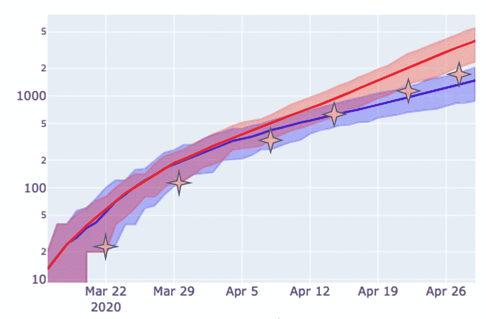
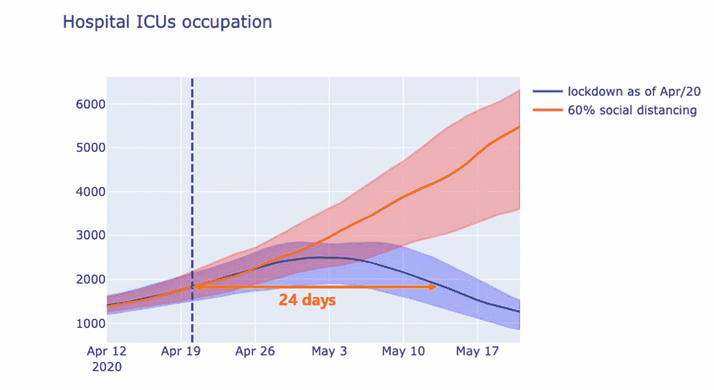
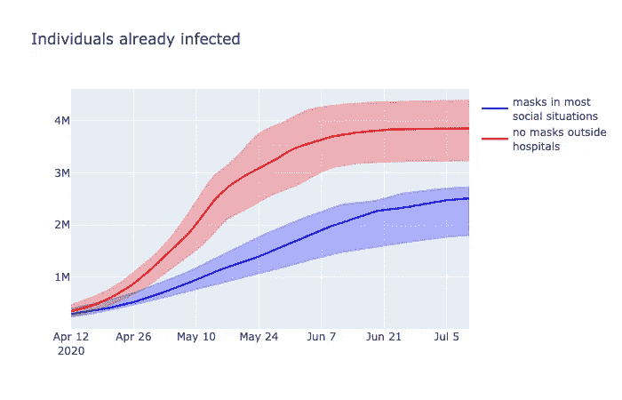
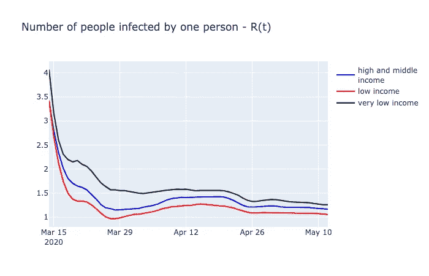
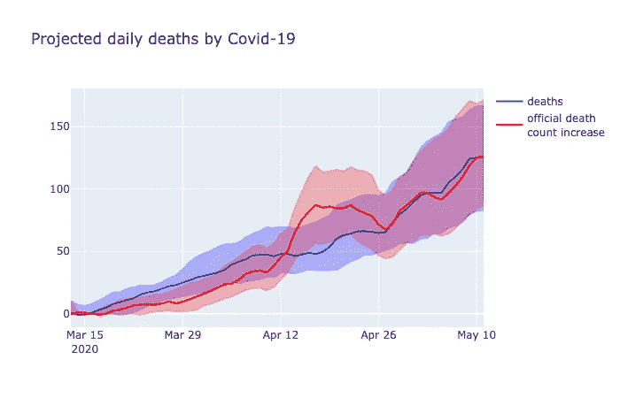
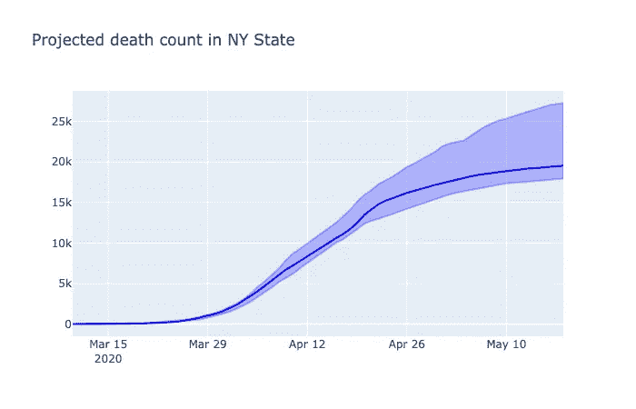
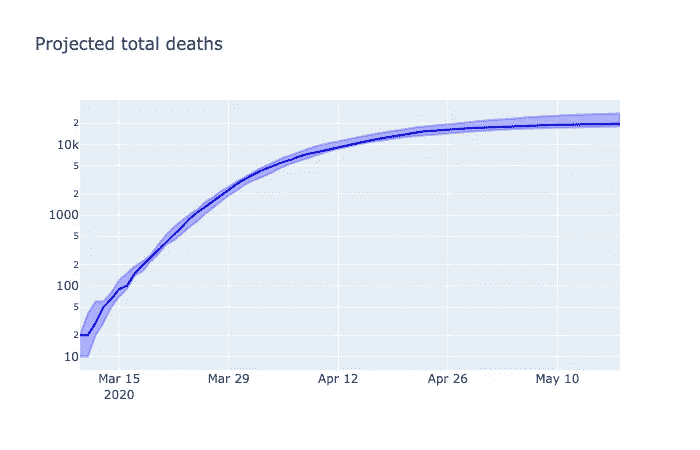
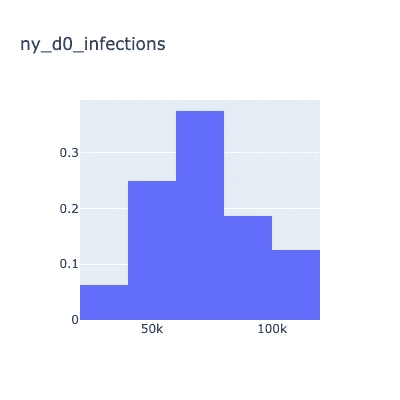
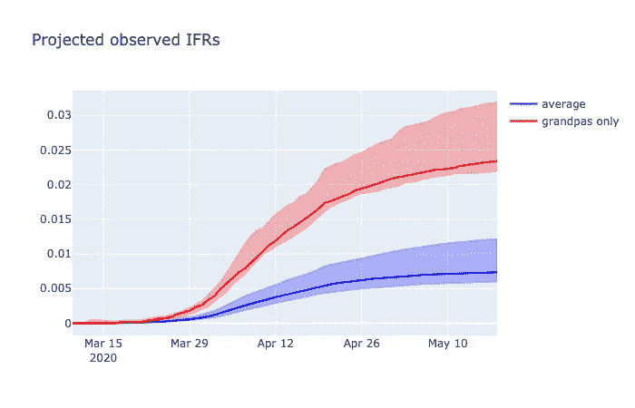

# 使用 Python 模拟您所在地区的新冠肺炎-超越 SIR 模型

> 原文：<https://towardsdatascience.com/model-the-covid-19-epidemic-in-detail-with-python-98f0d13f3a0e?source=collection_archive---------16----------------------->

## 结合基于个人的模拟和概率框架的详细和准确的建模，以及如何在几个步骤中建立自己的模拟


图片由[皮克斯拜](https://pixabay.com/?utm_source=link-attribution&amp;utm_medium=referral&amp;utm_campaign=image&amp;utm_content=1370977)的 Gerd Altmann 提供

*疫情会持续多久？我们需要保持多长时间的社交距离？如果解除了呢？如果什么都没做呢？*

一个月前，在医生和数据科学家的帮助下，我用 Python 创建了一个模型，以预测圣保罗大都市地区冠状病毒疫情的演变，并回答上述问题。虽然有些人对预测的情景持怀疑态度，但我现在对预测的准确性感到震惊。这个模型已经得到了改进和开源，这就是为什么我想和你分享如何使用它，为任何你想建模的地区。

# 关于我早期的预测

## 圣保罗大都市区新冠肺炎预测死亡人数



*红线代表悲观的情况。蓝色的，乐观。星星，后来加上，显示官方死亡人数。预测是在 3 月 30 日计算的。*

当进行预测时，我们预计死亡的确认会有一些延迟，但这还不是模型的一部分。那时，在官方统计数据出来之前，我们仍然从医院的报告中得知死亡人数。因此，我们预计官方数据会像预测的那样，向右移动几天。

该模型在说:我不知道长期会发生什么，但未来 2-3 周，任何情景看起来都一样。如果我们对疾病的建模是正确的，那么毫不奇怪我们在这三周内是正确的。在过去的 10 天里，曲线的倾斜度似乎在两种情况的中间**。**

# 用模型回答问题

当前的模型可以处理关于流行病如何表现的不确定性，并且*【学习】*来自观察。没有人确切知道这种疾病的传染性如何，或者人们的行为如何。图表中投影周围的阴影区域代表了这种不确定性。在学习时，模型识别哪些假设组合可以解释现实，哪些不能。

尽管如此，我们还是可以开始提问。

***如果…*** 截止到 4 月 20 日有封锁怎么办？(在圣保罗，呆在家里只是一个建议，一些数据表明 40%的人每天不呆在家里)



封锁之后，重症监护室的入住率大约需要 24 天才能降至初始水平以下。如果在封锁前没有社交距离，这个时间可能会更长。

***如果……***医院外面没人戴口罩怎么办？假设病人戴上后有 40%的效果，易感者有 20%的效果，我们预计如果没有人使用，病毒的传播会更严重。



虽然不能控制疫情，但在户外使用口罩可能会减少传染，并有助于使曲线变平。

***什么是…*** 社会距离感的效果？让我们来看看模型预期的**生殖数**(每个感染者感染的人数)在里约热内卢是如何表现的:



每个收入水平的每日生育数。在所有的社会阶层中，生殖数量在三月中旬显著下降，那时社会距离在里约热内卢开始。

正如所料，社交距离在减少传播方面非常有效。负担不起呆在家里的费用的人，或者甚至没有家可住的人，不能有效地隔离，正如较高的生殖数量所显示的那样。

但是等等…为什么对于*收入很低的*来说，再生号有更高的起点( **R0** )？其他社会阶层从 *3.4* 开始，*极低收入*从 *4.0* 开始。这种不明显的行为有一个简单的解释:正如模型正确指出的那样，更多的人生活在一起增加了在家里传播的机会。

最后， ***为什么…*** 死亡人数在 4 月中旬加速上升如此之快，到那时似乎下降了，然后又再次上升？*(此事发生在圣保罗，解说解释了纽约等地的类似模式)*

考虑到诊断和死亡确认的延迟，以及它们如何随时间变化，可以解释在官方数字中看到的不明显的行为。我们预计，由于缺乏检测能力，实际死亡人数在 4 月中旬之前的许多周都高于官方统计数字。当测试赶上时，事情似乎会在几天内失去控制。



模拟的每日确诊死亡人数(红色)和每日实际死亡人数(蓝色)。测试能力的增加导致了 4 月中旬官方数字的激增——圣保罗大都市地区的预测。

关于巴西的模拟，可以在这里找到详细的历史数据[。对于世界数据来说，](https://brasil.io/dataset/covid19/caso/)[这个 Kaggle 数据集](https://www.kaggle.com/sudalairajkumar/novel-corona-virus-2019-dataset)可以是一个好的开始。

# 模型是如何构建的

*(如果你对 Python 建模不感兴趣，你可以跳到靠近末尾的图表，带有对纽约州的预测)*

当我在圣保罗做模特时，有一件事从一开始就很清楚:社会不平等很重要。所以我知道这个模型会比之前的大多数模型更复杂。使用时间序列模型是无助的，因为在曲线上领先的国家有非常不同的社会。建立一个[房室模型](https://en.wikipedia.org/wiki/Multi-compartment_model) (SIR，SEIR 之类的)，预先定义状态，并详细说明转换的微分方程，由于要建模的许多重要方面，将是不可行的。一个基于个人的模拟[正在进行。](https://en.wikipedia.org/wiki/Agent-based_model)

通过使用 [**Simpy**](https://simpy.readthedocs.io/en/latest/) ，很容易对疾病的任意特征或人们的行为进行建模。不需要预先知道什么是状态转换，甚至不需要知道有多少可能的状态，只需要知道状态变量和控制它们的逻辑。

简而言之，我们随机创建一个群体，根据其亚群体的特征，我们指定一些种子感染，并让个体相互作用。所有关于人们如何互动的规则，病人会有什么结果，疾病的每个阶段会持续多长时间，所有这些都可以被明确编程。一个事件可以触发并行逻辑，彼此独立运行，具有独立的随机性。这就像编写异步代码，将在模拟时间同步运行。

**Python** 很棒，但是当对一种可能对一小部分人群产生影响的疾病建模时，需要模拟大量的个体。10.000 个人，内存消耗和 CPU 使用率直线上升。为了解决这个问题，每个个体都变成了 [**Cython**](https://cython.readthedocs.io/en/latest/src/tutorial/cython_tutorial.html) 中的一个对象，代码几乎没有变化，但可以模拟 1000000 个个体，消耗大约 1GB RAM，性能大幅提升。

然后，对疾病演变和传播进行了详细建模。大多数参数来自以下两个来源:

*   【2019 年冠状病毒疾病严重程度的估计:基于模型的分析
*   [流行病计算器](http://gabgoh.github.io/COVID/index.html) —包含几个疾病参数的估计值。

该模型的当前源代码可以在这里找到:

[](https://github.com/ArroyoAndre/covidsimulation) [## ArroyoAndre/covidsimulation

### Covid 流行病模拟 python 和 cython 中基于个体的动态模型，带有 Simpy“所有模型都是错误的，但是…

github.com](https://github.com/ArroyoAndre/covidsimulation) 

# 模拟一个地区的疫情

## 安装

首先，让我们克隆回购，建立一个虚拟环境，并安装模拟代码。(安装将下载需求，编译 Cython 代码，并将所有内容作为一个包安装)

```
git clone [https://github.com/ArroyoAndre/covidsimulation.git](https://github.com/ArroyoAndre/covidsimulation.git)cd covidsimulation/python3 -m venv venv. venv/bin/activate./setup.sh
```

然后，启动 Jupyter:

```
jupyter notebook
```

## 配置您的区域

在笔记本中，让我们从导入开始:

现在，我们将定义一个群体。为了真实地模拟一个地区，您可以定义几个人口(例如，城市和乡村、富人和穷人、普通人口和基本服务人员……)

我们将模拟**纽约州**。提供数字是为了教学目的。(例如，我发明了年龄分布和房屋大小)

我们还需要指定**干预**。我们将使用两种干预措施。3 月 10 日，学校停课，社交聚会被禁止，3 月 22 日，家庭订单被取消。4 月 10 日和 12 日，我们将使用**诊断延迟变更**干预来减少测试结果的延迟，以解决几天后报告的死亡人数激增的问题。

等等…为什么我在 10 天开始**诊断 _ 延迟**，然后减少到 5 天？似乎合理的是，从收集检查结果，送到实验室，测试，结果出来，到死亡报告，总共需要大约 5 天时间。根据维基百科的数据，在 4 月 10 日到 4 月 15 日期间，纽约每天大约有 700 人死亡。在 16 日和 17 日，死亡人数比之前的平均值多 3500 人，然后回到之前的趋势。所以我们可以假设有大约 5 天的死亡等待确认，最终得到确认。因此之前的 10 天延迟。

现在，我们需要将所有这些包装到一个区域的**参数**对象中。

由于感染人数很少，疫情发展的时间可能会有很大差异，我们将所有模拟都放在 **D0** 中，定义为感染人数达到阈值的日期。我们将把 **D0** 定义为 3 月 10 日(因为在此之前发生的事情不多)。因为我们不知道那时有多少人被感染，我们把它设为一个在 10k 到 200k 之间均匀分布的**随机参数**。

## 校准我们的模型

我们在模型中加入了两个不确定的参数。其他一些，如来自感染者的传播率，也是未知的，或者可能因地区而异，默认为**随机参数**。这就是为什么我们需要校准我们的模型。

通常，我们可以用来校准的偏差较小的变量是官方的死亡人数。可能会有一些系统性的漏报和系统延迟，但这比其他偏见要好。我们已经假设病例确认的平均延迟从 10 天开始，到 4 月中旬变为 5 天，所以我们应该没问题。

我们将创建一个得分函数，为模拟提供更低的损失值，以更好地匹配特定日期的官方死亡人数:

然后，我们将开始校准过程。首先，我们将使用 100，000 个个体的小群体，尝试模型内部参数值的几种组合。(**为此，我使用了一个具有 32 个 CPU 内核的虚拟实例**。在笔记本电脑上，可能需要一段时间……)我们将进行 1000 次试验，并保留 100 个最佳结果( *p=0.1* )。

其次，我们将在 100 万人的群体中尝试这 100 个最佳，以减少分离最佳时的噪音。然后我们会保留 16 个最好的。

那些**随机状态**是模型中所有不确定参数联合分布的*后验*。通过适当的命名，可以使用一个区域的*后验*作为另一个区域的*前验*，以获得精确的*后验*。

## (终于！)运行模拟并绘制结果

在花了这么多时间校准之后，你可能想保存目前为止找到的**随机状态****。**(如何使用**泡菜**做这件事超出了这篇文章的目的，但是鼓励你去谷歌一下)

我们现在可以进行真正的模拟，并预测未来的事情。我们将选取找到的 16 个最佳随机状态，并在 200 万个体的群体中分别应用两次。同样，我们将保留最符合我们校准数据的 16 个模拟(*其中 0.5 个*)。

让我们画出已确认的死亡人数，来做第一次检查:



该模型用截至 3 月 19 日的真实数据训练，预测死亡人数在 5 月初趋于稳定。请注意 4 月中旬死亡人数的正确预测。

和总死亡数，没有确认延迟，以对数标度:



我们还可以满足我们的好奇心，看看我们的随机参数学习了哪些值。



尽管对数先验范围在 1 万到 20 万之间，但我们的模型认为 3 月 10 日更有可能有大约 7 万人已经被感染。不同的先验可能导致不同的结论，除非我们可以观察到足够的数据来减少其他参数的不确定性。

可以看到实现的指标:

列出实施的指标的输出

死亡率呢？没有一个衡量标准，但是我们可以创建一个。



该中心对预测感染死亡率的估计接近 0.5%，与最近通过血清学检测对已感染人群的估计一致。60-69 岁年龄组的 IFR 可能高达 3%。

尽管这是出于教学目的的快速建模(抱歉，如果你用的是笔记本电脑)，但结果却非常真实。

## 经验之谈

*   良好的前科是金。在许多情况下，避免**统一参数**，即使用不同的分布来代替它们，也可以在只能学习过去的模型和能够真正预测未来不明显行为的模型之间产生差异。请记住:

> 进→出

*   进行许多模拟(至少从 10k **random_states** 开始)，并用大量人群(200 万用于演示目的)进行模拟也可以显著提高准确性。
*   向评分函数添加不同类型的度量可以使更多的输出变量更加准确。

# 如果你走到这一步…

这里没有探讨更多的功能，比如研究卫生措施或使用口罩的效果。也有可能模拟不同的社会距离情景，包括间歇性距离，并考虑到卫生系统的能力。

我希望你可以很好地利用这个模型，或者告诉人们你所在地区的预测和情景，或者只是了解它是如何构建的，以及如何用 Python 做更酷的事情。

邀请[与您合作改进模型](https://github.com/ArroyoAndre/covidsimulation)，为新区域建模，添加新功能，并分享您的成果。

***编者按:*** [*走向数据科学*](http://towardsdatascience.com/) *是一份以数据科学和机器学习研究为主的中型刊物。我们不是健康专家或流行病学家，本文的观点不应被解释为专业建议。想了解更多关于疫情冠状病毒的信息，可以点击* [*这里*](https://www.who.int/emergencies/diseases/novel-coronavirus-2019/situation-reports) *。*