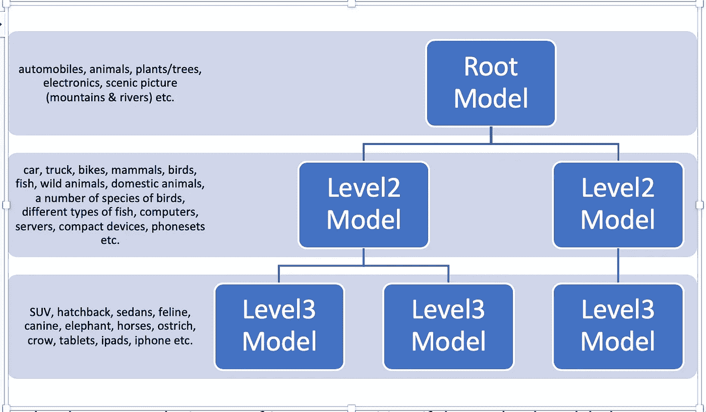

# 用于大规模分类的模型树分类器

> 原文：<https://towardsdatascience.com/model-tree-classifier-for-large-scale-classification-ab93207ce1b2?source=collection_archive---------39----------------------->

一种层次分类的方法。

L 大规模分类问题是目标标签数量多但确定的用例，不仅在规模方面，而且在实现许多有用的机器学习算法方面都提出了挑战，否则这些算法可以方便地解决许多用例。值得仔细研究一下标签，看看它们是否可以按层次排列，或者是否有某种提供这种层次的分类法。最大似然空间中一个流行的用例是图像识别，其中目标标签的数量可能非常高，以百万计。

建立一个具有 RNN 层或神经网络集群的整体模型可能是一种选择。一些人认为一组或一系列 LSTMs 可以解决这个问题。

但是也有一些根本性的缺陷

- LSTM 神经网络和多层神经网络固有的训练和分类速度慢

-如果我们需要将每一层连接到分类法或层次结构中的某个分类级别，则神经元和层数之间不可能存在真实的相关性。

-像决策树算法这样的其他算法并不健壮，看起来更像是逻辑推导，而随机森林是一种集成算法，更多的是在黑暗中射击，偶然击中目标。

-分类标签的绝对数量使得训练算法和优化器不能收敛，尽管有大量好的训练例子。

需要一个现实的分布式模型来解决工程和算法方面的问题，并处理分类对象的规模。标签，在图像分类的情况下，在层级的叶级别上可能达到数百万。

H 分层模型树，而不是分层建模(单个整体模型)，是一种稳健的方法，用于从顶层根节点的单个模型和沿层级向下的每个级别的模型集群开始，对层级的每个级别的项目进行分类。

-每个模型都有自己的算法。根模型可以是朴素贝叶斯分类器，而第二层模型可以是具有卷积的神经网络(NN/CNN)

一些模型可以采用 RNN 和 LSTMs，并且可以是其自身的微神经网络，但是模型本身将表示模型树中的一个节点。

-前提是每个模型应分类到一个指定的标签中，并且在下一个级别存在一个具有子类别并满足分类类别的模型。

过度工程化可能是这种方法的潜在负面，人们倾向于构建一个非常离散的层次结构，并且会遇到构建大量模型的开销。在层次结构的每一层需要多少个模型，它们覆盖或处理什么不同的方面，更多的是工程或功能上的考虑。

在上面的例子中，在图像识别的情况下，如果顶层模型，根模型，将照片分类为不同的类别，汽车、动物、植物/树木、风景图片(山脉和河流)等。第二层将为每个对象建立一个模型。例如，动物的 2 级模型可以将动物分类为哺乳动物、鸟类、鱼类等。或者它可以是更离散的，如野生动物、家畜、多种鸟类、不同类型的鱼等。，这取决于我们希望在这一级拥有的目标标签的数量。

但是，这种方法有一定的成本。那是贴标签。每个示例或训练数据集都应该被标记，以匹配层次结构的每个级别的至少一个模型中的一个标签。例如，如果我们要训练一个狗的图像，上面例子中的根模型只能归类为汽车、动物等抽象标签，所以狗的图像也应该被标记为动物；此外，在第二级，这个狗的形象必须被标记为哺乳动物，以训练与动物模型。如果第二级模型更离散，如野生动物、家畜等。就像上面的例子一样，狗也需要贴上家畜的标签。因此，无论哪种方式，建立一个层级都有其负面影响。

如果我们不得不处理更复杂的图片，例如，一张北极熊猎鱼的图片，这种方法可能会变得复杂。这是多标签分类的情况，其中训练示例可能沿着树流经 2 个或更多路径。

另外，图像分类可以是上下文相关的，例如，在较早的北极熊的例子中，上下文是“狩猎”。这可以被视为图像分类的另一个维度和完全不同的上下文层次树。如果分类正确，最终结果可能是这棵树上的另一个标签，即狩猎。

随后，将有一个合并方面来合并多个标签，并为图像提供一个有创意的名称，在本例中为“北极熊猎鱼”。然而，这种整合不是本文的一部分，我们仅限于“使用模型层次结构或模型树进行分类”

## **变量，自动质量保证和校正:**

在分类期间，所讨论的对象可能沿着树的不同路径向下遍历。这里有许多选择/导出正确分类的考虑因素。

*   如果第一级分类将对象归类为哺乳动物，则子节点中的模型应该与哺乳动物及其子类对齐。
*   可以考虑在一个模型下混合两个或更多不同的子类别/标签，例如，在上述例子中的家养和野生动物。这个孩子模型将包括许多家养和野生动物的变种；在分类期间，如果第一级将“牛”分类为“家畜”，下一级模型应该能够从家畜类别中对对象进行分类，比如说牛；如果下一个级别将它归类为“猫科动物”(狮子)，那么结果会变得不对齐。
*   这就是验证和反馈成为关键的地方。本例的分类应该到此为止，分类摘要应该报告哪些内容可以有把握地进行分类。
*   在一些用例中，在这个例子中，基于 1 级模型的置信度，分类可以将这个对象分类为仅仅是哺乳动物。
*   一些情况下可以采用“最一致的分类”方法，例如，级别 1 将奶牛分类为动物(从人、事物、动物等中)。)，2 级分类为哺乳动物(来自哺乳动物、鸟类、爬行动物等。)、3 级家畜(来自家养、野生等。)并且第 4 级分类为狮子(从母牛、山羊、鹿、大象、狮子中)。此处，分类应在第 3 级结束。
*   用母前缀标记标签是检查分类一致性的一种方式，例如，如果哺乳动物编码为“ma”，家养和野生动物分别编码为“mado”和“mawi”。

## **自动校正的好处:**

在每个子级别分类并拥有 2 个或更多子类别(不相关)的好处是确保我们不会将错误从顶级传播到下一级。如果级别 2 模型被训练成处理家畜的所有子类和植物的所有子类，则好的模型算法应该对牛的图像进行分类，牛被分类为级别 1 的家畜到级别 2 的牛。如果 2 级模型将奶牛分类到植物的一个子类中，那么结果是不对齐的，我们不会进一步分类，因为这是错误分类。我们致力于用这种用例扩充第 2 级和第 1 级模型，并进行错误修正。

所以如果误差传播没有出现。在一些变体中，如果 1 级模型被训练为随着时间推移而变得健壮，我们仍然可以将该示例分类到 1 级模型的输出，并将其标记为“抽象分类”，因为我们没有得到细节。

在一些变体中，1 级、2 级、3 级模型对齐，而 4 级模型不对齐，然后我们给出前 3 级分层模型与特定类别和子类别对齐的好处，并在 3 级停止分类。这还是不错的。

构建这个层次模型的关键是建立一个良好的子类别和进一步子类别的组合，这样我们就可以确定我们是在正轨上还是停了下来。

另一个方面是当我们向下传播时处理更小的数据集。随着我们向下传播，可用于针对特定标签集构建模型的数据量变得更少。但是这里有几件事需要注意。

*   我们可以采用一种分类器算法，该算法在训练样本较少的情况下仍能很好地工作。模型算法不能用较少的训练样本进行分类不是模型树分类器的问题。
*   这样的模型树分类器不受影响，因为它仍然可以向下渗透到更小的细节，并且仍然可以尝试将示例分类到抽象类别。清晰的比对逻辑/评分应注意误差传播。

## 结论:

这项工作的第一个方面是查看分层结构中的目标标签并构建标签树。这也将有助于可视化分类问题和理解问题空间。

第二步是针对每个示例定义或识别标签，以匹配层次结构，因为这是一种核心的监督学习方法。

步骤 3 是使不同的 ML 模型沿树向下分层，每个节点一个模型，并建立分类聚类。

步骤 4 是实现自动校正和处理错误传播，以获得准确的分类，而不一定是详细的分类。