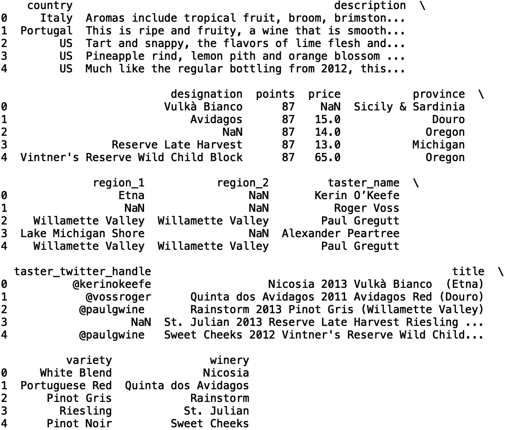
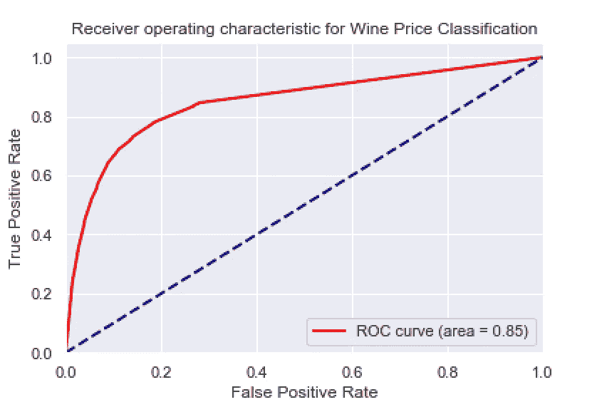
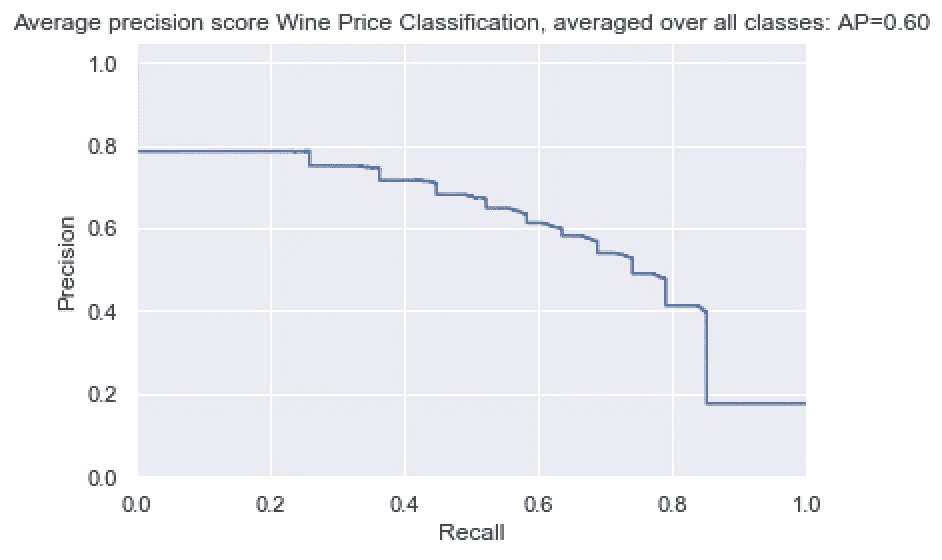
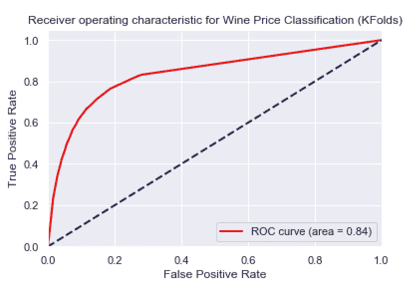
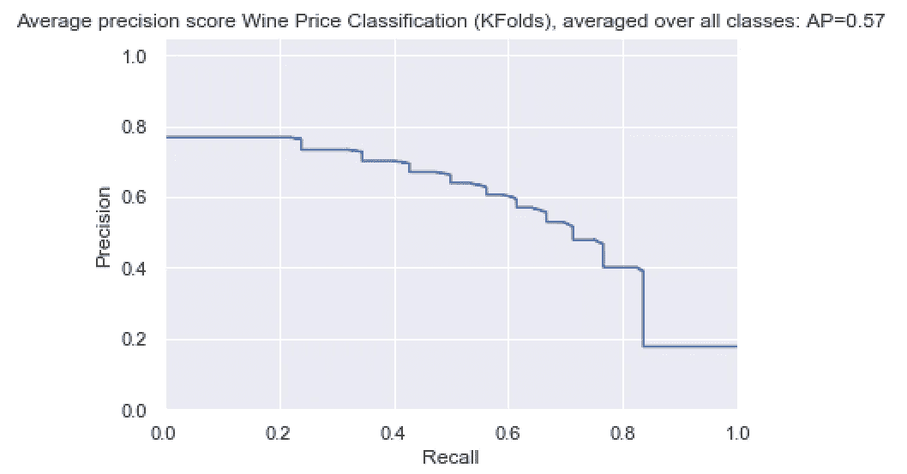
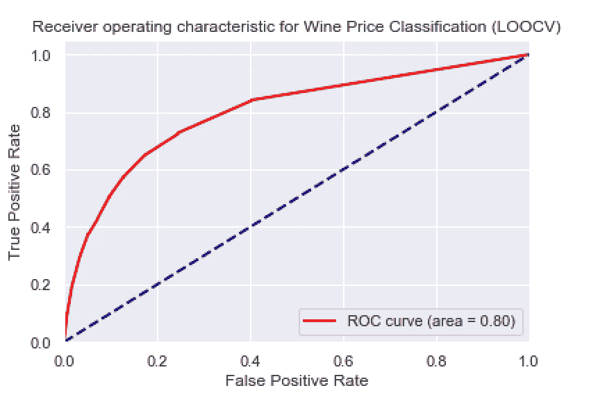
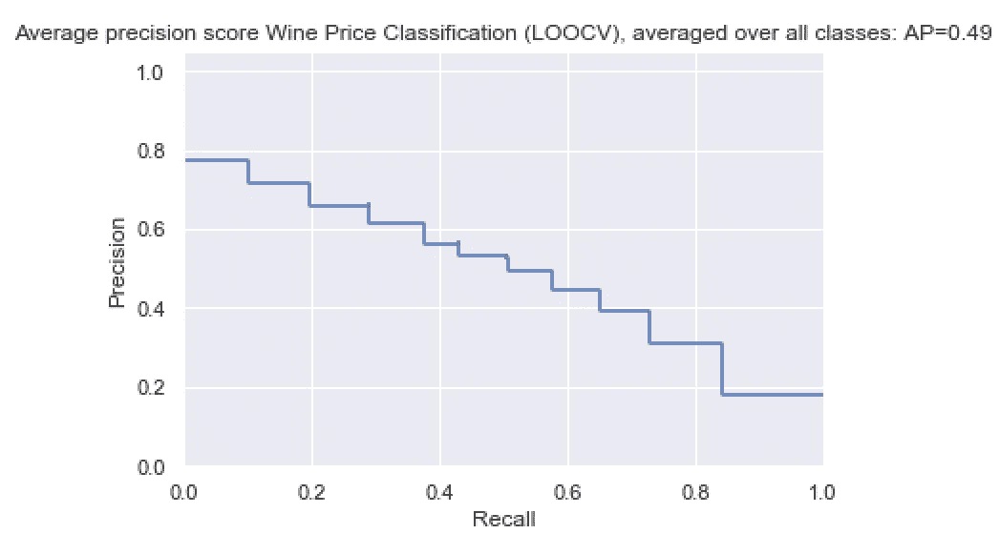

# Python 中的模型验证

> 原文：<https://towardsdatascience.com/model-validation-in-python-95e2f041f78c?source=collection_archive---------29----------------------->

## 应用训练/测试分割、折叠，并省略一个


照片由[像素](https://www.pexels.com/photo/architecture-black-and-white-challenge-chance-277593/)上的 [Pixabay](https://www.pexels.com/@pixabay) 拍摄

Scikit-learn 是一个开源的机器学习库，提供了构建、训练和测试模型的工具。模型选择模块具有许多对模型测试和验证有用的功能。在本帖中，我们将讨论 scikit-learn 中一些重要的模型选择功能。

我们开始吧！

出于我们的目的，我们将使用葡萄酒评论数据集，该数据集可以在[这里](https://www.kaggle.com/zynicide/wine-reviews)找到。

首先，让我们将数据读入熊猫数据框:

```
import pandas as pd
df = pd.read_csv("winemag-data-130k-v2.csv")
```

接下来，让我们打印前五行数据:

```
print(df.head())
```



让我们考虑基于品种、酒厂、国家和评论点预测葡萄酒价格是否比 50 美元更贵的任务。我们可以构建一个随机的森林分类器来执行这项任务。首先，让我们将分类特征转换成可由随机森林处理的分类代码:

```
df['country_cat'.format(i)] = df['country'].astype('category').copy()
df['country_cat'.format(i)] = df['country_cat'.format(i)].cat.codesdf['winery_cat'.format(i)] = df['winery'].astype('category').copy()
df['winery_cat'.format(i)] = df['winery_cat'.format(i)].cat.codesdf['variety_cat'.format(i)] = df['variety'].astype('category').copy()
df['variety_cat'.format(i)] = df['variety_cat'.format(i)].cat.codes
```

让我们也估算缺失值。我们在这里不做任何花哨的估算，但是看看用 Python 预测缺失值的[，这是一种更可靠的估算方法。这里，让我们用 0 替换丢失的值:](/predicting-missing-values-with-python-41e581511117)

```
df.fillna(0, inplace=True)
```

接下来，让我们根据价格值是否大于或等于$50，为它们分配二进制标签。超过 50 美元的葡萄酒有“1”的标签，否则为“0”:

```
df['price_class']=np.where(df['price']>=50,1,0)
```

现在，让我们定义我们的功能和目标:

```
X = np.array(df[['country_cat', 'winery_cat', 'variety_cat', 'points']])
y = np.array(df['price_class'])
```

## 训练/测试分割

我们将讨论的第一个函数是“train_test_split()”方法。这个函数将数组或矩阵分成随机训练和测试子集。让我们从 scikit-learn 导入这个函数:

```
from sklearn.model_selection import train_test_split
```

为了将我们的功能划分为培训和测试，我们执行以下操作:

```
X_train, X_test, y_train, y_test = train_test_split(X,y)
```

默认测试大小为 0.25。您还可以更改训练/测试分割的大小。例如，要将测试大小更改为 0.3，我们需要执行以下操作:

```
X_train, X_test, y_train, y_test = train_test_split(X,y, test_size = 0.3)
```

接下来，我们可以训练和测试我们的随机森林模型:

```
from sklearn.ensemble import RandomForestClassifier
model = RandomForestClassifier()
model.fit(X_train, y_train)
y_pred = model.predict_proba(X_test)
```

让我们评估接收器工作特性曲线(AUROC)下的面积:

```
from sklearn.metrics import roc_auc_score
from sklearn.metrics import roc_curve, auc
fpr, tpr, _ = roc_curve(y_test, y_pred)
roc_auc = auc(fpr, tpr)
```

并绘制 ROC:

```
import matplotlib.pyplot as plt
import seaborn as sns
sns.set()
plt.figure()
lw = 2
plt.plot(fpr, tpr, color='red',
         lw=lw, label='ROC curve (area = %0.2f)' % roc_auc)
plt.plot([0, 1], [0, 1], color='navy', lw=lw, linestyle='--')
plt.xlim([0.0, 1.0])
plt.ylim([0.0, 1.05])
plt.xlabel('False Positive Rate')
plt.ylabel('True Positive Rate')
plt.title('Receiver operating characteristic for Wine Price Classification')
plt.legend(loc="lower right")
plt.show()
```



我们还可以看看精度/召回曲线和平均精度:

```
precision, recall, _ = precision_recall_curve(y_test,y_pred)
average_precision = average_precision_score(y_test, y_pred)sns.set()
plt.figure()
plt.step(recall, precision, where='post')plt.xlabel('Recall')
plt.ylabel('Precision')
plt.ylim([0.0, 1.05])
plt.xlim([0.0, 1.0])
plt.title(
    'Average precision score Wine Price Classification, micro-averaged over all classes: AP={0:0.2f}'
    .format(average_precision)
```



## k 倍交叉验证

接下来让我们讨论“KFold”方法。该函数提供训练和测试索引，将数据分成训练和测试集。它将数据随机或连续(默认)分成 *K* 个折叠，每个折叠用于一次验证，而其余 k-1 个折叠构成训练集。我们将使用折叠数的默认值，即 5。让我们初始化一个“KFold”对象，获取数据分割，并初始化预测目标值和真实目标值的数组:

```
from sklearn.model_selection import KFold
folds = KFold()
folds.get_n_splits(df)
y_true  = []
y_pred = []
```

如果我们想将折叠数从 5 改为 10，我们可以这样做:

```
folds = KFold(n_splits=10)
```

接下来，让我们在 for 循环中训练和测试我们的模型，并追加结果:

```
for train_index, test_index in folds.split(df):
    df_test = df.iloc[test_index]
    df_train = df.iloc[train_index]     
    X_train = np.array(df_train[['country_cat', 'winery_cat', 'variety_cat', 'points']])
    y_train = np.array(df_train['price_class'])
    X_test = np.array(df_test[['country_cat', 'winery_cat', 'variety_cat', 'points']])
    y_test = np.array(df_test['price_class'])    
    y_true.append(y_test)
    model = RandomForestClassifier()
    model.fit(X_train, y_train)    
    y_pred.append(model.predict_proba(X_test)[:,1])
y_pred = [item for sublist in y_pred for item in sublist]   
y_true = [item for sublist in y_true for item in sublist]
```

接下来我们绘制 ROC 曲线:

```
fpr, tpr, _ = roc_curve(y_true, y_pred)
roc_auc = auc(fpr, tpr)sns.set()
plt.figure()
lw = 2
plt.plot(fpr, tpr, color='red',
         lw=lw, label='ROC curve (area = %0.2f)' % roc_auc)
plt.plot([0, 1], [0, 1], color='navy', lw=lw, linestyle='--')
plt.xlim([0.0, 1.0])
plt.ylim([0.0, 1.05])
plt.xlabel('False Positive Rate')
plt.ylabel('True Positive Rate')
plt.title('Receiver operating characteristic for Wine Price Classification (KFolds)')
plt.legend(loc="lower right")
plt.show()
```



精确度/召回率曲线:

```
precision, recall, _ = precision_recall_curve(y_true,y_pred)
average_precision = average_precision_score(y_true, y_pred)sns.set()
plt.figure()
plt.step(recall, precision, where='post')plt.xlabel('Recall')
plt.ylabel('Precision')
plt.ylim([0.0, 1.05])
plt.xlim([0.0, 1.0])
plt.title(
    'Average precision score Wine Price Classification (KFolds), micro-averaged over all classes: AP={0:0.2f}'
    .format(average_precision))
```



## 遗漏一个交叉验证

最后，让我们讨论一下“LeaveOneOut”方法。该功能提供训练/测试指数，以分割用于训练和测试的数据。每个样本作为单独测试使用一次，而剩余的样本用于训练。这里，我们初始化“LeaveOneOut”对象，并像以前一样获取数据拆分:

```
from sklearn.model_selection import LeaveOneOut
loo = LeaveOneOut()
loo.get_n_splits(df)
y_true  = []
y_pred = []
```

我们循环遍历索引并追加结果。为清楚起见，代码被截断:

```
for train_index, test_index in loo.split(df):
    df_test = df.iloc[test_index]
    df_train = df.iloc[train_index]
    ...
```

接下来我们绘制结果:



我就讲到这里，但我鼓励您自己尝试一下这些函数。

## 结论

总之，在这篇文章中，我们讨论了如何使用模型选择模块中的函数来验证模型。首先，我们讨论了随机选择数据进行训练和测试的训练/测试分割函数。然后，我们讨论了“K-Fold”函数，它将数据分成连续或随机的折叠，用于训练和测试。最后，我们讨论了“LeaveOneOut”函数，该函数使用一个单独的样本进行测试，剩余的数据用于数据中每个样本的训练。我希望你觉得这篇文章有用/有趣。这篇文章中的代码可以在 [GitHub](https://github.com/spierre91/medium_code/blob/master/machine_learning/model_selection_python.py) 上找到。感谢您的阅读！