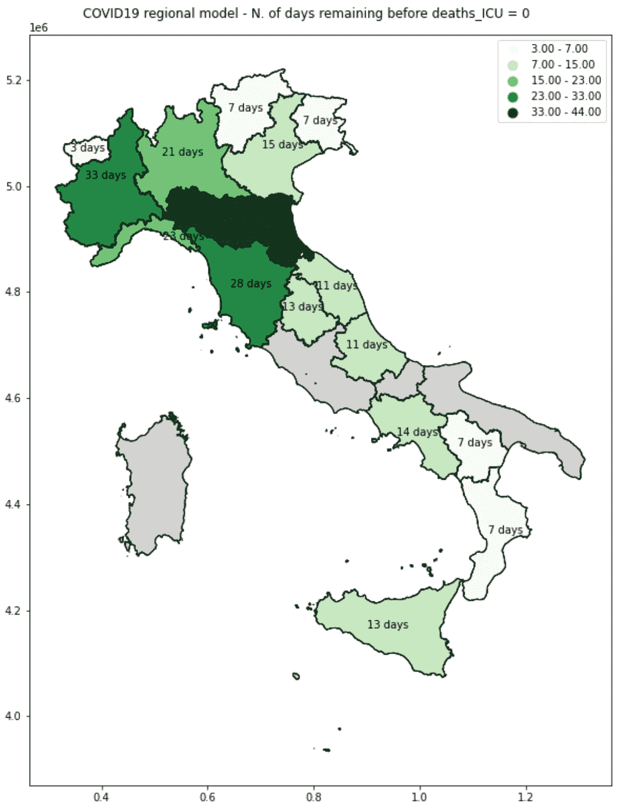
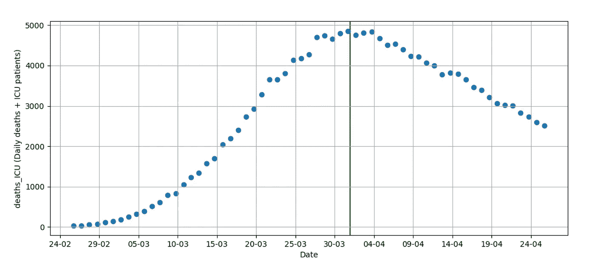
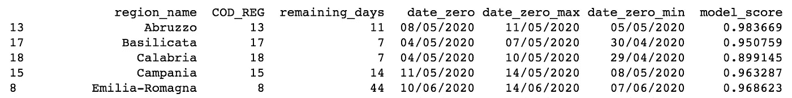
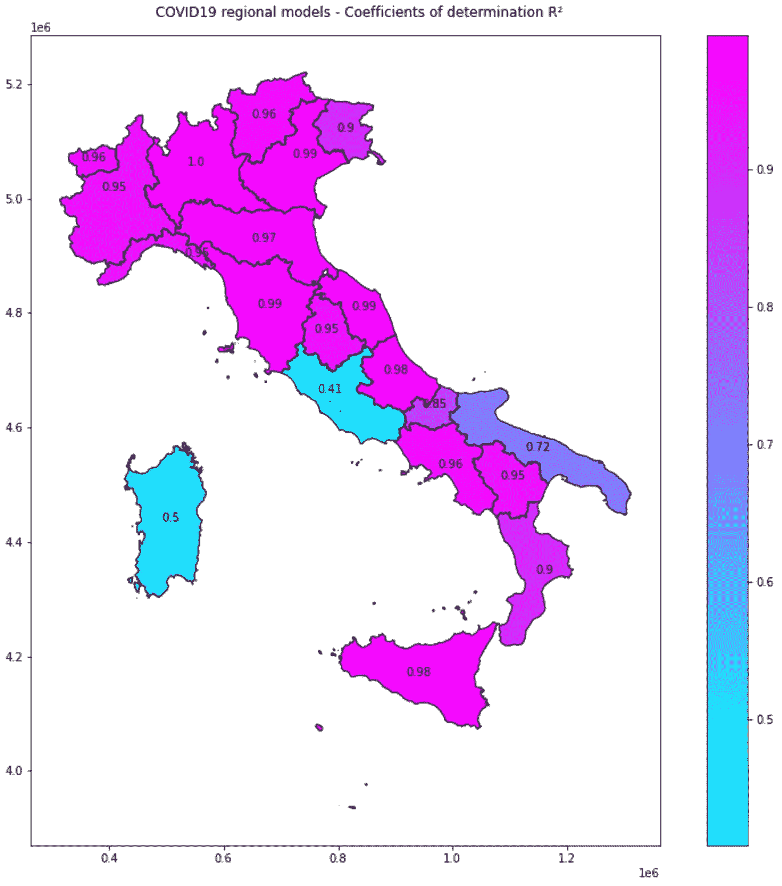
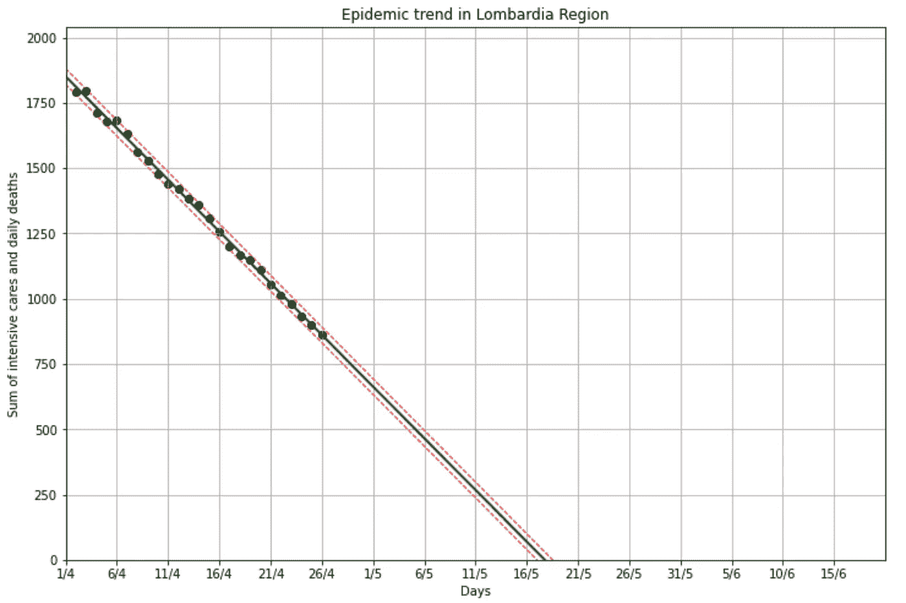
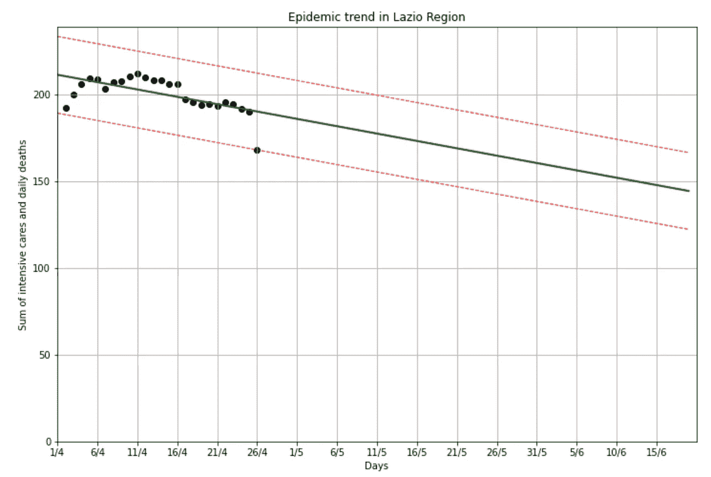
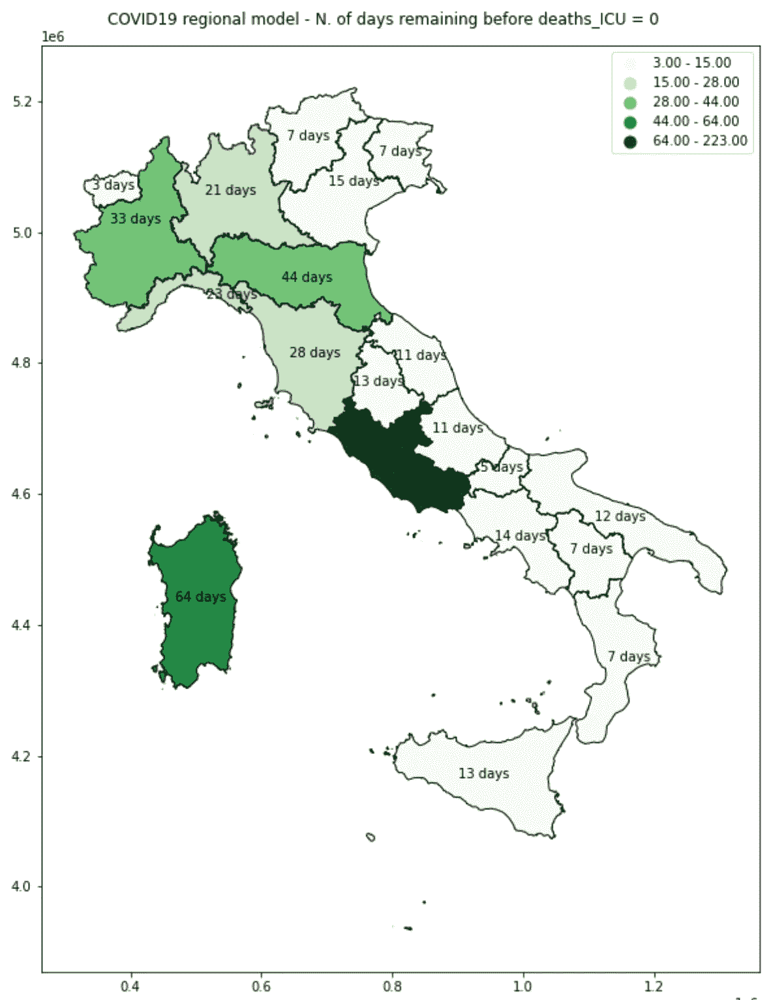

# 用 Python 建模区域性新冠肺炎疫情

> 原文：<https://towardsdatascience.com/modeling-and-mapping-regional-covid-19-trends-with-python-89f4415300f7?source=collection_archive---------47----------------------->

> 我所在地区的疫情何时会结束？

下图是意大利新冠肺炎疫情的一系列数据分析和建模结果。对于每个地区，它显示了流行病结束的预期日期，以在危急情况下零死亡和零患者之前剩余的天数表示。为了理解我是如何预测这些日期以及我是如何绘制它们的，我们需要倒退几步。

在[4 月 21 日发表的这篇文章](/modeling-covid-19-epidemic-with-python-bed21b8f6baf)中，我展示了如何使用 Python 和数据科学库来分析和建模新冠肺炎数据。在我的分析中，我使用了意大利民防局每天发布的数据集，这些数据集可以在官方 [GitHub 知识库](https://github.com/pcm-dpc/COVID-19)上获得。

在确定了采样方法中偏差的几个潜在来源后，我证明了在 4 月 1 日达到峰值后，每天死亡人数与重症监护病房患者人数的总和(一个我命名为`deaths_ICU`的变量)呈线性下降趋势。

因此，使用该衍生变量，可以创建一个[线性回归模型](https://en.wikipedia.org/wiki/Regression_analysis)来估计意大利严重疫情的结束时间，给出的日期是每天死亡人数与重症监护患者人数之和预计为零的日期。

如下图所示，在文章发表五天后，趋势仍在有规律地持续，模型的结果在今天(4 月 26 日)仍然有效。

衍生变量`deaths_ICU`随时间的演变

## 更仔细地看

根据该模型，考虑到整个国家，疫情的结束应该发生在 2020 年 5 月 19 日至 22 日之间。然而，我们知道，自疫情开始以来，北部地区受影响最为严重；此外，一些地区可能比其他地区恢复得更快。模型预测的日期可能是 20 个地区的平均日期。

> 出于这个原因，**今天，我们将通过为每个意大利地区开发一个单独的模型来进一步分析**。

然后，我们将加入时态信息(*什么时候结束？*)与空间成分(*在哪里会先结束？*)，并创建显示疫情结束时间表的复合区域地图。

## 导入和清理数据

首先，让我们导入必要的图书馆和意大利民事保护局提供的新冠肺炎地区细目表

这个数据集已经包含了大约 1200 行。不幸的是，数据并没有完全按照我们需要的格式提供。事实上，由于一些体制原因，20 个地区中只有 19 个每天提供民事保护的最新情况。*特伦蒂诺上阿迪杰*(数据集中的第 4 区)由它的两个省分别代表(*波尔扎诺自治省*和*特伦托自治省*)。因此，数据集报告了 19 个地区和 2 个省份的数据。因此，首先要做的是从数据集中排除引用区域 4 的所有行。然后，我们创建第二个*数据帧*，相反，它只包含两个省份的行。

现在我们将这两个省的数据相加，以便计算整个 *Trentino Alto Adige* 地区的死亡人数和 ICU 患者。最后，我们将两个表连接在一起，以得到一个包含 20 个区域中每个区域的干净数据的*数据框架*，这最终是分析所需的格式。

## 将数据集分成 20 部分

假设我们要构建和训练 20 个不同的模型，每个意大利地区一个，我们还需要将主数据集分成 20 个部分。当我们这样做时，我们还计算将用于训练模型的派生变量`deaths_ICU`。所有 20 个数据集随后被追加到一个名为`regional_df_list`的列表中。

## 定义代数函数

下一步是定义一些稍后将在主脚本中使用的函数。这些函数将执行估计回归线和 X 轴之间的交点所需的代数运算。

## 建立和训练 20 个模型

我们现在已经获得了遍历每个地区的数据集、创建模型、训练模型以及估计从意大利北部到南部的疫情所需的所有信息。当我们迭代时，我们将模型的输出存储在一个名为`model_outputs_df`的新数据框架中。它不仅包含预测日期，还包含每个区域模型的决定系数 R。r 会给出一些关于模型性能的信息。R 为 1 表示回归预测完全符合数据，因此值越接近 1，我们就越信任我们的模型。

如果你对以下脚本的细节感到好奇，你可以在[我之前的文章](/modeling-covid-19-epidemic-with-python-bed21b8f6baf)中了解更多。

## 了解模型的输出

我们快完成了！这是前 5 个地区的`model_outputs_df`的样子:

列`model_score`特别重要，它是 R 系数，告诉我们模型的表现如何，因此每个地区的预测有多可信和可靠。

**映射模型的性能**

现在，生活在我内心的地理空间极客终于可以得到一些满足:可视化区域模型的不同可靠性的最佳方式是在地图上显示它们，我们将使用`geopandas`和`mapclassify`库来实现这一点。意大利地区的边界可以从意大利国家统计局的网站上下载。

上图显示了模型的可靠性在不同的地区有很大的差异。在我们构建和训练的模型中，表现最好的模型是与*伦巴第*地区相关的模型。

由于其 R 高于 0.99，该模型完全符合数据序列，我们可以预计该估计在未来也是相当可靠的。在光谱的另一端，我们发现了拉齐奥区。

在这种情况下，决定系数 R 仅为大约 0.35。因此，预测不太可靠，并且误差幅度特别大。这主要是因为该地区的流行趋势不是线性趋势，因此该模型提供的预测不应被视为有效。

## 映射模型的预测

我们的模型提供的关键信息是对每个意大利地区流行病结束的预测，用变量`deaths_ICU`变为零之前所需的天数表示。在考虑我们的模型的可靠性之前，让我们画一张他们在全国的预测图。

## 将预测与模型可靠性相结合

最后一步是将区域模型的预测与它们的可靠性得分结合起来。换句话说，**我们希望从最终地图中排除所有模型表现不佳的区域**。为此，我们为最小可接受的`model_score`设置了一个任意的阈值，并且我们只在地图上显示我们的预测更可靠的区域。

## 结论

下表总结了我们在本练习中构建和训练的区域*线性回归*模型的预测。

如前所述，模型得分越高，预测就越可靠。由于这个原因，低评分模型的输出已经从这个摘要表和最终地图中排除。

考虑到地区差异和趋势，本文旨在预测意大利新冠肺炎疫情的结束。像任何建模工作一样，我们必须考虑任何新的外部因素都可能改变流行病的有效演变。模型无法考虑系统中的意外变化，如封锁限制的逐渐放松(预计在 5 月 4 日之后在意大利)，或气温上升对病毒传播的影响。系统中的这些变化可能会产生影响，并改变我们观察到的线性趋势。

从更普遍的角度来看，我们的分析结果强调了意大利 COVID 疫情的巨大异质性，一些地区的恢复速度比其他地区快得多。此外，在地图上可视化这些预测让我们有了更清晰的概览，并帮助我们更好地了解疫情。

我为本文中显示的分析、模型和地图开发的所有代码都可以在我的 [GitHub 库](https://github.com/Andrampa/covid_analysis/blob/master/Modeling_COVID19_epidemic_regional_breakdown.ipynb)上获得。